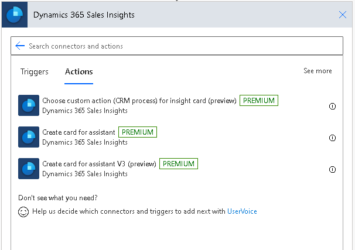
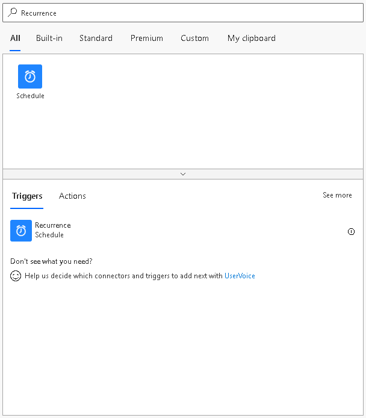
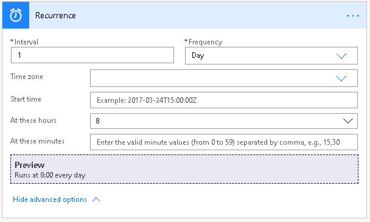
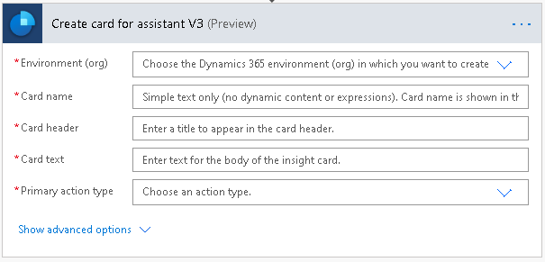
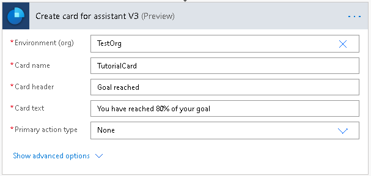
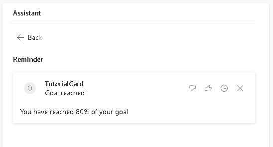

تم اعتماد القدرة على إنشاء بطاقة معلومات لا تحتوي على أي إجراءات/أزرار وهي متاحة حاليًا في المعاينة.

تمت الإضافة إلى عملية **إنشاء بطاقة للمساعد V3 (معاينة)**.

> [!div class="mx-imgBorder"]
> 

## الخطوة 1: إنشاء مشغل لبدء التدفق

قم بتعيين مشغل يعمل كل صباح في 8 صباحًا.

1.  في البحث، أدخل **تكرار**. من نتائج البحث، ضمن الخيار المشغلات، حدد **تكرار**.

    > [!div class="mx-imgBorder"]
    > 

1.  ستري المشغل أدناه. أدخل **الفاصل الزمني** كـ **1** وحدد **التكرار** كـ **يوم**.  يضمن ذلك تشغيل المشغل مرة واحدة في اليوم.

    يمكن تعيين الأعمدة الأخرى وفقًا لمتطلباتك. في هذا المثال، نقوم بتعيين **في هذه الساعات** كـ **8**، حيث إننا نريد تشغيل المشغل كل صباح في الساعة 8 ص.

    > [!div class="mx-imgBorder"]
    > 

## الخطوة 2: إضافة إجراء إلى المسار

1.  حدد **خطوة جديدة** وفي مربع البحث، أدخل **Sales Insights** أو **المساعد**.

1.  حدد موصل **Dynamics 365 Sales Insights**.

1.  ضمن الإجراءات، حدد **إنشاء بطاقة للمساعد V3**.

    > [!div class="mx-imgBorder"]
    > 

## الخطوة 3: إدخال التفاصيل واختيار نوع الإجراء "لا شيء"

1.  أدخل البيئة والتفاصيل الأخرى حسب الحاجة.

1.  حدد **لا شيء** من القائمة المنسدلة **نوع الإجراء "أساسي"** للتأكد من عدم إضافة أي إجراء في بطاقة المعلومات.

    > [!div class="mx-imgBorder"]
    > 

## الخطوة 4: حفظ التدفق واختباره

تشغيل المسار يدويًا أو عند تشغيله كما هو مجدول، يجب أن تكون بطاقة المعلومات الجديدة متوفرة في التطبيق.

> [!div class="mx-imgBorder"]
> 
