ستحتاج إما إلى بيئة تجريبية أو بيئة تحديد الصلاحيات مع Sales Insights لإكمال هذه البرامج التعليمية.

### الهدف

لإنشاء تسلسل مبيعات "مرحباً بالعالم" ليتبعه البائعون.

## الخطوة 1: إنشاء تسلسل جديد

1. انقر فوق علامة التبويب **التسلسلات** في إعدادات Sales insights.

2. انقر فوق **+ تسلسل جديد** في المنطقة العلوية اليسرى.

    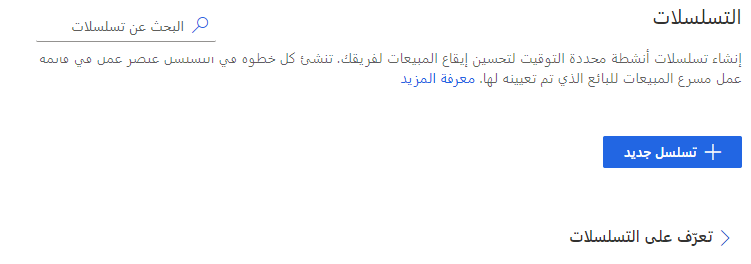

## الخطوة 2: قم بإنشاء معلومات أساسية حول التسلسل

1. قم بتعيين الاسم والوصف وحدد نوع الجدول الذي سيكون التسلسل متاحاً له.

    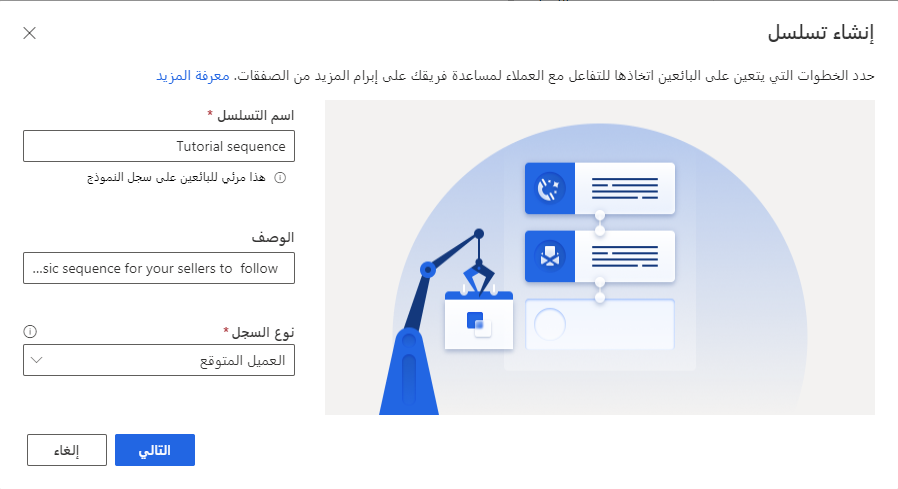

2. في مربع النص **التسلسل** **الاسم**، اكتب اسم التسلسل.

3. في مربع النص **الوصف**، أدخل وصف التسلسل - لمن هو، ما هي حالة الاستخدام التي يشير إليها هذا التسلسل وما إلى ذلك.

4. انقر فوق **التالي**.

## الخطوة 3: حدد أول نشاط ليقوم به البائع

1. حدد الخطوة الأولى التي يجب أن يتخذها البائعون، يمكن أن تكون إما إرسال بريد إلكتروني أو إجراء مكالمة هاتفية أو إضافة مهمة خاصة بك.

    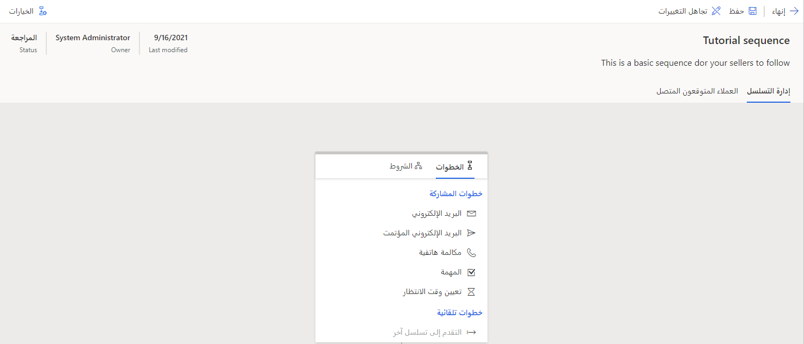

    في مثالنا، سنبدأ بإرسال بريد إلكتروني إلى العميل المحتمل.

2. انقر فوق **بريد إلكتروني**

    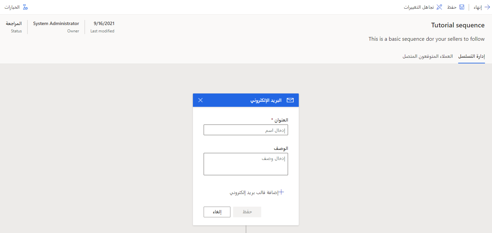

3. في مربع النص **الاسم**، أدخل اسم البريد الإلكتروني.

4. في مربع النص **الوصف**، أدخل وصف البريد الإلكتروني.

5. إذا كانت قوالب البريد الإلكتروني، أو القوالب الخاصة بالجدول أو القوالب العمومية، متوفرة في مؤسستك، يمكنك اختيار قالب بريد إلكتروني من **إضافة قالب بريد إلكتروني**.

6. انقر فوق **حفظ**.

> [!NOTE]
> ستكون هذه المعلومات مرئية للبائعين حتى يتمكنوا من التصرف بناءً عليها.

## الخطوة 4: أضف أنشطة إضافية ليقوم بها البائع

أضف أنشطة إضافية ليقوم بها البائعون بطريقة منظمة، أي يحتاج البائع إلى القيام بالنشاط الأول أولاً، ثم النشاط الثاني والثالث وهكذا.

> [!TIP]
> لاستمرار التغييرات، بعد إضافة نشاط، انقر فوق الزر **حفظ**.

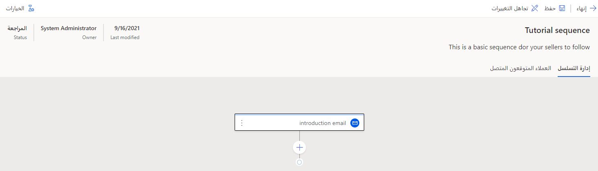

1. انقر فوق الزر **+**

2. حدد النشاط التالي ليقوم به البائع، ويمكن أن يكون إما إرسال بريد إلكتروني أو إجراء مكالمة هاتفية أو إضافة مهمة خاصة بك. يمكنك أيضاً اختيار **ضبط وقت الانتظار** لتحديد الفاصل الزمني بين الأنشطة.

    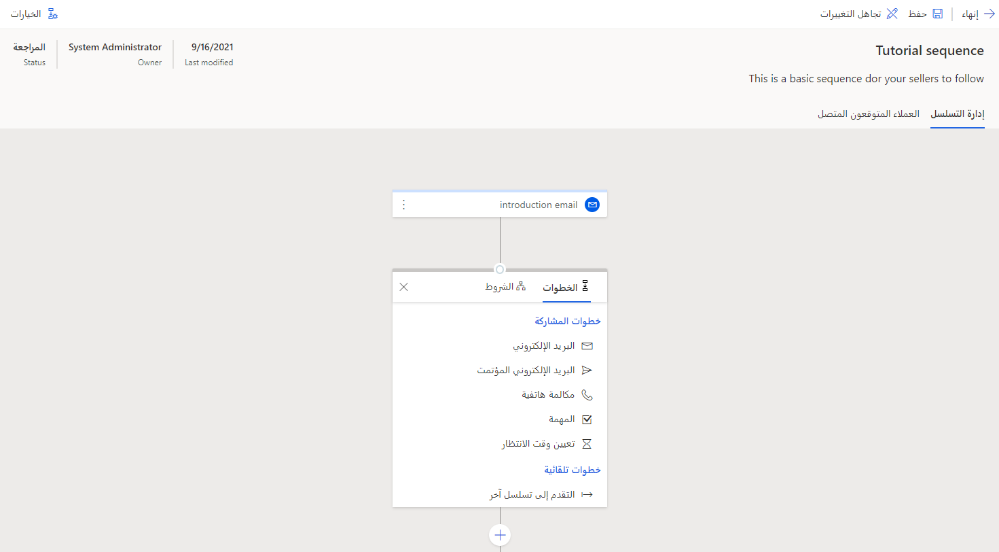

    في مثالنا سنضيف فترة زمنية قدرها ساعة واحدة.

    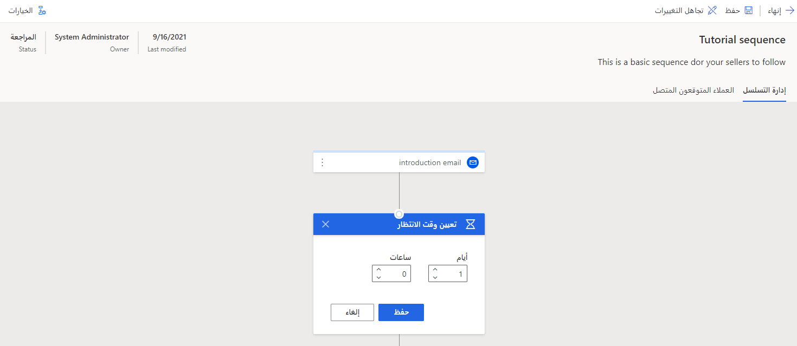

2. اضبط **الساعات** إلى 1.

3. انقر فوق **حفظ**.

بطريقة مماثلة نضيف نشاط مكالمة هاتفية.

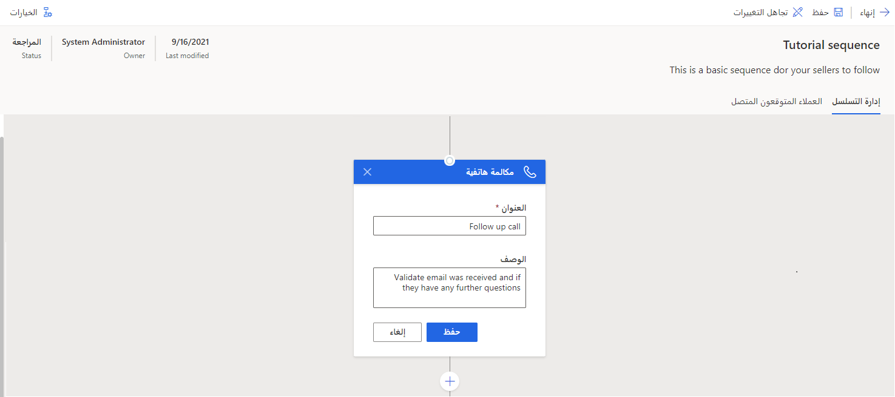

> [!NOTE]
> يمكنك تكرار الخطوة 3 ومتابعة إضافة الأنشطة حتى تقوم بإنشاء مجموعة الخطوات المطلوبة ليقوم البائعون باتباعها.

## الخطوة 5: احفظ التسلسل

احفظ التسلسل الذي تم إنشاؤه ليكون متوفرًا لمؤسستك.

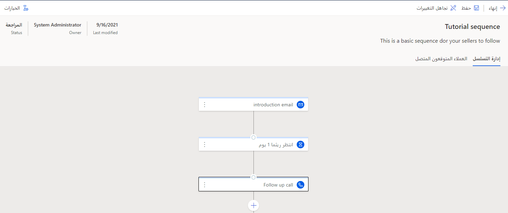

1. حدد **حفظ** في الجزء العلوي الأيمن من الشاشة.

## الخطوة 6: تنشيط التسلسل

لإتاحة التسلسل، قم بتنشيطه لتتمكن من توصيله بالعملاء المتوقعين.

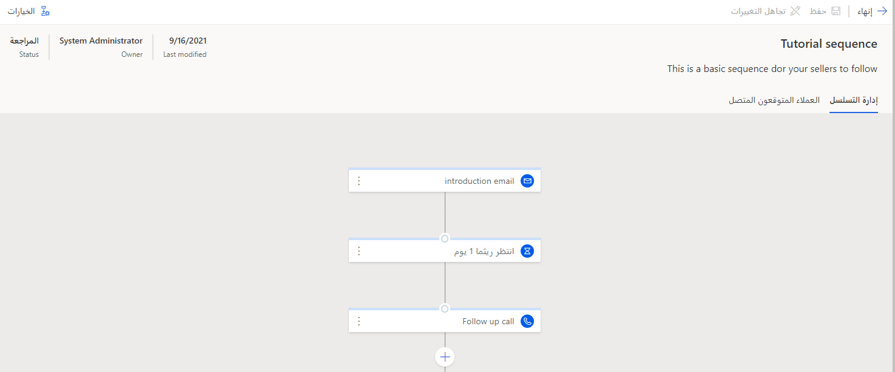

1. حدد **تنشيط** في الجزء العلوي الأيمن من الشاشة.

    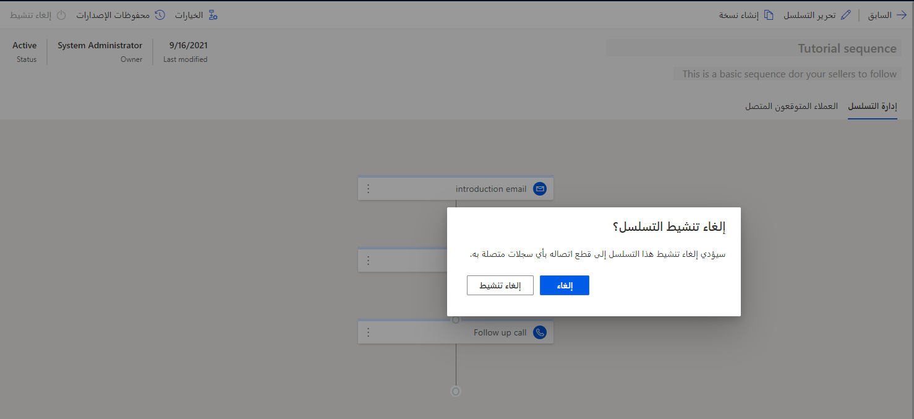

2. انقر فوق **نعم**.

الآن، يمكنك عرض التسلسل الجديد الذي تم إنشاؤه في عرض قائمة التسلسلات الخاصة بك.

> [!TIP]
> للتنقل السريع، اكتب اسم التسلسل في مربع البحث

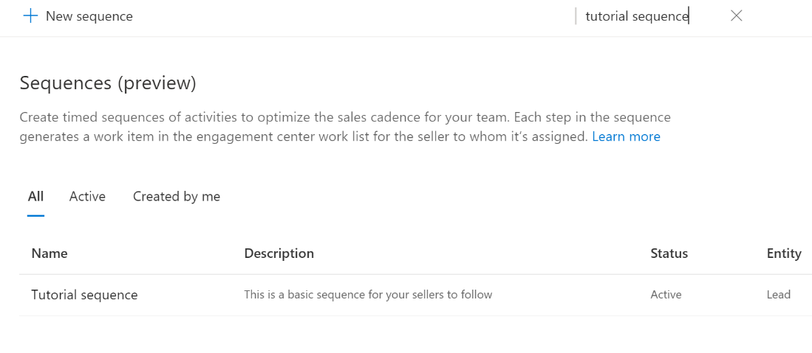

> [!NOTE]
> راجع [البرنامج التعليمي 2](/learn/modules/sales-sequence/3-connect/?azure-portal=true) لمعرفة كيفية توصيل هذا التسلسل بعملاء متوقعين. 

 
