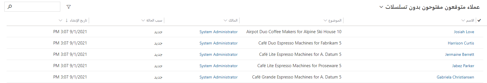

ستحتاج إما إلى بيئة تجريبية أو بيئة تحديد الصلاحيات مع Sales Insights لإكمال هذه البرامج التعليمية.

### الهدف

لربط تسلسل بسجل يتيح للبائعين تتبعه عند العمل على هذا السجل.

في هذا المثال، سنقوم بربط تسلسل بعملاء متوقعين، ما يؤدي إلى إمكانية ربط تسلسل بالفرص بطريقة مماثلة.

## الخطوة 1: الانتقال إلى عرض القائمة ذات الصلة

انتقل إلى عرض القائمة حيث يمكنك رؤية جميع السجلات ذات الصلة.

في هذا المثال، سنربط تسلسل بالعملاء المتوقعين، لذلك ننتقل إلى عرض قائمة العملاء المتوقعين.

ومن أجل راحتك، قمنا بإنشاء طرق عرض لعرض العملاء المتوقعين والفرص غير المرتبطة حاليًا بأي تسلسل.

في هذا المثال، *افتح العملاء المتوقعين بدون تسلسلات*.

## الخطوة 2: اختيار السجلات ذات الصلة

حدد السجلات التي ترغب في ربط تسلسل بها، حيث يمكن أن يكون سجلاً واحدًا أو أكثر.

في هذا المثال، سنقوم بربط تسلسل بإحصاءات Robin وديبرا جارسيا.

## الخطوة 3: ربط تسلسل بالسجلات المختارة

1. قم بربط تسلسل بالسجلات المختارة.

2. انقر فوق **ربط** **تسلسل** في شريط الأوامر.

    

3. حدد التسلسل ذي الصلة أو ابحث عنه.

    > [!NOTE]
    > لا تتوفر سوى التسلسلات النشطة التي يجب الارتباط بها، حيث تم تحديدها لنوع الجدول المحدد.

    في هذا المثال، ستظهر كل التسلسلات المتوفرة للعملاء المتوقعين، سنقوم بالارتباط بـ *تسلسل البرنامج التعليمي*.

4. انقر فوق **ربط**.

تحتوي جميع السجلات الآن على *تسلسل برنامج تعليمي* تم ربطه بالبائعين لاتباع خطوات التسلسل.

> [!NOTE]
> لمعرفة كيفية فصل تسلسل من السجلات، راجع [البرنامج التعليمي 3](/learn/modules/sales-sequence/4-disconnect/?azure-portal=true). 
 

