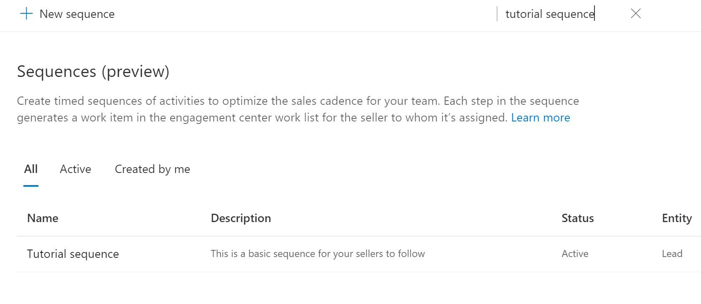
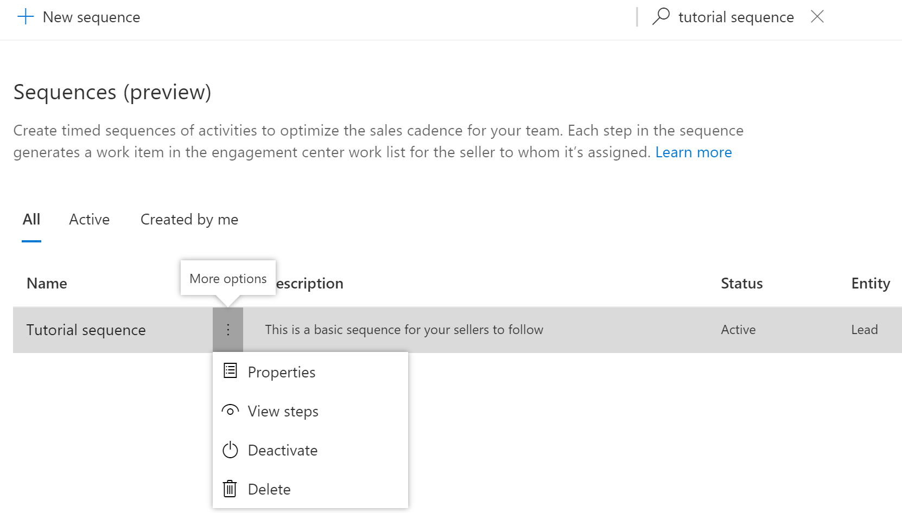
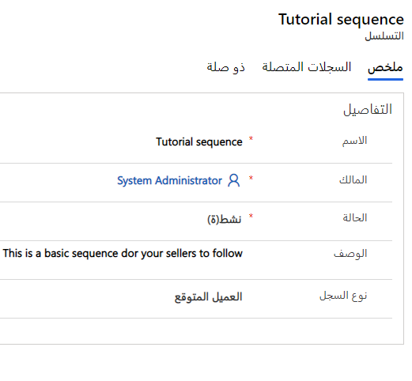
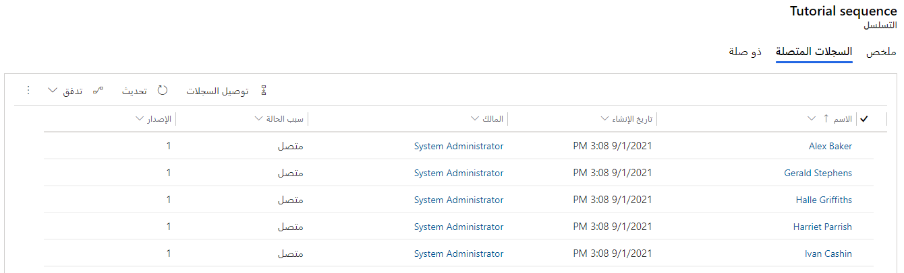
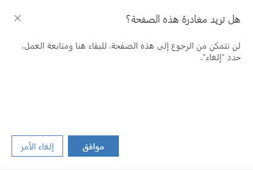

ستحتاج إما إلى بيئة تجريبية أو بيئة تحديد الصلاحيات مع Sales Insights لإكمال هذه البرامج التعليمية.

### الهدف

لقطع اتصال تسلسل من سجل حتى لا يرى البائعون بعد ذلك خطوات التسلسل فيما يتعلق بالسجل.

## الخطوة 1: الانتقال إلى عرض قائمة التسلسلات

انتقل إلى عرض القائمة حيث يمكنك رؤية جميع التسلسلات المتاحة.

> [!TIP]
> للتنقل السريع، اكتب اسم التسلسل في مربع البحث.

## الخطوة 2: اختيار التسلسل ذي الصلة

حدد التسلسل الذي ترغب في قطع اتصال السجلات منه.

1. انقر فوق **خصائص**.

    

2. انقر فوق علامة تبويب **السجلات المتصلة**.

## الخطوة 3: قطع اتصال السجلات

يمكنك قطع اتصال السجلات من التسلسل.

في المثال الذي لدينا، نود قطع اتصال *ديبرا جارسيا* من *تسلسل البرنامج التعليمي*.

1. انقر فوق **قطع الاتصال**.

    

2. انقر فوق **قطع الاتصال**.

لقد تم الآن قطع اتصال جميع السجلات من التسلسل.

> [!NOTE]
> راجع [البرنامج التعليمي 2](/learn/modules/sales-sequence/3-connect/?azure-portal=true) لمعرفة كيفية توصيل هذا التسلسل بعملاء متوقعين. 
