ستحتاج إما إلى بيئة تجريبية أو بيئة تحديد الصلاحيات مع Sales Insights لإكمال هذه البرامج التعليمية.

### الهدف

لتحرير تسلسل مبيعات.

## الخطوة 1: إلغاء تنشيط التسلسل

انتقل إلى طريقة عرض قائمة التسلسلات وحدد التسلسل الذي تريد تحريره.

> [!TIP]
> للتنقل السريع، اكتب اسم التسلسل في مربع البحث.

في المثال الذي نتناوله، سنقوم بتحرير *تسلسل البرنامج التعليمي*.

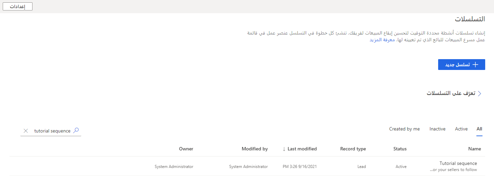

لتحرير تسلسل، يجب أن يكون غير نشط.

> [!NOTE]
> عند إلغاء تنشيط تسلسل، يتم قطع اتصال كافة السجلات المتصلة به تلقائياً. وهذا يعني أنه لن يعد متوفرًا للبائعين كي يقوموا بمتابعته.

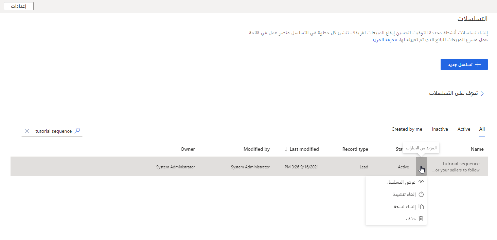

1. انقر فوق **إلغاء تنشيط**.

    

2. انقر فوق **إلغاء تنشيط**.

## الخطوة 2: تحرير خطوات التسلسل

إضافة خطوات تسلسل أو إزالتها.

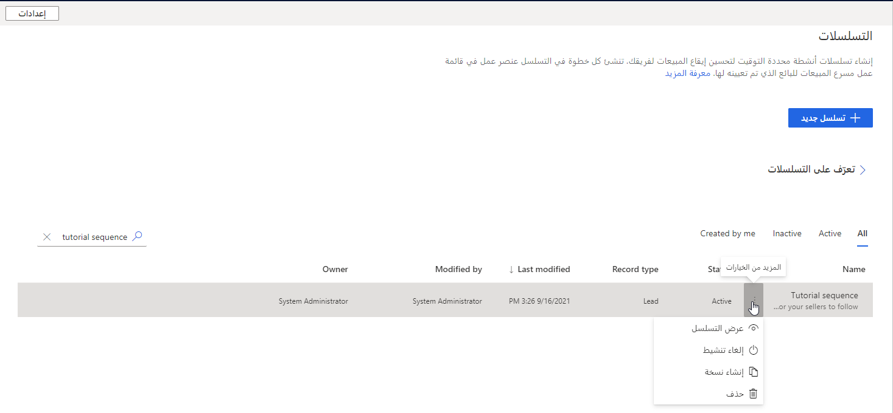

1. انقر فوق **تحرير الخطوات**.

## الخطوة 3: إضافة أنشطة إضافية ليقوم البائع بتنفيذها

أضف نشاطًا في نهاية التسلسل.

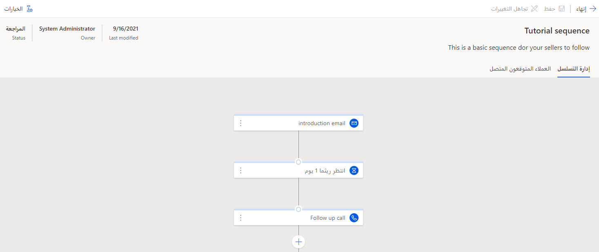

1. انقر فوق **+**.

    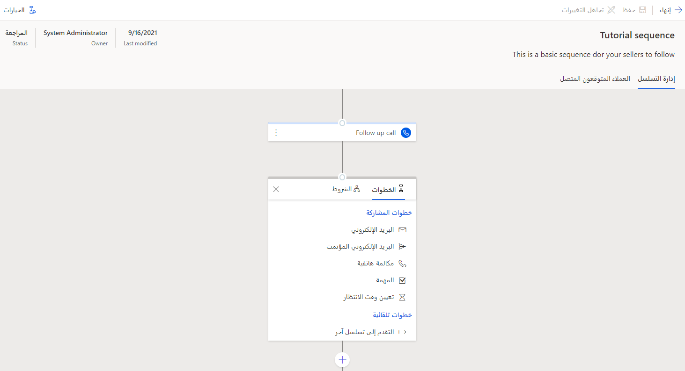

2. حدد نوع النشاط. في مثالنا، سنقوم بإضافة مهمة لتأهيل العميل المتوقع.

    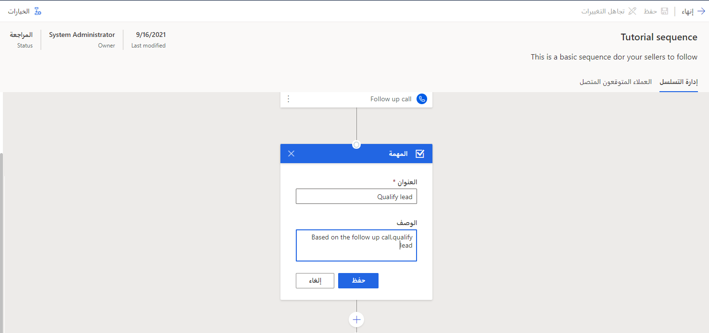

3. انقر فوق **حفظ**.

## الخطوة 4: إزالة نشاط

أزِل خطوة من تسلسل.

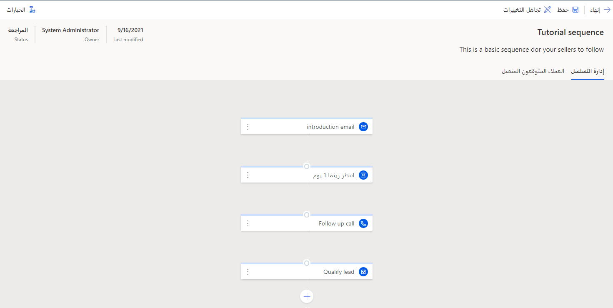

1. انقر فوق الخطوة التي ترغب في إزالتها. في مثالنا، سنقوم بإزالة فاصل زمني.

    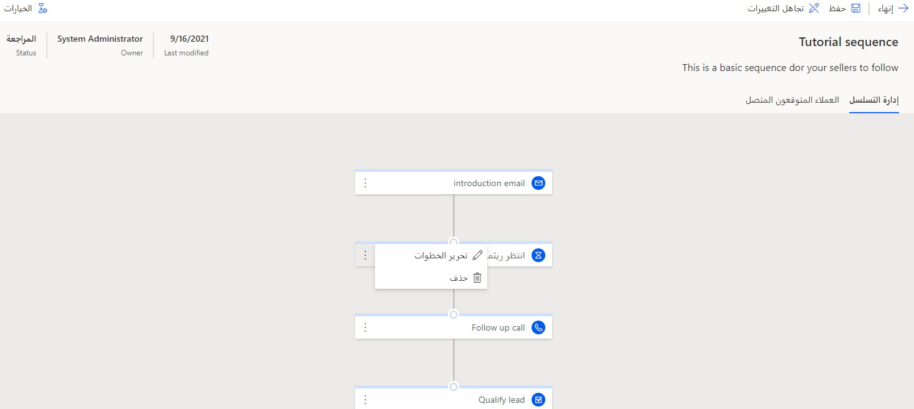

2. انقر فوق **حذف**. تمت إزالة النشاط من التسلسل.

## الخطوة 5: إضافة نشاط بين نشاطين موجودين

لإضافة خطوة بين خطوتين موجودتين، قم بالتمرير فوق السطر الذي يربط بين هاتين الخطوتين.

في مثالنا، سنضيف نشاط بريد إلكتروني بين الخطوة الثانية والثالثة إلى بائع لإرسال ملخص المكالمة.

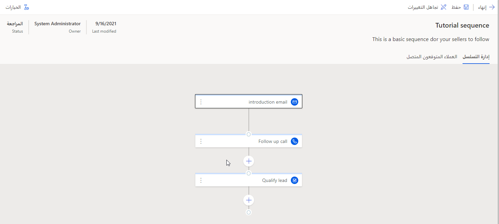

1. انقر فوق **+**.

    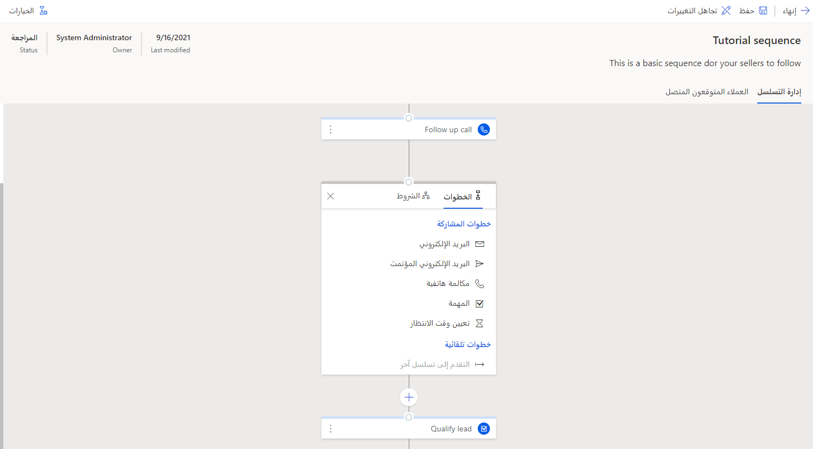

2. انقر فوق **بريد إلكتروني**

    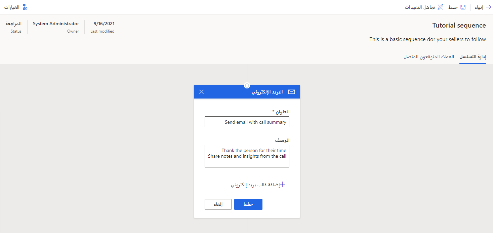

3. انقر فوق **حفظ**.

    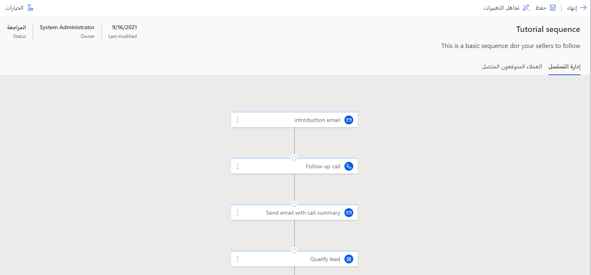

تمت إضافة نشاط لإرسال بريد إلكتروني مع ملخص المكالمة بين الخطوتين.

## الخطوة 6: حفظ التسلسل

احفظ التسلسل الذي تم إنشاؤه ليكون متوفرًا لمؤسستك.

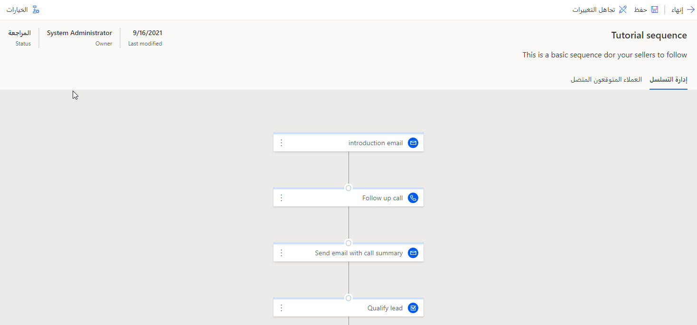

1. حدد **حفظ** في الجزء العلوي الأيمن من الشاشة.

## الخطوة 7: تنشيط التسلسل

لتوفير تسلسل، قم بتنشيط التسلسل لتطبيقه على عملاء متوقعين.

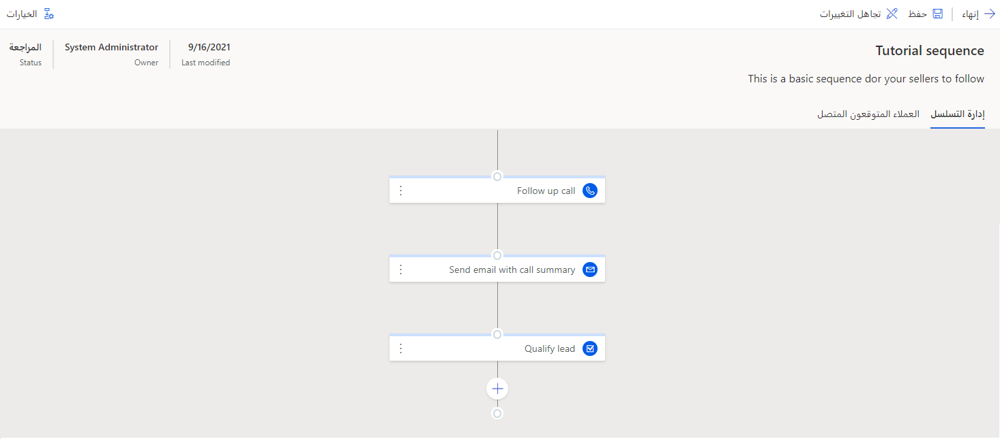

1. حدد **تنشيط** في الجزء العلوي الأيمن من الشاشة.

    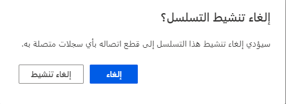

2. انقر فوق **نعم**.

الآن، يمكنك رؤية التسلسل الذي تم تحريره في عرض قائمة التسلسلات.

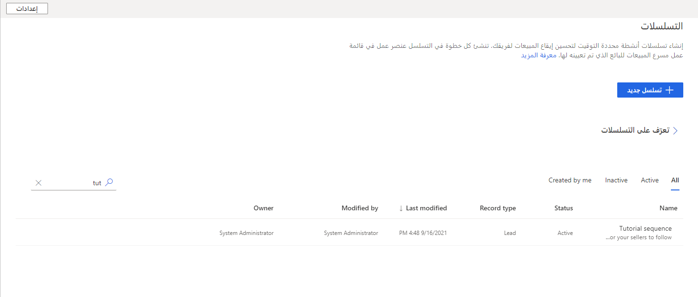

> [!NOTE]
> راجع [البرنامج التعليمي 2](/learn/modules/sales-sequence/3-connect/?azure-portal=true) لمعرفة كيفية توصيل هذا التسلسل بالسجلات. 

 

