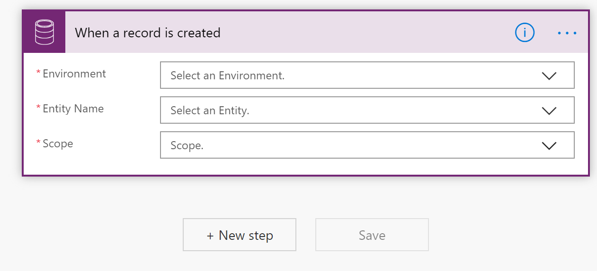
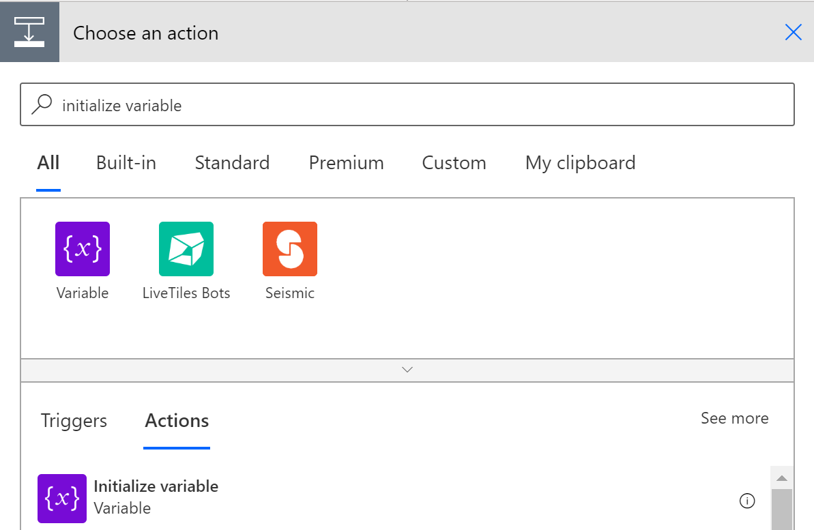

ستحتاج إما إلى بيئة تجريبية أو بيئة تحديد الصلاحيات مع Sales Insights لإكمال هذا البرنامج التعليمي. ستحتاج أيضًا إلى إصدار تجريبي أو ترخيص لـ Power Automate.

### الهدف

إنشاء مسار لتوصيل تسلسل بالعملاء المتوقعين أو الفرص تلقائياً. في المثال الخاص بنا، سنقوم بتوصيل تسلسل بالعملاء المتوقعين للأولوية 1.

## الخطوة 1: إنشاء سير جديد

1. في المتصفح الخاص بك، انتقل إلى [Power Automate](https://flow.microsoft.com/?azure-portal=true).  

2. انقر فوق **إنشاء**.

3. انقر فوق **سير العمل التلقائي**.

    

4. في مربع نص **اسم سير العمل**، حدد اسمًا لسير العمل الخاص بك.

5. في **اختيار مشغل سير العمل الخاص بك**، اكتب عند إنشاء سجل.

6. حدد مشغل **Microsoft Dataverse** .

7. انقر فوق **إنشاء**.

    

## الخطوة 2: تكوين المشغل

تعيين البيئة والجدول والنطاق.

1. في مربع التحرير والسرد  **البيئة** ، حدد البيئة للمسار. 

2. في مربع تحرير وسرد  **الجدول** ، حدد نوع الجدول، في المثال الخاص بنا، العميل المتوقع.

3. في مربع تحرير وسرد **النطاق**، حدد المؤسسة.

4. انقر فوق **الخطوة التالية**.

## الخطوة 3: تكوين متغير معرف التسلسل

الخطوة 3: تكوين متغير معرف التسلسل.

 

1. ابحث وحدد  **تهيئه متغير**.

    

2. في مربع نص **الاسم**، اكتب معرف التسلسل.

3. في مربع تحرير وسرد الكتابة، حدد سلسلة.

4. في مربع نص **القيمة** اكتب "".

## الخطوة 4: تكوين الشرط 

تكوين التحقق من صحة كون العميل المتوقع ذا أولوية-1.

1. حدد عنصر التحكم في  **الشرط**. 

    

2. قم بالبحث وحدد **قيمه الأولوية**.

3. في مربع نص القيمة اكتب **1**.

    

## الخطوة 5: تكوين "في حالة عدم وجود"

إذا لم يعط الشرط، فنحن نرغب في إنهاء تنفيذ المسار بالحالة "تم التخطي" للكشف عن تشغيل المسار ولكن العميل المتوقع غير مطابق للمعايير.

1. انقر فوق **في حالة لا**.

2. في نوع مربع البحث اكتب **إنهاء**.

3. حدد **إنهاء** من قائمه الإجراءات.

    

4. في **مربع الحالة**، حدد **تم إلغاء**.

    

## الخطوة 6: تكوين "في حالة نعم"

إذا كان الشرط يعطي الحالة "نعم"، فإننا نرغب بتوصيل تسلسل بالأولوية-1 للعميل المتوقع.

1. انقر فوق **في حالة نعم**. 

     

2. حدد **Microsoft Dataverse**.

3. حدد **سجلات القائمة**.

    

4. في مربع تحرير وسرد البيئة، حدد البيئة التي يتم تعريف تسلسلاتك بها.

5. في مربع تحرير وسرد اسم الجدول، حدد **تسلسلات**.

6. انقر فوق **عرض الخيارات المتقدمة**.

7. في نوع **استعلام التصفية** اكتب msdyn_name eq 'Pri1 sequence'.

8. انقر فوق **إضافة إجراء**.

9. ابحث وحدد **تعيين المتغير**.

    

10. في مربع تحرير وسرد اسم الجدول، حدد **معرف التسلسل**.

11. في القيمة، حدد **تسلسل**.

12. انقر فوق **إضافة إجراء**.

13. ابحث وحدد **تنفيذ اجراء غير مرتبط**.

    

14. في مربع نص **اسم الإجراء** اكتب msdyn_ConnectSequence.

15. في **RegardingIdTable‎** حدد العميل المتوقع.

16. في نوع **RegardingTAableName** اكتب العميل المتوقع.

17. في **SequenceId‎** حدد معرف التسلسل.

    

18. انقر فوق **حفظ**.

لقد انشانا مسار في Power Automate الذي سيتم تشغيله عند إنشاء سجل عميل متوقع.

المسار:

-   سيتحقق من صحة كون العميل المتوقع بالفعل في الأولوية-1.

-   إحضار تسلسل الأولوية-1 المطابق.

-   قم بربط التسلسل الذي تم جلبه إلى العميل المتوقع أعلاه.

بمجرد اتصال التسلسل، سيكون متوفرًا للبائعين الذين يعملون على سجل العميل المتوقع في قائمه انتظار العمل الخاصة بمسرع المبيعات.
