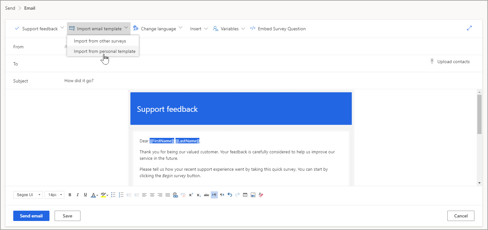

Dynamics 365 Customer Voice يتضمن وظائف البريد الإلكتروني، ما يوفر لمنشئي الاستبيانات والمسوقين القدرة على إرسال رسائل بريد إلكتروني مخصصة إلى عنوان بريد إلكتروني أو مستلم من Outlook أو Dynamics 365 أو عن طريق استيراد المستلمين من ملف CSV. ويمكن تخصيص الاستبيان بنسق شركة باستخدام صور وألوان وخطوط وشعارات، ما يوفر إمكانية التعرف على العلامة التجارية للمستجيب الذي يكمل الاستبيان. ومع ذلك، إذا لم يعرض البريد الإلكتروني المستلَم أي نوع من العلامات التجارية المماثلة، فقد يتضح أنه قد تم انقطاع الاتصال بين البريد الإلكتروني والاستبيان، والذي قد يؤدي إلى أن المُستلِم يقوم بتجاهل البريد الإلكتروني أو يعتقد أنه بريد عشوائي.

للحفاظ على تناسق التجربة، يمكنك تخصيص قوالب البريد الإلكتروني لتتناسب مع رحلة العميل بالكامل. يتم إنشاء كل قالب بريد إلكتروني وامتلاكه من جانب مستخدم، ولكن يمكن مشاركته عبر استبيانات أخرى. ويمكن أيضًا استيراد القوالب من استبيانات أخرى، إذا لزم الأمر. يمكن أن يتضمن القالب صورًا وتغييرات على الخطوط والقدرة على إضافة متغيرات بحيث يمكنك إنشاء قالب بريد إلكتروني مخصص لإرساله إلى المستلمين.

تحتوي المشاريع المختلفة على استبيانات ذات قوالب بريد إلكتروني قياسية مختلفة. يحتوي كل قالب على صياغة مختلفة قليلاً في النص الرئيسي ويشمل تحية مختلفة بناءً على الغرض من القالب.

> [!div class="mx-imgBorder"]
> 

يتكون قالب بريد إلكتروني من عدة مكونات، وتكون بعضها مطلوبة. قد تقوم المكونات الأخرى بتحسين المظهر العام والمساعدة على جعل البريد الإلكتروني واضحًا ومختصرًا. ضع في اعتبارك الحقول الآتية عند إنشاء قوالب بريد إلكتروني.

|     المكون           |     المطلوب    |     التفاصيل                                                                                                                                                                                                                                                                                                           |
|-------------------------|-----------------|-----------------------------------------------------------------------------------------------------------------------------------------------------------------------------------------------------------------------------------------------------------------------------------------------------------------------|
|     الموضوع             |     نعم         |     يجب أن تشتمل دعوة الاستبيان على موضوع; وهي مطلوبة في أي قالب بريد إلكتروني تم إنشاؤه. وكما هو الحال مع أي نوع من رسائل البريد الإلكتروني، تحمل الدعوات الخاصة بالاستبيانات اسم الموضوع المحتمل بدرجة أكبر أن تتم الإجابة عنه.                                                                                                                        |
|     ارتباط الاستبيان         |     نعم         |     يلزم توفير رابط للاستبيان. يمكن أن يكون هذا الرابط في شكل رابط مباشر أو يمكن أن يكون بصورة وباستخدام [[SurveyLink]] في رابط عنوان URL. عند إرسال دعوة بريد إلكتروني، يتم إنشاء رابط مخصص لكل مستلِم للاستبيان بهدف السماح بتعقب الإجابات التي يتم استلامها.           |
|     رابط إلغاء الاشتراك‬    |     نعم         |     يجب إدراج رابط إلغاء الاشتراك في قالب البريد الإلكتروني. يسمح هذا الرابط لمستلم البريد الإلكتروني بإلغاء الاشتراك من تلقي طلبات أكثر للإجابة عن الاستبيانات التي يتم إرسالها من Dynamics 365 Customer Voice (استنادًا إلى البيئة التي تم إرسالها منها).                                                                          |
|     المتغيرات           |     لا          |     يمكن استخدام المتغيرات لإظهار المعلومات المخصصة مثل الاسم الأول أو اسم العائلة. يمكن استخدام هذه المتغيرات عند الإرسال مباشرة من Dynamics 365 Customer Voice. ويجب استخدام المتغيرات الأخرى بالارتباط مع التدفق في Microsoft Power Automate لجذب المعلومات مثل اسم الشركة والمسمى الوظيفي وما إلى ذلك.    |
|     الشعار                |     لا          |     إذا تمت إضافة صورة إلى الاستبيان، فستتم إضافتها إلى أعلى قالب الاستبيان بشكلٍ افتراضي. ويمكن إزالتها إذا لم تكن ضرورية، ولكن يمكنها المساعدة على التعرف على العلامة التجارية.                                                                                                                               |
|     الصور              |     لا          |     يمكن إضافة الصور إلى مناطق أخرى من قالب البريد الإلكتروني واستخدامها في روابط أو عناوين ملفات تعريف وسائل التواصل الاجتماعي أو التعرف على العلامة التجارية.                                                                                                                                                              |

باستخدام بعض التخطيطات والتعديلات، يستطيع المسوق إنشاء مكتبة كاملة من قوالب البريد الإلكتروني الجاهزة والمتوفرة لمنشئ الاستبيان للتحديد منها. يمكن أن يساعد الحفاظ على تناسق العلامات التجارية مع بقية أساليب التواصل في المؤسسة على تشجيع معدل أعلى للإجابة عن الاستبيان وتقديم التعليقات المرتبطة به.
