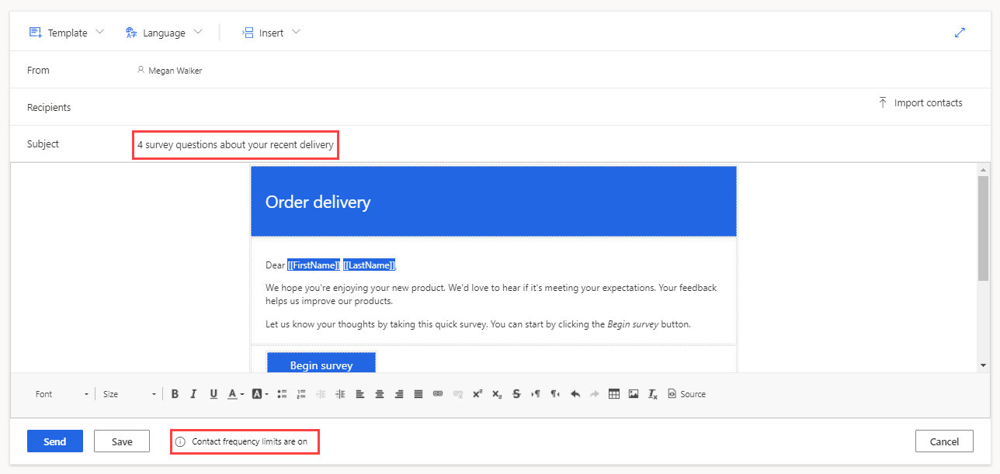
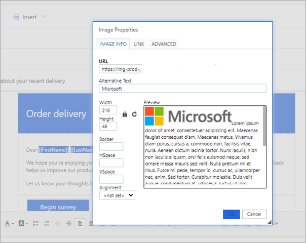
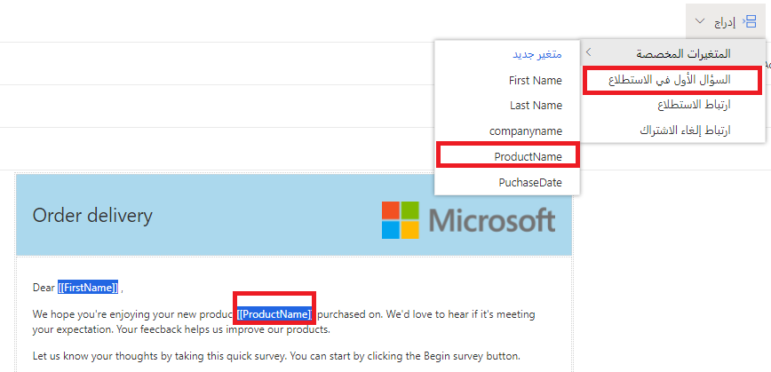
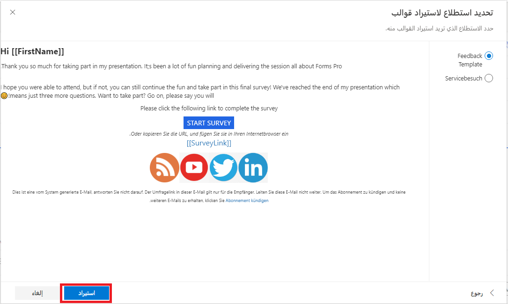

بعد إنشاء استطلاع، حان الوقت لبدء إرساله إلى العملاء والبدء في جمع التعليقات. قبل هذه النقطة، يجب مراعاة العلامة التجارية والتسويق التي قد تتطلبها المؤسسة فيما يتعلق بمظهر الرسالة الإلكترونية المرسلة. إذا كان الاستطلاع يبدو جيداً وكان يحمل علامة تجارية كاملة بشعار الشركة ونظام الألوان، فمن المنطقي أن تتطابق الرسالة الإلكترونية مع الاستطلاع وترتبط به. هذا هو المكان الذي تكون فيه قوالب الرسائل الإلكترونية في Dynamics 365 Customer Voice مفيدة. 

يمكنك الوصول إلى قوالب الرسالة الإلكترونية من استطلاع في Customer Voice عن طريق تحديد علامة التبويب **إرسال** ثم تحديد خيار **رسالة إلكترونية**. سوف يشتمل كل مشروع على قالب رسالة إلكترونية واحد على الأقل، بغض النظر عما إذا تم استخدام قالب مشروع أو إذا تم إنشاؤه من الصفر. ستشتمل قوالب الرسائل الإلكترونية الخاصة بمشروع تم إنشاؤه من الصفر على موضوع عام وتصميم أساسي في نص الرسالة الإلكترونية. يمكن أن تحتوي قوالب المشروع على موضوع مخصص قليلاً وتخطيط أكثر إرضاءً من الناحية الجمالية في نص الرسالة الإلكترونية. وتكون الشاشة المستخدمة لتحرير القالب هي نفس الشاشة المستخدمة لإرسال رسائل إلكترونية. تحقق من وجود مؤشر يخبرك أن حدود تكرار الاتصال قيد التشغيل. يعتمد هذا المؤشر على إعداد في منطقة إعدادات التوزيع يمكنه التحقق من إرسال الاستطلاع لجهات الاتصال فقط إذا لم يتلقوا بالفعل دعوة في آخر عدد **س** من الأيام. 

> [!div class="mx-imgBorder"]
> 

يمكنك تعديل نص الرسالة الإلكترونية باستخدام عناصر تحكم التحرير WYSIWYG. يمكنك تحرير النص وتمييزه لتغيير نمط الخط وحجمه، وجعله بخط غامق أو مائل أو تزويده بشَرطة سفلية وتغيير لون الخط ولون الخلفية. بالإضافة إلى ذلك، يمكنك إضافة الجداول والصور للمساعدة في إنشاء قالب جيد التنسيق ومرتبط بالعلامة التجارية. إذا كانت الصور مطلوبة، فيجب أن تتم استضافتها وستحتاج إلى عنوان URL لسحبه إلى الصورة. تأكد من استخدام الصور المستضافة على مجال شركتك أو مواقع الويب العامة الأخرى فقط. بعد ذلك، يمكنك تعيين حجم الصورة ومحاذاتها، إلى جانب نص بديل وتغيير الحجم والارتباط التشعبي.

> [!div class="mx-imgBorder"]
> 

تتمثل إحدى مزايا تخصيص قوالب الرسائل الإلكترونية في القدرة على إدراج المحتوى. للمساعدة على زيادة نسبة التعليقات والتشجيع عليها، يمكنك إضافة السؤال الأول في الاستطلاع. قد يؤدي هذا الأسلوب إلى ظهور اختلاف في عدد الردود التي تتلقاها. لا يمكن إدراج السؤال الأول إلا إذا كان لديك اختيار من متعدد (إجابة واحدة) أو تصنيف (نجمة أو ابتسامة) أو سؤال Net Promoter Score (NPS) كأول سؤال في الاستطلاع. إذا تم تمكين خيار تبديل الأسئلة عشوائياً في الاستطلاع، فلن تتمكن من استخدام هذه الميزة. 

يمكن أن يساعدك خيار **المتغيرات المخصصة** من قائمة **إدراج** على توفير مزيد من التعرف على متلقي الرسالة الإلكترونية.
يمكن أن تساعد إضافة المحتوى المستلم في التعرف على سبب مطالبتهم بالتعليقات، ويمكن أن يشجعهم أيضاً على الرد بالتعليقات. بعد إضافة المتغيرات في قائمة **إضفاء طابع شخصي**، يمكن بعد ذلك إدراجها مباشرةً في موضوع الرسالة الإلكترونية أو نصها. 

هناك صنفان يجب تضمينهما في كل قالب رسالة إلكترونية ويكونان مطلوبان قبل أن تتمكن من حفظ القالب: هما رابط الاستطلاع ورابط إلغاء الاشتراك. إذا تمت إزالة أي من الرابطين، فسيتم عرض إخطار أعلى الشاشة يفيد بضرورة تضمينه. 

> [!div class="mx-imgBorder"]
> 

إذا كان لدى مؤسسة قوالب رسائل إلكترونية تم إنشاؤها في أداة مراسلة إلكترونية مختلفة، فيمكن إضافة HTML باستخدام زر **مصدر** من أسفل قالب الرسالة الإلكترونية. قد تتم مطالبتك بإجراء بعض التعديلات بعد إضافة HTML، ستحتاج إلى إضافة الاستطلاع وروابط إلغاء الاشتراك. ومع ذلك، قد تكون هذه الطريقة مستهلكة للوقت للتأكد من أن كافة قوالب الرسائل الإلكترونية يتم تمييزها بعلامات تجارية لتفي بإرشادات العلامة التجارية الخاصة بالمؤسسة.

قبل استخدام قالب الرسالة الإلكترونية، تأكد من حفظه.
تجنب إرسال رسالة إلكترونية قبل الحفظ لأن كافة التغييرات ستفقد. يمكن إنشاء المزيد من القوالب من جديد أو استيرادها من قائمة القوالب الأخرى التي تم إنشاؤها أو الاستطلاعات الأخرى التي تتضمن قوالب الرسائل الإلكترونية. 

> [!div class="mx-imgBorder"]
> 

شاهد الفيديو التالي للاطلاع على عرض توضيحي سريع حول القوالب.

> [!VIDEO https://www.microsoft.com/videoplayer/embed/RWREr1]
