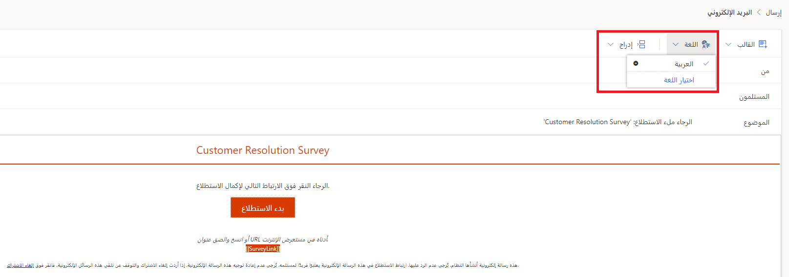

يُشكل التأكد من تخصيص المحتوى في موضوع الرسالة الإلكترونية ونصها وأن المظهر العام والشكل يلبيان إرشادات العلامة التجارية للمؤسسة أمراً مهماً لتوعية العملاء وتقديرهم. تلعب اللغة أيضاً دوراً أساسياً في إنشاء محتوى مخصص.
يتيح لك Dynamics 365 Customer Voice القدرة على الاتصال بالعملاء العموميين. إذا كان الاستطلاع الذي تم إنشاؤه يتضمن لغات متعددة، فتأكد من مراجعة قالب الرسالة الإلكترونية المقابلة لتوفير التجربة العمومية نفسها.

بالنسبة إلى الاستطلاع الذي يتضمن أكثر من لغة واحدة، يمكنك تحديد القائمة المنسدلة **اللغة** الموجودة في قالب رسالة إلكترونية لعرض اللغة الافتراضية للاستطلاع تلقائياً. عندما تم إنشاء الاستطلاع، وإضافة أي لغات لاحقة، تم تعيين أول قالب رسالة إلكترونية (وغيره من القوالب التي تم إنشاؤها) إلى اللغة الأصلية. للتأكد من إمكانية استخدام قالب رسالة إلكترونية يتوافق مع كل لغة جديدة، تحتاج إلى إنشاء إصدارات متنوعة من القالب.
بعد أن تقوم بتحديد قائمة **اللغة**، حدد خيار **اختيار اللغة**. يكون هذا الخيار نشطاً فقط إذا كانت لا تزال هناك حاجة إلى ترجمة لغة للقالب الذي تقوم بعرضه.

> [!div class="mx-imgBorder"]
> 

سيتم عرض جميع اللغات التي لا تزال بحاجة إلى الترجمة للمستخدم الذي يقوم بإنشاء قالب الرسالة الإلكترونية. يمكنك تحديد لغة واحدة أو أكثر ثم تحديد زر **إضافة** لربطها بقالب الرسالة الإلكترونية. 

> [!div class="mx-imgBorder"]
> 

بعد إضافة المزيد من اللغات، يمكنك تحديد اسم اللغة الذي سيظهر مع علامة اختيار بجانبه.
سيظل الإصدار باللغة الافتراضية ويجب أن يترجمه الشخص الذي يقوم بتحرير القالب. يمكنك ضبط النص بحيث يتم عرض ترجمات اللغة الصحيحة. عند الانتهاء، حدد الزر **حفظ** في الجزء السفلي من الشاشة. بعد الانتهاء من الترجمة الأولى، حدد اللغة التالية واتبع الخطوات نفسها. تابع هذه العملية حتى يتم الانتهاء من كافة إصدارات قالب الرسالة الإلكترونية. تأكد من قيامك بالحفظ بعد كل تعديل. 

عندما يتم إرسال إصدار بلغة معينة لقالب رسالة إلكترونية من Customer Voice ويحدد المستجيب الرابط من الرسالة الإلكترونية لفتح الاستطلاع، سيتم فتح الاستطلاع افتراضياً باللغة نفسها المرتبطة بإصدار قالب الرسالة الإلكترونية الذي تم إرساله. ونتيجة لذلك، سيكون لدى العميل تجربة عمومية كاملة، حيث يتلقى رسالة إلكترونية واستطلاعاً بلغته المفضلة أو المطلوبة. عند استخدام Power Automate لإرسال دعوات الاستطلاع، يمكنك تعيين حقل **الإعدادات المحلية** على إرسال استطلاع أو إنشاء إجراء دعوة للغة معينة لأتمتة التجربة. ومع ذلك، يجب التأكد من إرسال الاتصال باللغة المفضلة. ضع في اعتبارك استخدام حقل في صفوف جهات الاتصال ذات الصلة للتأكد من أن اللغة المحددة ذات صلة بالمستجيب.  

> [!div class="mx-imgBorder"]
> 

