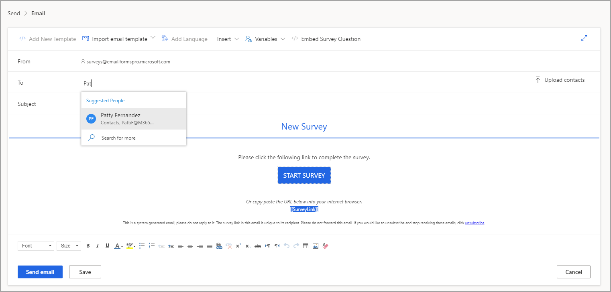
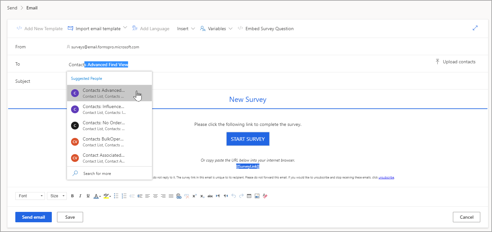
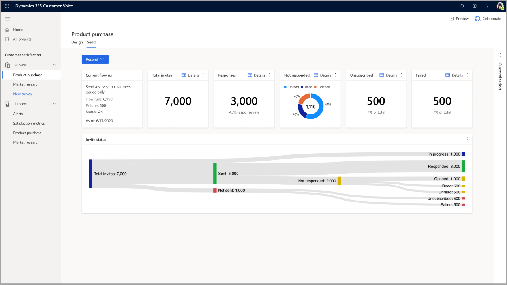

بعد الانتهاء من إضافة علامة تجارية إلى قالب بريد الكتروني مخصص، يمكنك إرسال الاستطلاع وطلب الملاحظات. يؤدي إرسال استطلاع إلى إنشاء سجل دعوة الاستطلاع، والذي يتم تخزينه في Microsoft Dataverse. عندما يتم الرد على الاستطلاع، فإنه ينشئ سجل استجابة الاستطلاع ويتم تخزينه في Dataverse، المرتبط بدعوة الاستطلاع. توفر لك هذه الميزة القدرة على عرض الدعوات التي تم الرد عليها باستطلاع كامل والدعوات التي تم البدء فيها ولكن لم يتم الرد عليها والدعوات التي لم يتم فتحها.

يتم إرسال بريد إلكتروني مباشرة من علامة التبويب **إرسال** في الاستطلاع. باستخدام خيار البريد الإلكتروني، يمكنك مراجعته قبل إرساله. بعد ذلك، يمكنك تحديد قالب بريد إلكتروني افتراضي أو مخصص ثم تحديد المستلمين.
يحتوي Dynamics 365 Customer Voice على تكامل مباشر مع Microsoft Outlook وDynamics 365. يمكنك إدخال عنوان بريد إلكتروني مباشرة في عمود **المرسل إليه**، متبوعاً بفاصلة منقوطة.
رغم أنه سيتم إرسال رسالة إلكترونية، إلا أن استخدام هذه الطريقة يعني أنه لا يمكن إضفاء طابع شخصي على الاستطلاع لأنه يتم استخدام عنوان البريد الإلكتروني فقط ولم يتم توفير الاسم الأول واسم العائلة. يحدد الإعداد في كل استطلاع أيضاً ما إذا كان سيتم إنشاء أي مستجيبين، حيث لا يمكن العثور على عنوان البريد الإلكتروني في Dataverse، كسجل جهة اتصال أم لا. بشكل افتراضي، يتم تشغيل هذا الإعداد ولكن يمكن إيقاف تشغيله بحيث لا يتم إنشاء سجلات جهات اتصال جديدة.

انتقل إلى Outlook أو Dynamics 365، وفي مربع البحث في علامة التبويب "جهات الاتصال"، ادخل اسم شخص أو عنوان بريد إلكتروني لعرض قائمة بالأشخاص المقترحين الذين يستوفون القيمة التي قمت بإدخالها. عندما يتم عرض جهة الاتصال المطلوبة، يمكنك تحديد الاسم لإضافة جهة الاتصال في عمود **المرسل إليه**. يمكنك إضافة عدة مستلمين، وسيتلقى كل شخص بريده الإلكتروني بشكل فردي، دون أي إشارة إلى من تم إرسال البريد الإلكتروني إليه.

> [!div class="mx-imgBorder"]
> 

هناك خيار آخر لعملاء Dynamics 365 وهو البحث عن دعوة استطلاع وإرسالها إلى جميع جهات الاتصال التي تم إرجاعها من عرض. يتم إنشاء طرق العرض كنظام أو طرق عرض شخصية، ويمكن اختيار أي منهما للإرسال. بكتابة اسم طريقة العرض في العمود **المرسل إليه**، يتم عرض قائمة بأي طرق عرض تطابق هذه المعايير. يمكن بعد ذلك إرسال البريد الإلكتروني مع نسخة تذهب إلى كل شخص يفي بمعايير البحث لطريقة العرض التي تم تحديدها.

> [!div class="mx-imgBorder"]
> 

بعد إرسال الاستطلاع مرة واحدة، ستعرض علامة التبويب **إرسال** لوحة معلومات. ستوفر لك لوحة المعلومات إمكانية الوصول لإعادة إرسال الاستطلاع، وستقدم لك نظرة عامة على عناصر واجهة المستخدم التي تعرض العدد الإجمالي للدعوات والاستجابات للاستطلاع. ستعرض لوحة المعلومات أيضاً عدد الدعوات التي فشلت وتم إلغاء الاشتراك فيها.

> [!div class="mx-imgBorder"]
> 

سيؤدي تحديد خيار **التفاصيل** لعناصر واجهة المستخدم المختلفة إلى فتح لوحة المستلمين. على سبيل المثال، إذا حددت الرابط **التفاصيل** في قسم **فشل** فسيتم عرض أي عناوين بريد إلكتروني لم يُتمَكن من تعيين دعوات الاستطلاع عليها في قائمة. يمكن بعد ذلك مراجعة هذه الإدخالات للتأكد من أنها عناوين بريد إلكتروني صالحة. يتم تعقب رسائل البريد الإلكتروني المرسلة، بمعنى أنك ستتمكن من المراقبة عند فتح المستلمين لدعوة الاستطلاع. بالإضافة إلى ذلك، سيتم تزويدك بنظرة عامة يتم العثور عليها في عنصر واجهة المستخدم الذي **لم تتم الاستجابة** له. سيوفر تحديد خيار **التفاصيل** مزيداً من المعلومات. على الرغم من أنه ليس من الممكن ضمان عدم حظر أي من رسائل البريد الإلكتروني ووضع علامة عليها كبريد عشوائي أو بريد غير هام، إلا أن رسائل البريد الإلكتروني تتضمن إدارة السمعة، مما يقلل من احتمالية حدوث هذا الموقف.

وتظهر قيم حالة دعوة الاستطلاع المحتملة في الجدول التالي.

|     الحالة          |     المعنى                                                                                                                  |
|---------------------|------------------------------------------------------------------------------------------------------------------------------|
|     قيد التقدم     |     تم وضع الرسالة الإلكترونية لدعوة الاستطلاع في قائمة الانتظار ليتم إرسالها.                                                                      |
|     مُرسلة            |     تم تسليم البريد الإلكتروني لدعوة الاستطلاع بنجاح إلى المستلم.                                          |
|     قراءة            |     تمت قراءة البريد الإلكتروني لدعوة الاستطلاع أو فتحه.                                                                   |
|     تم البدء         |     بدأ الاستطلاع من قبل المستلم ولكنه لم يكتمل بعد.                                                  |
|     تم الرد       |     رد المستلم على الاستطلاع.                                                                             |
|     فشل          |     لم يتم تسليم البريد الإلكتروني لدعوة الاستطلاع إلى المستلم بسبب أن عنوان البريد الإلكتروني غير صحيح أو خطأ آخر.    |
|     غير مشترك    |     قام المستلم بإلغاء اشتراكه من تلقي رسائل البريد الإلكتروني المتعلقة بالاستطلاع.                                               |

بشكل افتراضي، يتم إرسال الاستطلاعات من عنوان بريد إلكتروني عام لـ Dynamics 365 Customer Voice. ومع ذلك، يمكن تخصيص عنوان البريد الإلكتروني للمرسل لتزويد المؤسسة بالقدرة على تحديد عنوان بريد إلكتروني من نطاقها الخاص. يساعد التخصيص في التعرّف على العلامة التجارية ويزيد من احتمالية قيام المستجيبين بالمراجعة والفتح واتخاذ الإجراءات عند تلقي بريد إلكتروني من مؤسسة مألوفة لديهم. 

يمكن العثور على معلومات حول تخصيص عنوان البريد الإلكتروني للمرسل في [تفاصيل البريد الإلكتروني لـ Customer Voice](https://aka.ms/CustomerVoiceCustomEmail).

يمكن للمستلم أيضاً إلغاء الاشتراك من تلقي المزيد من الاستطلاعات التي يتم إرسالها من Dynamics 365 Customer Voice. يوفر الارتباط المطلوب أسفل كل قالب بريد إلكتروني للمستلمين خيار إلغاء الاشتراك. بعد إلغاء اشتراك المستلم، تتم إضافة عنوان بريده الإلكتروني إلى Dataverse إلى قائمة إلغاء الاشتراك الخاصة بالبيئة. سيتم أولاً التحقق من أي استطلاعات أخرى يتم إرسالها من نفس البيئة مقابل قائمة غير المشتركين، وإذا تم العثور على عنوان بريد إلكتروني مطابق، فسيتم استبعاد المستلم من توزيع البريد الإلكتروني.
