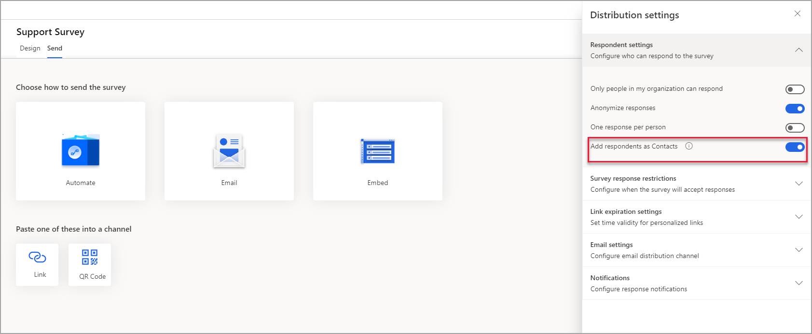
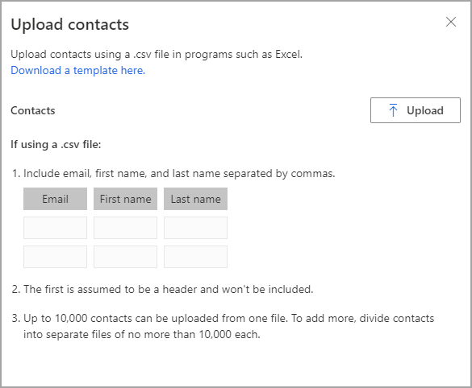

إن طرق إرسال دعوة بالبريد الإلكتروني للمشاركة في استبيان تتضمن الكتروني إرسال بريد إلكتروني إلى جهة اتصال Outlook وجهة اتصال Dynamics 365 وإرسال بريد الكتروني إلى كافة جهات الاتصال التي يتم إرجاعها في طريقة عرض Dynamics 365. وتكون هذه الأساليب مألوفة للمستخدم ومثالية لاستخدامها في حالة وجود جهات الاتصال بالفعل. فكر في سيناريو المؤسسة، Contoso، الذي يستضيف حدثًا صناعيًا. خلال الحدث الذي استمر يومين، كان فريق المبيعات قد استغرق وقتًا لجمع الأسماء وعناوين البريد الإلكتروني لكافة الأشخاص الذين قاموا بتقديمها وإضافتها إلى جدول البيانات. حان الوقت الآن لفريق التسويق أن يطلب التعليقات. 

الخطوة الأولى التي يجب أن يتخذها فريق التسويق هو تحديد ما إذا كان يجب إضافة هؤلاء الحضور إلى بيئة Microsoft Dataverse كسجلات جهات اتصال. بشكلٍ افتراضي، يوجد، في كل استبيان، إعدادًا يحدد أنه سيتم إنشاء جميع عناوين البريد الكتروني غير المعروفة التي تم إرسال دعوة الاستبيان إليها كسجل جهة اتصال جديد. وفي حالة العثور على عنوان بريد إلكتروني كمطابقة، سيتم ربط سجل دعوة الاستبيان بجهة الاتصال هذه. قد لا يكون هذا النهج مناسبًا لكافة الحالات، لذلك يمكن إيقاف تشغيل هذه الوظيفة على أساس كل استبيان على حدة. يمكن الوصول إلى **إضافة المستجيبين كجهات اتصال** من علامة تبويب **إرسال** ثم قائمة **تخصيص**. حدد **إعدادات التوزيع > إعدادات المستجيب**، والتي ستوفر التبديل لتشغيل هذه الوظيفة أو إيقاف تشغيلها، استنادًا إلى متطلبات الاستبيان.  

> [!div class="mx-imgBorder"]
> 

لإرسال دعوات الاستطلاع إلى كافة عناوين البريد الإلكتروني التي حصل عليها فريق المبيعات في حدث Contoso، يحتاج فريق التسويق إلى التأكد من أن جدول البيانات الذي استخدمه فريق المبيعات بالتنسيق الصحيح ليقوم Dynamics 365 Customer Voice بقراءته. يجب أن يكون جدول البيانات ملف CSV ويجب أن يتوافق مع المعايير الآتية: 

-   يجب أن يحتوي ملف CSV على قيم مفصولة بفاصلة لكل جهة اتصال موجودة في التسلسل:

    - عنوان البريد الإلكتروني (إلزامي)

    - الاسم الأول

    - اسم العائلة

-   من المفترض أن الصف الأول في الملف هو الرأس، ولن يتم استيراده.

-   يمكن استيراد 10,000 مستلمين فقط في المرة الواحدة. وفي حالة وجود أكثر من 10,000 مستلم، يمكنك تقسيمهم إلى ملفات CSV متعددة قبل استيرادهم.

بالإضافة إلى ذلك، من الممكن ربط دعوة الاستطلاع والإجابة عنه بجدول في بيئة Dataverse نفسها بإضافة الأعمدة والمعلومات الآتية إلى ملف CSV:

-   **‏‫معرّف ذو صلة‬** - معرّف الجدول الذي سيتم ربطه بدعوة الاستبيان والإجابة عنه.

-   **‏اسم الجدول ذو الصلة‬** - اسم الجدول الذي سيتم ربطه بدعوة الاستبيان والإجابة عنه.

عندما يكون التنسيق صحيحًا، يستطيع فريق التسويق استيراد المعلومات عن طريق الانتقال إلى علامة تبويب **إرسال** الخاصة بالاستبيان وتحديد **البريد الإلكتروني**. يوجد الخيار **تحميل جهات الاتصال** على يسار عمود **إلى**. بعد الاستعراض بحثًا عن ملف السجلات من الحدث، يمكن أن يقوم عضو الفريق بتحديد الملف واستيراده. سيتم عرض قائمة بالمحتويات التي يمكن للفريق مراجعتها قبل تحديد زر **استيراد المستلمين**. كما يتم توفير خيار لتحديث معلومات جهة الاتصال في حالة وجود المستلم المستورد كجهة اتصال بالفعل في Dataverse، استنادًا إلى عنوان البريد الإلكتروني. ونظرًا إلى أن ملف الاستيراد يحتوي فقط على ثلاثة أعمدة من البيانات لكل سجل، يمكن تحديث العمودين **الاسم الأول** و **اسم العائلة** فقط. بعد اكتمال الاستيراد، سيظهر عمود **إلى** عدد المستلمين الذين ستتم مراسلتهم بالبريد الإلكتروني. بعد تحديد قالب بريد إلكتروني ، يمكن إرساله. 

> [!div class="mx-imgBorder"]
> 

> [!VIDEO https://www.microsoft.com/videoplayer/embed/RE4ALuR]
