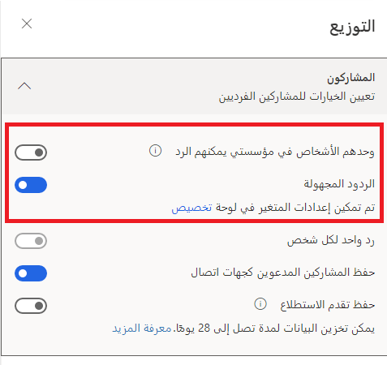
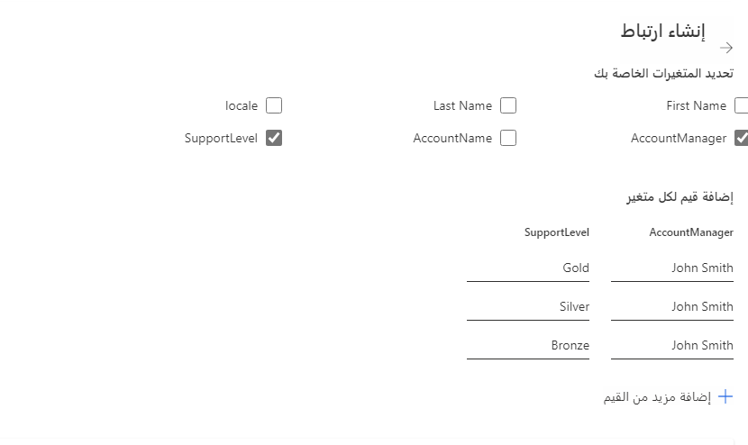
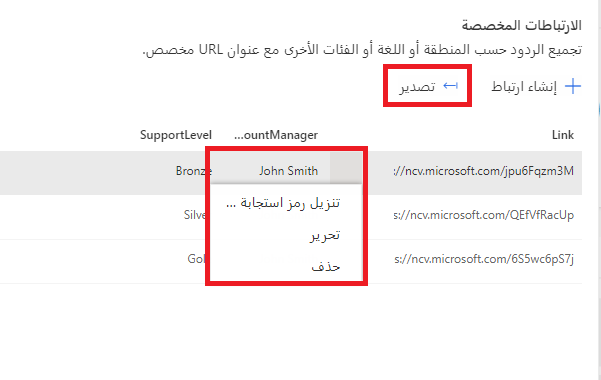
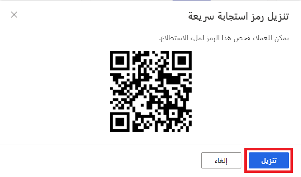

يعد إرسال بريد إلكتروني لطلب الملاحظات من مستلم محدد إحدى الطرق للحصول على استطلاع Customer Voice للأشخاص. يساعد استخدام البريد الإلكتروني في التعريف بالمستجيب على الاستطلاع، كما يتم ربط الاستجابة على الاستطلاع بدعوة الاستطلاع الأصلية. يمكن أيضاً مشاركة الاستطلاعات مع الأشخاص الآخرين المجهولين باستخدام ارتباط مباشر أو شفرة الاستجابة السريعة. فكر في الاستطلاع لجمع ملاحظات حول حدث ما. يحتوي الحدث على مجموعة مقابلة في إحدى قنوات وسائل التواصل الاجتماعي، ويريد المنظمون معرفة رأي الناس في الجلسات المختلفة والفكرة الرئيسية. تعني مشاركة الارتباط مباشرة أنه لا يمكن للمنظمين تسجيل اسم كل استجابة فردية. ومع ذلك، يمكن تمرير المتغيرات إلى رمز الارتباط أو شفرة الاستجابة السريعة في حاله الرغبة، وذلك للتأكد من معرفة من أكمل الاستطلاع. 

توفر مراجعة منطقة التوزيع من قائمة إرسال التخصيص لاستطلاع معلومات حول من يمكنه ملء النموذج وإرسال استجابة. يمكن لأي شخص لديه الرابط الاستجابة، أو يمكن الاستجابة فقط للأشخاص داخل نفس المؤسسة. في حالة تشغيل الإعدادات للسماح للأشخاص الموجودين في المؤسسة فقط بالاستجابة، بالإضافة إلى إرسال دون مشاركته عبر بريد إلكتروني مخصص من Customer Voice، فما يزال من الممكن تسجيل أسماؤهم لأنه سيتعين عليهم تسجيل الدخول للاستجابة. إذا تمت مشاركة الارتباط وكان الإعداد متاحاً لكي يتمكن أي شخص من الاستجابة، فلا يمكن تسجيل اسمه لأنه لم يتم توفير أي رابط إلى عنوان بريد إلكتروني فريد.  تحدد رمز تبديل الاستجابات المجهولة المتغيرات التي سيتم حفظها مع استجابة الاستطلاع. ويعد ذلك مفيداً في حالة ضرورة حفظ ملاحظات الاستطلاع بشكل مجهول ولكن يجب حفظ المتغيرات مثل اللغة أو البلد/المنطقة أو القسم للمساعدة في إعداد التقارير عن الاستجابات. 

> [!div class="mx-imgBorder"]
> 

في منطقة الإرسال الموجودة في الاستطلاع، يمكنك مراجعة كافة طرق توزيع الاستطلاع. يوفر خيار **الارتباط** عنوان URL الكامل للاستطلاع حيث يمكن نسخه ومشاركته على وسائل التواصل الاجتماعي أو عبر البريد الإلكتروني. يتم تقصير الارتباط الموفر تلقائيا، مما يجعله أكثر استخداماً في منصات وسائل التواصل الاجتماعية المتعددة أو استخدام خدمات SMS. مجدداً، هذا الارتباط عبارة عن ارتباط لاستطلاع غير مخصص، ولن تحتوي أي متغيرات تتم إضافتها إلى الاستطلاع على أي نوع من التخصيص للمستجيبين، لذا يجب مراعاة هذا الجانب عند إنشاء الاستطلاع. يعتبر أسفل الارتباط الخاص بالاستطلاع الكامل هو خيار إنشاء ارتباطات مخصصة توفر القدرة على تمرير المتغيرات من خلال الارتباط. ويؤدي النقر فوق إنشاء ارتباط إلى نقل المستخدم إلى شاشة باستخدام كافة المتغيرات الموجودة للاستطلاع. بعد تحديد المتغيرات، يجب بعد ذلك إضافة القيم لكل منها. يمكن إعداد ارتباطات متعددة في وقت واحد بالنقر فوق "إضافة" مزيد من القيم.  

> [!div class="mx-imgBorder"]
> 

يوجد أيضاً خيار متقدم يوفر قالب تنزيل. يتم عرض ذلك بعد تحديد المتغيرات من القائمة التي يتم بعد ذلك تضمينها في ملف CSV الذي يمكن تحميله. بعد ملء المتغيرات في الملف، يمكن تحميلها من نفس الشاشة. سيتم بعد ذلك إنشاء ارتباط فريد لكل مجموعة من المتغيرات المضافة اليها. يوفر المرور فوق الارتباط أيقونة نسخة، وبالنقر فوقه سوف يضيف ارتباط الحافظة الخاصة بالجهاز، ويكون جاهزاً للصق ومشاركته كما هو مطلوب. سيؤدي النقر فوق علامة الحذف التي تظهر بجوار أيقونة النسخ إلى فتح قائمة جديدة. ويوفر ذلك القدرة على تحرير الارتباط أو حذفه أو تحميل شفرة الاستجابة السريعة المطابق الذي تم إنشائه تلقائياً. 

> [!div class="mx-imgBorder"]
> 

يمكن الوصول إلى شفرة الاستجابة السريعة للاستطلاع الرئيسي من علامة التبويب "نظرة عامة" أو من منطقة الارتباط. تتوفر شفرات الاستجابة السريعة كصورة يمكن تنزيلها بواسطة جهة إجراء الاستطلاع في Customer Voice. يتم *التقاط* صورة لشفرة الاستجابة السريعة، حيث إن ذلك يشبه إلى حد كبير التقاط صورة بهاتف أو جهاز لوحي. يمكن القيام بهذا الإجراء مباشرةً باستخدام الكاميرا الموجودة في بعض الهواتف أو باستخدام تطبيق قارئ شفرة الاستجابة السريعة الموجود على أجهزة أخرى. بمجرد التقاط الصورة، يمكن بعد ذلك الانتقال إلى الارتباط الموجود خلف شفرة الاستجابة السريعة، ومن ثم يتمكن مالك الجهاز مباشرة من إكمال استطلاع Customer Voice.  

> [!div class="mx-imgBorder"]
> 

يمكن استخدام شفرات الاستجابة السريعة بالعديد من الطرق المختلفة. يمكن تنفيذ بعض الطرق التالية بواسطة مؤسسة ترغب في الاستفادة من هذه الوظيفة:

-   أضف رمز الاستجابة السريعة إلى وظيفة شاغرة للمساعدة في التوظيف، مما يسمح للباحثين عن وظائف بملء نموذج والتقدم للحصول على وظيفة مباشرةً من خلال هواتفهم.

-   إذا كانت الشركة تدير مسابقة أو منافسة، فإن إضافة شفرة الاستجابة السريعة إلى النشرات أو الملصقات الموجودة حول المبنى أو وضعها في أسفل الإيصالات أو الفواتير يساعد في تسهيل عملية الإرسال التي يجريها الأشخاص للمشاركة.

-   يساعد استخدام Dynamics 365 Customer Voice داخلياً في استطلاع حول ملاحظات الموظفين على منح أعضاء الفريق القدرة على تقديم اقتراحات وأفكار مباشرةً إلى فريق الموارد البشرية.

-   عندما تستضيف إحدى الشركات تدريبًا، سواء داخلياً أو خارجياً للعملاء، يجب أن تقدم ملاحظات عن ذلك. يساعد عرض شفرة الاستجابة السريعة في نهاية الجلسة على تعزيز قدرة الطلاب على مشاركة أفكارهم وتقييم الدورة التدريبية والمدرس بشكل أسرع وأسهل.

قم بمشاهدة الفيديو التالي للاطلاع على عرض توضيحي سريع.

> [!VIDEO https://www.microsoft.com/videoplayer/embed/RWRLO4]
