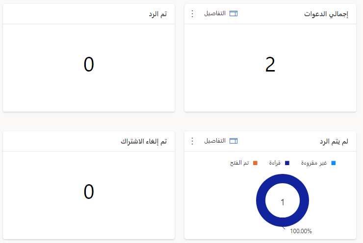
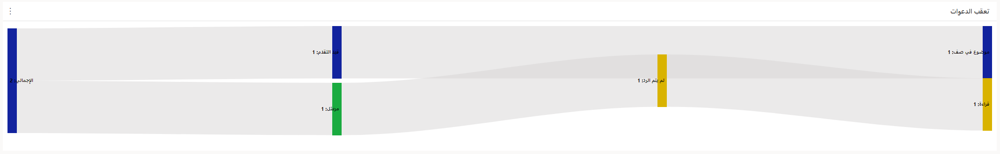
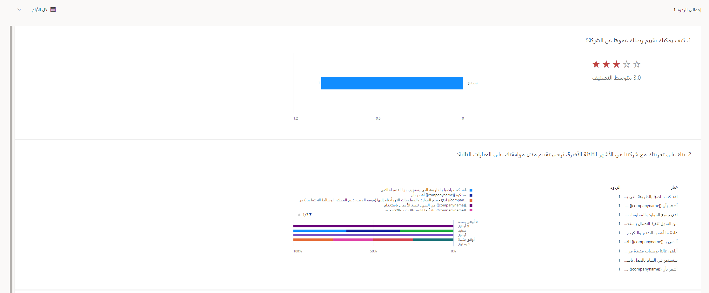
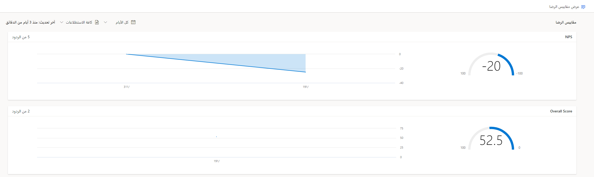
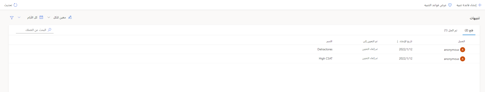

لقد أعددت الاستطلاعات بعناية ثم وزعتها على عملائك. بعد إرسال الدعوات الأولى، وعند إرسال التعليقات، ستستخدم هذه الردود لمراجعة تفاصيل الاستطلاع وتفسيرها. 

المناطق الأربعة الرئيسية لمراجعة التقارير أو التحليلات هي:

-   نظرة عامة على توزيع الاستطلاعات

-   تقرير استجابات الاستطلاع

-   مقاييس الرضا

-   التنبيهات

## نظرة عامة على توزيع الاستطلاعات

يمكنك الوصول إلى نظرة عامة على توزيع الاستطلاع من علامة التبويب **إرسال** في الاستطلاع. لا يتوفر إلا بعد إرسال بريد إلكتروني أو عند إنشاء الدعوات باستخدام Power Automate.
ستعرض البطاقات العدد الإجمالي للدعوات المرسلة، وعدد الردود على الاستطلاع التي تم تلقيها، وعدد الدعوات التي لم يتم إرسالها بسبب التأخير أو حالات الفشل. سيلخص مخطط سير العمل في الجزء السفلي من النظرة العامة الدعوات لإظهار المسار المأخوذ من قيد التقدم أو الفشل أو الإرسال، إلى الدعوات التي لم يتم الرد عليها بعد، أو التي تم فتحها أم لا، وأخيراً إلى الدعوات التي تم الرد عليها.

> [!div class="mx-imgBorder"]
> 

> [!div class="mx-imgBorder"]
> 

-   **إجمالي الدعوات** - عرض العدد الإجمالي لدعوات الاستطلاع التي تم إرسالها.

-   **تم الرد** - عرض العدد الإجمالي للمستلمين الذين استجابوا لدعوات الاستطلاع.

-   **لم تتم الاستجابة** - عرض العدد الإجمالي للمستلمين الذين لم يستجيبوا لدعوات الاستطلاع. يُظهر المخطط الدائري توزيع دعوات الاستطلاع حسب الحالة:

    -   **غير مقروءة** - لم تتم قراءة الرسالة الإلكترونية لدعوة الاستطلاع.

    -   **مقروءة** - تمت قراءة الرسالة الإلكترونية لدعوة الاستطلاع أو فتحها.

    -   **مفتوح** - تم فتح الاستطلاع، ولكن لم يتم إكماله بعد.

-  **إلغاء الاشتراك** - عرض العدد الإجمالي للمستلمين الذين قاموا بإلغاء الاشتراك من تلقي الرسائل الإلكترونية المتعلقة بالاستطلاع.

-   **فشل** - يعرض العدد الإجمالي لدعوات الاستطلاع التي لم يتم تسليمها إلى المستلمين بسبب عنوان بريد إلكتروني غير صحيح أو خطأ آخر.

## تقرير استجابات الاستطلاع

عند إنشاء استطلاع، سيتم إنشاء تقرير مطابق تلقائياً.
يحتوي التقرير على بيانات بعد إنشاء سجل استجابة الاستطلاع. يوفر هذا التقرير تمثيلاً رسومياً لكل سؤال في الاستطلاع، بما في ذلك المتوسطات أو عدد الاستجابات لكل خيار وفقاً لأنواع الأسئلة المطروحة. 

يمكنك تصفية الردود لعرضها جميعاً، أو الردود من آخر سبعة أيام، أو 28، أو 90 يوماً، أو الردود في نطاق زمني مخصص. بالإضافة إلى ذلك، يمكنك تصدير الاستجابات إلى مصنف Microsoft Excel لمزيد من التحليل. سيؤدي تحديد قائمة **المستجيبين** في التقرير إلى عرض قائمة بجميع الردود التي تم استلامها. يؤدي النقر المزدوج فوق أحد الردود من القائمة إلى فتح التفاصيل في نافذة منبثقة. تسمح لك هذه الميزة بالتمرير خلال الإجابات المقدمة. ستتمكن أيضاً من مراجعة البيانات الشخصية، والتي ستحتوي على المتغيرات التي تم جمعها من خلال الدعوة ثم تخزينها مقابل استجابة الاستطلاع. إذا لزم الأمر، يمكنك حذف استجابات الاستطلاع من السجلات الفردية.

> [!div class="mx-imgBorder"]
> 

## مقاييس الرضا

إذا تمت إضافة مقاييس الرضا إلى أي استطلاع موجود في مشروع، وتم تلقي استجابة استطلاع واحدة على الأقل، فسيعرض تقرير مقاييس الرضا بيانات قيّمة. يمكنك مراجعة البيانات لنفس الأطر الزمنية مثل استجابات الاستطلاع في تقرير استجابة الاستطلاع. نظراً لأن المشروع يمكن أن يحتوي على استطلاعات متعددة، قد لا يكون بعضها قد تم إعداد مقاييس الرضا، يمكنك مراجعة تقرير مقياس الرضا للمشروع بأكمله وللاستطلاعات الفردية.
للقيام بذلك، حدد القائمة المنسدلة للاستطلاع التي يتم تعيينها افتراضياً إلى **جميع الاستطلاعات**. 

يمكنك إعداد مقاييس الرضا بأربع طرق مختلفة، مما ينتج عنه أربعة مخططات مختلفة يمكن عرضها في التقرير. 

-   **Net Promoter Score ‏(NPS)** - مخطط عدّاد يُظهر مقاط المقياس. يُظهر مخطط المنطقة الموجود على يمين مخطط العداد اتجاه Net Promoter Score للفترة الزمنية المحددة.

-   **التوجه** - يعرض مخطط دائري توزيع التوجه الإيجابي والحيادي والسلبي للمقياس. يعرض المخطط العمودي المكدس إلى يمين المخطط الدائري توزيع التوجه الإيجابي والحيادي والسلبي للفترة الزمنية المحددة.

-   **رضا العميل (CSAT)‬‬‬‬‬** - يُظهر مخطط عدّاد مجموعة نقاط المقياس. يعرض مخطط المنطقة الموجود على يمين مخطط العداد اتجاه نتائج رضا العميل (CSAT) للفترة الزمنية المحددة.

-   **النتيجة المخصصة‬** - يُظهر مخطط عدّاد نتيجة المقياس.
    يعرض مخطط المنطقة الموجود إلى يمين مخطط العدّاد اتجاه مجموع النقاط المخصص‬ للفترة الزمنية المحددة.

حدد الخيار **عرض مقاييس الرضا** في الزاوية العلوية اليسرى من التقرير لمراجعة مقاييس الرضا. ومع ذلك، تحتاج إلى إضافة مقاييس جديدة مباشرة من استطلاع من قائمة **التخصيص** في علامة التبويب **تصميم**. 

> [!div class="mx-imgBorder"]
> 

## التنبيهات

هناك منطقة أخرى في قسم **التقارير** هي **التنبيهات**. من خلال إضافة التنبيهات، يمكنك إنشاء مشغلات للإشارة إلى طريقة معينة تم الرد على السؤال بها. على سبيل المثال، يشير إنشاء تنبيه عند استجابة Net Promoter Score بـ 6 أو أقل إلى وجود منتقص. يمكن أن يساعد إنشاء تنبيه يمكن تعيينه لأحد أعضاء فريق خدمات العملاء للمتابعة مع العميل على حل المشكلات قبل أن تصبح شديدة الخطورة. يمكنك عرض قواعد التنبيه الموجودة وإنشاء قواعد تنبيه جديدة من منطقة التقرير أيضاً.

يحتوي قسم **التنبيهات** على خيار تصفية يتيح لك التصفية لإظهار جميع التنبيهات المخصصة لك أو للجميع، وكذلك للتصفية حسب اسم التنبيه ومقياس الرضا المحدد ومن استطلاع رأي محدد. بالإضافة إلى ذلك، يمكنك تصفية التنبيهات حسب خيارات التاريخ المختلفة والتنبيهات التي يتم تشغيلها بواسطة عميل معين. 

> [!div class="mx-imgBorder"]
> 
