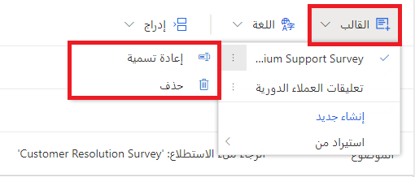
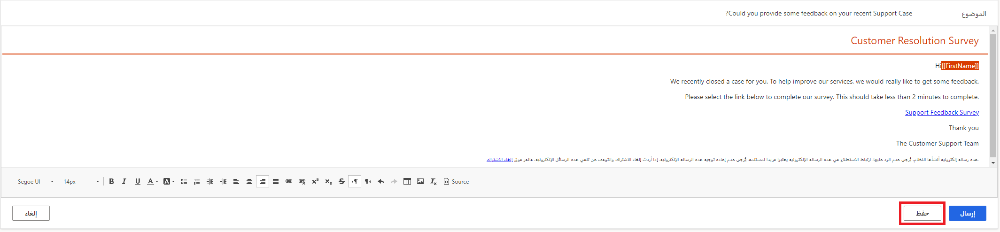
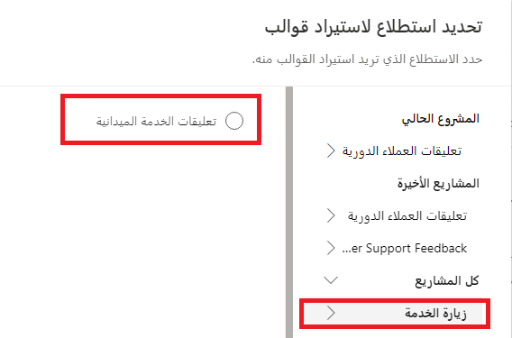

في هذا التمرين، ستقوم بإنشاء قالب الرسالة الإلكترونية الأول ثم استخدامه في Dynamics 365 Customer Voice.

> [!NOTE]
> يمكنك إكمال هذا التمرين باستخدام Microsoft Dynamics ‏365 Sales الممكّن في بيئتك أو من دونه. وعلى الرغم من ذلك، إذا كنت ترغب في استكمال التمارين في الوحدات التالية، فعليك استكمال هذه الخطوات في بيئة بها أيضاً Dynamics 365 Sales تم تمكينه.

## المهمة 1: إنشاء قالب رسالة إلكترونية جديد

لإنشاء قالب بريد إلكتروني جديد، اتبع الخطوات التالية:

1. انتقل إلى [Microsoft Customer Voice](https://customervoice.microsoft.com/?azure-portal=true) وسجّل الدخول إليه باستخدام بيانات اعتمادك.

1. حدد **كل المشاريع** من قائمة التنقل.

    

1. من قائمة المشاريع، انقر نقراً مزدوجاً فوق المشروع من القائمة التي قمت بإنشائها مسبقاً في مسار التعلم هذا.

    

1. حدد **استطلاع الدعم المميز**، ثم حدد **إرسال**.

    > [!div class="mx-imgBorder"]
    > 

1. حدد **رسالة إلكترونية**.

    

1. حدد **قالب**.

    

1. حدد **إنشاء جديد**.

    

1. أدخل **استطلاع الدعم المميز** في المربع، ثم حدد **إضافة**.

    

1. حدد القائمة المنسدلة **قالب**. يجب أن تكون الآن في قالب **استطلاع الدعم المميز** الجديد الخاص بك. قم بتمرير مؤشر الماوس فوق علامة الحذف (**...**) بجوار اسم القالب للكشف عن خياري **إعادة التسمية** و **حذف**.

    

1. حدد الارتباط **قالب** مرة أخرى لإغلاق القائمة. بعد ذلك، حدد حقل **الموضوع** في قالب البريد الإلكتروني.

1. احذف النص القياسي، ثم اكتب **هل يمكنك تقديم بعض التعليقات حول حالة الدعم الأخيرة؟**

    

1. في نص البريد الإلكتروني، حدد النص بالكامل، باستثناء العنوان العلوي ورابط إلغاء الاشتراك. بعد ذلك، احذف النص المحدد بأكمله.

    > [!div class="mx-imgBorder"]
    > 

1. انقر بجوار **رابط إلغاء الاشتراك**، ثم حدد الزر **محاذاة إلى اليسار** في الجزء السفلي من القائمة. بعد ذلك، قم بنفس العملية باستخدام نص العنوان بحيث تتم محاذاة كلاهما إلى يسار القالب.

    > [!div class="mx-imgBorder"]
    > 

1. في الجزء العلوي من النموذج، اكتب **مرحباً**، ثم حدد القائمة **تخصيص**. حدد متغير **First Name** من القائمة المنسدلة.

    > [!div class="mx-imgBorder"]
    > 

1. ابدأ سطراً جديداً ثم اكتب **لقد قمنا مؤخراً بإغلاق حالة لك. للمساعدة في تحسين خدماتنا، نحتاج بالفعل إلى الحصول على بعض التعليقات.**

    ابدأ سطراً جديداً، ثم اكتب **يُرجى تحديد الرابط أدناه لإكمال الاستطلاع الخاص بنا. من المفترض أن تستغرق هذه العملية أقل من دقيقتين حتى تكتمل.**

    > [!div class="mx-imgBorder"]
    > 

1. يمكنك بدء سطر آخر جديد، ثم اكتب **استطلاع تعليقات الدعم**.

    حدد هذا النص، وحدد القائمة **إدراج**، ثم حدد خيار **ارتباط الاستطلاع**. سيؤدي هذا الإجراء إلى إنشاء ارتباط تشعبي إلى الاستطلاع.

    

1. أضف سطراً جديداً، ثم اكتب **شكراً**.

    أضف سطراً آخراً، ثم اكتب **فريق دعم العملاء**. يجب أن يشبه قالب البريد الإلكتروني للاستطلاع الصورة التالية. حدد الزر **حفظ** لإكمال قالب البريد الإلكتروني الجديد.

    > [!div class="mx-imgBorder"]
    > 

1. لا تنتقل بعيداً عن هذا الاستطلاع.

## المهمة 2: استيراد قالب رسالة إلكترونية إلى مشروع

في هذه المهمة، ستقوم باستيراد قالب رسالة إلكترونية وتخصيصه من مشروع آخر.

1. حدد علامة التبويب **إرسال** من استطلاع حل الحالة.

    

    إذا لم تكن قد أرسلت الاستطلاع بعد، فحدد خيار **الرسالة الإلكترونية**. إذا قمت بالفعل بإرسال الاستطلاع وظهرت الشاشة التالية، فحدد **إعادة الإرسال**.

    

1. حدد **رسالة إلكترونية**.

    

1. حدد القائمة **قالب**.

    

1. قم بتمرير مؤشر الماوس فوق **الاستيراد من** للحصول على القائمة المنبثقة. حدد **الاستطلاعات**.

    

1. إذا كنت قد قمت مسبقاً بإضافة **مشروع زيارة الخدمة**، فحدد هذا الحقل من القائمة في **جميع المشاريع**. بخلاف ذلك، انتقل إلى هذا المشروع وأضفه من القوالب.

1. حدد الاستطلاع **تعليقات الخدمة الميدانية** من القائمة.

    

1. يجب أن يكون قالب **زيارة الخدمة** ظاهراً. حدد هذا القالب من القائمة، ثم حدد **استيراد**.

    > [!div class="mx-imgBorder"]
    > 

1. بعد تحديد **الاستيراد**، عُد إلى القائمة المنسدلة **قالب**، ومرر مؤشر الماوس فوق قالب **زيارة الخدمة** من القائمة. حدد **إعادة تسمية**.

    

1. أدخل **قالب إغلاق الحالة القياسي**، ثم حدد **إعادة تسمية**.

    

1. يمكنك تعديل القالب وضبطه ليناسب احتياجات هذا المشروع المحدد.

    > [!div class="mx-imgBorder"]
    > 

## المهمة 3: إرسال بريد إلكتروني باستخدام قالب بريد إلكتروني مخصص

في هذه المهمة، ستقوم بإرسال رسالة إلكترونية من Customer Voice باستخدام قالب الرسالة الإلكترونية الذي أنشأته في المهمة 1 من هذا التمرين.

1. من قائمه التنقل، حدد **جميع المشاريع**.

    > [!div class="mx-imgBorder"]
    > 

1. من قائمة المشاريع، انقر نقراً مزدوجاً فوق **تعليقات دعم العملاء**.

    

1. حدد علامة التبويب **إرسال** من استطلاع حل الحالة.

    

1. إذا لم تكن قد أرسلت الاستطلاع بعد، فحدد خيار **الرسالة الإلكترونية**. إذا قمت بالفعل بإرسال الاستطلاع وظهرت الشاشة التالية، فحدد **إعادة الإرسال**.

    

1. حدد **رسالة إلكترونية**.

    

1. تأكد من تحديد قالب **استطلاع الدعم المميز** من القائمة المنسدلة **القالب**.

    

1. أدخل عنوان الرسالة الإلكتروني في حقل **المستلمون**. تأكد من إمكانية وصولك إلى عنوان البريد الإلكتروني هذا حتى تتمكن من استرداد البريد الإلكتروني. حدد **إرسال**.

    

1. سيتم إرسال البريد الإلكتروني إلى عنوان البريد الإلكتروني الذي قمت بتوفيره في حقل **المستلمون**. وبعد ذلك، يمكنك فتح الرسالة الإلكترونية وتحديد الارتباط لإجراء الاستطلاع.

    
