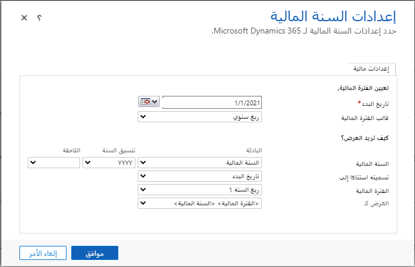

الفترات المالية مهمة لإدارة الأهداف لأن جميع الأهداف مرتبطة بالتاريخ. هذا يعني أنك بحاجة إلى تحديد مواعيد للأهداف. تؤثر خيارات السنة المالية على طريقة تخزين بيانات مؤسستك في Dynamics 365.

فيما يلي بعض القواعد العامة للتعرف على فترات السنة المالية وأهداف السنة المالية:

- لكل هدف، يجب تحديد فترة مالية أو فترة زمنية للعميل.

- إذا قمت بتحديد فترة مالية، يجب عليك تحديد سنة مالية.

- الفترات المالية لديها مجموعة واسعة من التواريخ للاختيار من بينها، مثل شهرية، ربع سنوية، فصل دراسي، سنوي.

- ترتبط السنة المالية والفترة المالية للهدف بإعدادات السنة المالية للمؤسسة ويمكن إعادة تعريفها في أي وقت.

بشكل افتراضي، يحدد Microsoft Dynamics 365فترة مالية بناءً على سنة تقويمية. قد لا تقوم العديد من المؤسسات بمواءمة السنة المالية مع السنة التقويمية. قد يديرون السنة المالية من يوليو إلى يونيو.
على الرغم من أن المؤسسة تدير السنة المالية الخاصة بها، فمن المهم التأكد من تكوين النظام بشكل صحيح للسنة المالية لكل مؤسسة.

## تحديد إعدادات السنة المالية

يمكن الوصول إلى إعدادات السنة المالية في Dynamics 365 بالانتقال إلى **الإعدادات > إدارة الأعمال > إعدادات السنة المالية**. عند تكوين الإعدادات، يمكنك القيام بأمرين:

- **تحديد الفترة المالية** - حدد التاريخ الذي تبدأ فيه السنة المالية للمؤسسة، ونموذج الفترة الذي يجب استخدامه. يمكنك الاختيار من بين خمسة خيارات للفترة الزمنية:

  - سنوية

  - نصف سنوي

  - ربع سنوي

  - شهري

  - فترة 4 أسابيع

- **تكوين كيفية عرض البيانات** - حدد إعدادات العرض لعناصر السنة المالية المختلفة التي يتم تقديمها. هذا يشمل:

  - **تنسيق عرض السنة المالية** - يمكنك تعيين البادئة وتنسيق السنة وإصلاح النشر.

  - **مسمى على أساس** - يحدد ما إذا كانت السنة المالية تعتمد على تاريخ بداية السنة المالية أو نهايتها.

  - **الفترة المالية** - تحدد كيفية عرض الفترات، على سبيل المثال الربع الأول أو الربع الأول.
  
  - **العرض كـ** - يحدد كيفية عرض الفترات والسنوات عند عرضها معاً.

