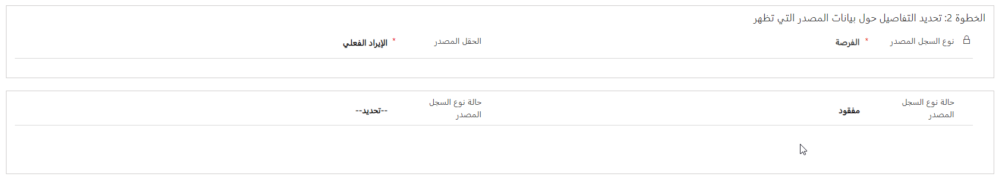
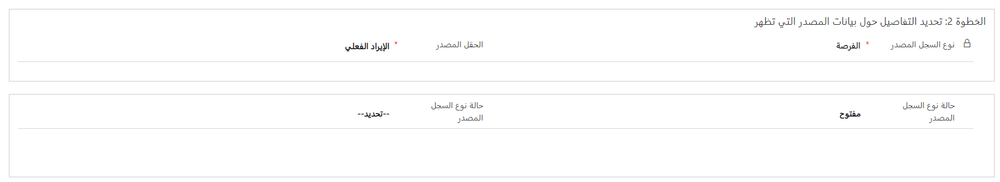
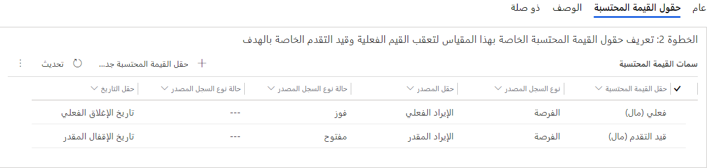

مقاييس الأهداف هي القياس الرقمي لنوع سجل محدد وتساعد على تحديد كيفية القياس والشيء المراد قياسه. يستند كل سجل هدف إلى سجل مقياس هدف، بنوع مقياس إما "مبلغ" أو "عدد". اختيار مقياس الهدف يحدد كيفية حساب الأهداف الفعلية وقيد التقدم.

هناك عدد من سجلات مقاييس الأهداف الجاهزة المتاحة للاستخدام.  

تستخدم مقاييس الأهداف لتحديد المعلومات الأساسية الآتية:

- نوع البيانات الذي يحدد به الهدف. على سبيل المثال، عادةً ما يكون مقياس هدف المبيعات محددًا على أنه نوع البيانات "أموال" أو أن مقياس هدف الخدمة سيكون غالبًا عبارة عن "العدد" الإجمالي للأصناف التي ينطبق عليها. 
- أعمدة القيم المحتسبة المراد استخدامها. هذه الأعمدة هي نوع السجل والعمود الذي سيتم إدخال أهداف الهدف له والتي تتعقب القيم الفعلية وقيد التقدم. على سبيل المثال، يمكن تحديد مقياس هدف نموذجي للمبيعات لنوع سجل الفرصة وتحديد المبيعات الفعلية كسجلات فرص ذات حالة "مكسب". يمكن تحديد مقياس هدف نموذجي للخدمة لنوع سجل الحالة وتحديد الحالات الفعلية التي تم حلها فعليا كسجلات حالات ذات حالة "تم الحل".

### تحديد مقياس هدف

أول الأشياء التي تريد تحديدها عند التحضير لإنشاء مقياس هدف هي كيفية قياس المعلومات. على سبيل المثال، يمكنك تحديد:

- هل تقيس مبلغًا بالدولار؟

- هل يعتمد على الكمية التي قمت ببيعها بالفعل؟
  - هل هو مبلغ بالدولار؟
  - هل تقوم بحساب عدد المنتجات أو الخدمات التي قمت ببيعها؟

ويلزم تحديد هذه التعريفات أولاً، لأنها ستحدد الأصناف الإضافية المحددة في مقياس الهدف. عندما تكون مستعدًا لإنشاء مقياس هدف، يمكنك إنشاؤه من إعدادات التطبيق في تطبيق مركز المبيعات.

سيحتاج كل قياس أهداف إلى تحديد الآتي:

- **الاسم** - يحدد اسم المقياس الذي سيتم استخدامه مع إرفاقه بسجلات الهدف.
- **نوع المقياس** - يحدد نوع المقياس الذي سيتم تعقبه. يمكن تعيين المقاييس إما كعدد أو مبلغ. عند تحديد مقياس على أنه مقياس مبلغ، سيلزم تحديد نوع بيانات للمبلغ. يمكنك التحديد من بين **أموال** أو **رقم عشري** أو **عدد صحيح**.

والبند الثاني الذي يجب تحديده لمقياس الهدف هو نوع السجل الذي سيتم إقرانه به والعمود الفعلي الذي سيتم تعقب الأهداف الفرعية للهدف من أجله مقابل استخدام القيم الفعلية وقيد التقدم. على سبيل المثال، إذا كنت ترغب في إنشاء هدف مرتبط بفرص المبيعات، فيجب أن تحدد الآتي:

- ما الفرص التي ينبغي تعقبها؟
- هل تتعقب مبالغ بالدولار؟ إذا كانت الإجابة بنعم، فأي عمود؟
- هل ستتعقب المبلغ بالدولار المقدر أم ستتعقب عمود المبلغ بالدولار الفعلي؟
- هل تتعقب تاريخ الإقفال أم تتعقب تاريخ الإقفال المقدر أو تاريخ الإقفال الفعلي؟
- هل تتعقب فرص المبيعات ذات الحالة "مفتوحة" مقابل الحالة "مكسب"؟

يشار إلى جميع هذه الأعمدة كأعمدة قيمة محتسبة. يتكون تحديد عمود القيمة المحتسبة من ثلاث خطوات:

1. تحديد عمود القيمة المحتسبة لتعقبه مقابل الأهداف،
2. تحديد البيانات المصدر التي سيتم تجميعها،
3. تحديد عمود التاريخ المستخدم لتحديد فترة الهدف التي سيتم تجميع السجلات فيها.

### تحديد عمود القيمة المحتسبة لتعقبه مقابل

يعتمد كل سجل هدف على سجل مقياس هدف أساسي. إن اختيار مقياس الهدف يحدد كيفية حساب الأهداف الفعلية وقيد التقدم. تتعقب العديد من الأهداف كلاً من القيمة الفعلية والقيمة قيد التقدم مقابل الهدف. على سبيل المثال، قد يكون لدى أحد مندوبي المبيعات إيراد شهري مستهدف ويتعقب الفرص المتاحة وفرص الربح مقابل الهدف. ومع ذلك، لا يلزم أن تتضمن سجلات الأهداف كلاً من الأعمدة الفعلية وقيد التقدم المحسوبة.

فيما يأتي بعض الأمثلة عن المقاييس التي قد يتم تحديدها:

- **عدد العملاء المتوقعين والمقترحات** - خلال دورة ربع السنة أو الشهر أو الأسبوع أو السنة، يكون لديك أهدافًا معينة لعدد العملاء المتوقعين والمقترحات التي يتم إرسالها أو إقفالها بواسطة فريق المبيعات.
- **عدد العملاء الجدد والمحتفظ بهم** - بافتراض وجود مقياس مدمج لتحليل المدة التي قضاها العميل معك، أو إذا تم اعتباره عميلاً محتفظًا به أو عميلاً جديدًا، فيمكنك تعقب ذلك باستخدام وظيفة الهدف.

يمكن تعيين القيمة المحتسبة إلى أحد الخيارات التالية:

- فعلية
- قيد التقدم
- مخصصة

يمكن استخدام كل منها مرة واحدة فقط لكل قياس. على سبيل المثال، بمجرد إضافة **قيد التقدم**، لا يمكن إضافتها مرة أخرى.

### تحديد البيانات المصدر التي سيتم تجميعها

الأمر التالي الذي يجب تحديده لعمود "القيمة المحتسبة" هو التفاصيل التي ستقوم بتحديد السجلات التي سيتم التعامل معها. توجد أربعة أصناف يمكن تكوينها:

- **نوع السجل المصدر** - يحدد الجدول الذي سيتم إقران عمود القيمة المحتسبة به. (هذا مطلوب).
- **العمود المصدر** - يحدد العمود الذي يحتوي على البيانات التي سيتم تجميعها. (هذا مطلوب).
- **حالة نوع السجل المصدر** - تحدد حالة السجل التي سيتم تضمينها مثل مفتوحة أو مُقفلة.
- **حالة نوع السجل المصدر** - تحدد حالة السجل التي سيتم تضمينها مثل ملغاة أو مكتملة.

تعمل المجموعة المكونة من جميع التفاصيل المحددة على تحديد السجلات التي سيتم تضمينها.

قد يشبه عمود القيمة المحتسبة الفعلية المستند إلى مقياس الأموال الصورة التالية.

في هذا المثال، سيتضمن عمود القيمة المحتسبة البيانات من عمود **الإيرادات الفعلية** لأي فرصة تم الفوز بها.

وفيما يأتي، سيتم تضمين البيانات الموجودة في عمود **الإيرادات المقدرة** لأي فرصة مفتوحة حاليًا.

### تحديد عمود التاريخ الذي يحدد الفترة التي سيتم تجميع السجلات فيها

والسؤال الأكثر أهمية الذي يجب طرحه عند تحديد أعمدة القيم المحتسبة هو: ما أعمدة التاريخ التي يجب أن نبحث فيها؟ تذكر أن جميع سجلات الهدف مرتبطة بالتاريخ. وهذا يعني أنك عندما تحاول تحديد ما تقوم بقياسه، فإنك تحتاج أيضًا إلى تحديد أعمدة التاريخ التي ترغب في تقييمها.  

لتحديد عمود تاريخ، ستحتاج إلى تحديد نوع السجل وعمود التاريخ الخاص بنوع السجل هذا.

تظهر الصورة التالية المظهر المحتمل لعمود **القيمة المحتسبة الفعلية** المكتمل.

