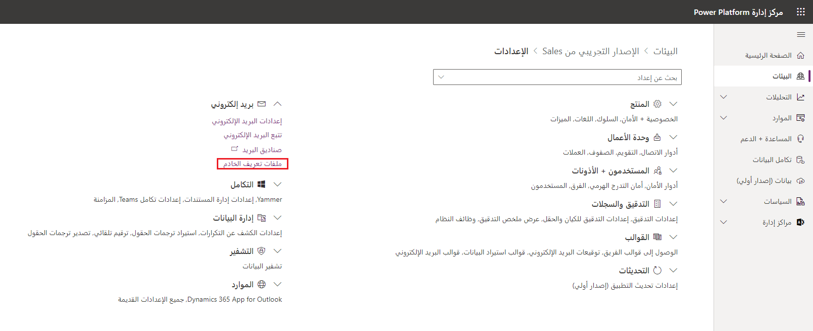
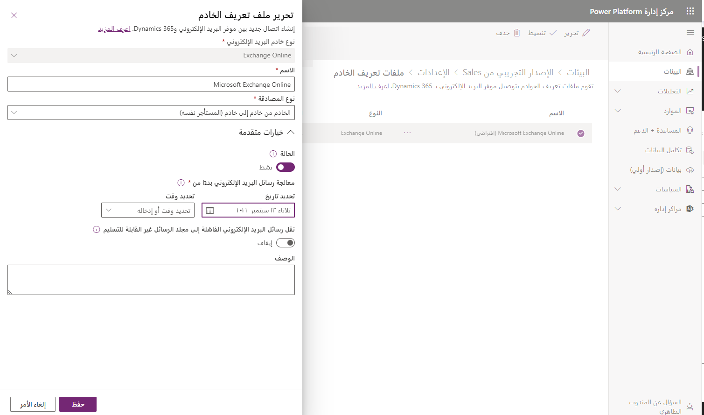
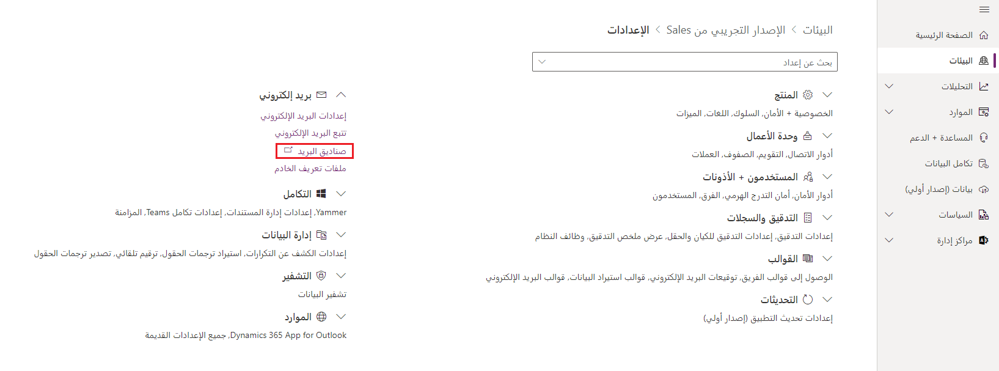
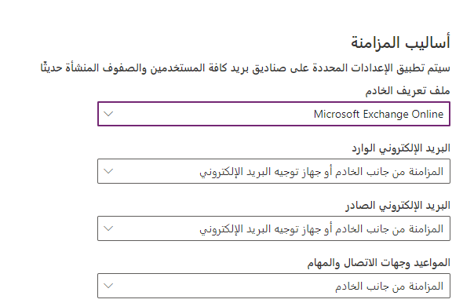
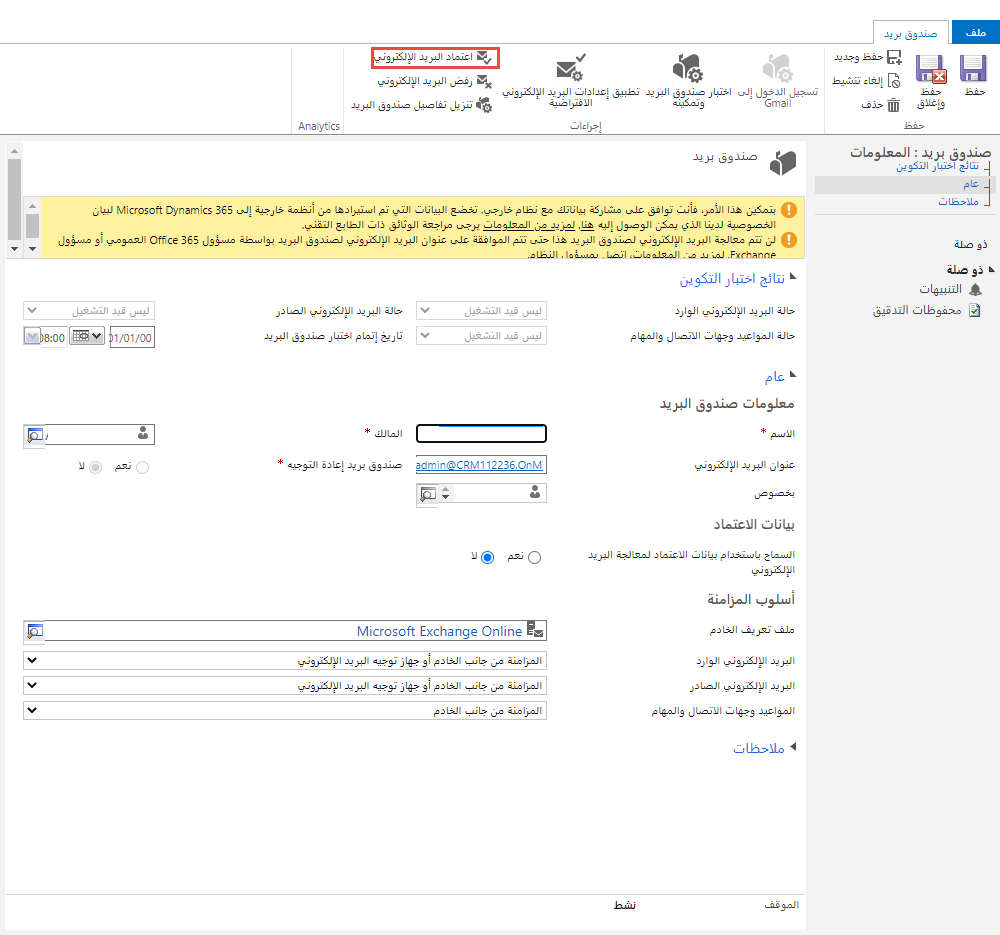
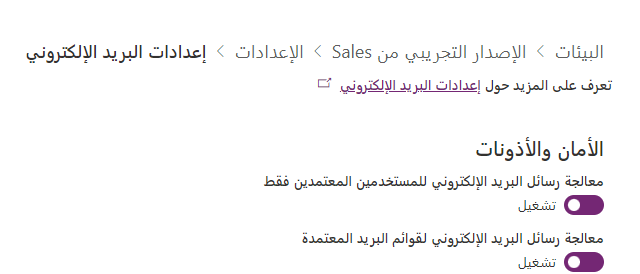
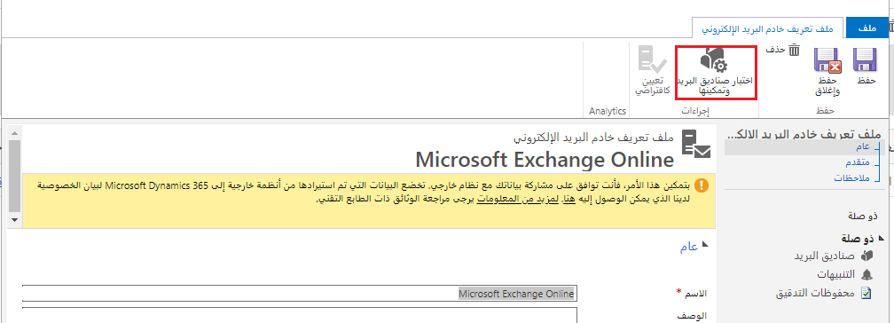
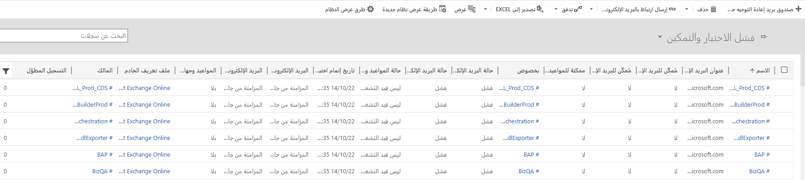

البريد الإلكتروني هو المكان الذي تبدأ فيه العديد من حركات الأعمال وتنتهي وهو سعة تكامل أساسية لأي نظام أساسي لمشاركة العملاء. يجب إرسال رسائل البريد الإلكتروني التي تنشأ من تطبيقات مثل تطبيقات Dynamics 365 واستلامها من خلال حساب البريد الإلكتروني نفسه الذي يستخدمه المستخدمون لكافة الاتصالات الأخرى. سيوفر ذلك تجربة متسقة للمستخدمين ويضمن ربط أي اتصال عبر البريد الإلكتروني ذي صلة بسجلات Dynamics 365 حسب الحاجة.

يعمل Microsoft Dataverse على مستوى الخادم مع خدمة البريد الإلكتروني، مثل Microsoft Exchange، وخوادم البريد الإلكتروني الأخرى، للسماح بإرسال رسائل البريد الإلكتروني الصادرة التي نشأت كأنشطة بريد إلكتروني في Dataverse. لن تظهر رسائل البريد الإلكتروني هذه فقط في صندوق الصادر الخاص بالمستخدم المرسل تماماً مثل أنشطة البريد الإلكتروني الأخرى، ولكن يتم تعقب الأنشطة مقابل بيانات Dataverse. يحافظ هذا على الاتصال في مكان واحد.

يتمحور التكامل مع البريد الإلكتروني وأدوات Office حول السماح للمستخدمين بأداء عملهم من حيث يريدون. يعني هذا إما إحضار بيانات Dataverse إليهم أو إحضار الأدوات إلى تطبيقات تستند إلى النموذج. في كلتا الحالتين، يمكنهم اختيار مكان عملهم.

## كيف يعمل تكامل البريد الإلكتروني

يتم التحكم في تكامل البريد الإلكتروني من خلال ملفات تعريف الخادم. تحدد ملفات تعريف الخادم معلومات الاتصال لخادم البريد الإلكتروني الذي سيتم استخدامه لمعالجة رسائل البريد الإلكتروني الصادرة من سجلات Dynamics 365 أو المرتبطة بها. هناك العديد من خيارات الخادم التي يمكنك الاختيار منها عند إنشاء ملف تعريف الخادم:

-   **Exchange Server ‏(On-Premises)**: الاتصال بخادم بريد إلكتروني Microsoft Exchange الموجود في موقع العميل أو على جهاز افتراضي.

-   **Exchange Online:** الاتصال بخادم بريد إلكتروني Microsoft Exchange Online‏ الموجود في السحابة وتتم استضافته عادةً بواسطة Microsoft.

-   **Gmail:** الاتصال بخادم بريد إلكتروني Gmail للمعالجة.

-   **أخرى (IMAP/POP/SMTP):** يُستخدم عندما تريد الاتصال بنوع مختلف من خادم البريد الإلكتروني بناءً على احتياجات مؤسستك.

## استخدام Microsoft Exchange Online

أحد أكثر سيناريوهات خادم البريد الإلكتروني شيوعاً المستخدمة مع Dynamics 365 هو Microsoft Exchange ‏Online. في هذا السيناريو، لدى المؤسسة اشتراك Online Microsoft Exchange ‏موجود تريد استخدامه مع تطبيق Dynamics 365 الخاص بها. نظراً لأن كلاًّ من Microsoft Dataverse للتطبيقات وOnline Microsoft Exchange ‏خدمات عبر الإنترنت، ويُعد توصيلهما تكويناً مباشراً للغاية.

إذا كانت مؤسستك تمتلك Online Microsoft Exchange، فسيتم إنشاء ملف تعريف افتراضي لاتصال البريد الإلكتروني بـ Exchange Online تلقائياً عندما تقوم بتوفير Dataverse لقاعدة بيانات التطبيقات. سيحتوي هذا الاتصال بالفعل على بيانات الاعتماد والخادم الضرورية المحددة. للتحقق من ملف التعريف هذا، انتقل إلى **إعدادات** البيئة التي تريد العمل معها في [مركز مسؤولي Power Platform](https://admin.powerplatform.microsoft.com/?azure-portal=true)، ثم حدد **ملفات تعريف الخادم** في قسم **البريد الإلكتروني**.

> [!div class="mx-imgBorder"]
> 

يجب أن يكون ملف تعريف Online Microsoft Exchange ‏في قائمة ملفات التعريف النشطة. إذا كان ملف تعريف Online Microsoft Exchange مفقوداً، فتأكد من أن لديك اشتراك في Exchange Online وأنه موجود في نفس المستأجر، مثل اشتراك Dataverse.

عندما تم إنشاء ملف تعريف Online Microsoft Exchange، من المحتمل أنه تم تعيينه كملف التعريف الافتراضي لصناديق البريد الجديدة المضافة إلى النظام. إذا كان هناك العديد من ملفات تعريف البريد الإلكتروني الموجودة في النظام، فحدد ملف تعريف Microsoft Exchange Online من القائمة، وحدد  **تعيين كافتراضي**.

### الإعدادات المتقدمة

يسمح نموذج ملف تعريف الخادم لملف تعريف Online Microsoft Exchange ببعض الإعدادات الإضافية في القسم **خيارات متقدمة**.

-   **الحالة:** تحدد ما إذا كان ملف تعريف خادم البريد الإلكتروني نشطاً حالياً ويقوم بمعالجة رسائل البريد الإلكتروني.

-   **معالجة البريد الإلكتروني من:** يوجه عملية المزامنة لمعالجة رسائل البريد الإلكتروني فقط بعد التاريخ والوقت المحددين لجميع صناديق البريد المرتبطة بملف التعريف هذا. يكون هذا مفيداً إذا أضافت المؤسسة Dataverse أو تطبيقات Dynamics 365 Customer Engagement إلى مستأجرها بعد أن كانت تستخدم Exchange Online، وترغب في تتبع بعض رسائل البريد الإلكتروني السابقة فقط في سياق تطبيقات Dataverse.

-   **نقل رسائل البريد الإلكتروني الفاشلة إلى مجلد غير قابل للتسليم:** ينشئ مجلداً غير قابل للتسليم في علب بريد المستخدمين وينقل رسائل البريد الإلكتروني التي لا يمكن تتبعها في Dataverse إلى هذا المجلد.

> [!div class="mx-imgBorder"]
> 

كما ذكرنا سابقاً، هناك العديد من خيارات خادم ملف تعريف خادم البريد الإلكتروني المختلفة المتاحة بناءً على نوع خادم البريد الإلكتروني الذي تستخدمه مؤسستك. لمعرفة المزيد حول كل منها، والاطلاع على الإرشادات الخاصة بإعدادها، راجع ما يلي:

- [الاتصال بـ Exchange Server (محلياً)](/power-platform/admin/connect-exchange-server-on-premises/?azure-portal=true)

- [الاتصال بـ Gmail](/power-platform/admin/connect-gmail-oauth2/?azure-portal=true)

- [الاتصال بخادم IMAP أو POP أو SMTP](/power-platform/admin/connect-to-imap-servers/?azure-portal=true)

## صناديق البريد

تُستخدم صناديق البريد Microsoft Dataverse للتطبيقات لتوصيل سجلات المستخدم وقائمة الانتظار من التطبيقات المدعومة بواسطة Dataverse بصناديق البريد الخاصة بها على خادم البريد الإلكتروني لغرض تتبع الأنشطة، مثل رسائل البريد الإلكتروني أو المواعيد. صناديق البريد هي فقط للاتصال. لا تقوم بتخزين أي معلومات حول الأنشطة المتعقبة بأنفسها. يتم إنشاء صناديق البريد تلقائياً عند إضافة مستخدمين جدد أو قوائم انتظار إلى النظام. يقترن كل مستخدم وكل سجل قائمة انتظار بصندوق بريد واحد فقط.

تحتوي سجلات صندوق البريد على معلومات التكوين الخاصة بصندوق بريد فردي على خادم البريد الإلكتروني، مثل عنوان البريد الإلكتروني وبيانات اعتماد صندوق البريد وطريقة مزامنة البريد الإلكتروني. لمعالجة رسائل البريد الإلكتروني باستخدام المزامنة من جانب الخادم للمستخدمين وقوائم الانتظار، يجب ربط سجلات صندوق البريد الخاصة بهم بسجل ملف تعريف خادم البريد الإلكتروني في Dataverse.

يمكن الوصول إلى معلومات حول صناديق البريد والإعدادات ذات الصلة في قسم البريد الإلكتروني من إعدادات البيئة في [مركز مسؤولي Power Apps](https://admin.powerplatform.microsoft.com/?azure-portal=true).

> [!div class="mx-imgBorder"]
> 

بينما يمكن تحديد إعدادات صندوق البريد الخاصة بكل صندوق بريد فردي بشكل فردي، يمكنك تكوين الإعدادات الافتراضية لصناديق البريد التي تم إنشاؤها حديثاً عن طريق تحديد إعدادات البريد الإلكتروني وتكوين طرق المزامنة. بمجرد تحديد إعدادات البريد الإلكتروني، من تلك النقطة فصاعداً، كلما تم إنشاء صندوق بريد جديد، فسيستخدم إعدادات التكوين المحددة في إعدادات البريد الإلكتروني. يمكن الكتابة فوق هذه الإعدادات في صناديق البريد الفردية حسب الحاجة.

> [!div class="mx-imgBorder"]
> 

### تكوين صناديق البريد

بالنسبة للمستخدمين الحاليين الذين تمت إضافتهم إلى النظام قبل تحديد إعدادات البريد الإلكتروني، قد تحتاج إلى تعديل إعدادات البريد الإلكتروني لصندوق البريد. يوصى باستخدام المزامنة على جانب الخادم لـ **البريد الإلكتروني الوارد**، و **البريد الإلكتروني الصادر**، و **المواعيد**، و **جهات الاتصال**، و **المهام**. سنغطي المزيد حول المزامنة على جانب الخادم لاحقاً.

يمكنك تغيير الإعدادات الخاصة بصناديق البريد المتعددة عن طريق تحديد صناديق البريد الهدف وإما باستخدام الأمر "تطبيق إعدادات البريد الإلكتروني الافتراضية" أو باستخدام أمر التحرير وتغيير الإعدادات الفردية.

### الموافقة على البريد الإلكتروني

لن يتمكن صندوق البريد من معالجة البريد الإلكتروني حتى تتم الموافقة عليه. الموافقة على صندوق بريد تخبر النظام بشكل أساسي أنك راجعت صندوق البريد، وأنه من المقبول بدء معالجة البريد الإلكتروني.

> [!div class="mx-imgBorder"]
> 

يمكنك تجاوز الحاجة إلى الموافقة على علب البريد في قسم الأمان والأذونات في إعدادات البريد الإلكتروني. هنا يمكنك تحديد للمستخدمين الفرديين وقوائم الانتظار ما إذا كانت المزامنة من جانب الخادم ستعالج البريد الإلكتروني للمستخدمين أو قوائم الانتظار التي لم تتم الموافقة على عناوين بريدهم الإلكتروني من قبل مسؤول النظام.

> [!div class="mx-imgBorder"]
> 

عند استخدام Microsoft Exchange Online كملف تعريف خادم، تتم الموافقة تلقائياً على عناوين البريد الإلكتروني للمستخدمين الجدد. ومع ذلك، في ظل ظروف معينة، قد تظل بحاجة إلى الموافقة على عنوان البريد الإلكتروني لكل صندوق بريد مستخدم أو قائمة انتظار قبل أن يتمكن صندوق البريد من معالجة البريد الإلكتروني. على سبيل المثال، الموافقة مطلوبة إذا تغير عنوان البريد الإلكتروني للمستخدم ولم يُسمح بصناديق البريد التي لم تتم الموافقة عليها في النظام.

### اختبار تكوين صناديق البريد

قبل معالجة النظام لصناديق البريد التي تمت الموافقة عليها، يجب اختبارها وتمكينها. سيؤدي هذا أولاً إلى إجراء اختبار للتأكد من أن Dynamics 365 وملف تعريف خادم البريد الإلكتروني المستخدم يتواصلان بشكل صحيح. بمجرد اكتمال الاختبار، سيقوم عندئذٍ بتمكين صندوق البريد للمعالجة.

للاختبار والتمكين:

-   بالنسبة لصندوق البريد الفردي عن طريق فتح سجل صندوق البريد وتحديد **اختبار وتمكين صندوق البريد**.

-   بالنسبة لصناديق البريد المتعددة عن طريق تحديد صناديق البريد التي تريد اختبارها، ثم تحديد **اختيار وتمكين صناديق البريد**.

-   بالنسبة لجميع صناديق البريد المرتبطة بملف تعريف خادم البريد الإلكتروني عن طريق فتح ملف التعريف وتحديد **اختبار وتمكين صناديق البريد**.

> [!div class="mx-imgBorder"]
> 

سيؤدي هذا إلى اختبار تكوين البريد الإلكتروني الوارد والصادر لصناديق البريد المحددة وتمكينها من معالجة البريد الإلكتروني. عند اختبار تكوين البريد الإلكتروني، يتم تشغيل مهمة غير متزامنة في الخلفية. قد يستغرق إكمال الاختبار بضع دقائق.

في حالة حدوث خطأ في صندوق بريد، يتم عرض تنبيه على جدار التنبيهات الخاص بصندوق البريد ومالك ملف التعريف. اعتماداً على طبيعة الخطأ، قد يقوم Dataverse بإعادة محاولة المعالجة أو تعطيل صندوق البريد لمعالجة البريد الإلكتروني.

يمكنك الوصول إلى جميع صناديق البريد الفاشلة من خلال عرض الاختبار وتمكين العرض الفاشل.

> [!div class="mx-imgBorder"]
> 

يتم عرض نتائج اختبار تكوين البريد الإلكتروني في الحقول حالة البريد الإلكتروني الوارد وحالة البريد الإلكتروني الصادر والمواعيد وجهات الاتصال وحالة المهام في سجل صندوق البريد.

> [!IMPORTANT]
> قبل أن يتمكن صندوق البريد من معالجة البريد الإلكتروني، يجب أن **توافق** على صندوق البريد، ثم يمكنك **اختباره وتمكينه**. سيؤدي عدم القيام بذلك إلى عدم معالجة البريد.

عادةً ما يكون هذا هو السبب الأول الذي يجعل صندوق البريد لا يعالج البريد الإلكتروني في البداية. إذا كان صندوق البريد لا يعالج البريد الإلكتروني، فيجب عليك دائماً الرجوع إلى صندوق البريد، و **الموافقة** عليه، و **اختباره وتمكينه** مرة أخرى قبل فعل أي شيء.

الآن بعد أن قمنا بتكوين صناديق البريد، دعنا نفحص المزامنة من جانب الخادم بمزيد من التفاصيل.
