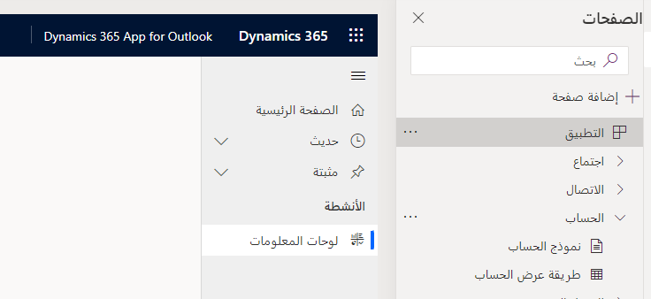

يعد Dynamics 365 App for Outlook تطبيقاً يستند إلى نموذج تم إنشاؤه للتشغيل داخل Outlook. بصفتك مسؤولاً، لديك القدرة على تخصيص العديد من الجوانب المختلفة للتطبيق. على سبيل المثال، يمكنك إنشاء عرض محدد تريد أن تتمكن من استخدامه من داخل التطبيق. يمكنك إجراء التغييرات حسب الحاجة.

يمكنك تعديل الجداول وعرضها التي يتم استخدامها في التطبيق عن طريق تعديل التطبيق مباشرة. يمكن القيام بهذا في Power Apps [App Maker Portal](https://make.powerapps.com/?azure-portal=true). من قائمة التطبيقات في بيئتك، حدد موقع تطبيق Dynamics 365 App for Outlook، وحدد **تحرير.**

> [!div class="mx-imgBorder"]
> 

بمجرد تحميل التطبيق في المصمم، سترى شيئاً مثل الصورة التالية:

> [!div class="mx-imgBorder"]
> 

> [!IMPORTANT]
> إذا تلقيت خطأ بشأن عدم قابلية إجراء Dynamics 365 App for Outlook للتطبيق، فهذا هو السلوك المتوقع. يمكنك فقط تحديد **موافق** على الرسالة. في لوحة الصفحات على اليسار، سترى جميع الجداول المتوفرة في التطبيق. عندما تقوم بتوسيع جدول، سترى كلاً من الخيار "نموذج" و"عرض". على سبيل المثال، في الصورة أدناه، قمنا بتوسيع الحساب، ويمكنك رؤية نموذج الحساب وعرض الحساب.

> [!div class="mx-imgBorder"]
> 

## تكوين النماذج

سيؤدي تحديد نموذج الحساب إلى عرض النموذج الذي يتم استخدامه لتقديم معلومات الحساب في تطبيق Outlook. في البداية، سيخبرك أنه لا توجد نماذج متاحة. حدد **إضافة نموذج** واختر النموذج الذي تريد استخدامه. عادةً ما يكون هذا هو النموذج الرئيسي **الحساب**. يمكنك تحرير الحقول في النموذج عن طريق تحديد **علامة الحذف** بجوار النموذج الذي تريد تعديله واختيار **تحرير**.

> [!div class="mx-imgBorder"]
> 

## تكوين وجهات النظر

لزيادة قابلية استخدام التطبيق، قم بإزالة العناصر التي لا يحتاجها المستخدمون أو لا يستخدمونها. في كثير من الأحيان، تحتوي التطبيقات على العديد من طرق العرض المتوفرة ولكن ليس جميعها منطقية في سياق العمل مع تطبيق Outlook. سيؤدي تحديد طريقة عرض الحساب إلى عرض النموذج الذي يتم استخدامه لتقديم معلومات الحساب في تطبيق Outlook. حدد **إضافة طريقة عرض** واختر طريقة العرض التي تريد استخدامها. عادةً ما يكون هذا هو طريقة عرض **حساباتي النشطة**. يمكنك تحرير الحقول في النموذج عن طريق تحديد **علامة الحذف** بجوار طريقة العرض التي تريد تعديلها واختيار **تحرير**.

> [!div class="mx-imgBorder"]
> 
