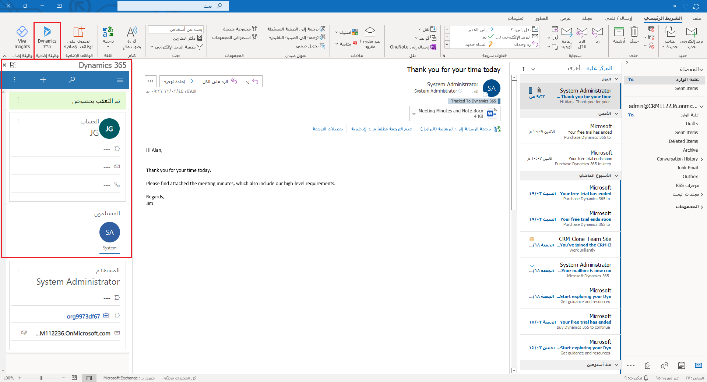
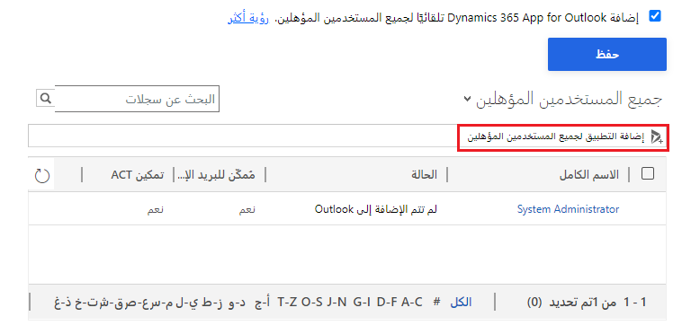

يضع Dynamics 365 App for Outlook قوة تطبيقات Dynamics 365 في متناول يدك أثناء استخدام إصدار سطح المكتب أو الويب أو الأجهزة المحمولة من Outlook. إنه يسمح بعرض المعلومات حول بريد إلكتروني أو موعد بسهولة، وربطه بسهولة بسجلات Dynamics 365 مثل فرصة أو حساب أو حالة في تطبيقك. يعمل Dynamics 365 App for Outlook مع تطبيقات تفاعل العملاء (مثل Dynamics 365 Sales وDynamics 365 Customer Service وDynamics 365 Marketing وDynamics 365 Field Service وDynamics 365 Project Operations وPower Apps التي تستند إلى النماذج والتي يتم تشغيلها على Microsoft Dataverse.

> [!div class="mx-imgBorder"]
> 

باستخدام Dynamics 365 App for Outlook، يمكنك:

-   ربط رسائل البريد الإلكتروني والاجتماعات والمواعيد بصف في تطبيقك. على سبيل المثال، ربط رسالة بريد إلكتروني بحساب أو فرصة أو حالة معينة.

-   عرض المعلومات في سياق رسالة بريد إلكتروني أو اجتماع أو موعد.

-   مزامنة جهات الاتصال والمعلومات ذات الصلة بحيث يكون Exchange وتطبيق محدّثين دائماً.

-   إضافة قوالب البريد الإلكتروني والمقالات المعرفية ووثائق المبيعات عند إنشاء رسالة بريد إلكتروني أو إعداد اجتماع.

لكي يتمكن المستخدمون من استخدام Dynamics 365 App for Outlook مع بيئتك، يجب عليك إكمال بعض الأعمال التمهيدية. في الكثير من عمليات النشر، ستحتاج إلى التنسيق مع واحد أو أكثر من مسؤولي نظام التطبيق لتمكين التطبيق للمستخدمين بنجاح.

لتمكين المستخدمين من أن يكونوا مؤهلين لاستخدام Dynamics 365 App for Outlook، سيحتاج المسؤول إلى القيام بما يلي:

1. [إعداد المزامنة على جانب الخادم](/power-platform/admin/set-incoming-outgoing-email-synchronization/?azure-portal=true) في صندوق بريد المستخدمين لرسائل البريد الإلكتروني الواردة والمواعيد وجهات الاتصال والمهام.

1. [الموافقة على](/power-platform/admin/connect-exchange-online?azure-portal=true#approve-mailboxes) صندوق بريدهم.

1. [اختبار وتمكين](/power-platform/admin/connect-exchange-online?azure-portal=true#test-the-configuration-of-mailboxes) صندوق بريدهم.

1. إضافة المستخدم إلى دور أمان [مستخدم Dynamics 365 App for Outlook](/dynamics365/outlook-app/deploy-dynamics-365-app-for-outlook#step-3-provide-security-role-access/?azure-portal=true).

## تمكين التطبيق للمستخدمين

بعد أن تتأكد من تلبية المتطلبات الأساسية وحصول المستخدمين المقصودين على استحقاقات الأمان المطلوبة، تقضي الخطوة التالية بدفع التطبيقات إلى المستخدمين الذين تريدهم أن يكونوا قادرين على استخدام التطبيق. حدد أيقونة **الإعدادات** (تبدو مثل الترس) في التطبيق، ثم انتقل إلى **الإعدادات‏‎ المتقدمة > الإعدادات‏‎ > Dynamics 365 App for Outlook**. من هنا، يمكنك القيام بالتالي:

-   تمكين التثبيت التلقائي للتطبيق للمستخدمين المؤهلين، وهذا يضمن إعداد المستخدمين الجدد بشكل تلقائي.

-   دفع التطبيق إلى جميع المستخدمين المؤهلين.

-   تحديد المستخدمين المؤهلين من القائمة ودفع التطبيق إليهم على وجه التحديد.

> [!div class="mx-imgBorder"]
> 

وليس من الضروري دفع التطبيق إلى المستخدمين. يمكنهم إضافة التطبيق باستخدام إدارة الوظائف الإضافية في Outlook إذا كانوا مؤهلين.

الآن بعد أن رأينا كيف يمكنك نشر Dynamics 365 app for Outlook، دعنا نراجع عملية تخصيصه.
