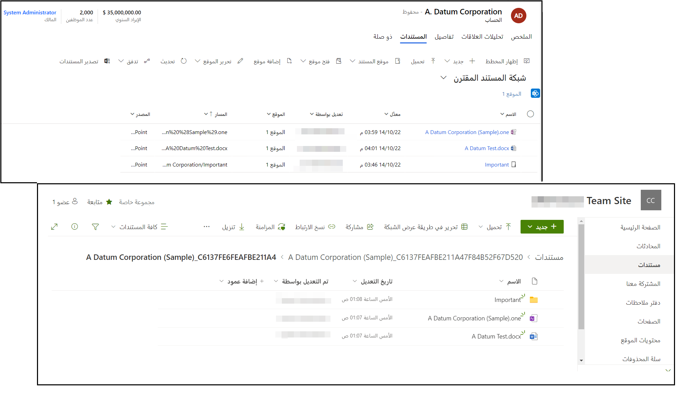
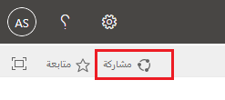
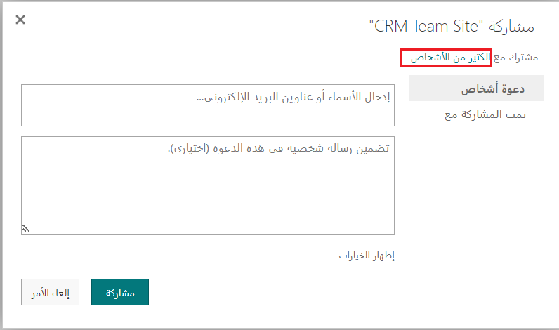
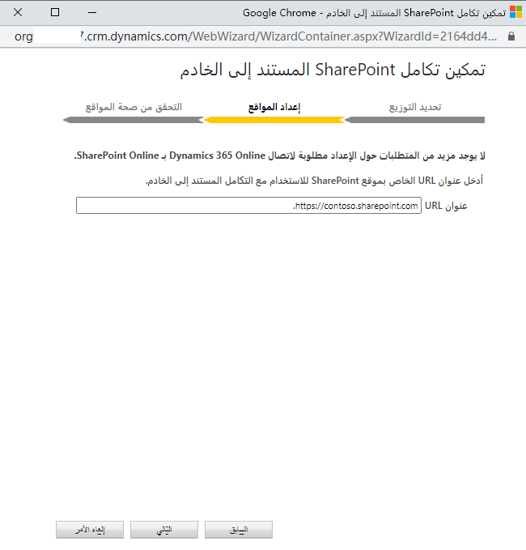
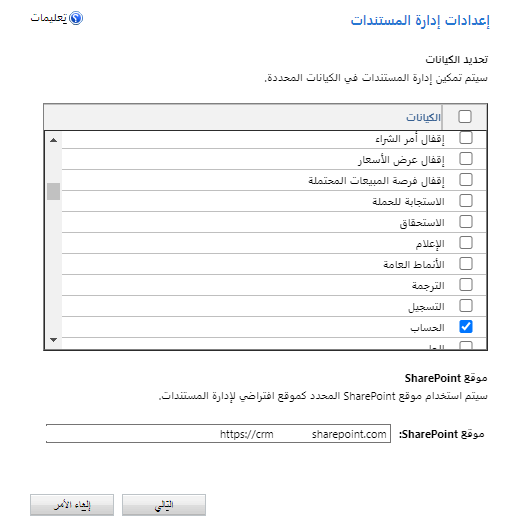
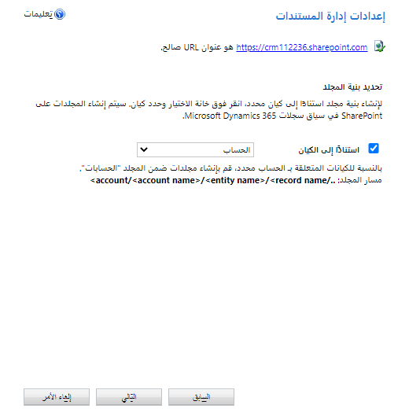
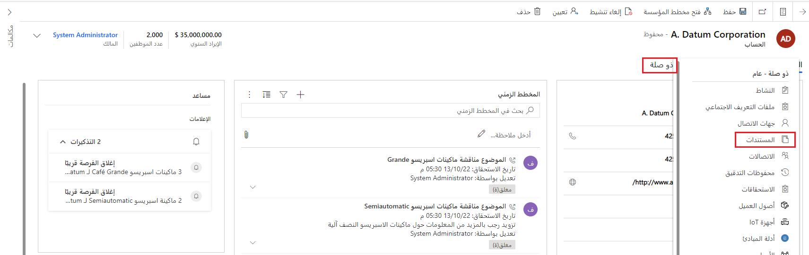
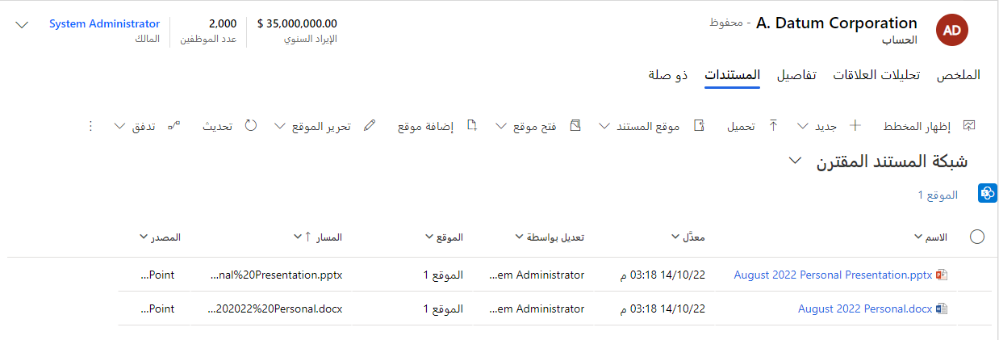

تستخدم المؤسسات تطبيق Microsoft SharePoint في أغلب الأحيان لإنشاء مواقع ويب حيث يمكنك تخزين المعلومات وتنظيمها ومشاركتها والوصول إليها بأمان من أي جهاز. إحدى الميزات الأساسية التي يتسم بها SharePoint هي إمكانيات إدارة المستندات. إنه يوفر للمستخدمين مساحة واحدة للتعاون في العمل على المستندات، ويتضمن ميزات مثل تعقب التغييرات وتعيين إصدارها. نظراً لوجود مستندات مهمة تتعلق بالعملاء في أغلب الأحيان، مثل الاقتراحات وعروض PowerPoint التقديمية وملفات التكوين، ستستخدم المؤسسات في أغلب الأحيان SharePoint كأداة لهذه الملفات.

تسمح ميزة إدارة المستندات باستخدام SharePoint للمستخدمين بإدارة أنواع مستندات شائعة، مثل Word وExcel وPowerPoint وOneNote. يمكنك إنشاء مجلدات لحفظ تلك المستندات وإدارتها في تطبيقات تفاعل العملاء‬ مثل Dynamics 365 Sales وDynamics 365 Customer Service وDynamics 365 Field Service وDynamics 365 Marketing وDynamics 365 Project Operations. ويتم تخزين المستندات بسلاسة في SharePoint.

بينما يتم تخزين المستندات في SharePoint، يمكن الوصول إليها بسهولة من موقع SharePoint مباشرة، ومن سجلات Dynamics 365 كما يظهر في الصورة أدناه.

> [!div class="mx-imgBorder"]
> 

تستخدم وظيفة إدارة المستندات تكامل SharePoint المستند إلى الخادم في مجموعة مواقع مشتركة في SharePoint. يوفر SharePoint المستند إلى الخادم المزايا التالية:

-   يسجل المستخدمون دخولهم مرة واحدة فقط، وبالتالي لا يتعين عليهم تسجيل الدخول إلى كل من تطبيقات تفاعل العملاء وSharePoint.

-   لا حاجة إلى تثبيت أي برنامج آخر على SharePoint.

-   ستظهر مستندات SharePoint في قوائم.

-   ينفذ المستخدمون إجراءات SharePoint من شريط الأوامر.

عندما تستخدم SharePoint Online مع تطبيقات تفاعل العملاء، يمكنك القيام بما يلي:

-   إنشاء المستندات المخزنة في SharePoint وتحميلها وعرضها وحذفها من ضمن تطبيقات تفاعل العملاء.

-   استخدام قدرات إدارة المستندات من SharePoint في تطبيقات تفاعل العملاء، مثل إيداع المستندات وسحبها وتغيير خصائص المستندات.

-   تمكين مستخدمي تطبيقات أخرى غير تطبيقات تفاعل العملاء، مثل العملاء الذي يرغبون في مراجعة مزايدة، من الوصول مباشرةً إلى مستندات SharePoint (شريطة حصولهم على الأذونات المناسبة).

## الشروع في العمل

قبل أن نبدأ جولة نتعرف فيها على كيفية تكوين الوظيفة، من الضروري أن نفهم كيفية عمل التكامل. يتم تخزين المستندات والوصول اليها من خلال SharePoint. ولا يتم الوصول إليها مباشرةً من Dynamics 365. أثناء عملك في تطبيقات تفاعل العملاء من Dynamics 365، فأنت تنظر بشكل أساسي إلى IFrame يتصل بموقعك في SharePoint وتم تنسيقه بحيث يبدو مماثلاً لتطبيق Dynamics 365. ولهذا السبب، فإن أي شخص ينتقل إلى المستندات في SharePoint، سواء من موقع SharePoint مباشرةً أو من ضمن تطبيقات Dynamics 365، سيحتاج إلى تعيين مستويات أذونات معينة إلى مستخدمين فرديين أو مجموعات من ضمن SharePoint.

لمشاركة العناصر، استعرض وصولاً إلى [مركز مسؤولي Microsoft 365](https://admin.microsoft.com/?azure-portal=true) وسجل دخولك باستخدام بيانات اعتماد مسؤول Microsoft 365 العمومي. افتح مشغل تطبيق Microsoft 365، ثم حدد **SharePoint**. في القائمة الموجودة على الجانب الأيمن، عادةً باتجاه الجزء السفلي من الشاشة، حدد **موقع الفريق**. في الصفحة الرئيسية، حدد **مشاركة** (الزاوية العلوية اليسرى).

> [!div class="mx-imgBorder"]
> 

يمكنك عرض الأذونات الافتراضية لموقع فريقك عن طريق تحديد 
**كثير من الأشخاص‬**. بشكل افتراضي، بإمكان جميع المستخدمين في مؤسسة Microsoft 365 إضافة المستندات وتحريرها على موقع SharePoint الخاص بالفريق. لدعوة أشخاص آخرين، اختر **دعوة الأشخاص** وأضف أشخاصاً من خارج مؤسستك لمشاركة المستندات معهم.

> [!div class="mx-imgBorder"]
> 

للحصول على المزيد من المعلومات حول أذونات SharePoint، راجع 
[المقدمة: التحكم في وصول المستخدمين بواسطة الأذونات](https://support.office.com/Article/Introduction-Control-user-access-with-permissions-ab2d1ab1-07cf-4c69-bdd9-390bfd787b26/?azure-portal=true).

## تكوين مؤسسة جديدة

بشكل افتراضي، لا يتم تكوين إدارة المستندات في البيئات الجديدة. إذا لم تكن مؤسستك قد نشرت إدارة المستندات، فستظهر رسالة تنبيه لتمكين تكامل SharePoint المستند إلى الخادم، عندما يسجل مسؤول النظام دخوله. إذا أردت تمكين تكامل SharePoint المستند إلى الخادم، فيمكنك تحديد **تمكين الآن**. بعد أن تنتهي من تكوين التكامل المستند إلى الخادم، سيتوقف ظهور التنبيه.

> [!div class="mx-imgBorder"]
> 

إذا لم تتمكن من رؤية الرسالة لسبب ما، فيمكنك مع ذلك تكوين الوظيفة عبر [مركز مسؤولي Power Platform](https://admin.powerplatform.microsoft.com/?azure-portal=true). في مركز مسؤولي Power Platform، حدد بيئة تريد تكوينها، وانتقل إلى **الإعدادات** > **التكامل** > 
**إعدادات إدارة المستندات**، ثم حدد **تمكين تكامل SharePoint المستند إلى الخادم**. سيؤدي ذلك إلى إرشادك عبر معالج تكوين سيساعدك في تكوين تكامل SharePoint المستند إلى الخادم.

ستحتاج إلى تحديد ما إذا كنت بصدد الاتصال بموقع  **عبر الإنترنت** أو **محلي‏‎** لـ SharePoint. بالاستناد إلى الخيار الذي تحدده، ستحتاج إلى توفير بعض المعلومات الإضافية. على سبيل المثال، إذا كنت بصدد الاتصال بموقع SharePoint عبر الإنترنت، فستحتاج إلى توفير عنوان URL لموقع SharePoint الذي تريد الاتصال به، مثل `https://contoso.sharepoint.com`.

> [!div class="mx-imgBorder"]
> 

## تحديد الجداول المطلوب استخدامها مع إدارة المستندات

بعد تمكين تكامل SharePoint المستند إلى الخادم، ستحتاج إلى تكوين الجداول التي تريدها متاحة لتكامل إدارة المستندات. على سبيل المثال، إذا أردت أن تكون قادراً على تخزين المستندات في SharePoint لحسابات أو جهات اتصال معينة، فستحتاج إلى التأكد من تمكين هذه الجداول لإدارة المستندات.

بعد إكمال الإعداد الأولي، قد يتم سؤالك عما إذا كنت تريد الانتقال مباشرة إلى إعدادات إدارة المستندات. إذا لم يكن الأمر كذلك، فيمكنك الوصول إلى الإعدادات من [مركز مسؤولي Microsoft Power Platform](https://admin.powerplatform.microsoft.com/?azure-portal=true). بعد تحديد بيئة تريد العمل فيها، حدد **الإعدادات > التكامل > إعدادات إدارة المستندات > إعدادات إدارة المستندات**.

ستحتاج إلى تحديد الجداول التي ترغب في استخدامها لإدارة مستندات SharePoint. إذا لم يكن عنوان URL محدداً بالفعل، فستحتاج إلى إدخال عنوان URL الخاص بموقع SharePoint حيث سيتم إنشاء مواقع المستندات والمجلدات لتخزين المستندات.

> [!div class="mx-imgBorder"]
> 

بينما تقوم بجولة في معالج تكوين إدارة المستندات، ستتمكن من تحديد بنية المجلد التي تريد استخدامها. إذا لم تحدد أي شيء هنا، وعندما يقوم أحد المستخدمين باستخدام التكامل لأحد السجلات للمرة الأولى، فستتم مطالبته بإنشاء المجلد لتخزين البيانات. إذا حددت الخيار **استناداً إلى الكيان**، فيتم إنشاء المجلدات ومكتبات المستندات التي تستند إلى كيان الحساب أو جهة الاتصال بشكل تلقائي في موقع SharePoint. ولن تتم مطالبة المستخدمين بإنشائها.

> [!div class="mx-imgBorder"]
> 

يمكنك العثور على المزيد من الإرشادات المفصلة حول تكوين إدارة المستندات هنا: [تمكين إدارة المستندات على الكيانات](/power-platform/admin/enable-sharepoint-document-management-specific-entities/?azure-portal=true).

بعد تمكين تكامل SharePoint المستند إلى الخادم، يمكنك إدخال المزيد من التحسينات على التكامل عن طريق تمكين OneNote وOneDrive for Business.

-   **OneNote:** عند تمكينه، يمكنك الاستفادة من مزايا استخدام OneNote لتدوين ملاحظات العملاء أو مراجعتها مباشرةً من سجلات العملاء. للحصول على المزيد من المعلومات حول تكوين تكامل OneNote، راجع [إعداد تكامل OneNote](/power-platform/admin/set-up-onenote-integration-in-dynamics-365/?azure-portal=true).

-   **OneDrive for Business:** عند تمكينه، بإمكان المستخدمين إنشاء مستندات خاصة وإدارتها باستخدام OneDrive for Business. للحصول على المزيد من المعلومات حول تكوين تكامل OneDrive for Business، راجع [تمكين OneDrive for Business(عبر الإنترنت)](/power-platform/admin/enable-onedrive-for-business/?azure-portal=true).

## استخدام إدارة المستندات

بعد تكوين تكامل SharePoint، يمكنك بدء إضافة المستندات إلى السجلات. بعد فتح سجل ممكّن لإدارة المستندات مثل الحساب، سترى خيار **المستندات** عندما تحدد علامة التبويب **ذات صلة**.

> [!div class="mx-imgBorder"]
> 

عندما تفتح علامة تبويب "المستندات"، سترى الشبكة المقترنة بالمستند، التي ستوفر لك الخيارات التالية:

-  **جديد:** يسمح لك هذا الخيار بإنشاء مستند جديد مباشرةً من داخل النافذة. ستتمكن من إنشاء مستند Word أو جدول بيانات Excel أو دفتر ملاحظات OneNote أو عرض تقديمي من PowerPoint. يمكنك أيضاً إنشاء مجلد جديد لتخزين المستندات.

-   **تحميل:** يسمح لك هذا الخيار بتحميل مستند موجود مباشرة إلى موقع SharePoint.

-   **موقع المستند:** يسمح لك هذا الخيار بتحديد موقع المستند الذي ترغب في عرض المستندات منه. من المحتمل أن يكون لديك مواقع متعددة تم تكوينها لأنواع مختلفة من المستندات.

-   **فتح الموقع:** يسمح لك هذا الخيار بفتح موقع مستند SharePoint مباشرةً من الشبكة الفرعية، بحيث يمكنك الاستفادة من جميع الخيارات المتاحة.

-   **إضافة موقع:** يسمح لك هذا الخيار بإضافة موقع مستندات إضافي لتخزين المستندات.

-   **تحرير الموقع:** يسمح لك هذا الخيار بإجراء تغييرات على موقع المستند الحالي الذي تعمل عليه.

-   **تحديث:** يحدّث هذا الخيار موقع المستند.

> [!div class="mx-imgBorder"]
> 

يمكنك العثور على جولة تفصيليه حول كيفيه العمل مع تكامل إدارة المستندات في SharePoint هنا: [استخدام إدارة المستندات](/power-platform/admin/set-up-dynamics-365-online-to-use-sharepoint-online#using-document-management/?azure-portal=true).
