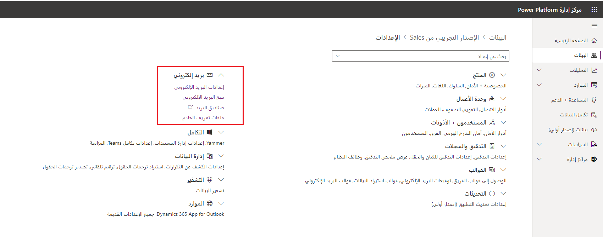
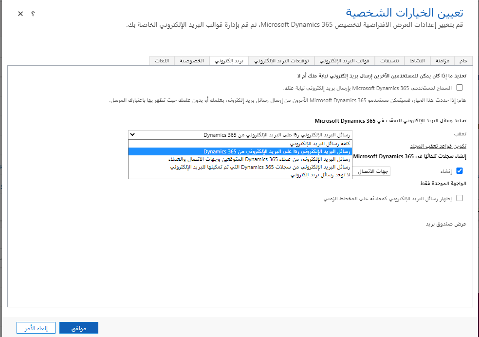
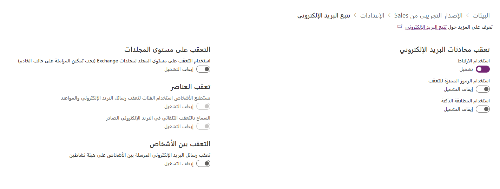

يمكنك استخدام المزامنة من جانب الخادم لمزامنة نظام البريد الإلكتروني الخاص بك مع Microsoft Dataverse على مستوى الخادم. تعتمد كيفية معالجة رسائل البريد الإلكتروني والميزات المتوفرة لمستخدمي Dataverse على خيارات معالجة البريد الإلكتروني التي تم تكوينها في مركز إدارة Power Platform ضمن البيئة المحددة **إعدادات**.

> [!div class="mx-imgBorder"]
> 

## إعدادات البريد الإلكتروني

هذه هي القرارات الأساسية التي تحتاج إلى اتخاذها فيما يتعلق بإعدادات البريد الإلكتروني:

-   هل الموافقة الإدارية مطلوبة قبل معالجة رسائل البريد الإلكتروني لصناديق البريد الفردية؟

-   ما إعدادات المزامنة الافتراضية لصناديق البريد الجديدة؟

-   ما هو الحجم الأقصى للمرفقات (لن تتم مزامنة رسائل البريد الإلكتروني التي تحتوي على المرفقات التي تتجاوز الحد الأقصى)؟

-   ماذا تفعل عندما يتطابق عنوان البريد الإلكتروني للمستلم مع سجلات متعددة في Dataverse للتطبيقات؟

لمزيد من المعلومات حول كيفية استخدام إعدادات البريد الإلكتروني الفردية، راجع [إدارة إعدادات البريد الإلكتروني](/power-platform/admin/settings-email/?azure-portal=true).

## تعقب البريد الإلكتروني

عندما تتعامل المزامنة من جانب الخادم مع البريد الإلكتروني الوارد، تحتاج العملية إلى اتخاذ بعض القرارات بشأن ما إذا كان البريد الإلكتروني بحاجة إلى تعقب (أي تحويله إلى سجل نشاط في Dataverse وكيفية ربط البريد الإلكتروني بسجلات أخرى في تطبيقك). على سبيل المثال، عند التواصل مع أحد العملاء بشأن حالة دعم حالية، من المهم التعامل مع جميع رسائل البريد الإلكتروني ذات الصلة كمحادثة واحدة بخصوص الحالة.

## الخيارات الشخصية

يتم تكوين رسائل البريد الإلكتروني التي يتم تعقبها لكل مستخدم أو أساس قائمة الانتظار باستخدام إعدادات المستخدم الشخصية أو خصائص سجل قائمة الانتظار، على التوالي.

> [!div class="mx-imgBorder"]
> 

توضح هذه الصورة إعدادات تعقب المستخدمين الفرديين. تتوفر إعدادات تعقب مماثلة عند تحرير سجل قائمة الانتظار. خيارات التعقب المتاحة هي:

- **جميع رسائل البريد الإلكتروني:** كما يوحي الاسم، سيتم تعقب جميع رسائل البريد الإلكتروني المستلمة في صندوق بريد كأنشطة Dataverse للتطبيقات.

- **رسائل البريد الإلكتروني ردًا على بريد Dynamics 365 الإلكتروني:** تقرر هذه العملية ما إذا كنت تريد تعقب بريد إلكتروني باستخدام إعدادات تعقب المحادثة للبيئة (انظر أدناه).

  - **رسائل البريد الإلكتروني من العملاء المتوقعين وجهات الاتصال والحسابات في Dynamics 365:** سيتم استخدام عنوان البريد الإلكتروني للمرسل للبحث في هذه الكيانات فقط وتعقب البريد الإلكتروني في حالة العثور على مطابقة.

  - **رسائل البريد الإلكتروني من سجلات Dynamics 365 التي تم تمكين البريد الإلكتروني فيها:** سيتم استخدام عنوان البريد الإلكتروني للمرسل للبحث في جميع الكيانات التي تم تمكين البريد الإلكتروني فيها وتعقب البريد الإلكتروني في حالة العثور على مطابقة.

بالإضافة إلى إعدادات التعقب هذه، يمكن للمستخدمين أيضاً تكوين قواعد تعقب المجلد إذا تم تمكين التعقب على مستوى المجلد داخل البيئة. تعقب المجلد هو آلية تعقب بديلة تعتمد على مجلدات خادم Exchange حيث يتم تخزين رسائل البريد الإلكتروني بدلاً من المعلومات داخل البريد الإلكتروني نفسه.

## إنشاء سجلات تلقائياً في Microsoft Dynamics 365

بشكل افتراضي، عندما يتلقى المستخدم رسالة متعقبة أو طلب اجتماع من مرسل غير معروف، يظل سجل المرسل دون حل حتى يقوم المستخدم بربطه يدوياً بسجل موجود ممكن للبريد مثل جهة الاتصال.

يؤدي تحديد مربع الاختيار **إنشاء** إلى تمكين إنشاء السجلات تلقائياً لمرسلين غير معروفين. يمكن للمستخدمين تحديد ما إذا كان يتم إنشاء جهة اتصال أو عميل متوقع (إذا كان متاحاً) تلقائياً. سيتم تعيين جهة الاتصال أو سجلات العملاء المتوقعين التي تم إنشاؤها تلقائياً كمرسلين للبريد الإلكتروني أو طلبات الاجتماع المقابلة.

### الإعدادات العمومية

تحدد إعدادات تعقب البريد الإلكتروني العالمية داخل البيئة كيفية تجميع رسائل البريد الإلكتروني في محادثات وما إذا كانت رسائل البريد الإلكتروني *رداً على* رسائل بريد إلكتروني، عندما يحدد المستخدمون الفرديون هذا الخيار. حدد خيار تعقب البريد الإلكتروني في إعدادات المؤسسة في مركز إدارة Power Platform لتكوين هذه الخيارات.

> [!div class="mx-imgBorder"]
> 

### تعقب محادثات البريد الإلكتروني

يتيح لك قسم تعقب محادثات البريد الإلكتروني تكوين كيفية اتخاذ القرار إذا كان البريد الإلكتروني الوارد جزءاً من محادثة موجودة. يمكن تعقب رسائل البريد الإلكتروني باستخدام الطرق التالية:

- **استخدام الارتباط:** عند تمكينه، سيحاول النظام تجميع رسائل البريد الإلكتروني في محادثات باستخدام خصائص البريد الإلكتروني المتوفرة في رؤوس البريد الإلكتروني.

- **تعقب الرمز:** سيكون لكل بريد إلكتروني تم إرساله أو استلامه رمزاً مميزاً فريداً يضاف إلى سطر الموضوع. يضمن تعقب الرموز، ما لم يتم تعديلها يدوياً من قبل المستخدمين، دقة التعقب، ومع ذلك، تحتاج إلى النظر في الآثار المترتبة على الموضوعات المعدلة. على سبيل المثال، عند التمكين، قد يبدو الموضوع مثل *Sale Pricing CRM:0123456* حيث يعد CRM:0123456 رمز التعقب.

- **استخدام المطابقة الذكية:** سيستخدم النظام مزيجاً من الموضوع والمرسل والمستلم لمطابقة رسائل البريد الإلكتروني المستلمة مع أنشطة البريد الإلكتروني داخل Dataverse.

### تعقب المجلد

تمكين التعقب على مستوى المجلد لمجلدات Exchange عند تمكين المزامنة من جانب الخادم. سيتم تلقائياً تعقب جميع رسائل البريد الإلكتروني التي تظهر في مجلدات تم تكوينها مسبقاً. يتم تكوين المجلدات من قِبل المستخدمين في إعدادات البريد الإلكتروني الشخصية.

### التعقب بين الأشخاص

عند إرسال بريد إلكتروني بين مستخدمي Dataverse للتطبيقات أو صفوف الانتظار، يمكن تسجيله كنشاط واحد أو نشاطين، صادر ووارد. عادةً ما يعتمد تحديد كيفية تعقب رسائل البريد الإلكتروني بين مستخدمي Dataverse للتطبيقات على متطلبات التنفيذ التلقائي واحتياجات تعقب.

لمزيد من المعلومات حول كيفية استخدام إعدادات تعقب البريد الإلكتروني الفردية، راجع [إدارة إعدادات تعقب البريد الإلكتروني](/power-platform/admin/settings-email-tracking/?azure-portal=true).
