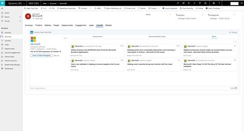

تجمع Microsoft بين أدوات Microsoft Dynamics 365 Salesوتطبيقات Power BI وLinkedIn Sales Navigator من أجل نجاح عملية البيع بينك وبين عملائك. 
 
حل MRS (حل Microsoft Relationship Sales) هو وحدة SKU مخفضة تجمع بين Microsoft Dynamics 365 SalesوLinkedIn Sales Navigator الذي يقوم بما يلي: 
 
- عرض معلومات LinkedIn حول العملاء المتوقعين والحسابات الموجودة في Dynamics 365 من خلال عنصر واجهة مستخدم Sales Navigator.
- يوفر مزامنة يومية بين Sales Navigator وDynamics 365، بحيث يمكن رؤية العملاء المتوقعين وجهات الاتصال والحسابات الموجودة بالفعل في Dynamics داخل Sales Navigator.
- يكتب تحديد أنشطة Sales Navigator إلى Dynamics 365 بنقرة واحدة. 
 
يمكنك الاستفادة من Sales Navigator وDynamics 365 لتحقيق النجاح في علاقة البيع وإشراك العملاء والعملاء المتوقعين. يمكنك تعزيز إنتاجية المبيعات باستخدام حل ‎ ‎MRS‎ (Dynamics 365وLinkedIn Sales Navigator). وتشكل مزامنة هذين الحلين السعر وميزة التفاضل التي يمكنك تقديمها لعملائك. عرض حل MRS لوحدة SKU - سعر مخفض على Sales Navigator تم مزامنته مع حل CRM - لديك عرضًا مثيرًا وفريدًا لعملائك – العرض الوحيد من نوعه في هذا المجال.  
 
يتيح لك تطبيق LinkedIn فيما يخص طلب حل CRM في Microsoft Dynamics إمكانية عرض معلومات LinkedIn حول العملاء المتوقعين والعقود وجهات الاتصال والحسابات والفرص مباشرةً في تطبيقات Dynamics 365.  يجمع الحل البيانات المختلفة عبر برامج Dynamics وMicrosoft 365 وSales Navigator. باستخدام بيانات العلاقة الموحدة، يمكن للبائعين الاطلاع على العلاقات وتنفيذ المشاركة الموثقة والمخصصة التي يطلبها المشترون اليوم.  

> [!div class="mx-imgBorder"]
> 

### معالجة نقاط الصعوبة

تشمل نقاط الصعوبة الأساسية التي تمت معالجتها استخدام الحلول والميزات المحسّنة ونتائج التحليلات المحسّنة وصحة البيانات المهمة والنتائج القابلة للقياس. لا يجد البائعون اليوم جميع اللاعبين الأساسيين في صفقة ما، ويُنظر إليهم على أنهم لا يضيفون قيمة إلى المشترين، كما يكافحون من أجل الحفاظ على إنتاجياتهم بينما يستخدمون علاقات متعددة. 

### مزايا حل MRS

تساعد مزايا استخدام حل MRS في التغلب على العديد من التحديات التي يواجهها محترفو المبيعات كل يوم. يساعد حل MRS على تمكين محترفي المبيعات من بناء علاقات مع الأشخاص المناسبين، بالإضافة إلى عرض نتائج التحليلات والتوصيات مع مشاركة ذلك على نطاق واسع مع العملاء والعملاء المتوقعين. يتمثل أحد العناصر المهمة في هذا الأمر في توفير القدرة على تحسين كفاءة سير العمل وإنتاجيته وفعاليته. حاليًا، يستغرق محترفو المبيعات ما يصل إلى 14 ساعة أسبوعيًا في الأنشطة الإدارية مثل تحديث حل CRM. (المصدر: Sirius Decisions لعام 2018) 

### تكامل الحل

لتكامل الحل، سيتعين عليك أولاً تنزيل حل Microsoft Dynamics 2016 أو 365. وتعد عملية تكامل المنتج هي نفس العملية بالنسبة لعميل يشتري Dynamics 365 for Sales وSales Navigator بشكل منفصل وعميل يشتري حل MRS.  

تم العثور على متطلبات تكامل CRM sync الأساسية في [تكامل Sales Navigator](/dynamics365/customer-engagement/linkedin/integrate-sales-navigator).

راجع [المخططات المؤسسية المباشرة الاختيارية](/dynamics365/customer-engagement/sales-enterprise/live-org-chart) لتحديث المخططات المؤسسية.

### خيارات وحدة SKU

يوجد خياران بوحدة SKU لحل MRS:

- **MRSs** - (LinkedIn Sales Navigator Team + Dynamics 365 Sales Enterprise)
- **MRSs Plus** - (LinkedIn Sales Navigator Enterprise + Dynamics 365 Sales Enterprise) 

**لتأهيل وحدة SKU لحل MRS** يتم تطبيق المعايير التالية: 
- في اتفاقية Microsoft Enterprise التجارية (يوجد أكثر من 500 مقعد لأي منتج من منتجات Microsoft)  
- 10 مقاعد لحل MRS كحد أدنى 
- لا توجد حسابات حكومية أو تعليمية
- لإنهاء عقد LinkedIn (قبل تاريخ تجديد العقد):
    - التزام لسنوات متعددة وحجوزات تراكمية
    - إجمالي الإنفاق (إجمالي قيمة العقد) > 200 ألف دولار أمريكي (35 مقعد لحل MRS بموجب عقد مدته ثلاث سنوات) 
    - >أعلى بنسبة 20% من المبلغ المستهدف لتجديد عقد معهد المناظر الطبيعية 

قيمة الجزء LinkedIn Sales Navigator لحل MRS (على سبيل المثال، في حالة انخفاض المدة، يجب زيادة المقاعد).

**قواعد المشاركة (RoE):** يجب إخطار ممثل Sales Professional في Microsoft Solutions وممثل LinkedIn مسبقًا بحركة المبيعات. 
 
**عملية مطالبات الشريك:** تعد عملية مستشار خدمات الإنترنت (OSA) هي عملية المطالبات الجديدة نفسها.

 

