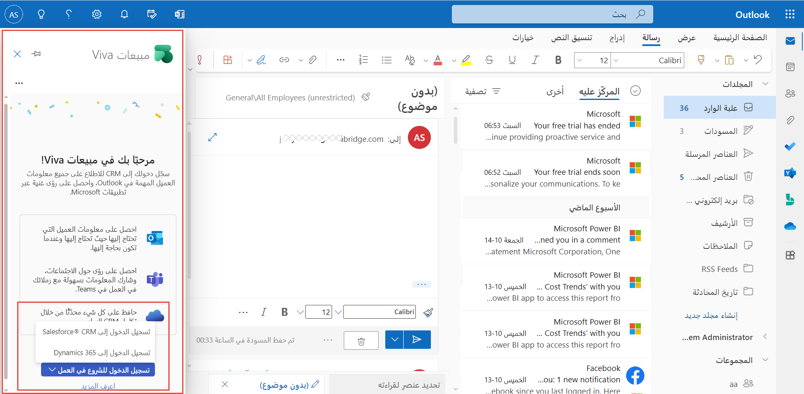

يمكن لمسؤولي Microsoft 365 تثبيت مبيعات Viva كتطبيق متكامل على منصات متعددة أو كوظيفة إضافية فردية على نظام أساسي واحد. يمكن للمسؤولين البدء من مركز مسؤولي Microsoft 365 أو السوق التجاري لـ Microsoft لتثبيته في Outlook وتعيين المستخدمين. إذا بدأت من AppSource، فستنتهي من التثبيت في مركز مسؤولي Microsoft 365.

لمزيد من المعلومات، راجع [تثبيت مبيعات Viva من AppSource](/viva/sales/install-viva-sales-individual-add-in-appsource/?azure-portal=true) أو [تثبيت مبيعات Viva من مركز مسؤولي Microsoft 365](/viva/sales/install-viva-sales-individual-add-in-admin-center/?azure-portal=true). في البداية، تتوفر مبيعات Viva لعملاء Dynamics 365 وSalesforce.

> [!div class="mx-imgBorder"]
> 

تم تمكين تطبيق مبيعات Viva في Microsoft Teams ولكن لم يتم تثبيته تلقائياً. ستحتاج إلى الانتقال إلى مركز مسؤولي Teams وإنشاء سياسات الإعداد لتثبيت التطبيق وتعيين المستخدمين. بالإضافة إلى ذلك، نوصي بتثبيت التطبيق لزيادة قابلية اكتشافه وتشجيع البائعين على استخدامه.

لتثبيت التطبيق وتثبيت مكانه في Microsoft Teams، ستحتاج إلى [إنشاء سياسة إعداد تطبيق Teams مخصص](/viva/sales/install-pin-viva-sales-teams?azure-portal=true#create-a-custom-teams-app-setup-policy) و 
[تعيين السياسة إلى مجموعة مستخدمين](/viva/sales/install-pin-viva-sales-teams?azure-portal=true#assign-the-custom-teams-app-setup-policy-to-a-user-group)  (مجموعة الأمان أو الوحدة التنظيمية أو قائمة التوزيع). قد يستغرق ظهور الوظيفة الإضافية للمستخدمين لديك ما يصل إلى 24 ساعة.

> [!IMPORTANT]
> إذا كان المستخدمون يعملون في Salesforce، فتأكد من عدم حظر Microsoft Power Platform. يمكنك التحقق من حالته في صفحة **استخدام OAuth للتطبيقات المتصلة** في Salesforce.

> [!NOTE]
> يجب أن تكون مسؤولاً في Microsoft 365 لنشر وتثبيت الوظيفة الإضافية لمبيعات Viva لبرنامج Outlook. يجب أن تكون مسؤول Teams لنشر وتثبيت مبيعات Viva لـ Teams.

> [!IMPORTANT]
> يجب تسجيل اجتماع Microsoft Teams ونسخه إلى مبيعات Viva لتكوين رؤى. لمزيد من المعلومات، راجع [قم بتشغيل أو إيقاف تشغيل النسخ الكتابي للتسجيل](/microsoftteams/cloud-recording?azure-portal=true#turn-on-or-turn-off-recording-transcription).

## تخزين البيانات

مبيعات Viva مضمن في [Microsoft Power Platform](https://powerplatform.microsoft.com/?azure-portal=true). بيانات مبيعات Viva مخزنة في [Microsoft Dataverse](/powerapps/maker/common-data-service/data-platform-intro/?azure-portal=true) بالإضافة إلى CRM المتصل. عند اتصال مبيعات Viva بـ Dynamics 365، يتم تخزين بيانات مبيعات Viva باستخدام مثيل Dataverse لـ Microsoft Dynamics 365 Sales.

عندما تكون مبيعات Viva متصلة بـ Dynamics 365 CRM مثل Salesforce اليوم، سيتم توفير مثيل Dataverse افتراضي خاص بمبيعات Viva إلى المستأجر الخاص بك. يتم تخزين بيانات مبيعات Viva في المثيل الافتراضي بالإضافة إلى CRM الخاص بك.

يمكنك العثور على اسم وتفاصيل مثيل Dataverse الافتراضي الخاص بك المسمى 
**msdyn_viva** في [مركز مسؤولي Microsoft Power Platform](https://admin.powerplatform.microsoft.com/?azure-portal=true).

## الحد الأدنى من الامتيازات المطلوبة لاستخدام مبيعات Viva

تحتاج إلى تلبية متطلبات امتياز معينة لاستخدام مبيعات Viva مع نظام CRM الخاص بك.

إذا كنت تستخدم Dynamics 365 كنظام CRM الخاص بك، فيجب تعيين دور أمان مدير المبيعات أو مندوب المبيعات للمستخدمين لاستخدام مبيعات Viva. يصف الجدول التالي متطلبات الامتياز لـ Dynamics 365.

| الجدول | الوظيفة | الامتيازات |
|-------|---------------|------------|
| اتصال CRM | قم بإنشاء اتصال بمثيل Dynamics 365. | إنشاء وقراءة وكتابة وحذف وإلحاق وإلحاق بـ |
| إشعار | إنشاء وتحديث وربط الإشعارات مع العميل المحدد. | إنشاء وقراءة وكتابة وحذف وإلحاق وإلحاق بـ |
| جهة الاتصال | استرجع بيانات جهة الاتصال في بطاقة جهة الاتصال وقم بتحديث الحقول القياسية في بطاقة جهة الاتصال. | قراءة وكتابة وإلحاق وإلحاق بـ |
| الحساب | إظهار معلومات الحساب ذات الصلة لجهة اتصال في بطاقة جهة الاتصال وإقران جهة اتصال بحساب. | قراءة وإلحاق وإلحاق بـ |
| الفرصة | اقرأ الفرصة المرتبطة بجهة الاتصال واكتشف أنها صاحبة المصلحة في الفرصة. | قراءة فرصة، وقراءة الاتصال، وقراءة دور الاتصال |
| المستخدم | أنشئ اتصالات في Dynamics 365. | مستخدم القراءة |

يصف الجدول التالي متطلبات الامتياز لـ Salesforce.

| الجدول | الوظيفة | الامتيازات |
|-------|---------------|------------|
| جهة الاتصال | استرجع بيانات جهة الاتصال في بطاقة جهة الاتصال وقم بتحديث الحقول القياسية في بطاقة جهة الاتصال. | قراءة، وقراءة الكل، والتحديث |
| الحساب | إظهار معلومات الحساب ذات الصلة لجهة اتصال في بطاقة جهة الاتصال. | قراءة وعرض الكل |
| الفرصة | إظهار معلومات الفرصة ذات الصلة لجهة اتصال في بطاقة جهة الاتصال. | قراءة وعرض الكل |

يمكنك الوصول إلى مستند [الأسئلة المتداولة حول مبيعات Viva](https://support.microsoft.com/topic/viva-sales-faq-dd0b9203-a5d4-44ee-a173-cadc808c828a) للمساعدة في معالجة أي من الأسئلة الشائعة التي أثيرت حول مبيعات Viva.
