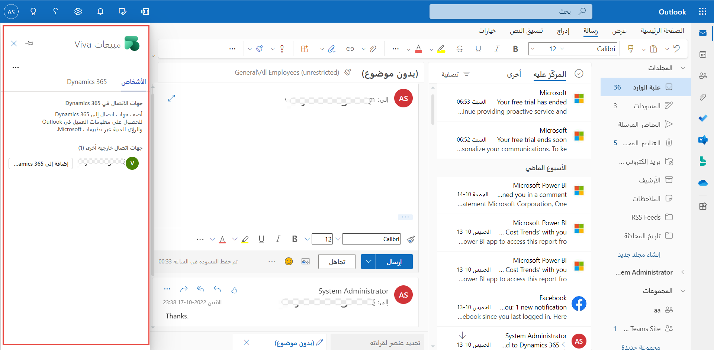

تُقدم مبيعات Viva العديد من الإمكانات التي يمكن أن تحافظ على إنتاجية البائعين في تدفق العمل داخل تطبيقات Microsoft Teams وMicrosoft Outlook. يمكن للبائعين عرض بيانات CRM في Outlook ومزامنة بيانات تفاعل العميل تلقائياً من Outlook إلى Salesforce و365 Microsoft Dynamics، وبالتالي توفير الوقت والإحباط. في Outlook، سيتم عرض مبيعات Viva بالإضافة إلى تطبيق Outlook. كما يمكنك تسجيل الدخول إلى نظام CRM الخاص بك من مبيعات Viva.

> [!div class="mx-imgBorder"]
> 

باستخدام الفوائد والميزات الخاصة بمبيعات Viva، يمكن للبائعين القيام بما يلي:

-   تسجيل الدخول إلى نظام CRM الخاص بهم من Outlook.

-   إنشاء جهة اتصال جديدة في نظام CRM الخاص بهم. يتم تعبئة معلومات الاتصال مسبقاً باستخدام توقيع بريد إلكتروني إذا كانت موجودة.

-   عرض معلومات الحساب والفرصة من داخل Outlook.

-   حفظ رسائل البريد الإلكتروني في نظام CRM الخاص بهم من Outlook.

كما يمكن للبائعين أيضاً التعاون مع زملائهم في بيانات العميل من خلال Teams وOutlook. وباستخدام ميزات التعاون، يمكن للبائعين القيام بما يلي:

-   نسخ معلومات جهة الاتصال والحساب والفرصة من Outlook ومشاركتها في Teams كرابط، والتي يتم تنفيذها في بطاقة معاينة منسقة.

-   مشاركة معلومات CRM في دردشة Teams وذلك باستخدام ملحقات الرسائل.

-   تحديث معلومات سجل CRM من دردشة Teams باستخدام بطاقات المعاينة.

يمكن للبائعين استخدام رؤى اجتماعات Teams الذكية للتواصل بشكل أفضل مع العملاء. ستساعد عناصر الإجراءات التلقائية لمتابعة العملاء في توفير وقت تدوين الملاحظات الذي يمكن للبائعين استخدامه للتركيز على دورة المبيعات. ومع هذه الرؤى، يمكن للبائعين القيام بما يلي:

-   الوصول إلى معلومات CRM عند قيامهم بجدولة اجتماع من Outlook.

-   حفظ تفاصيل الاجتماع إلى CRM من Outlook.

-   الاستفادة من رؤى الاجتماع، مثل ملخص تنفيذي مفصل وتحليل التوجه وعناصر الإجراءات التي يجب متابعتها (معلومات محادثة المبيعات).

إذا كنت تستخدم مبيعات Viva مع Microsoft Teams، فيمكنك استخدام إمكانات البحث عن الكلمات أو العبارات للبحث عن أجزاء من المحادثة التي أجريتها مع أحد العملاء أثناء اجتماع مبيعات Teams والتي قد تكون مهمة لإغلاق إحدى عمليات البيع. بالإضافة إلى ذلك، يمكنك مسح النسخة المكتوبة من اجتماع Teams ضوئياً لتحديد موقع أجزاء أساسية من المحادثة.

> [!div class="mx-imgBorder"]
> 
