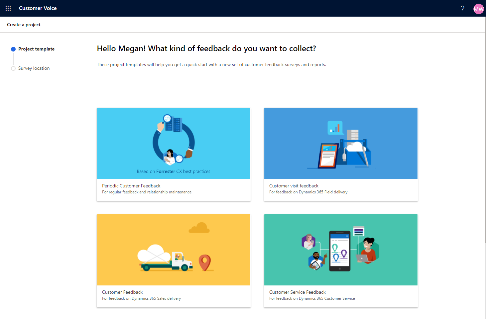

Dynamics 365 Customer Voice يزود المؤسسات بأداة استبيان قوية للحصول على تعليقات العملاء والموظفين وتحليلها ثم العمل عليها. ضع في اعتبارك كافة نقاط الاتصال التي تتفاعل خلالها مع العميل، ما يؤدي إلى تجربة إيجابية أو محايدة أو سلبية.
وعادةً ما يشار إلى هذه التجارب على أنها *لحظات الثقة*، والتي ينتج عنها الانطباع الدائم عن مؤسستك. وتشكل هذه النقاط ضرورة أساسية عند تجميع التعليقات.

تتضمن الأمثلة الشائعة لهذه التجارب:

-   بعد حل مشكلة دعم العميل وإقفال الحالة

-   بعد شراء أحد المنتجات

-   بعد إكمال جلسة التدريب بواسطة طالب

يمكن استخدام Dynamics 365 Customer Voice للحصول على آراء العملاء وتعليقاتهم. يمكن كذلك استخدام الاستبيانات لجمع المعلومات المطلوبة، حتى قبل أن يصبح المستجيب عميلاً.

يمكن أن تشمل حالات استخدام الحصول على هذه المعلومات ما يأتي:

-   التسجيل لحدث يتم الاحتفاظ به

-   طلب تفاصيل حول الخدمات المتوفرة

-   إكمال نموذج تم إدراجه في صفحة منتج موقع ويب على الإنترنت

يقوم Dynamics 365 Customer Voice باستخدام مفهوم المشاريع لتقسيم مجموعات من الاستبيانات والتقارير وتضمينها. يمكن أن يحتوي المشروع على استبيان واحد أو أكثر من الاستبيانات التي سيتم استخدامها لأحداث مختلفة أو *لحظات الثقة* خلال رحلة علاقة العميل.

من خلال حفظ حالات الاستخدام في ذهنك، يمكنك إنشاء الاستبيانات والعمليات باستخدام Dynamics 365 Customer Voice لتقديم تجربة سلسة وتفاعلية لأي مؤسسة.

يمكن أن تحتوي الاستبيانات على عدة أنواع من الأسئلة: الاختيار والتاريخ وLikert والترتيب والتصنيف والنص وNet Promoter Score (‏‫NPS). يعد Net Promoter Score ‏(NPS) مقياسًا يتم استخدامه لتحليل الولاء الإجمالي للعملاء. يقيس تصور العميل لمؤسسة أو منتج أو خدمة عن طريق السؤال عن مدى احتمالية أن يقوم بتوصية الأصدقاء أو الزملاء. عند طرح سؤال NPS في استبيان، يوفر Net Promoter Score الإجمالي، والذي يوفر مقياسًا آخر لتقييم رضا العملاء.

تم تضمين Dynamics 365 Customer Voice مع اشتراكات Microsoft Dynamics ‏365 المحددة، وهو متاح في صورة ترقية لاشتراكات Microsoft 365. يتم تخزين الاستبيانات والأسئلة والدعوات والإجابات في Microsoft Dataverse. 

في حين أن هذه المعلومات قد تساعد إذا كنت تستخدم منتج Dynamics أو إذا كنت ترغب في إنشاء تطبيق يستند إلى النموذج في Microsoft Power Apps، إلا أنك لن تحتاج إليه عند الوصول إلى Dynamics 365 Customer Voice واستخدامه:

-   تم إنشاء الاستبيانات

-   تمت إضافة الأسئلة الاستقصائية إلى الاستبيانات

-   قام المستجيبون بإكمال إجابات الاستبيان

-   تحتوي كل إجابة على خيارات إجابة عن أسئلة الاستبيان المرتبطة بأسئلة الاستبيان

-   تم إرسال دعوات الاستبيان إلى العملاء أو الموظفين، ما يجعله استبيانًا مخصصًا

-   يتم ربط الدعوات والإجابات معًا وهما عبارة عن أنشطة

-   يمكن كذلك لجهات الاتصال إلغاء الاشتراك من استبيانات Dynamics 365 Customer Voice، والتي ستقوم بإنشاء سجل إلغاء الاشتراك لمنع إرسال دعوات الاستبيان الإضافية

يقوم Dynamics 365 Customer Voice باستخدام Microsoft Power BI لعرض المعلومات الموجزة والنتائج الفردية في تحليلات غنية في الوقت الحقيقي. يتم توفير Survey insights لإظهار الارتباطات بين أحد الأسئلة أو أكثر، والتي تساعد المؤسسات على الحصول على النماذج في الإجابات وتحقيق فهم أفضل للعملاء.

فكر في استبيان إقفال حالة الذي يطالبك بتصنيفات في جوانب مختلفة من تجربة الدعم (ممثل الدعم والوقت اللازم للإجابة والمعرفة وهكذا) ويطرح كذلك سؤالاً عن Net Promoter Score ‏(NPS). في السيناريو المثالي، إذا كانت كافة التعليقات إيجابية فيما يتعلق بمستويات خدمة العملاء التي تم توفيرها، فمن المحتمل أن تكون النقاط الإجمالية لمقياس NPS التي تم تحديدها إيجابية أيضًا. إذا كان كل شيء إيجابيًا، وكان NPS منخفضًا، فقد يتم تحديد أنه في حين أن خدمة العملاء التي تم تقديمها في تلك اللحظة كانت جيدة، فإن الرأي العام للعميل بشأن الشركة ككل سيئًا؛ لذلك، هناك حاجة إلى العمل لمعرفة السبب وتحسين هذا الرأي.
