## التمرين رقم 1: إنشاء مشروع أساسي Dynamics 365 Customer Voice

في هذا التمرين، عليك إنشاء أول مشروع لك في Dynamics 365 Customer Voice.

> [!NOTE]
> يُمكنك إكمال هذا التمرين باستخدام Dynamics 365 Sales الممكّن في بيئتك أو دونه. ورُغم ذلك، إذا كنت ترغب في استكمال التمارين في الوحدات التالية، فعليك استكمال هذه الخطوات في بيئة بها أيضًا Dynamics 365 Sales ممكَّنًا.

### المهمة رقم 1: إنشاء مشروع جديد

لإنشاء مشروع جديدة، اتبع هذه الخطوات:

1.  انتقل إلى [Dynamics 365 Customer Voice](https://customervoice.microsoft.com/) وسجّل الدخول باستخدام بيانات الاعتماد الخاصة بك.

2.  حدّد **الشروع في العمل**.

    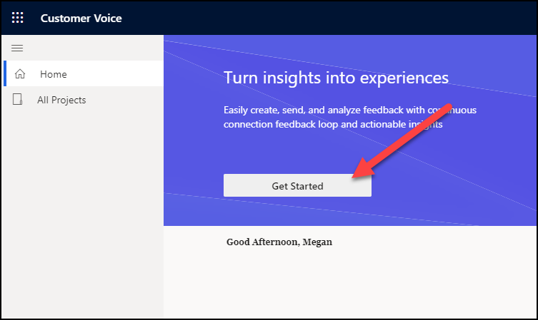

3.  حدد قالب مشروع **الدعم**.

    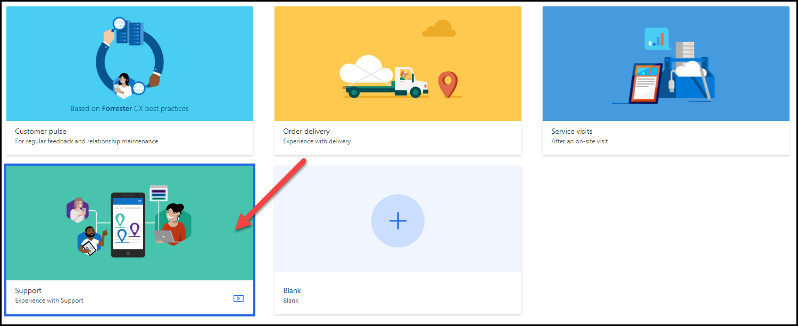

4.  حدد الزر **معاينة**.

    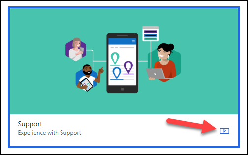

5.  سوف توفر هذه المعاينة نظرة عامة على الاستطلاع المرتبط بهذا المشروع. وعند الانتهاء من المراجعة، حدد **إغلاق**.

    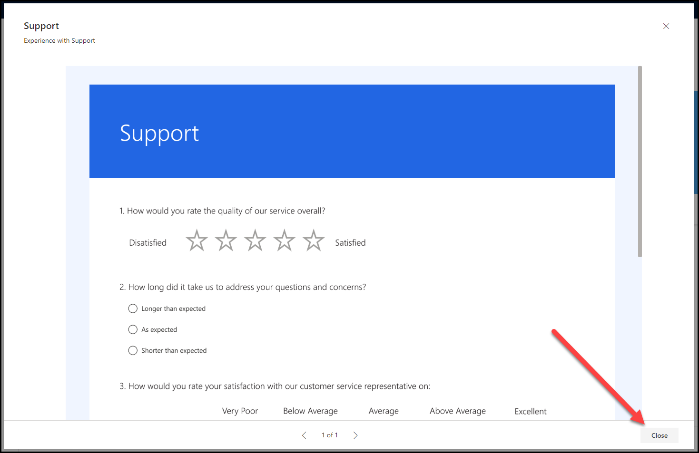

6.  حدد الزر **التالي** للمتابعة.

    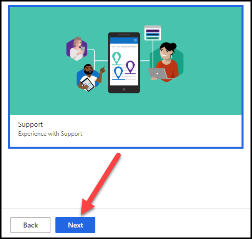

7.  من الشاشة **‏‫أين تريد إنشاء المشروع؟‬**، يُمكنك تحديد موقع المشروع.
    حدد الرابط **راجع جميع البيئات**.

    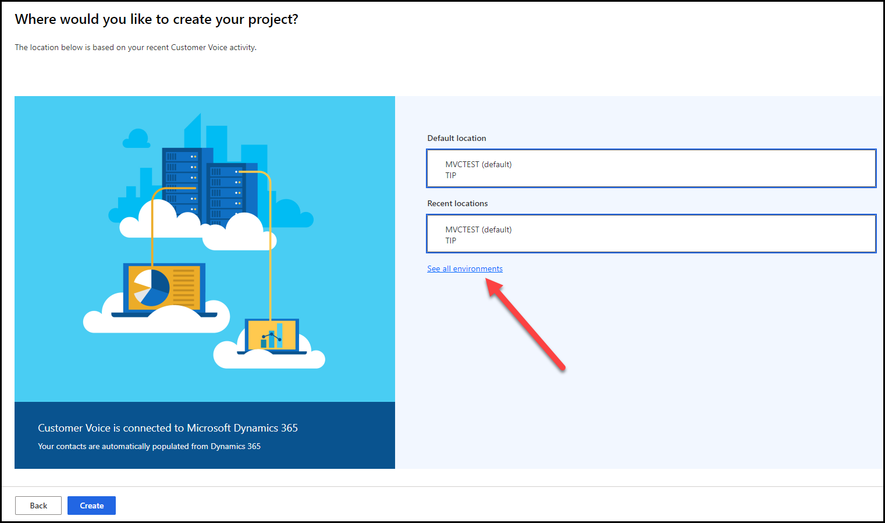

8.  من شاشة **‏‫جميع البيئات‬**، سوف ترى قائمة بكل بيئات Microsoft Dataverse التي لديك حق الوصول إليها. حدد البيئة التي تستخدمها لإكمال هذا التمرين وحدد الزر **تحديد وإغلاق**.

    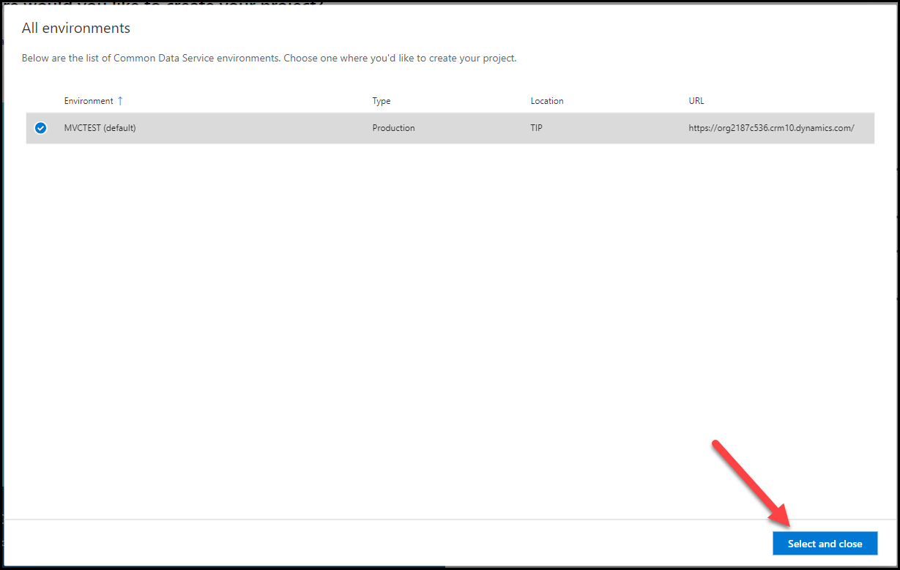

    > [!NOTE] 
    > نظرًا لاستخدامك Dynamics 365 Customer Voice لفتره من الوقت، سيتم ملء قائمه المواقع الأخيرة بأحدث البيئات التي استخدمتها. وبعد ذلك، يُمكنك تحديد البيئة مباشره من هذه القائمة.

    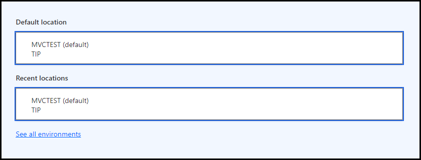

10. حدد الزر **إنشاء**. في حالة تعذُّر تحديد الزر، يُمكنك التأكيد باستخدام الخطوة السابقة والتأكّد من تحديد موقع واحد.

    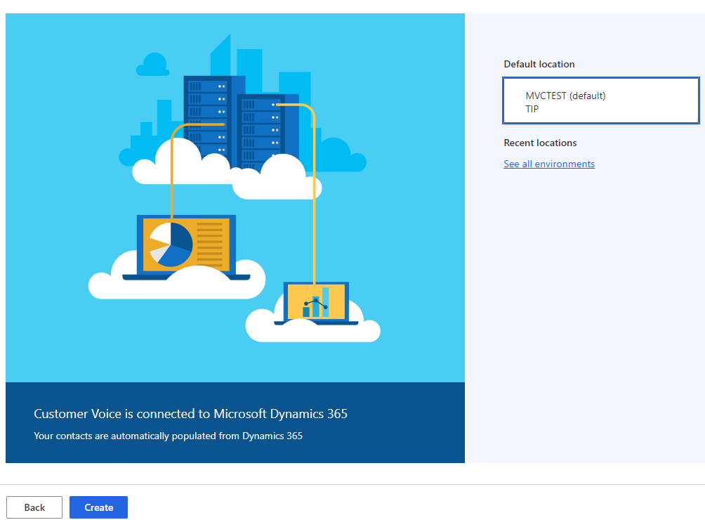

## التمرين رقم 2: مراجعه إعدادات المشروع

في هذا التمرين، سوف تتعلم المزيد عن المشروع فيما يخص إعادة تسميته ونسخه ومشاركته.

### المهمة رقم 1: إعادة تسمية المشروع.

في هذه المهمة، سوف تقوم بتغيير اسم المشروع.

1.  من قائمه التنقل، حدد **جميع المشروعات**.

    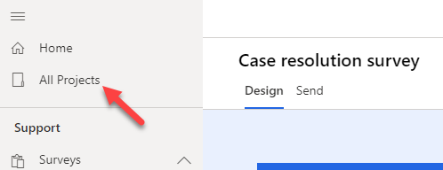

2.  ابحث عن المشروع الجديد في القائمة، ثم حدد علامة الحذف (**...**) بجوار اسم المشروع.

3.  حدد **إعادة تسمية** من القائمة.

    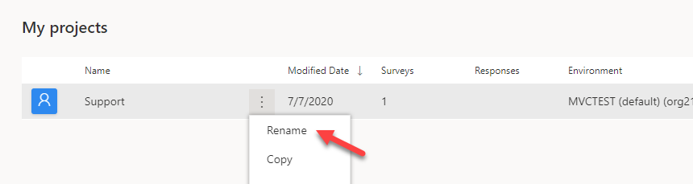

4.  أدخِل **تعليقات دعم العملاء** على أنها الاسم الجديد، ثم حدد **إعادة تسمية**.

    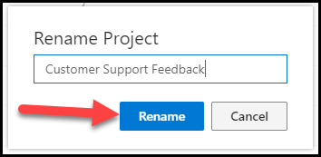

### المهمة رقم 2: نسخ المشروع.

في هذه المهمة، ستنسخ المشروع إلى بيئة أخرى. وإذا لم يكن لديك أكثر من بيئة لهذا التمرين، فيُمكنك قراءة الخطوات المطلوبة لفهم الوظيفة بدلًا من ذلك.

1.  من قائمه التنقل، حدد **جميع المشروعات**.

2.  ابحث عن المشروع الجديد في القائمة، ثم حدد علامة الحذف (**...**) بجوار اسم المشروع.

3.  حدد **نسخ** من القائمة.

    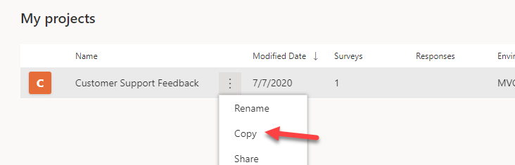

4.  وإذا كان هناك أكثر من موقع متوفر في بيئتك، حدد موقعًا مختلفًا. أما إذا كان لديك موقعًا واحدًا فقط، فحدد ذلك الموقع. حدد الزر **نسخ** للمتابعة.

    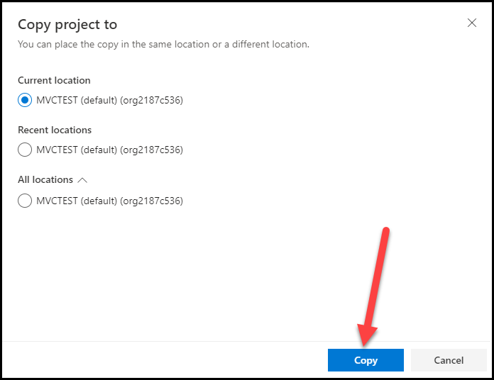

5.  سيُعرض إشعارًا يُظهر أن المشروع قد نُسخ إلى الموقع المُحدد في الخطوة 4.

    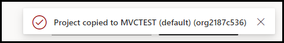

6.  بعد نسخ المشروع، سيُدرج المشروع في الموقع المُحدد في الخطوة 4، مع **نسخ** في نهاية الاسم للإشارة إلى الاسم الجديد.

    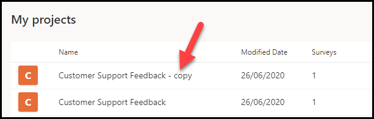

### المهمة رقم 3: مشاركة المشروع.

في هذه المهمة، سوف تُشارك المشروع مع مستخدمين آخرين داخل المؤسسة نفسها. وإذا لم يكن لديك هناك مستخدمين آخرين يُمكنك مشاركة المشروع معهم لعمل هذا التمرين، فيُمكنك قراءة الخطوات المطلوبة لفهم الوظيفة بدلًا من ذلك.

1.  من قائمه التنقل، حدد **جميع المشروعات**.

2.  ابحث عن المشروع الجديد في القائمة، ثم حدد علامة الحذف (**...**) بجوار اسم المشروع.

3.  حدد **مشاركة** من القائمة.

    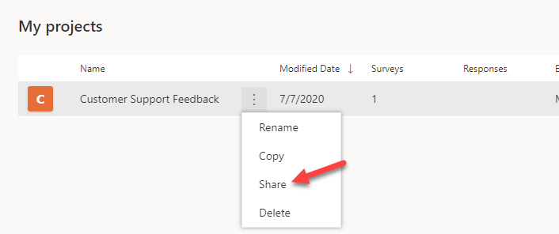

4.  في علامة التبويب **تعاون**، أدخل اسم المستخدم الآخر لمشاركة المشروع معه.

    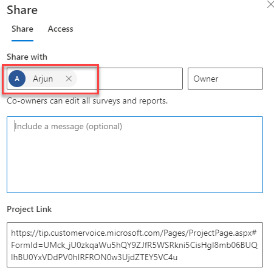

5.  في مربع الرسالة، أدخل **أود العمل على هذا الاستطلاع معك، يُرجى مراجعه الاقتراحات وتقديمها**.

    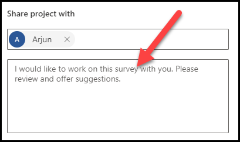

6.  حدد **مشاركة** أسفل الشاشة.

7.  سوف يظهر إشعار لتأكيد مشاركة المشروع مع المستلمين المحددين في الخطوة 4.

    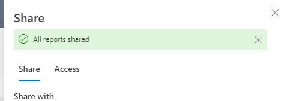

8.  يُمكنك إغلاق شاشة **المشاركة** ثم كرر الخطوتين 2 و 3. حدد علامة التبويب **وصول**، إذ يُمكنك مشاهده الأشخاص الذين لهم حق الوصول إلى المشروع.

    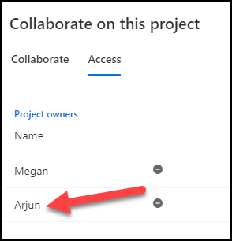
