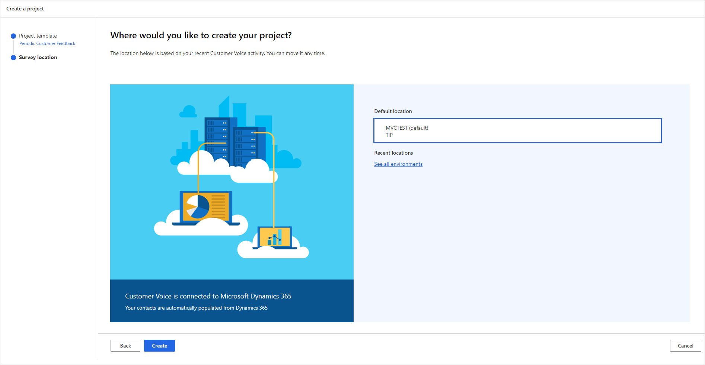
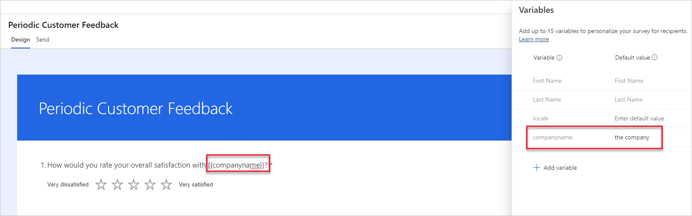

تم التخطيط وفهم الغرض من المشروع. حان وقت إنشاء المشروع الآن. يتم توفير العديد من قوالب المشاريع في Dynamics 365 Customer Voice. تم تصميم هذه القوالب لمنح المستخدم بداية سريعة باستطلاع مقترح وعمليات تتعلق بنوع معين من التعليقات.

تم اقتراح قوالب المشروع التالية.

|     قالب المشروع              |     الغرض من القالب                                       |
|-----------------------------------|------------------------------------------------------------|
|     تعليقات الدورية للعملاء    |     للحصول على تغذية راجعة منتظمة وصيانة العلاقة    |
|     تعليقات زيارة العملاء       |     Fللتعليق على توصيل Dynamics 365 Field Service    |
|     تعليقات العملاء             |     للحصول على تعليقات حول عرض Dynamics 365 Sales          |
|     التعليقات الخاصة بخدمة العملاء     |     للحصول على تعليقات حول Dynamics 365 Customer Service          |
|     فارغ                         |     ابدأ من البداية وأنشئ استطلاع جديد           |

بعد اختيار قالب المشروع الأنسب لاحتياجات المؤسسة، يجب على المستخدم تحديد موقع المشروع. سيكون عدد المواقع المتاحة للاختيار من بينها مرتبطاً بعدد البيئات المختلفة المتاحة لهم في Microsoft Dataverse. إذا تم استخدام Dynamics 365 Customer Voice فقط، فسيكون هو الموقع الوحيد المتاح للاختيار من بينها. ومع ذلك، إذا كان لدى المؤسسة Dynamics 365 Customer Service، على سبيل المثال، فسيتم عرض موقع لكل موقع يمتلك المستخدم حق الوصول إليه. قد تكون هذه البيئة هي الإنتاج أو بيئة الاختبار المعزول. إذا كانت المؤسسة تستخدم Dataverse " وأنشأت Power Apps،أخرى مستندة إلى نموذج، فقد يتم أيضاً سرد هذه البيئات.

يتم إنشاء *بيئة افتراضية واحدة* تلقائياً وإتاحتها في Dynamics 365 Customer Voice. لا يمكن حذف هذه البيئة ويمكن استخدامها لإضافة المشاريع. ومع ذلك، إذا كان الغرض من المشروع هو جمع البيانات التي تستند إلى المشغلات مثل إغلاق الحالة أو شراء المنتجات، وتحدث هذه المشغلات في Dynamics 365 أو بيئة Dataverse أخرى، يجب تحديد نفس البيئة عندما يقوم المستخدم بإنشاء المشروع.

> [!div class="mx-imgBorder"]
> 

بعد إنشاء المشروع، إذا تم استخدام أحد القوالب، فسيتم إعطاؤه اسماً محدداً مرتبطاً بالقالب المختار. يمكن إعادة تسمية المشروع إلى شيء يتماشى أكثر مع كائنات المؤسسة، إذا لزم الأمر. يمكن أيضاً نسخ المشروع ومشاركته والكتابة فوقه وحذفه. سيظهر المشروع الذي تم إنشاؤه من فارغ على أنه **مشروع جديد** حتى يتم إعادة تسميته إلى شيء أكثر ملاءمة.

يعني تحديد قالب مشروع أيضاً أنه سيتم إضافة قالب استطلاع كجزء من المشروع. بالنسبة إلى نموذج تعليقات العملاء الدورية، يتم تضمين استطلاع مع الأسئلة التي تطالب بالتعليق على التجربة التي مر بها المجيب في الأشهر الثلاثة الماضية. يستخدم الاستطلاع أنواعاً مختلفة من الأسئلة، بما في ذلك أسئلة التقييم و Likert والنص. يتضمن كل سؤال إعدادات مختلفة، والتي تحدد ما إذا كانت الأسئلة مطلوبة، أو لها أي قيود، أو لها عنوان فرعي معروض. يمكن تعديل العناصر لكل سؤال، إذا لزم الأمر. ضع في اعتبارك أن هناك حاجة إلى تعديلات طفيفة للتأكد من أن الأسئلة تفي بمتطلبات الشركة التي تم إنشاء المشروع من أجلها.

قد يتم تضمين ميزات إضافية في الاستطلاع المقدم، مثل إضافة متغير، كما هو موضح في الشكل التالي. في هذا المثال، تمت إضافة، **اسم الشركة** كمتغير جديد، ثم يتم استخدامه في عنوان السؤال وأيضاً في بعض العبارات داخل سؤال Likert. في حالة استخدام هذا المتغير، يجب على منشئ المشروع تحديث القيمة الافتراضية باسم المؤسسة الفعلي حتى تكون أي استطلاعات يتم إرسالها باستخدام المتغير دقيقة وذات معنى. 

> [!div class="mx-imgBorder"]
> 

يمكن أن يشتمل قالب المشروع على عناصر إضافية مثل علامة تجارية محددة وقواعد تفريع وتنسيقات أخرى. سيؤدي تحديد الخيار الفارغ عند إنشاء مشروع جديد إلى توفير استطلاع جديد بدون إضافة أسئلة. على الرغم من أن هذا الاستطلاع الفارغ لا يوفر إرشادات لمنشئ الاستطلاع، إلا أنه يعد خياراً جيداً لاختيار شخص لديه خبرة في إنشاء الاستطلاعات أو يشعر بالراحة في استخدام Dynamics 365 Customer Voice ويفهم مفاهيم المشروع وجميع عناصر مسح جيد النوعية.

> [!VIDEO https://www.microsoft.com/videoplayer/embed/RE4AWED]

