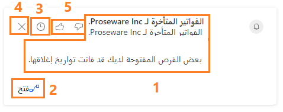

قد يكون من الصعب البقاء على اطلاع بكل المستجدات بشكل جيد. لا يركز البائعون على الصفقات التي تُجرى اليوم فحسب، بل يركزون أيضًا على العملاء الذين لا يعملون معهم حاليًا. يمكن تنفيذ بعض أعمال هذه الصيانة، مثل إعداد التذكيرات، باستخدام تطبيقات مثل Microsoft Outlook. ومع ذلك، فإن هذه التطبيقات ليس لديها القدرة على تذكيرك في حالة عدم تواصلك مع شخص ما. بإمكان المساعد أن يساعد في هذه المهمة.

يراقب المساعد الإجراءات والاتصالات اليومية التي تجريها ويقوم بإنشاء مجموعة من *البطاقات* التي يتم عرضها بشكل بارز من خلال التطبيق لتوفير نتائج تحليلات مخصصة وقابلة للتنفيذ.

يمكن للمساعد تنفيذ المهام التالية:

-   يذكرك بالأنشطة القادمة مثل الاجتماعات والمهام.

-   يمكنك تقييم اتصالاتك واقترح الوقت المناسب للتواصل مع جهة اتصال كانت غير نشطة لفترة من الوقت.

-   حدد رسائل البريد الإلكتروني التي قد تكون في انتظار ردك.

-   تنبيهك عندما يقترب موعد إغلاق الفرصة.

المكون الأساسي الذي يستخدمه المساعد للتفاعل مع المستخدمين هو بطاقات الإجراءات. توفر بطاقات الإجراءات أحدث المعلومات عن رسائل البريد الإلكتروني والاجتماعات وغيرها. يتم عرض بطاقات الإجراءات عبر تطبيق Dynamics 365 في عناصر مثل النماذج ولوحات المعلومات لتوفير معلومات ذات صلة بالسياق الذي تعمل فيه حاليًا. على سبيل المثال، عندما يفتح شخص ما سجل حساب، قد يتم تزويده ببطاقات عمل مرتبطة برسائل البريد الإلكتروني التي يتم تلقيها من الحساب وتذكيرات بالاجتماعات القادمة مع العميل وبطاقات تخبره بأن فرصة ستنتهي قريباً.

تحتوي بطاقة المعلومات على العناصر الأساسية التالية:

> [!div class="mx-imgBorder"]
> 

1.  **منطقة المحتوى الرئيسية** - تُظهر عنوان السجل الذي تشير إليه البطاقة وملخصه ونوع البطاقة والمعلومات الأساسية الأخرى.

1.  **منطقة الإجراءات** - توفر روابط مناسبة لمساعدتك على إكمال أي نوع من الإجراءات توصي بها البطاقة. يختلف نوع الارتباطات وعدد الارتباطات (ما يصل إلى اثنين) حسب نوع البطاقة. لمزيد من المعلومات، راجع [مرجع بطاقات المعلومات](/dynamics365/ai/sales/action-cards-reference).

1.  **التأجيل** - يختلف وقت التأجيل حسب نوع البطاقة. سيتم تأجيل جميع البطاقات ذات الأولوية العالية والبطاقات من نوع Today لمدة ساعة واحدة، وسيتم تأجيل جميع البطاقات الأخرى لمدة 24 ساعة. بعد انتهاء وقت التأجيل، ستظهر البطاقة مرة أخرى.

1.  **رفض** - حدد هذا الزر لرفض البطاقة نهائياً، بغض النظر عما إذا كنت قد أكملت الإجراء الذي توصي به أو لا.

1.  **التعليقات** - تساعدك في تقديم تعليقات حول ما إذا كانت البطاقة مفيدة لك أو لا. تساعد التعليقات Microsoft ومسؤولي مؤسستك على تحسين تجربة البطاقة وجعلها أكثر إفادة لك. 

## التكوين الشخصي

بعد أن يكمل مسؤول مؤسستك التكوين الأولي لميزة بطاقات المعلومات، يمكن للبائعين الفرديين تحديد البطاقات التي يريدون استخدامها بناءً على احتياجاتهم الشخصية. يمكن لأحد البائعين تعديل إعدادات sales insights الشخصية من منطقة إعدادات Sales Insights الخاصة بتطبيق مركز المبيعات.

من داخل شاشة **إدارة بطاقة المعلومات**، يمكنك الوصول إلى جميع البطاقات التي تم توفيرها لك استنادًا إلى دور الأمان التابع لك. سيتم تشغيل كل بطاقة تظهر لك افتراضيًا، ولكن يمكنك إيقاف تشغيل أي منها حسب الحاجة. يمكن تحديد موقع البطاقات باستخدام خيار "البحث" أعلى الشاشة. عند إدخال اسم البطاقة التي تريدها، ستتم تصفية القائمة.

وعند المرور فوق إحدى البطاقات، سيتم عرض معاينة للبطاقة لمساعدتك على فهم ماهيتها بشكل أفضل إلى جانب طريقة تقديمها في التطبيق. إذا قررت عدم استخدام بطاقة، يمكنك فتحها وإيقاف تشغيلها.
