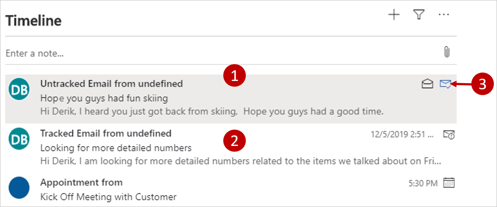

غالباً ما يتلقى موظفو المبيعات رسائل بريد إلكتروني من عملاء متعددين أو مرتبطة بصفقات متعددة. قد يصبح من الصعب الحفاظ على هذا الحجم الكبير من البريد الإلكتروني.
تمكّن ميزة الالتقاط التلقائي لـ Sales Insights Dynamics 365 من الوصول إلى البريد الإلكتروني في Microsoft Exchange للعثور على الرسائل المتعلقة بعمل مندوب المبيعات وعرضها. تتيح هذه الميزة لموظفي المبيعات لديك رؤية رسائل البريد الإلكتروني ذات الصلة مع جميع الأنشطة الأخرى المرتبطة بسجل معين في Dynamics 365.

يتم دمج الرسائل التي تم العثور عليها عن طريق الالتقاط التلقائي مع أنشطة Dynamics 365 الأخرى ذات الصلة وتظهر في الجدول الزمني للسجل الذي تنطبق عليه. يمكن رؤية الرسائل الملتقطة تلقائياً على جهة الاتصال والفرصة والعميل المتوقع والحساب والحالة والجداول المخصصة. على سبيل المثال، إذا كنت تبحث عن فرصة في Dynamics 365، فسيعرض المخطط الزمني جميع الأنشطة التي قمت بتسجيلها لهذه الفرصة. يعرض أيضاً ما يصل إلى 50 رسالة بريد إلكتروني حديثة في حسابك Microsoft Exchange والتي تم إرسالها إلى أو من جهة الاتصال الرئيسية لتلك الفرصة أو أصحاب المصلحة فيها.

تُظهر الصورة التالية كلاً من الرسائل المتعقبة والتلقائية (غير المتعقبة) في عمود الأنشطة وتبرز التفاصيل التالية:

1.  **رسائل الالتقاط التلقائي** - تم العثور على هذه الرسائل بواسطة ميزة الالتقاط التلقائي. لقد تم تحديدها على أنها من المحتمل أن تكون ذات صلة بالسجل الحالي، لكنها لا تزال خاصة، لذا يمكنك أنت فقط رؤيتها. بالمقارنة مع الرسائل التي تم تعقبها، تظهر هذه الرسائل رمزًا رماديًا وحدًّا منقطًا وتتضمن رابط تعقب وتسمية بريد إلكتروني خاص.

2.  **الرسالة المتعقبة** - تم تعقب هذه الرسالة بالفعل، لذا تم استيرادها بالفعل إلى Dynamics 365 وتتم مشاركتها مع الفريق. وتعرض رمزًا باللون الأسود ولا تتضمن أي عناصر تحكم أو رسائل للتعقب.

3.  **ارتباط التعقب** - حدد الارتباط لتحويل رسالة خاصة تم العثور عليها عن طريق الالتقاط التلقائي إلى رسالة متعقبة في Dynamics 365.

في البداية، تعتبر الرسائل التي يعثر عليها الالتقاط التلقائي خاصة وتكون مرئية لك فقط؛ لن يتمكن مستخدمو Dynamics 365 الآخرون من رؤيتهم. بعد تحديد رمز المسار، ستصبح الرسالة رسالة بريد إلكتروني متعقبة. الرسالة موجودة الآن في قاعدة بيانات Dynamics 365 وستكون مرئية لمستخدمي Dynamics 365 الآخرين.
يتم بالفعل تعقب رسائل الالتقاط التلقائي التي لا تتضمن رابط المسار. قد يستغرق الأمر بضع دقائق حتى تنتقل الرسالة من حالة غير متعقبة إلى متتبعة، وخلال هذه الفترة ستظهر رسالة تعقب معلقة.

كما هو الحال مع الأنواع الأخرى من الإطارات المتجانبة لرسائل البريد الإلكتروني التي تظهر في قائمة الأنشطة، يمكنك تحديد الإطار المتجانب لتوسيع محتوى الرسالة أو تصغيره.

يلخص الجدول التالي كيفية تحديد الالتقاط التلقائي للرسالة ذات الصلة.

| نوع الجدول     | يطابق قيم العمود هذه مع عنوان "المرسل إليه" أو "نسخة إلى" أو "المرسل" لكل رسالة بريد إلكتروني                                                                                                                                                                                                                                                                                                                                                                                                                                             |
|-----------------|-----------------------------------------------------------------------------------------------------------------------------------------------------------------------------------------------------------------------------------------------------------------------------------------------------------------------------------------------------------------------------------------------------------------------------------------------------------------------------------------------------------------------------|
| الحساب         | عنوان البريد الإلكتروني لجهة الاتصال الرئيسية المدرجة. عنوان البريد الإلكتروني لأهم 50 جهة اتصال لديها الحساب كحساب أصلي. يتم تحديد جميع عناوين البريد الإلكتروني لسجل الحساب.                                                                                                                                                                                                                                                                                                                                    |
| الفرصة     | عنوان البريد الإلكتروني المدرج لجهة اتصال الفرصة. عناوين البريد الإلكتروني لأي جهة اتصال في قائمة أصحاب المصلحة. يتم تحديد جميع عناوين البريد الإلكتروني الفرصة الحساب.                                                                                                                                                                                                                                                                                                                                                      |
| الحالة            | عنوان بريد جهة الاتصال الرئيسية الإلكتروني. يتم تحديد جميع عناوين البريد الإلكتروني لسجل الحالة. إذا كان العميل جهة اتصال، فاستخدم كل عناوين البريد الإلكتروني لسجل جهة الاتصال. إذا كان العميل حساباً، فاستخدم كل عناوين البريد الإلكتروني لسجل الحساب.                                                                                                                                                                                                                                                                |
| عميل متوقع            | يتم سرد عنوان البريد الإلكتروني في قسم الاتصال. يتم تحديد جميع عناوين البريد الإلكتروني لسجل العميل المتوقع.                                                                                                                                                                                                                                                                                                                                                                                                                        |
| جهة الاتصال         | يتم تحديد جميع عناوين البريد الإلكتروني لسجل جهة الاتصال.                                                                                                                                                                                                                                                                                                                                                                                                                                                                     |
| جداول مخصصة | بالنسبة لأعمدة الحساب، استخدم عنوان البريد الإلكتروني لجهة الاتصال الرئيسية للحساب، بالإضافة إلى جميع عناوين البريد الإلكتروني المحددة لسجل الحساب. بالنسبة لأعمدة جهات الاتصال، استخدم كافة عناوين البريد الإلكتروني المحددة لسجل جهة الاتصال. بالنسبة لأعمدة العميل التي تشير إلى جهة اتصال، استخدم كافة عناوين البريد الإلكتروني المحددة لسجل جهة الاتصال. بالنسبة لأعمدة العميل التي تشير إلى حساب، استخدم عنوان البريد الإلكتروني لجهة الاتصال الرئيسية المدرجة، بالإضافة إلى جميع عناوين البريد الإلكتروني المحددة لسجل الحساب. |

يرجى الاطلاع على [الالتقاط التلقائي للرسائل الإلكترونية ذات الصلة](/dynamics365/ai/sales/auto-capture/?azure-portal=true) لمزيد من المعلومات.