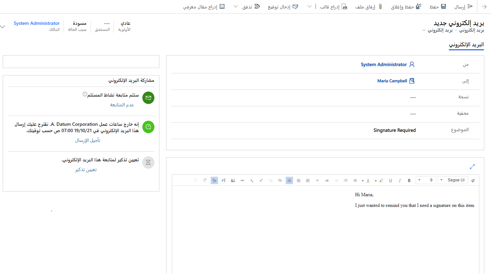

العديد من المؤسسات لديها دورات بيع قصيرة أو قوية. يُعد الحصول على المعلومات من العملاء وتلقيها منهم أمرًا بالغ الأهمية لضمان الوفاء بأهداف دورات البيع هذه. قد يكون معرفة وقت فتح البريد الإلكتروني مفيدًا لموظفي المبيعات. وتُعد القدرة على التصرف بناءً على ما إذا كان البريد الإلكتروني قد فُتِحَ أم لا أمرًا مفيدًا بالقدر ذاته. مثال، إذا كان التوقيع مطلوبًا في ظهر الجمعة، ولم تُفتَح رسالة البريد الإلكتروني التي بها رابط المستند حتى ظهر الخميس، يُمكن تشغيل تذكير، يُذكرك بالتواصل مع المستلم.

تسمح ميزة مشاركة البريد الإلكتروني في Sales Insights للمؤسسات بالتالي:

-   تعرّف على الوقت الذي فتح فيه المستلمون رسالتك أو حددوا رابطًا أو فتحوا مرفقًا أو أرسلوا ردًا.

-   استلم تنبيهًا على الفور، في أول مرة يفتح فيها المستلم رسالتك.

-   جدول وقت التسليم الأكثر فعالية واستلام النصيحة لأفضل وقت حسب المنطقة الزمنية للمستلم.

-   حدد قالب الرسالة الأكثر فعالية، مع التوصيات التي تستند إلى سجل تفاعل البريد الإلكتروني السابق للمؤسسة.

-   يُمكنك تعيين تنبيه لتذكيرك عندما يحين وقت متابعة رسالة بريد إلكتروني.

-   راجع سجل التفاعل الكامل لرسالة واحدة أو راجع مؤشرات KPI.

## إنشاء رسالة بريد إلكتروني وإرسالها

بعد تمكين مشاركة البريد الإلكتروني لأي مؤسسة، سيكون لأي نشاط بريد إلكتروني جديد تم إنشاؤه في Dynamics 365 عناصر تحكم في مشاركة البريد الإلكتروني. ستُعرض عناصر التحكم في قسم **مشاركة البريد الإلكتروني** لنشاط بريد إلكتروني.

يحتوي قسم **‏‫مشاركة البريد الإلكتروني‬** على الخيارات التالية:

- **تمكين/تعطيل عناصر التحكم التالية**، سيتم اتباع جميع الرسائل الجديدة على نحوٍ افتراضي. يُمكنك تعطيل ذلك على أساس كل رسالة على حدة بتحديد خيار **عدم المتابعة**.

- **عناصر التحكم في جدولة التسليم**، يُتيح لك هذا الخيار عرض وقت تسليم الرسالة وتعيينه. إضافة إلى ذلك، سيقدم التطبيق نصيحة بأوقات التسليم الموصى بها، مثال، إذا كان من المحتمل إرسال بريد إلكتروني خارج ساعات العمل العادي للمنطقة الزمنية للمستلم. يُمكنك تأخير الإرسال إلى وقت عمل العميل بتحديد **تأخير الإرسال**. سيقترح النظام وقت ما، ولكن يُمكنك تغيير هذا الوقت إلى أي وقت تختاره.

- **عناصر تحكم تذكير المتابعة**، يسمح لك بتعيين تذكير بالمتابعة يمكن تشغيله في حالة عدم استيفاء شروط معينه.

  يحتوي كل تذكير على شرط. الشروط المتاحة هي:

  -   **في حالة عدم تلقي رد**، سوف يعرض تذكيرًا في مساعد العلاقة إذا لم يتلقى ردًا على البريد الإلكتروني في الوقت المحدد.

  -   **إذا لم تُفتَح رسالة البريد الإلكتروني بحلول**، سوف يعرض تذكيرًا في مساعد العلاقة إذا لم تُفتَح رسالة البريد الإلكتروني في الوقت المحدد.

  -   **ذكّرني على أي حال في**، سوف يعرض تذكيرًا في مساعد العلاقات في الوقت المحدد.

## تعقب المرفقات

إضافة إلى تعقب رسائل البريد الإلكتروني، يُمكن أيضًا تعقب المرفقات الفردية المضمنة في رسائل البريد الإلكتروني وتعقبها. قبل تعقب المرفقات، يجب حفظ البريد الإلكتروني. بعد حفظ البريد الإلكتروني، سوف تُعرض شبكة المرفقات الفرعية ويمكن إرفاق الملفات.

يُمكن إرفاق الملفات في رسالة بريد إلكتروني بتحديد زر **مرفق جديد** في شبكة المرفقات الفرعية أو بتحديد زر **إرفاق ملف** في شريط الأوامر. عند تعقب المرفقات، تُخزّن في مجلد OneDrive for Business، ولذلك سوف تحتاج إلى ضمان أن OneDrive for Business قد تم تمكينه.

## عرض سجل مشاركة البريد الإلكتروني

تتوفر الحالة الحالية، وإحصائيات التفاعل، ومؤشرات الأداء الأساسية لرسائل البريد الإلكتروني التي تتبعها عبر Dynamics 365، حيثُ يتم تجميعها وعرضها لكل سجل توجد به علاقة. تُميز الأقسام التالية الأماكن المتنوعة التي يُمكنك مشاهده هذه المعلومات فيها في Dynamics 365.

تظهر الرسائل المتتبعة حالة التفاعل الحالية، مثل **مجدولة للإرسال** أو **لم تُفتَح بعد** أو **آخر فتح كان بالأمس**، باليمين في العنوان في قائمة الأنشطة. استخدم الأزرار الموجودة أعلى الزاوية اليمنى لمربع رسالة البريد الإلكتروني لتوسيع المحتوى وسجل التفاعل الموجودين في القائمة أو لفتح صفحه الرسالة الكاملة.

## تفاصيل الرسالة

افتح صفحه تفاصيل رسالة مستلمة بتحديد الموضوع في أحد الأنشطة أو قائمه رسائل البريد الإلكتروني. يأخذك هذا التحديد إلى عرض الرسالة الكاملة للقراءة فقط، مع استخدام قسم مشاركة البريد الإلكتروني يسار الصفحة التي تعرض سجل تفاعل الرسالة ومؤشرات الأداء الأساسية (KPIs).

راجع [استخدام مشاركة البريد الكتروني لعرض تفاعلات الرسائل](/dynamics365/ai/sales/email-engagement/?azure-portal=true) لمزيد من المعلومات.
