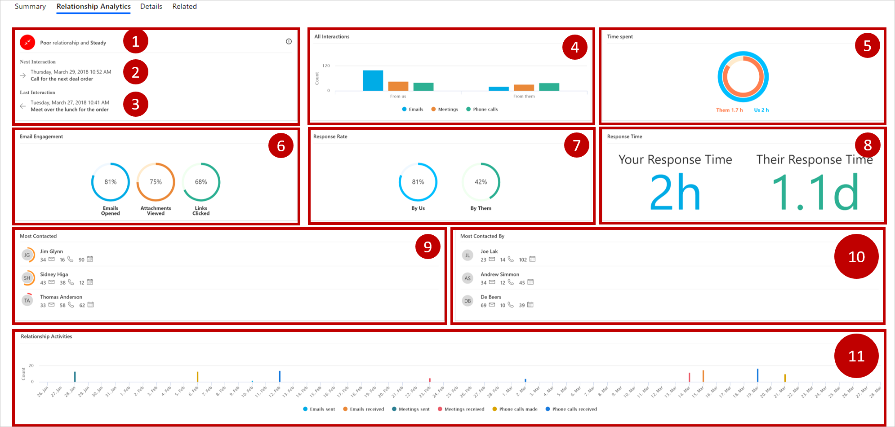

هل علاقتك جيدة بعملائك؟ قد تتفاجأ بإجابة عملائك عن هذا السؤال. في حين أنك قد تعتقد أن علاقتك بهم جيدة، قد يكون للعملاء رأي مختلف. قد يشعر أحد العملاء بأنك لا تتواصل معه إلا خلال دورات المبيعات، أو قد يرى أحد العملاء أنك لا تعاود الاتصال بالسرعة المطلوبة.
هذه الأمثلة ليست سوى عوامل قليلة يمكن أن يكون لها تأثير كبير على علاقتك بعميلك بصفة عامة.

تفحص "تحليلات العلاقة" في Dynamics 365 علاقتك الكاملة بعملائك. ولا تفحص فقط مدى تكرار تفاعلك مع عملائك، لكن أيضاً كيف يتفاعل عملاؤك معك. تستعرض "تحليلات العلاقة" كم الاتصالات، مثل عدد رسائل البريد الإلكتروني والمواعيد والمكالمات الهاتفية والأنشطة الأخرى التي تبدأها أنت وغيرك من أعضاء مؤسستك. بالإضافة إلى ذلك، فهي تفحص عوامل أخرى يمكن أن يكون لها تأثير ملموس على علاقة العميل، مثل مدى تكرار رده على اتصالاتك وحتى مدى سرعة رده.

تزودك "تحليلات العلاقة" بنظرة عامة على محفوظات النشاط، ومؤشرات الأداء الأساسية للعلاقة، ونقاط سلامة العلاقة، واتجاه سلامة العلاقة لجهة الاتصال، والفرصة، والعميل المتوقع، وسجلات الحسابات. يتم عرض مؤشرات الأداء الأساسية الأكثر أهمية، مثل الأنشطة السابقة والتالية، في طريقة عرض القائمة لكل نوع من أنواع السجلات هذه بحيث يمكنك الحصول على نظرة عامة وفرز القائمة حسبها.

> [!div class="mx-imgBorder"]
> 

باستخدام "تحليلات العلاقة"، يصبح موظفو المبيعات والمديرون في مؤسستك أكثر استعداداً للإجابة عن أسئلة مثل:

-   هل علاقتنا جيدة بالعميل؟

-   ما مقدار الوقت الذي قضيناه مع العميل؟

-   متى كانت آخر مرة اتصلنا فيها بالعميل؟

-   متى ستكون المرة القادمة التي سنتصل فيها بالعميل؟

-   كم عدد رسائل البريد الإلكتروني التي تبادلناها مع العميل والاجتماعات التي عقدناها معه؟

-   ما معدل استجابة العميل؟

-   ما عدد الأنشطة التي بدأها العميل؟

-   ما المدة التي يستغرقها الفريق للاستجابة للعميل؟

-   ما الفرص التي يجب أن أقضي وقتي في العمل عليها؟

## ‏‫البنية الأساسية لبرنامج ربط العمليات التجارية الخاصة بالعلاقة

أثناء العمل على الفرص، قد يكون من المفيد الحصول على نظرة عامة سريعة على مدى سلامة الفرص في البنية الأساسية لبرنامج ربط العمليات التجارية. تزودك طريقة عرض البنية الأساسية لبرنامج ربط العمليات التجارية الخاصة بالعلاقة بمخطط فقاعة لإطلاعك على نظرة عامة سريعة على مدى سلامة الفرص المقبلة وتاريخ إغلاقها والإيراد المقدر لها. يمكن الوصول إلى طريقة العرض من طريقة عرض قائمة **جدول الفرص**. يمكن الوصول إلى مخطط البنية الأساسية لبرنامج ربط العمليات التجارية الخاصة بالعلاقة من خلال قائمة بالمخططات المتاحة عند تحديد الزر **إظهار المخطط**.

يتم رسم كل فرصة مقبلة كفقاعة على مخطط البنية الأساسية لبرنامج ربط العمليات التجارية الخاصة بالعلاقة. يشير حجم كل فقاعة إلى الإيراد المقدر للفرصة. يتم رسم السلامة على المحور ص، بحيث تشير الفقاعة إلى قدر أكبر من السلامة عند رسمها في موضع أعلى. يتم رسم تاريخ الإغلاق المقدر على المحور س، بحيث يمكن أن تنتهي صلاحية الفرص على الجانب الأيمن من المخطط قريباً. وبالتالي، الفرص الأكثر أهمية هي في الفقاعات الكبيرة الموجودة بالقرب من الزاوية السفلية اليمنى، بينما الفرص الواعدة تكون بالقرب من الجزء العلوي من المخطط.

عندما تمرر مؤشر الماوس فوق فقاعة، سترى اسم الفرصة وغير ذلك من التفاصيل. يمكنك فتح الفرصة المقترنة بفقاعة عن طريق تحديد الفقاعة لفتحها.

يشير لون كل فقاعة إلى سلامة العلاقة:

-   يشير اللون الأخضر إلى علاقة جيدة.

-   يشير اللون الأصفر إلى علاقة مقبولة.

-   يشير اللون الأحمر إلى علاقة ضعيفة.

-   يشير اللون الرمادي إلى عدم احتساب النتائج أو عدم كفاية البيانات.

> [!div class="mx-imgBorder"]
> 

يعتمد مخطط البنية الأساسية لبرنامج ربط العمليات التجارية الخاصة بالعلاقة‬‬ على توفّر قيم متعددة لكل سجل فرصة، لكن في بعض الحالات، تكون هذه القيم غير متوفرة لبعض الفرص أو جميعها. قد يعود السبب إلى إغفال القيمة، أو قد يعود إلى عدم استخدام هذه الأعمدة في مؤسستك.

يقدّم المخطط القيم غير المتوفرة، كالآتي:

-   تظهر الفرص التي لا تتوفر لها قيمة لسلامة العلاقة باللون الرمادي والقيمة صفر.

    يتم رسم هذه الفرص في الجزء السفلي من المخطط.

-   لا يتم عرض الفرص التي يكون تاريخ إغلاقها المقدر في الماضي.

-   لا يتم عرض الفرص بدون تاريخ إغلاق مقدر.

-   الفرص بدون قيمة مقدرة للإيراد تعرض القيمة صفر.

    ويتم رسم هذه الفرص كفقاعات صغيرة.

عند عرض سجل لعميل أو فرصة، يمكنك مشاهدة التحليلات الكاملة للسجلات الفردية، بما في ذلك الرسوم البيانية ومؤشرات الأداء الأساسية، ومحفوظات التفاعل عبر البريد الإلكتروني، ومحفوظات النشاط بالكامل، وسلامة العلاقة.

> [!div class="mx-imgBorder"]
> 

1.  **سلامة العلاقة واتجاهها** - تعرض سلامة العلاقة مع العميل بصفة عامة ويشمل ذلك الاتجاه الأخير.

2.  **التفاعل التالي** - يعرض تاريخ ووقت النشاط التالي الذي تمت جدولته للسجل. إذا توفر لك حق الوصول إلى ذلك النشاط، فستشاهد أيضاً اسمه أو موضوعه. ولا يتم عرض التفاعلات التالية والأخيرة إلا لجداول الفرص والعملاء المتوقعين.

3.  **التفاعل الأخير** - يعرض تاريخ آخر نشاط أكملته للسجل ووقته. إذا توفر لك حق الوصول إلى ذلك النشاط، فستشاهد أيضاً اسمه أو موضوعه. ولا يتم عرض التفاعلات التالية والأخيرة إلا لجداول الفرص والعملاء المتوقعين.

4.  **جميع التفاعلات** - يعرض إجمالي عدد الأنشطة التي بدأها أعضاء فريقك والتي بدأها العميل. يتم تقسيم الأنشطة حسب النوع العام، مثل بريد إلكتروني واجتماعات ومكالمات هاتفية.

5.  **الوقت المنقضي** - يعرض المقدار النسبي للوقت المنقضي في العمل على أنشطة ذات صلة بالسجل، بما في ذلك فريقك والعميل. لكل نشاط اشترك فيه أكثر من عضو واحد في الفريق، يتم ضرب الوقت المنقضي في العمل على هذا النشاط في عدد أعضاء الفريق المتواجدين. مع ذلك، يتم احتساب الوقت الذي قضاه العميل مرة واحدة فقط، حتى إذا كان أكثر من عضو واحد من فريق العميل حاضراً.

6.  **‏‫مشاركة البريد الإلكتروني‬** - يلخص كيف تفاعل العميل مع البريد الإلكتروني الخاضع للمتابعة الذي أرسله فريقك إليه. لا يتم تضمين البريد الإلكتروني غير الخاضع للمراقبة، لذا، يجب تمكين ميزة مشاركة البريد الإلكتروني واستخدامها لمشاهدة أي معلومات في هذا القسم.

7.  **معدل الاستجابة** - يوفر تفاصيل حول نسبة الاستجابة حسب فريقك وفريقه.

8.  **وقت الاستجابة** - يوفر تفاصيل حول متوسط وقت الاستجابة من جانب فريقك وفريقه.

9.  **الأكثر اتصالاً** - يوفر إحصاءات حول العملاء الذين يتصل فريقك بهم مرات أكثر. قد تشمل جهات الاتصال هذه مستخدمي Dynamics 365 الذين يتعاملون مع العملاء كثيراً، حتى إذا لم يكونوا جزءاً من مستخدمي السجل.

10. **‏‫الأكثر اتصالاً بواسطة‬** - يوفر إحصاءات حول أعضاء فريقك الذين اتصلوا بالعملاء مرات أكثر. قد تشمل جهات الاتصال هذه العملاء الذين يتعاملون مع فريقك كثيراً، حتى إذا لم يكونوا جزءاً من مستخدمي السجل.

11. **أنشطة العلاقة** - يوفر نظرة تفصيلية على الأنشطة على مدار 90 يوماً، مقسمة حسب التاريخ ونوع النشاط، مثل رسائل البريد الإلكتروني المرسلة، ورسائل البريد الإلكتروني المستلمة، والاجتماعات المرسلة، والاجتماعات المستلمة، والمكالمات الهاتفية التي تم إجراؤها، والمكالمات الهاتفية المستلمة.

لمزيد من المعلومات، اطّلع على [كيف يتم حساب قيم "تحليلات العلاقة"](/dynamics365/ai/sales/relationship-analytics#how-relationship-analytics-values-are-calculated/?azure-portal=true).
