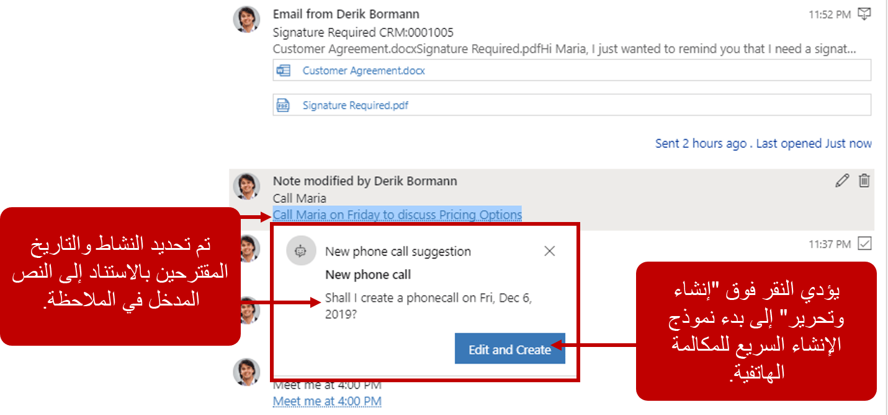
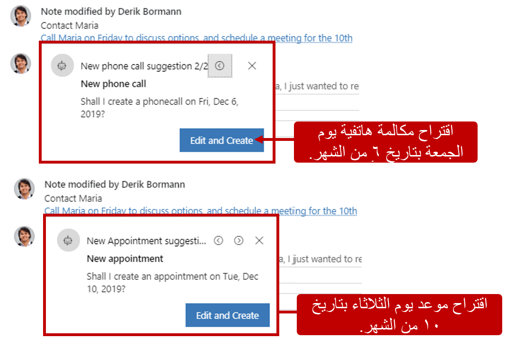
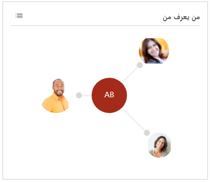
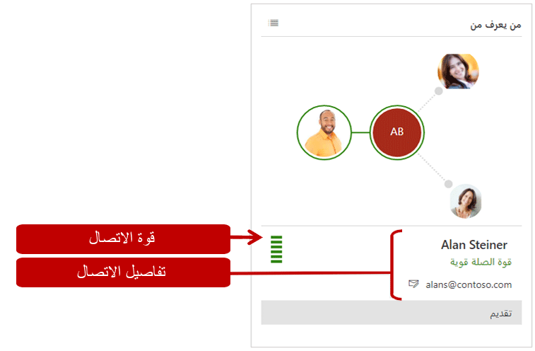
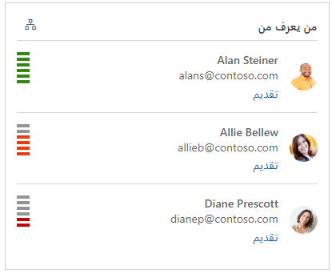
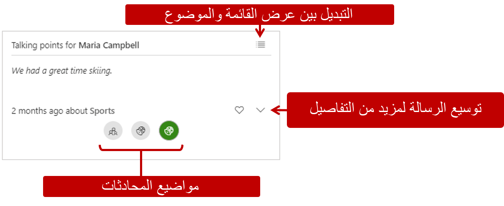
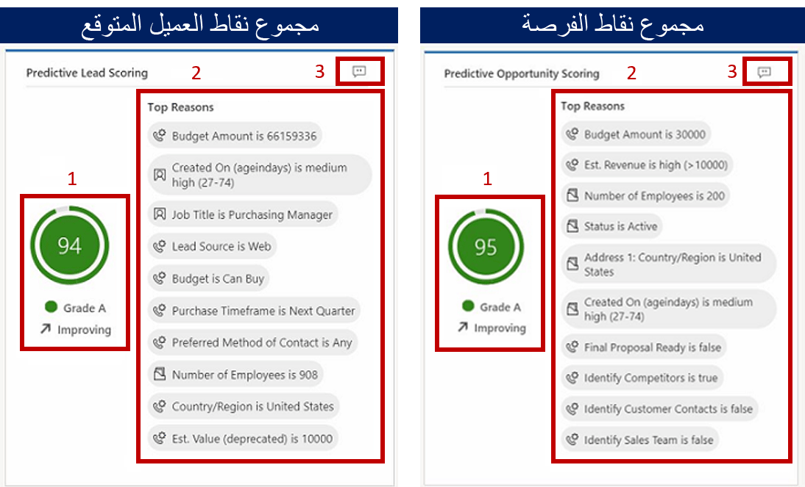

بالإضافة إلى إمكانات تحليلات العلاقة المتوفرة مع Dynamics 365 Sales Insights، فإنها تتضمن أيضًا العديد من ميزات الذكاء الاصطناعي الإضافية التي يمكن أن تساعد البائعين على المشاركة في تفاعلات أكثر شخصية وذات مغزى مع العملاء، فضلاً عن توفير الوقت لهم من خلال تقديم توصيات دقيقة ومساعدتهم على تركيز وقتهم والانتباه للحصول على أفضل فرصة للنجاح.

## تحليلات الملاحظات

يبحث البائعون دائمًا عن طرق لتوفير الوقت. تتمثل إحدى طرق توفير الوقت في استخدام عنصر تحكم المخطط الزمني المتوفر في الحسابات وجهات الاتصال والعملاء المتوقعين والفرص والحالات. يساعد عنصر تحكم المخطط الزمني البائعين على إدخال الملاحظات ذات الصلة بنشاطهم الحالي بسرعة. على سبيل المثال، أثناء الاجتماع مع عميلك، يطلب عقد اجتماع متابعة معك في غضون أيام قليلة. بدلاً من إدخال نشاط موعد في التطبيق، يمكنك إضافة ملاحظة تقول "الاجتماع مع ماريا في يوم الجمعة". تتيح لك هذه الخطوة السريعة الاستمرار في التواصل مع ماريا دون مقاطعة اجتماعك. في البداية، يؤدي إدخال الملاحظة إلى توفير الوقت؛ ومع ذلك، ففي مرحلة ما، من المحتمل أن تحتاج إلى إنشاء الاجتماع لضمان عدم نسيانه منك أو من ماريا.

تتيح لك ميزة تحليل ملاحظات في Sales Insights استخدام البيانات التي تم جمعها في ملاحظتك السريعة لإنشاء أنشطة متعلقة بالعميل، مما يوفر لك الوقت والجهد. تراقب ميزة تحليل الملاحظات النص الذي تقوم بإدخاله وتوفر اقتراحات ذكية للإجراءات، مثل إنشاء طلب اجتماع أو إضافة جهة اتصال من ملاحظة أدخلها العميل في المخطط الزمني.

عند حفظ ملاحظة، يتم تمييز نص الملاحظة وتسطيره. عند تحديد النص، يتم عرض الاقتراحات. قد تتضمن هذه الاقتراحات إنشاء أنشطة أو مهام أو جهات اتصال أو عقد اجتماع أو طلبات محتوى أو اكتشاف المشكلات.

على سبيل المثال، بالرجوع إلى السيناريو السابق حيث أدخلت ملاحظة لعقد اجتماع مع ماريا يوم الجمعة، ستكتشف ميزة تحليل الملاحظات مقدار الاحتمالية المتاح ويقوم بتمييز النص. بعد تحديد النص المميز، يتم تزويدك تلقائياً باقتراح لإنشاء موعد مع ماريا.

استنادًا إلى النص الذي تم إدخاله في الملاحظة، من الممكن أن تُنشئ ميزة تحليل الملاحظات اقتراحات متعددة. عندما تقترن عدة اقتراحات بملاحظة، سيعرض Dynamics 365 اقتراحات متعددة. ستتمكن من التنقل بين الاقتراحات وتحديد الإجراء الذي يجب اتخاذه.

على سبيل المثال، لقد قمت بإنشاء ملاحظة للاتصال بعميلك بخصوص الأسعار وجدولة اجتماع لإجراء المزيد من المناقشات حول الصفقة. تعرض الملاحظة اقتراحات لإنشاء موعد وجدولة مكالمة هاتفية.

## قدّم نفسك للعميل المتوقع

وبصفتك أحد البائعين، ستواجه العديد من الحالات التي تحتاج فيها إلى التعامل مع العملاء المتوقعين الذين لم تقابلهم من قبل. إذا لم يكن لديك علاقة سابقة مع شخص ما، فقد يكون من الصعب تحويل هذا التفاعل إلى نتيجة إيجابية. للحصول على مساعدة في هذه الحالات، تحتوي Sales Insights على ميزة **من يعرف من**، حيث تعرّف الأشخاص الموجودين في مؤسستك الذين قد يعرفون هذا العميل المتوقع وتوفر لك معلومات الاتصال التابعة لهم. تتيح لك هذه الميزة التواصل مع زملائك للحصول على تعريف. إن وجود اتصال مشترك يعرّفك على عميل متوقع يزيد بشكل كبير من فرص الحصول على نتيجة إيجابية أثناء التفاعل.

تحسب ميزة **من يعرف من** العلاقات استنادًا إلى أنواع الاتصالات والتعاون للمستخدمين في بيئة Microsoft Exchange. تتوفر النتائج على نموذجي جهات الاتصال والعملاء المتوقعين. عند فتح نموذج عميل متوقع أو جهة اتصال وتحديد طريقة العرض "Sales Insights"، يتم عرض الإطار المتجانب **من يعرف من**.

من داخل إطار المتجانب، يمكنك تحديد كل شخص تم تعريفه على أنه اتصال. سيزودك التطبيق بتفاصيل إضافية عن هذا الاتصال، مثل معلومات جهة الاتصال ومدى قوة اتصالهم بالعميل المتوقع أو جهة الاتصال. إذا كنت تريد مقدمة، يمكنك تحديد **الحصول على مقدمة**، حيث سيفتح بريدًا إلكترونيًا يتضمن طلب افتراضي يتم تقديمه إلى العميل المتوقع. يتضمن الإطار المتجانب **من يعرف من** أيضًا طريقة عرض القائمة التي تتيح لك رؤية الشخص والتعرف على قوة الاتصال بتنسيق قائمة حقيقي. يمكن تسهيل المقدمات مباشرة من القائمة.

## نقاط الحوار

وبصفتك أحد البائعين، ستتفاعل مع العديد من العملاء بشكل منتظم. قد يكون من الصعب تذكر التفاصيل المتعلقة بكل منهم، مثل الرياضات المفضلة أو الألعاب التي يشاهدونها أو الإجازات التي حصلوا عليها أو الأحداث التي حضروها. إن الحصول على هذه الأنواع من التفاصيل المتوفرة للتذكر عند الحاجة يمكن أن يكون مفيدًا للغاية أثناء التحدث مع العملاء. وغالبًا ما يساعد الحديث عن هذه التفاصيل في منح عميلك شعورًا بالاسترخاء وبراحة أكبر مما كان عليه عندما بدأت مناقشة الأعمال على الفور. يقدّر العملاء أيضًا أنك قد قضيت وقتًا في معرفة ما يستمتعون به وما يهتمون به.

توفر نقاط الحوار في Sales Insights آلية لتحديد بادئات المحادثة المحتملة تلقائياً من محادثات البريد الإلكتروني.
يمكن أن تتضمن بادئات المحادثة موضوعات متعلقة بالرياضة والعطلات والأسرة والترفيه. تُعرَض هذه الرؤى مباشرة من صفحة جهة الاتصال.

على سبيل المثال، لقد تلقيت بريدًا إلكترونيًا يتحدث فيه أحد العملاء عن الحصول على إجازة مؤخرًا حيث استمتع فيها بالتزلج. عند تحليل البريد الإلكتروني، سيتم تصنيفه تلقائياً إلى "ألعاب رياضية". في لوحة النقاط الحوار، سيظهر رمز رياضي. عند تلقي نقاط حوار من مواضيع مختلفة، يمكنك تحديد الموضوع الذي تريد استخدامه. يساعدك هذا الأسلوب على بدء محادثة مع عميلك مع التركيز على مجال اهتمامه. يمكنك الاطلاع على الرسالة الكاملة المتعلقة بالموضوع من خلال توسيع الرسالة.

## نقاط العميل المتوقع والفرصة التنبؤية

في هذا السوق شديد التنافس، يتعين عليك قضاء بعض الوقت في البحث عن عملاء متوقعين وفرص قيّمة لتحقيق أهداف مبيعاتك. من الأهمية بمكان أن يتم تحديدها وترتيبها حسب الأولوية بناءً على مقدار فرصك في النجاح. توفر النقاط التنبؤية للعميل المتوقع والفرصة من Dynamics 365 Sales Insights نموذج تسجيل نقاط لإنشاء نقاط للسجلات المتوفرة في البنية الأساسية لبرنامج ربط العمليات التجارية. يخصص النموذج درجة بين 0 إلى 100 بناءً على الإشارات الواردة من العملاء المتوقعين والفرص ومن الكيانات ذات الصلة مثل جهات الاتصال والحسابات. باستخدام هذه النقاط، يمكنك تحديد العملاء المحتملين الذين لديهم فرص أكبر للتحول إلى فرص وترتيب أولوياتهم.

على سبيل المثال، لديك عميلان متوقعان، العميل أ والعميل ب، ضمن البنية الأساسية لبرنامج ربط العمليات التجارية. سيراجع نموذج تسجيل النقاط العوامل الخاصة بكل عميل متوقع ويضع 80 نقطة للعميل المتوقع أ و50 نقطة للعميل المتوقع ب. وبالنظر إلى النتيجة، يمكنك التنبؤ بأن العميل المتوقع أ يحظى باحتمالية أفضل للتحول إلى فرصة. يمكنك أيضًا إجراء المزيد من التحليل لمعرفة سبب انخفاض درجة العميل المتوقع ب من خلال الاطلاع على أهم الأسباب التي تؤثر على النقاط ثم تحديد ما إذا كنت تريد تحسين هذه النقاط أم لا. ويتم تطبيق نفس المبدأ أيضًا على الفرص.

بعد تكوين النقاط وتطبيقها على السجلات الموجودة في مؤسستك، يمكنك الاطلاع عليها من طرق عرض **العملاء المتوقعين الذي تم تطبيق النقاط عليهم** و **الفرص المفتوحة التي تم تطبيق النقاط عليها**. من خلال تحليل المعلمات الرئيسية، يمكنك تحديد العملاء المتوقعين الذين لديهم أعلى احتمالية ليتم تحويلهم إلى فرص مع ترتيب أولوياتهم.

يتضمن العرض الذي تم تطبيق النقاط عليه المقاييس التالية:

-   **نقاط العميل المتوقع/الفرصة** - قيمة رقمية على مقياس من 1 إلى 100 تشير إلى مدى احتمالية تحويل العميل المتوقع إلى فرصة. عند تبلغ النقاط العدد 100، فإنها تشير إلى أعلى احتمالية للتحول إلى فرصة.

-   **درجة العميل المتوقع/الفرصة** - تعمل على تحديد درجات العميل المتوقع وتجميعها في فئات مختلفة مرمزة بألوان.

    -   **الدرجة أ (أخضر)** - أعلى احتمالية للتحول إلى فرصة.

    -   **الدرجة ب (أرجواني)** - ثاني أعلى احتمالية للتحول إلى فرصة.

    -   **الدرجة جـ (أصفر)** - ثاني أقل احتمالية للتحول إلى فرصة.

    -   **الدرجة د (أحمر)** - أقل احتمالية للتحول إلى فرصة.

    يمكن لمسؤولي النظام تحديد نطاقات نقاط العميل المتوقع الفعلية لتحديد الدرجة، وذلك بناءً على متطلبات مؤسستك.

-   **اتجاه نقاط العميل المتوقع/الفرصة** - تحدد الاتجاه الذي يتجه إليه العميل المتوقع مثل:

    -   **تحسين** (سهم لأعلى)

    -   **انخفاض** (سهم لأسفل)

    -   **ثابت** (سهم لليمين)

    -   **لا توجد معلومات كافية**

يتم عرض هذه الاتجاهات من خلال مقارنة النقاط الحالية مع النقاط السابقة. على سبيل المثال، كانت النقاط 65 وقد انخفضت الآن إلى
45. يتم عرض سهم لأسفل في عمود "اتجاه النقاط"، حيث يحدد أن السجل يفتقد إلى التفاعل ويحتاج إلى بعض الإجراءات من جانبك لتحسين النقاط.

عندما تفتح عميلاً متوقعًا أو فرصة، يساعدك عنصر واجهة مستخدم النقاط على رؤية أهم العناصر التي تؤثر على النقاط. ومصدر هذه الأسباب هو سمات العميل المتوقع والفرصة وسمات الجداول ذات الصلة.

1.  **المعلومات الأساسية** - تعرض المعلومات الأساسية لسجل مثل النقطة والدرجة واتجاه النقاط. يساعدك هذا الخيار على تجنب العودة إلى طريقة عرض **النقاط التي حصلت عليها** لعرض المعلومات الأساسية.

2.  **أهم الأسباب** - تعرض قائمة الأسباب التي تؤثر على النقاط. يمكنك كذلك اتباع الإجراءات اللازمة لتحسين النقاط، مثل إعداد الاجتماعات وعمليات المتابعة.

3.  **التعليقات:** تعرض التعليقات التي قام المستخدم بتوفيرها إلى السجل. لتقديم تعليقات، حدد أيقونة "دردشة" وأدخل النقاط والتعليقات المتوقعة. لحفظ التعليقات، حدد **إرسال**.
