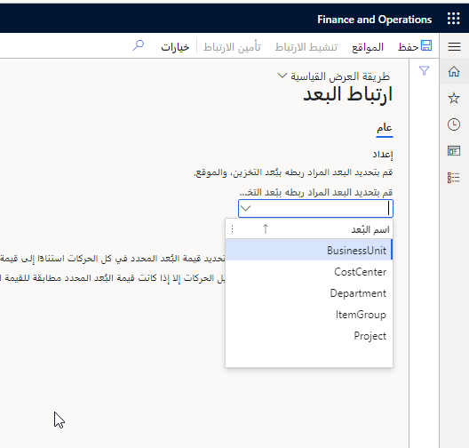

يمكن للشركات ربط البيانات المالية ذات الصلة بحركات المخزون التي يتم الحصول عليها في كل موقع في بيئة الإنتاج متعددة المواقع. يؤدي هذا الارتباط إلى:

-   بُعد مالي مقترن ببُعد مخزون الموقع.

-   قيمة بُعد مالي مقترنة بكل موقع.

تفترض روابط البُعد المالي أن الإيرادات المعنية تعزى مباشرةً إلى موقع التسليم. عندما يكون هذا هو الحال، تسمح هذه الميزة للشركات بتتبع أرقام الأرباح والخسائر مباشرةً من موقع التشغيل.

**إعداد > إدارة المخزون > ترحيل > ارتباط البُعد**

 

يجب تنشيط الارتباط بمجرد ربط الأبعاد المالية بحركات المخزون في أحد المواقع.

إذا قمت بتحديد زر **تنشيط الارتباط**، سيتم تحديد قيمة البُعد المحدد على كافة الحركات استناداً إلى قيمة بُعد تخزين الموقع. ومع ذلك، قد يستمر ترحيل الحركات بغض النظر عن قيمة البُعد.

ينتج عن تنشيط ارتباط البُعد المالي حدوث الحالات التالية:

-   عند إنشاء حركات جديدة تحمل كل من أبعاد المخزون والأبعاد المالية، يتم تعيين قيمة البُعد الخاصة بالبُعد المالي المرتبط بالموقع.

-   يمكن ترحيل الحركات التي تحمل أبعاد المخزون والأبعاد المالية، على الرغم من أن قيمة البُعد المالي المرتبطة لا تتطابق مع القيمة المحددة للموقع.

-   يمكن تغيير قيمة البُعد المالي المرتبط بالحركات المفتوحة التي تحمل أبعاد المخزون والأبعاد المالية.

إذا قمت بتحديد زر **تأمين الارتباط**، يمكن ترحيل الحركات فقط إذا كانت قيمة البُعد المحدد تطابق القيمة المقترنة ببُعد تخزين الموقع.
وبالتالي، يجب تحديث كافة الحركات المفتوحة قبل تأمين ارتباط البُعد.

يؤدي تأمين ارتباط البُعد المالي إلى حدوث الحالات التالية:

-   يتم تعيين قيمة بُعد مالي لحركات المخزون الجديدة التي تحمل أبعاد المخزون والأبعاد المالية على حد سواء استناداً إلى القيمة المحددة للموقع.

-   لا يمكنك ترحيل المعاملات التي تحمل أبعاد المخزون والأبعاد المالية إلا عندما تكون قيمة البُعد المالي المرتبطة مطابقة للقيمة المحددة للموقع.

-   ولا يمكنك تغيير قيمة البُعد المالي المتصل بالمعاملات التي تحمل أبعاد المخزون والأبعاد المالية على حد سواء.

-   لا يمكنك تحرير قيمة البُعد المالي المقترنة بموقع. تتمثل الشروط المسبقة لتأمين ارتباط‬ البُعد المالي في: وجوب إنشاء ارتباط البُعد المالي مع بُعد مخزون الموقع.
