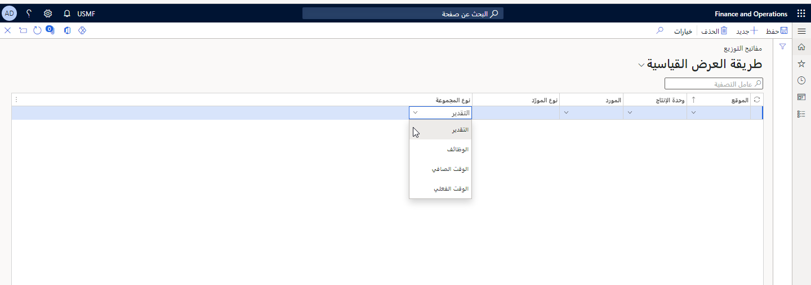

إذا بدأ موظف أكثر من وظيفة واحدة في صفحة **تسجيل الوظائف**، فإنه يُشار إليها باسم مجموعة. تُستخدم مفاتيح التوزيع لتحديد كيفية عمل تسجيلات الوظائف المجمعة في منطقة معينة.

يمكن توزيع الوقت المستغرق في الوظائف المجمعة للوظائف الفردية بطرق مختلفة باستخدام مفاتيح التوزيع هذه.

تتكون مفاتيح التوزيع من المكونات التالية:

-   المواقع

-   وحدات الإنتاج

-   الموارد

-   أنواع الموارد

-   نوع المجموعة

إذا قمت بتجميع الوظائف، فيجب تحديد إجمالي الوقت المسجل لجميع الوظائف التي سيتم توزيعها لكل وظيفة.

بالإضافة إلى ذلك، إذا قمت بتجميع الوظائف، فيجب تحديد كيفية توزيع إجمالي الوقت المسجل لجميع الوظائف لكل وظيفة. يمكنك تحديد التوزيع عن طريق تحديد أحد الخيارات التالية في الحقل **نوع المجموعة** في الصفحة **مفاتيح التوزيع**:

-   **التقدير** - يتم تقسيم الوقت بين الوظائف بناءً على الوقت المقدر للوظائف.

-   **الوظائف** - يتم تقسيم الوقت وفقاً لإجمالي الوظائف المجمعة ومقدار الوقت المستغرق في إنهاء جميع الوظائف.

-   **الوقت الصافي** - يتم تقسيم الوقت بالتساوي بين الوظائف الموجودة في المجموعة في أي وقت.

-   **الوقت الحقيقي** - يتم توزيع وقت الوظيفة الفعلي. يمكن حساب التكلفة على أساس تكلفة الرواتب الفعلية.

**التحكم بالإنتاج > إعداد > الإنتاج > مفاتيح التوزيع**

