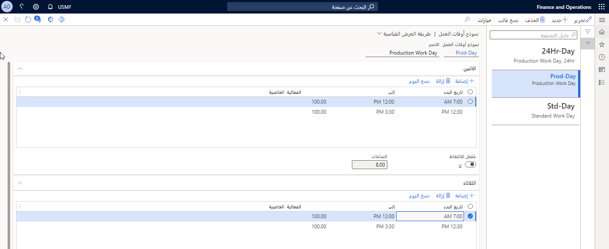

تتمثل الخطوة الأولى في عملية إعداد الموارد والتقويمات للاستخدام في الوحدة النمطية لمراقبة الإنتاج في إعداد قوالب أوقات العمل. يتم تحديد قوالب أوقات العمل في صفحة **قوالب أوقات العمل**، والتي يتم تحديدها باختيار **إدارة المؤسسة > إعداد > تقويمات > قوالب أوقات العمل**.

يمكنك استخدام هذه الصفحة لإعداد قوالب تعكس أوقات العمل العادية في شركتك. يمكن أن يكون هذا تسلسل إنتاج على مدار 24 ساعة والذي تكون الموارد فيه عبارة عن أجهزة، أو يمكن أن يكون أسبوع عمل من 9 إلى 5 لقسم الشراء، حيث تكون الموارد عبارة عن موظفين فرديين.

**التحكم في الإنتاج > الإعداد > الجدولة > قوالب أوقات العمل**

 

ستساعدك القوالب على إنشاء تقويمات أوقات العمل وإدارتها بما يتناسب مع مواردك. تستخدم تقويمات أوقات العمل أوقات العمل التي تحددها في هذا القالب.

على سبيل المثال، قد تساوي فترة ما الوقت الذي يبدأ فيه يوم العمل رسمياً وحتى استراحة الغداء، بينما قد تكون الفترة الأخرى من نهاية استراحة الغداء إلى النهاية الرسمية ليوم العمل. يتم إكمال هذا لكل يوم يعمل فيه الكيان القانوني. ثم يتم نسخ الساعات المجدولة إلى تقويم أوقات العمل.

حدد ساعات التشغيل العادية أو الأكثر استخداماً للعملية. يمكنك استخدام الحقل **من** لتحديد وقت بدء فترة العمل والحقل **إلى** لتحديد وقت انتهاء فترة العمل. يمكنك أيضاً استخدام حقلي **الفعالية** وكذلك **الخاصية** لتعريف استخدام كل فترة من الفترات الزمنية التي قمت بإعدادها.

## الفعالية

يمكنك استخدام هذا الحقل لتحديد نسبة الفعالية التي سيتم استخدامها في جدولة الفترة المعنية، حيث:

*وقت الجدولة= الوقت * 100/النسبة المئوية للفعالية.*

على سبيل المثال، إذا كانت وردية المساء تعمل بمستوى كفاءة 75 في المائة (مقابل الوردية الصباحية، التي تعمل بنسبة 90 في المائة)، فيمكنك ملاحظة ذلك في حقل **الفعالية**. وتأخذ تأثيرات هذه المعدلات في الاعتبار في القدرة المتاحة على الموارد وفي جميع أنحاء النظام.

## الخصائص

يمكنك استخدام هذا الحقل لتعيين خصائص إلى القوالب الخاصة بك.
تستخدم الخصائص في جدولة وهيكلة الإنتاج. الفكرة هي أن المنتجات التي تشترك في نفس الخصائص يمكن إنتاجها في وقت واحد. 

يتم استخدام الخصائص بواسطة الموارد للمساعدة على تحسين جداول الإنتاج ويتم إعدادها في صفحة **الخصائص**. من المفيد إعداد الخصائص في التقويمات الخاصة بك لاستخدامها في إعداد الخصائص على الموارد.

على سبيل المثال، إذا قمت بتعيين خاصية اللون الأحمر إلى جهاز الطلاء في يوم الإثنين، عند تشغيل الجدولة، سيقوم هذا المورد بطلاء الأصناف باللون الأحمر في أيام الإثنين فقط.

خصائص المورد غير مطلوبة عند إعداد تقويمات أوقات العمل.
