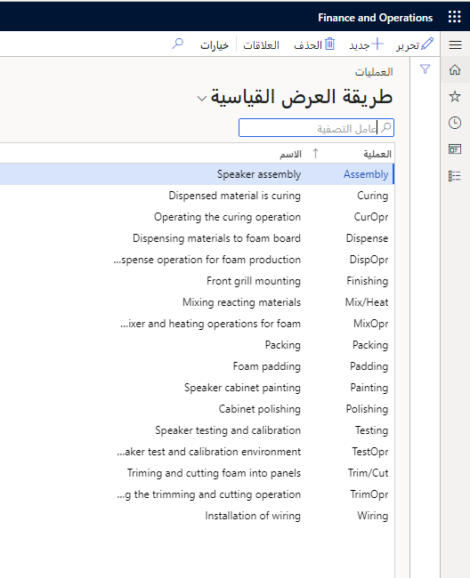

لإنشاء مسار يستند إلى سلسلة من العمليات المتسلسلة، يجب توفر العمليات نفسها. العملية هي مهمة أو عملية مرتبطة بإنتاج أحد الأصناف. يتضمن التفاصيل الضرورية لجدول إنتاج فعال.

يتم إعداد العمليات في تسلسل لإنشاء أمر وسياق مناسبين لعملية الإنتاج الإجمالية للصنف. إذا كنت تعمل أيضاً مع المسارات، فيجب تحديد العمليات لكل مسار إنتاج تقوم بإعداده.

|*التحكم في الإنتاج > الإعداد > المسارات > العمليات*|.

 

يتم تعريف العمليات على أنها سلسلة من المهام المنفصلة التي يجب تنفيذها بالتسلسل لإنتاج أحد الأصناف. يجب إعداد العمليات لكل مسار تقوم بإنشائه.

نظراً لأن العمليات المتعددة المرتبطة بالتسلسل تشكل شبكة تشغيل، وتشكل شبكات التشغيل المتعددة مساراً للإنتاج، فإن جميع البيانات المحددة للعملية ستكون مرتبطة تلقائياً بالمسار.

قبل تعيين العمليات، يجب أن تعرف:

-   ما المهمة أو النشاط الذي يجب إكماله

-   ترتيب العمليات وأولوية العملية

-   كم وما هي الموارد اللازمة لأداء العملية، وما هي الموارد التي يجب أن تكون قادرة على القيام بذلك

يجب عليك إنشاء قدرات وإنشاء موارد ومجموعات موارد أيضاً قبل إعداد العمليات لأن العمليات مرتبطة ارتباطاً وثيقاً بوجود الموارد.

## ‏‏علاقات العملية

تعمل علاقات العمليات على تبسيط وتسهيل مهمة إنشاء البيانات الأساسية للعمليات والحفاظ عليها. يتم استخدامها للتحكم في العملية المخصصة لمسار أو صنف معين.

تشمل الخصائص الرئيسية لعلاقات العملية ما يلي:

-   تحتوي كل علاقة على المعلومات التي تستخدمها أوامر الإنتاج عند إنشائها أو تحديثها. يتضمن ذلك متطلبات المورد والمسار وحساب الاستهلاك وفئات التكلفة والقياس والأوقات وكمية التداخل التي تنطبق على الأمر.

    -   إذا كانت المعلومات التي تنطبق على العملية عامة وتنطبق على جميع الأصناف، فيجب إنشاء علاقة واحدة فقط للعملية.

    -   إذا كان الصنف أو المسار يحتوي على محددات معينة لعملية تنحرف عن المحددات القياسية لذلك المسار، فسيتم وضع العلاقات الفردية في الاعتبار (يتم استخدام علاقات الجدول/المجموعة). عند إنشاء أمر الإنتاج، يتم نسخ المعلومات من العلاقة المحددة المعنية إلى مسار الإنتاج.

-   يقتصر استخدام علاقة العملية على الطريقة التي يتم بها ربطها بالأصناف والمسارات. يتم إرفاق كل علاقة بصنف أو مجموعة أصناف أو كافة الأصناف. في الوقت نفسه، يتم إرفاق كل علاقة إما بمسار أو بجميع المسارات. هذا يعني أن عملية واحدة قد تتضمن معلومات مختلفة عن الأوقات، وفئات التكلفة، والخصائص، وما إلى ذلك، المحددة في علاقات منفصلة. لذلك، يمكن استخدام العملية نفسها في عدة مسارات من خلال إنشاء علاقة لكل مسار.

لإعداد وتحرير قيم العملية المقترنة بالأصناف والمسارات، حدد الزر **علاقة الصنف/علاقة المسار** في صفحة **العمليات**. الحقول الموجودة في مجموعة حقول **حساب الاستهلاك** في علامة التبويب **الإعداد** هي:

-   **المعادلة** - تحديد كيفية حساب وقت التشغيل للعملية. 

-   **العامل** - إذا تم تحديد إمكانية استخدام معادلة مستخدم، يمكن أن يحتوي هذا الحقل على قيمة تستند إلى العملية. عادةً، يحتوي الحقل على عدد وحدات القدرة للمورد الحالي لاستخدامها في إنتاج أحد مكونات الصنف المنتهي.

-   **مورد التكلفة** - يمكنك استخدام هذا الحقل لفئات التكلفة الافتراضية من مورد التكلفة إلى فئات تكلفة علاقة العملية. يمكن أن يستند تقدير المسار إلى مورد تكلفة محدد.

فيما يلي مثال على كيفية حساب وقت التشغيل على أساس قدرة المورد:

يتم استخدام آلة ذات 1,000 دورة في الساعة لأداء العملية، حيث يتم الانتهاء من قطعتين من الصنف المنتهي في كل دورة، فإن إنتاج الأصناف المنتهية في الساعة سيكون 2,000 قطعة. يمكنك تحديد 1,000 لقدرة المورد لكل ساعة، وتعيين عامل المعادلة للعملية في المسار إلى 0.5 (P). يقدم هذا الحساب التالي: *كمية العملية لكل ساعة = 1,000 (K) / 0.5 (P) = 2,000 قطعة.*

يتم وصف الحقول الموجودة في مجموعة حقول **المسار** في علامة التبويب **عام** في الصفحة **علاقة العملية** أدناه:

-   **فئة الإعداد** - إعداد الموارد. يمكنك تحديد سعر تكلفة لفئة الإعداد لاستخدامها عند إجراء تقدير تكلفة لأمر إنتاج. تتم إدارة فئات التكلفة في صفحة **فئات التكلفة**. يتم احتساب التكلفة على النحو التالي: وقت الإعداد * الساعات/الوقت * تحميل * كمية الموارد * سعر التكلفة.

    يتم حساب سعر المبيعات لوقت الإعداد من خلال مجموعة التكلفة من فئة التكلفة (فئة الإعداد). يمكن أن تحتوي كل مجموعة تكلفة على إعداد واحد أو أكثر من إعدادات الربح والنسب المئوية المقابلة للربح.

    عند إجراء تقدير لتكلفة الإنتاج، يمكنك تحديد إعداد الربح، وبالتالي النسبة المئوية للربح التي تريد استخدامها عند حساب سعر المبيعات. تتم إدارة مجموعة التكلفة في صفحة **مجموعات التكلفة**.

-   **فئة وقت التشغيل** - تشير إلى فئة وقت التشغيل التي سيتم استخدامها عند تشغيل العملية. تتم إدارة فئات التكلفة في صفحة **فئات التكلفة**. يتم احتساب التكلفة على النحو التالي: الكمية * تراكمية * (وقت التشغيل/كمية العملية) * الساعات/الوقت * التحميل * كمية الموارد * سعر التكلفة.

    يتم حساب سعر المبيعات لوقت المشغل من خلال مجموعة التكلفة من صفحة **مجموعات التكلفة**.

-   **فئة الكمية** - استخدم هذا الحقل لتحديد سعر التكلفة الذي يتم استخدامه عند إجراء تقدير التكلفة لأمر الإنتاج. يتم احتساب التكلفة على النحو التالي: كمية * تراكمية * سعر التكلفة.

    يتم حساب سعر المبيعات لفئة الكمية من خلال مجموعة التكلفة. يتم ملء صفحة **مسار الإنتاج** تلقائياً بفئة الكمية المعطاة في صفحة **العمليات** عند تحديد إحدى العمليات. ومع ذلك، يمكن تغيير فئة الكمية للعملية الحالية في مسار الإنتاج.

-   **وقت الانتظار قبل** - وقت الانتظار قبل بدء العملية. يجب أن يكون وقت الانتظار موجباً. يمكنك إعداد الحقل في مجموعة المسارات، حيث تحدد إذا ما تمت جدولة كان وقت الانتظار وأي تقويم يتم استخدامه. يمكنك استخدام وقت الانتظار، على سبيل المثال، مع عمل المورد.

-   **وقت الإعداد** - وقت الإعداد، الذي يجب أن يكون قيمة موجبة، هو الوقت الثابت الذي يستغرقه إعداد أحد الموارد. يتم جدولة الوقت وفقاً للتقويم الخاص بمورد العمليات ويكون مستقلاً عن كمية الإنتاج. فيما يتعلق بالجدولة، يتم أيضاً تسجيل القدرة الإنتاجية للوقت في مورد العمليات. يتم ملء وقت الإعداد تلقائياً بوقت الإعداد المحدد لمسار العملية المختار.

-   **وقت التشغيل** - الوقت المطلوب لإنتاج كمية العملية. إذا لم يتم تحديد عامل لعلاقة العملية أو المورد، يتم التعبير عن وقت التشغيل بالساعات مع رقمين عشريين. إذا تم تحديد قيمة في حقل **الساعات/الوقت** لعلاقة العملية، فستتجاوز هذه القيمة قيمة الساعات/الوقت للمورد. يجب أن تكون كمية العملية قيمة موجبة. للحصول على وصف للتحويل إلى فترات زمنية أخرى، راجع وصف الحقل **الساعات/الوقت**. تحدد صفحة **مجموعات المسار** الخاصة بالعملية كيفية جدولة الوقت. يحسب النظام الوقت على النحو التالي: وقت التشغيل * (تحميل) * (1 + تراكمية) * الكمية / كمية العملية.
    
    إذا حددت **القدرة** في حقل **المعادلة** لمسار الإنتاج، يتم دائماً تعيين قيمة وقت التشغيل على **1**، وكمية العملية. يتم حساب القيمة بناءً على العامل، مع عدد وحدات القدرة التي حددتها ضمن القدرة للمورد الحالي.

-   **كمية العملية** - الكمية التي يمكن إنتاجها في وقت التشغيل المحدد.

-   **وقت الانتقال** - وقت الانتقال لنقل الأصناف بين موردي العمليات أو من العملية الأخيرة إلى المخزون. تعتمد كيفية استخدام وقت العبور على كيفية إعداد مجموعة مسار العملية. يجب أن يكون وقت الانتقال ذا قيمة موجبة.

-   **أوقات الانتظار بعد** - وقت الانتظار بعد الوقت الذي يجب أن تنتظر فيه الأصناف بعد انتهاء العملية وقبل أن تبدأ العملية التالية. يجب أن تكون القيمة في حقل **وقت الانتظار** موجبة. تمت جدولة الحقل وفقاً لإعداد مجموعة المسار في تقويم **مواعيد العمل** ويمكن استخدام إما التقويم الميلادي أو تقويم وقت العمل الحالي. يمكنك استخدام الحقل، على سبيل المثال، للإشارة إلى تجفيف الأصناف قبل بدء العملية التالية.

-   **الساعات/الوقت** - عامل التحويل لتلك الأوقات المحددة لعملية التحويل إلى ساعات بكسر عشري.
    يستخدم التحويل المعادلة التالية: ساعات مساوية لساعات التشغيل * ساعات/وقت.
    فيما يلي مثال على تحويل الساعات إلى ساعات بكسرين عشريين. وقت العملية 0.50 (نصف ساعة) وقيمة الساعات/الوقت هي 10000. يتم حساب الوقت على النحو التالي: 0.50 * 10,000 = 5,000 ساعة. إذا كان وقت العملية بالدقائق، فسيتم تعيين قيمة الساعات/الوقت على 0.0167. بالنسبة لوقت العملية الذي يبلغ 30 دقيقة، على سبيل المثال، يصبح ذلك الوقت 0.50 ساعة عند تطبيق عامل التحويل. حساب الوقت: 30.00 * 0.0167 = 0.50 ساعة.

-   **دُفعة النقل** - الكمية التي يمكن نقلها بين موارد العمليات المتسلسلة.

تحدد متطلبات الموارد المتطلبات التي يجب أن تفي بها الموارد لتخصيصها للعملية الحالية.

يتم تحديد متطلبات العملية لأحد الموارد في علامة التبويب **متطلبات المورد** الموضحة في وحدة سابقة.

تعتبر الموارد التي تتطابق مع متطلبات عملية ما، لتاريخ معين، موارد قابلة للتطبيق. يجب أن يفي المورد بجميع متطلبات الموارد حتى تكون العملية قابلة للتطبيق.
