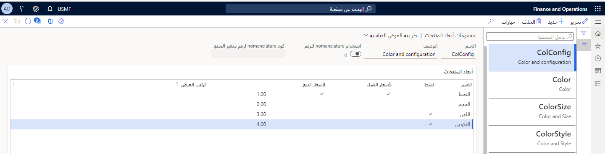

تتيح أبعاد المنتج للمستخدم إمكانية تحديد قيم اللون والحجم والتكوين الخاصة بالمنتج. يتم تحديد متطلبات أبعاد المنتج لأصل المنتج، بينما يتم تحديد متطلبات أبعاد التخزين والتعقب للمنتجات التي تم إصدارها.

أبعاد المنتج هي الخصائص التي تعرف متغير المنتج. يمكنك استخدام مجموعات من أبعاد المنتج لتحديد متغيرات المنتج. حدد بعد منتج واحد على الأقل لأصل منتج لإنشاء متغير منتج. متغيرات المنتج هي إصدار Supply Chain Management لمجموعة أبعاد الصنف، أو مجموعات فريدة للون والحجم والتكوين.

تحدد مجموعة أبعاد المنتج ما إذا كان بُعد المنتج نشطاً أم لا، بالإضافة إلى ما إذا كان سيتم استخدامها في البحث عن السعر للاتفاقيات التجارية أم لا. يتم تعيين مجموعة أبعاد المنتج مرة واحدة عند إنشاء أصل المنتج ولا يمكن إعادة تعيينه.
