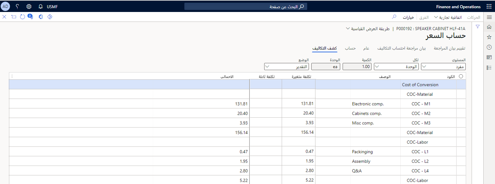

تتضمن تكاليف الإنتاج تحليل التكاليف الفعلية مقابل التكاليف المقدرة لأوامر الإنتاج، وتحليل تكاليف أنشطة الإنتاج الحالية.

عند تحليل تكاليف الإنتاج، يمكنك القيام بما يلي:

-   حساب التكاليف المقدرة لأمر إنتاج.

-   حساب سعر مبيعات مقترح بناءً على تكاليف أمر الإنتاج المقدرة.

-   تحليل التكاليف الفعلية مقابل التكاليف المقدرة لأمر إنتاج.

-   تحليل التكاليف التي تم الإبلاغ عنها لأوامر الإنتاج الحالية.

-   تحليل فروق الإنتاج لأمر إنتاج مكتمل لبند تكلفة قياسية.

-   تحديد مصادر فروق الإنتاج.

-   اقترح تكاليف معيارية جديدة على أساس الفروق التاريخية.

-   تحليل الفروق لفترات زمنية محددة.

يتم ترحيل تكاليف الإنتاج في كل مرة يتم فيها ترحيل دفتر يومية. تتراكم تكاليف الإنتاج في حسابي **الأصناف في الإنتاج** و **العمل قيد المعالجة** حتى يكتمل أمر الإنتاج.

أوامر الإنتاج غير المنتهية لها تكاليف إنتاج مقدرة استناداً إلى الكميات المقدرة، ويتم ترحيل التكاليف الفردية للكميات التي تم الإبلاغ عنها كمنتهية. ومع ذلك، لا يتم حساب تكلفة الإنتاج المحققة حتى يتم إنهاء أمر الإنتاج. عند انتهاء أمر الإنتاج، يتم حساب تكلفة الإنتاج النهائية باستخدام مبالغ الإنتاج الفعلية.

## تقدير استهلاك المواد والقدرة

يوفر لك التقدير المواد المتوقعة وتكاليف استهلاك السعة لإنتاج صنف في كمية أمر الإنتاج المخطط لها. إنها خطوة إلزامية في عملية الإنتاج ويتم إجراؤها بعد إنشاء أمر الإنتاج. تتمثل وظيفة التقدير الأساسية في تقدير استهلاك الصنف والمسار أثناء عملية الإنتاج. تشكل هذه التقديرات الأساس للجدولة اللاحقة وعمليات الإنتاج.

انتقل إلى **التحكم بالإنتاج > أوامر الإنتاج > جميع أوامر الإنتاج**، حدد أمر الإنتاج الذي تم تقديره، وحدد جزء الإجراءات **إدارة التكاليف**، وحدد **عرض تفاصيل الحساب**.

يستند التقدير إلى تكلفة الموارد، إذا لم تتم جدولة الإنتاج بعد. إذا تمت جدولة الإنتاج بالفعل، فإن التقدير يستند إلى الموارد المجدولة الفعلية أو مجموعة الموارد. 

عند تقدير تكاليف أمر الإنتاج، يقوم النظام بحسابات التكلفة المتوقعة بناءً على مجموعة مما يلي:

-   كميه أمر الإنتاج

-   المكونات في قائمة مكونات الصنف

-   عمليات التوجيه في مسار الإنتاج

-   التكاليف غير المباشرة التي تنطبق على هذه المكونات والعمليات

-   بيانات التكلفة النشطة اعتباراً من تاريخ الحساب

في حالة وجود صنف بند وهمي في قائمة مكونات الصنف للإنتاج، فإن الحسابات تعكس المكونات الوهمية وعمليات المسار. يمكنك حساب التكاليف المقدرة لتضمين معلومات جديدة. قد يكون ذلك ضرورياً، على سبيل المثال، إذا كانت هناك تغييرات في كمية الأمر، أو المكونات في قائمة مكونات الصنف للإنتاج، أو عمليات التوجيه في مسار الإنتاج، أو التكاليف غير المباشرة التي تنطبق على هذه المكونات والعمليات، أو بيانات التكلفة النشطة اعتباراً من تاريخ إعادة الحساب .

عند تشغيل التقدير، يحسب النظام الأنواع التالية من قيم التكلفة:

-   **تكلفة الإنتاج** - هذا هو البند العلوي للتقدير. يوضح التكلفة الكاملة لتشغيل أمر الإنتاج وإجمالي سعر البيع للإنتاج. إنه مجموع كل بنود التكلفة في التقدير.

-   **تكاليف المسار أو المورد** - هذه هي تكاليف العمليات المتضمنة في الإنتاج، بما في ذلك عناصر مثل وقت الإعداد ووقت التشغيل والنفقات العامة.

-   **تكاليف المواد** - هذه هي تكاليف وأسعار مكونات قائمة المواد اللازمة لإنتاج الصنف. تم إنشاء هذه مسبقاً وإدخالها في النظام.

يمكن أن يوفر تقدير التكلفة أيضاً ما يلي:

-   عروض أسعار ذات مغزى

-   تقديرات ربحية الأمر

-   تقديرات استخدام المواد الخام

-   مقارنات معلومات التكلفة من المنتجات السابقة

-   معلومات الموازنة والتنبؤ

-   تقديرات حجم الإنتاج المطلوب للحفاظ على تكلفة معينة

-   اقتراح سعر مبيعات لعنصر الإنتاج بناءً على نهج التكلفة بالإضافة إلى العلامات

## تحليل تكاليف أمر الإنتاج

بعد تقدير أمر الإنتاج، يمكنك تحليل تكاليفه المقدرة والفعلية باستخدام صفحة **حساب الأسعار** أو صفحة **تقديرات التكاليف وتقارير التكاليف**. في هذه الصفحات، يتم عرض معلومات حول التكاليف المقدرة والفعلية (والكمية) لكل صنف مكون، وعملية التوجيه، والتكلفة غير المباشرة. تستند التكاليف الفعلية لأمر الإنتاج إلى الاستهلاك المبلغ عنه لعمليات المواد والتوجيه.

يمكنك الوصول إلى الحركات التفصيلية حول الاستهلاك المبلغ عنه للمواد وعمليات التوجيه والتكاليف غير المباشرة في صفحة **ترحيل الإنتاج** لأمر إنتاج.

تعرض صفحة **حساب الأسعار** استهلاك المواد والوقت المقدّر في أمر إنتاج لإنشاء خط أساس يمكن من خلاله قياس التكاليف الفعلية. عند إنهاء أمر الإنتاج، تعتمد التكلفة النهائية على استهلاك المواد والوقت الفعلي، وتسمح بمقارنة التكاليف المتوقعة والتكاليف المحققة. يمكنك استخدام هذه الصفحة لتحليل التكاليف المقدرة والفعلية المرتبطة بالمكونات وعمليات التوجيه لأمر إنتاج. يمكنك أيضاً عرض معلومات تكلفة البضائع المباعة في تنسيق صحيفة التكاليف، وتحليل مصدر تباينات الإنتاج لأمر إنتاج منتهي لبند تكلفة قياسي.

**التحكم بالإنتاج > أوامر الإنتاج > جميع أوامر الإنتاج > إدارة التكاليف > عرض تفاصيل الحساب**

 

ضع في اعتبارك المثال التالي: تريد شركة مقارنة تكاليف الإنتاج المقدرة بتكاليف الإنتاج الفعلية. باستخدام صفحة **حساب الأسعار**، يمكن للشركة عرض تكلفة الإنتاج المقدرة قبل وأثناء عملية الإنتاج. نظراً لترحيل دفاتر اليومية أثناء الإنتاج، يستمر ترحيل التكاليف الفعلية للأصناف والعمالة/النفقات العامة في صفحة **حساب الأسعار**. عند إنهاء أمر الإنتاج، يتم تجميع التكاليف المرّحلة في التكاليف المحققة بحيث يمكن مقارنة التكاليف الفعلية بالتقدير الأصلي.
