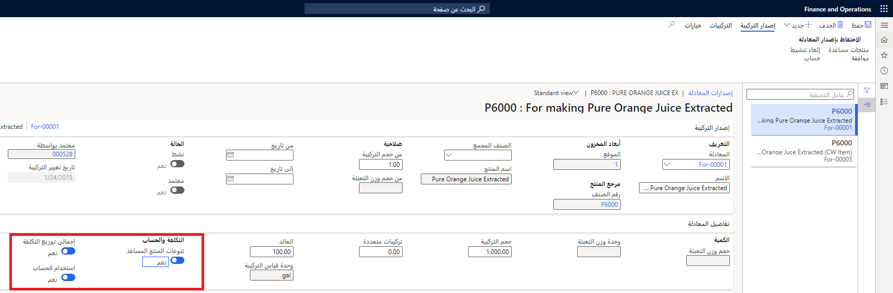

المنتجات المساعدة هي أصناف يتم إنتاجها بجانب صنف المعادلة أو المنتجات المساعدة الأخرى. تُنتج هذه المنتجات متلازمةً في عملية تصنيع الصنف الآخر. إن المنتجات المساعدة لديها قيمة مخزون وتم تخزينها في المخزون لاستخدامها في عملية إنتاج لاحقة أو بيعها بهدف كسب الأرباح.

يتم تحديد المنتجات المساعدة هذه في المعادلة بالكمية التي تم إنشاؤها لكل حجم دفعة لصنف المعادلة أو صنف التخطيط. يمكن تعيين تخصيص التكلفة يدويًا في مستوي الصنف كمنتج مساعد أو باستخدام طريقة توزيع التكلفة الإجمالية حيث يتم تخصيص التكاليف بشكل متناسب استنادًا إلى كميات صنف المعادلة وكميات المنتجات المساعدة الأخرى.

### المثال 1

لإنتاج ألواح خشبية بطول 2 في 4 أقدام، يتم فصل لوح خشبي كبير إلى لوح واحد بطول 2 في 4 أقدام. أثناء هذا الإنتاج، تكون أطراف اللوحة مخزنة ومستخدمة في عملية إنتاج لاحقة لإنشاء شرائح خشبية. 

إن صنف المعادلة في هذا المثال هو اللوح الخشبي مقاس 2 في 4 أقدام، بينما تكون الأطراف هي المنتجات المساعدة المخزنة مع قيمة المخزون ويتم استهلاكها فيما بعد لإنشاء الشرائح الخشبية. تقوم الأطراف بتخصيص بعض تكاليف الإنتاج الخاصة باللوح مقاس 2 في 4 أقدام لتغطي تكلفة الشرائح الخشبية التي تم إنتاجها لاحقاً.

### المثال 2

في عملية إنتاج أجزاء الألومنيوم المستخرج، توضع في المستخرج بلورة من الألومنيوم الخام، وباستخدام حرارة عالية ومضخة هيدروليكية، يتم دفع البلورة من خلال الصبغة لإعطاء صورة عن عملية الاستخراج.
ويتم بعد ذلك تقطيع هذه القطعة الطويلة المستخرجة بطول محدد لإعطاء قطعة مستخرجة قابلة للبيع. 

وكجزء من عملية التصنيع هذه، يتم جمع الألومنيوم الزائد غير المصنع من خلال الصبغ (المفرغ أو المقطع)، ثم يتم بيعه مرة أخرى إلى مورد الألومنيوم ليتم مزجه مع الألومنيوم الجديد لإنتاج المزيد من بلورة الألومنيوم. يتم تخزين القطعة المستخرجة عادهً بالقدم ويتم تخزين تفريغ الألومنيوم بالأرطال. يتم تخصيص تفريغ الألومنيوم الذي تم إنشاؤه لتكلفة أمر الإنتاج ويمكن أن يختلف في الكمية المنتجة استناداً إلى كل تشغيل إنتاج.

بالنسبة لهذا المثال، تكون القطعة المستخرجة هي صنف المعادلة التي تريد الشركة تنفيذها والتفريغ هو المنتج المساعد في العملية التي تخزنها الشركة ثم تبيعها إلى مُورد الألومنيوم. 

يتم تصميم هذا المثال في Supply Chain Management باستخدام معادلة تستهلك البلورة لإنتاج المستخرج والمنتج المساعد للتفريع التي تم تخصيص 15 بالمائة من تكلفه التصنيع له.

## استخدام إجمالي تخصيص التكلفة للمنتجات المساعدة

تتضمن الإرشادات الخاصة باستخدام إجمالي تخصيص التكلفة (TCA) للمنتجات المساعدة ما يلي:

-   وإذا قمت بتعيين شريط التمرير **إجمالي تخصيص التكلفة** إلى **نعم** لإصدار المعادلة، فيجب أن يكون سعر تكلفة المنتج المساعد أكبر من 0 (صفر). يمكن استرداد القيمة من إصدار التكلفة النشط لنفس الموقع أو للموقع الأول لإحدى المعادلات غير الخاصة بالموقع. يتم التحقق من صحة هذا الشرط عند اعتماد الصيغة.

    -   لا تحتاج إلى إدخال النسب المئوية لتخصيص التكلفة للمنتجات المساعدة يدويًا. وبدلاً من ذلك، يقوم النظام تلقائيًا بإنشاء النسبة المئوية لتخصيص التكلفة كمتوسط أسعار التكلفة النشطة للمنتجات المساعدة.

    -   لا يلزم إدخال التكلفة القياسية لأصناف التكلفة غير القياسية التي تُعد ضمن المنتجات المساعدة. نوعي إصدارات التكاليف في النظام هما التكلفة القياسية والتكلفة المخططة.

    -   إذا لم يتم تقييم أحد الأصناف وفقاً لطريقة تقييم التكلفة القياسية، نوصي باستخدام سعر تكلفة نشط في إصدار التكلفة المخطط له. يستخدم هذا السعر لتقدير التكلفة، على سبيل المثال، حساب قائمة مكونات الصنف، وتقدير تكلفة الإنتاج، والسعر الاحتياطي في عملية تقييم المخزون.

-   إذا قمت بتعيين شريط التمرير **إجمالي تخصيص التكلفة** إلى **نعم** لإصدار الصيغة وكانت الشروط التالية صحيحة، فإن أسلوب تخصيص التكلفة هو **TCA**، والنسبة المئوية لتوزيع التكلفة لا تتغير:

    -   لقد قمت بإضافة منتجات مساعدة.

    -   لقد استخدمت طريقة مختلفة لتخصيص التكلفة للمنتجات المساعدة.

-   إذا قمت بتعيين شريط التمرير **إجمالي تخصيص التكلفة** إلى **لا** لإصدار الصيغة وكانت الشروط التالية صحيحة، يتم تغيير أسلوب تخصيص التكلفة هو **يدوي**، والنسبة المئوية لتوزيع التكلفة لا تتغير:

    -   لقد قمت بإضافة منتجات مساعدة.

    -   تكون النسبة المئوية لتخصيص التكلفة أكبر من 0 (صفر).

-   قبل إجراء عملية حساب الصيغة بنجاح، يجب تقدير النسب المئوية لتوزيع التكلفة. يمكنك إكمال هذه الخطوة إما يدوياً أو باستخدام الخيار **التكلفة المقدرة** في الصفحة **المنتجات المشتركة**. 
 
   > [!Note] 
   > لا يكون خيار **التكلفة المقدرة** متاحاً إلا في حالة تعيين شريط التمرير **إجمالي توزيع التكلفة** إلى **نعم** لإصدار الصيغة.     يمكنك عرض التخصيص المتوقع إذا كانت كميات أمر الدفعة التي تم الإعلام عنها كمنتهية تطابق الكميات التي تظهر ضمن الصيغة.

-   عند إنشاء أمر دفعة يدوياً أو في حالة تأكيد أمر دفعة مخطط، يتم نسخ قيمة شريط التمرير **إجمالي تخصيص التكلفة** لإصدار الصيغة إلى أمر الدفعة. ومع ذلك، يمكنك تغيير هذا الإعداد في أمر الدفعة. في حالة تعيين شريط التمرير **إجمالي توزيع التكلفة** إلى **لا** لإصدار الصيغة ثم تغييره إلى **نعم** لأمر الدفعة، يتم تغيير طريقة تخصيص التكلفة لكل بند تم تعيينه من **يدوي** إلى **TCA**. لا يتم تغيير تخصيص التكلفة إلى **بلا**. في حالة تعيين شريط التمرير **إجمالي توزيع التكلفة** إلى **نعم** لإصدار الصيغة ثم تغييره إلى **لا** لأمر الدُّفعة، يتم تغيير طريقة تخصيص التكلفة لكل منتج مشترك من النوع **إنتاج** إلى **يدوي**. ولا يتم تغيير أي نسبة مئوية تقديرية لتوزيع التكلفة.

-   تعرض صفحة **تخصيص تكلفة المنتج المشترك** النسبة المئوية لتخصيص التكلفة المحسوبة. يمكنك فتح هذه الصفحة من الصفحة **أمر الدفعة**. تكون هذه المعلومات مفيدة عندما تختلف المنتجات والكميات التي يتم الإبلاغ عنها عن الكميات المجدولة أو التي تم البدء بها في أمر الدفعة. عند اكتمال التكلفة، يتم عرض تخصيصات النسبة المئوية الجديدة من TCA ضمن الصفحة **تخصيص تكلفة المنتج المشترك**.

**إدارة معلومات المنتج > المنتجات > المنتجات الصادرة > مهندس > مجموعة الصيغ > إصدارات الصيغ** 

