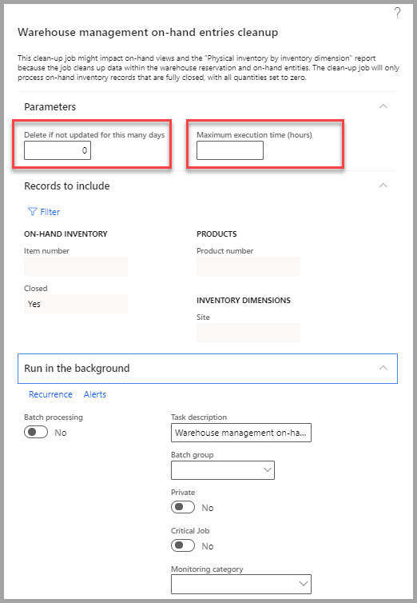

تستخدم دفاتر يومية المخزون في إدارة سلاسل التوريد لترحيل حركات المخزون المادية من مختلف الأنواع، مثل ترحيل الإصدارات والإيصالات، وحركات المخزون، وإنشاء قوائم مكونات الصنف (BOM)، وتسوية المخزون المادي. يتم استخدام كافة دفاتر يومية المخزون هذه بطريقة مماثلة، ولكن يتم تقسيمها إلى أنواع مختلفة.

تتوفر الأنواع التالية من دفاتر يومية المخزون:

- الحركة
- تسوية المخزون
- النقل
- قائمة مكونات الصنف
- وصول الصنف
- مدخلات الإنتاج
- الجرد
- جرد العلامات

## الحركة 

عند استخدام دفتر يومية حركة المخزون، يمكنك إضافة تكلفة إلى صنف عند إضافة مخزون، ولكن يجب تخصيص التكلفة الإضافية لحساب دفتر الأستاذ العام يدوياً عن طريق تحديد حساب إزاحة دفتر الأستاذ العام عند إنشاء دفتر اليومية. يكون نوع دفتر يومية المخزون هذا مفيداً إذا كنت ترغب في الكتابة فوق حسابات الترحيل الافتراضية.

شاهد هذا الفيديو لمشاهدة عرض توضيحي لدفتر يومية حركة المخزون:

 > [!VIDEO https://www.microsoft.com/videoplayer/embed/RE4ayjP]
 

## تسوية المخزون 

عند استخدام دفتر يومية تعديل المخزون، يمكنك إضافة تكلفة إلى صنف عند إضافة مخزون. يتم ترحيل التكلفة الإضافية تلقائياً إلى حساب دفتر أستاذ عام محدد، استناداً إلى إعداد ملف تعريف ترحيل مجموعة الأصناف. 

استخدم نوع دفتر يومية المخزون هذا لتحديث المكاسب والخسائر إلى كميات المخزون عندما يجب أن يحتفظ الصنف بحسابه المقابل الافتراضي لدفتر الأستاذ العام. عند ترحيل دفتر يومية تسوية المخزون، يتم ترحيل إيصال المخزون أو إصداره، ويتم تغيير قيم المخزون، ويتم إنشاء حركات دفتر الأستاذ.

## النقل 

يمكنك استخدام دفاتر يومية التحويل لنقل الأصناف بين مواقع التخزين أو الدفعات أو متغيرات المنتجات مع أو بدون التكاليف/الآثار المالية، والتي تعتمد جميعها على بند دفتر يومية التحويل المحدد والإعداد العام.

على سبيل المثال، يمكنك نقل الأصناف من مستودع إلى مستودع آخر داخل الشركة نفسها. عند استخدام دفتر يومية التحويل، يجب تحديد كل من بعدي المخزون **من** و **إلى**، على سبيل المثال، بالنسبة للموقع والمستودع. 

يتم تغيير المخزون الفعلي لأبعاد المخزون المحددة وفقاً لذلك. وتعكس عمليات نقل المخزون الحركة الفورية للمواد. لا يتم تعقب عمليات نقل المخزون. في حاله ضرورة تتبع المخزون أثناء النقل، فيجب عليك استخدام أمر تحويل بدلاً من ذلك. عند ترحيل دفتر يومية نقل، يتم إنشاء حركات مخزونين لكل بند دفتر يومية:

- إصدار مخزون من موقع **الإرسال**.
- إيصال مخزون إلى موقع **الاستلام**.

## قائمة مكونات الصنف 

عند الإبلاغ عن قائمة مكونات الصنف، يمكنك إنشاء دفتر يومية قائمة مكونات الصنف. باستخدام دفتر يومية قائمة مكونات الصنف، يمكنك ترحيل قائمة مكونات الصنف مباشرةً. ينشئ هذا الترحيل إيصال مخزون للمنتج، إلى جانب قائمة مكونات صنف مقترنة وإصدار مخزون للمنتجات المضمنة في قائمة مكونات الصنف. هذا النوع من دفاتر يومية المخزون مفيد في سيناريوهات الإنتاج البسيطة أو عالية الحجم حيث لا تكون التوجيهات مطلوبة.

## وصول الصنف 

يمكنك استخدام دفتر يومية وصول الصنف لتسجيل استلام الأصناف (على سبيل المثال، من أوامر الشراء). يمكن إنشاء دفتر يومية وصول الصنف كجزء من إدارة الوصول من صفحة **نظرة عامة على الوصول**، أو يمكنك إنشاء إدخال دفتر يومية يدوياً من صفحة **وصول الصنف**.

إذا قمت بتمكين اسم دفتر يومية وصول الصنف للتحقق من مواقع الانتقاء، فإن إدارة سلاسل التوريد تبحث عن موقع للأصناف المستلمة، وإذا كان هناك مجال، تقوم بإنشاء وجهات الموقع للأصناف الواردة.

## مدخلات الإنتاج 

تعمل دفاتر يومية إدخال الإنتاج مثل دفاتر يومية وصول الصنف ولكنها تستخدم لأوامر الإنتاج.

## الجرد 

تتيح لك دفاتر يومية الجرد تصحيح المخزون الفعلي الحالي المسجل للأصناف أو مجموعات الأصناف، ثم ترحيل العدد الفعلي بحيث يمكنك إجراء التعديلات المطلوبة لتسوية الاختلافات. 

يمكنك إقران سياسات الجرد بمجموعات الجرد للمساعدة في تجميع الأصناف ذات الخصائص المختلفة بحيث يمكن تضمينها في دفتر يومية الجرد. 

على سبيل المثال، يمكنك إعداد مجموعات الجرد لحساب الأصناف التي لها تردد معين، أو لحساب الأصناف عند انخفاض المخزون إلى مستوى محدد مسبقاً. 

من خلال إنشاء بنود في صفحة **جرد العلامات**، قم بوضع رقم علامة على كل صنف من أصناف المخزون، على سبيل المثال، رقم من 1 إلى 500. 

أثناء الجرد، يمكنك إدخال رقم الصنف والكمية في علامة مطابقة. ويمكن استخدام هذه العلامة بعد ذلك كأساس للإدخال في دفتر يومية جرد العلامات. بعد ترحيل دفتر يومية جرد العلامات، يتم إنشاء دفتر يومية جرد جديد في صفحة **الجرد**. 

تستند دفتر اليومية الجديد إلى بنود دفتر يومية جرد العلامات التي أنشأتها. لتحديد أصناف جرد العلامات حسب بُعد مخزون معين، حدد البُعد في صفحة **أبعاد العرض** التي يتم عرضها عند إنشاء دفتر يومية جرد العلامات. 

على سبيل المثال، لجرد الأصناف في مستودع معين، حدد خانة الاختيار **المستودع**. إذا تم تحديد شريط تمرير **تأمين الأصناف أثناء الجرد** في صفحة **معلمات إدارة المستودع والمخزون**، فلا يمكن تحديث الأصناف فعلياً أثناء عملية الجرد. ومع ذلك، لا يتم تأمين الأصناف الموجودة في دفاتر يومية جرد العلامات أثناء عملية الجرد. لا يتم إنشاء حركات المخزون حتى يتم ترحيل بنود جرد العلامات وتحويلها إلى دفتر يومية الجرد. إذا تم إدخال العلامات عشوائياً، وكنت ترغب في تحديد العلامات المفقودة، حدد رأس عمود **العلامات** لفرز البنود حسب العلامة

## جرد العلامات 

وغالباً ما يستخدم جرد علامة المخزون في شركه بيع بالتجزئة. يتم استخدام دفاتر يومية جرد العلامات لتعيين علامة مرقمة إلى دفعة جرد. يجب أن تحتوي العلامة على رقم العلامة ورقم الصنف وكمية الصنف. لضمان استخدام العلامة مرة واحدة فقط، واستخدام كافة العلامات، يجب أن يكون لكل رقم صنف مجموعة فريدة من العلامات التي لها تسلسل رقمي خاص بها. يمكن تعيين ثلاث قيم حالة لكل علامة:

- **مستخدم**: يتم جرد رقم الصنف لهذه العلامة.
- **ملغٍ**: يتم إلغاء رقم الصنف لهذه العلامة.
- **مفقود**: رقم الصنف مفقود لهذه العلامة.

بعد ترحيل دفتر يومية جرد العلامات، يتم إنشاء دفتر يومية جرد جديد استناداً إلى بنود دفتر يومية جرد العلامات. 

## مهمة تنظيف الإدخالات الفعلية لإدارة المستودعات

تتيح لك ميزة **الحد الأقصى لوقت التنفيذ لمهمة تنظيف الإدخالات اليدوية لإدارة المستودع** إنشاء أقصى وقت مسموح به لمعالجة مهمة تنظيف الإدخالات العملية. إذا لم تكتمل المهمة قبل عدد الساعات المحدد، سيتم حفظ العمل الذي تم إكماله حتى الآن ثم الخروج. وتتعلق هذه الإمكانية بشكل خاص بالتطبيقات التي لها استخدام عالي للمخزون. في هذه الحالة يجب جدولة المهمة ليتم تشغيلها في بعض الأحيان عندما يكون النظام محملاً بخفة قدر الإمكان. أدخل القيمة "0" (أو اتركها فارغة) للسماح بمتابعة مهمة المجموعة حتى يتم الانتهاء منها. 

عند حساب المخزون الفعلي، يؤثر عدد السجلات في الجداول المتضمنة على أداء الاستعلامات. ولعل تقليل كمية السجلات التي تعتبرها قاعدة البيانات إحدى الطرق المتبعة لتحسين هذا الأداء.

بالنسبة للأصناف الممكنة لمعالجة إدارة المستودع، فإن جداول **InventSum** و **WHSInventReserve** تخزن البيانات الفعلية. يمكن أن يؤدي حذف هذه السجلات إلى تحسين الحسابات الفعلية بشكل ملحوظ (يُشار إليها بأصناف WHS).

تقوم وظيفة تنظيف الإدخالات الفعلية بحذف أي سجلات في جداول **WHSInventReserve** و **InventSum** حيث تكون كافة قيم الحقول 0 (صفر). يمكن حذف هذه السجلات لأنها لا تساهم في المعلومات الموجودة. لا تقوم الوظيفة إلا بحذف السجلات التي تقع ضمن مستوى **الموقع**. 

### جدولة مهمة التنظيف وتكوينها
تتوفر مهمة تنظيف الإدخالات الفعلية في **إدارة المخزون > المهام الدورية > تنظيف > تنظيف الإدخالات الفعلية لإدارة المستودعات**. للتحكم في النطاق والجدول الزمني لتشغيل المهمة، استخدم إعدادات المهمة القياسية. تتوفر الإعدادات التالية أيضاً:

- **حذف ما لم يتم تحديثه لعدة أيام**: أدخل الحد الأدنى لعدد الأيام التي يجب أن تنتظرها المهمة حتى يتم حذف إدخال فعلي انخفض إلى الصفر. يساعد هذا على تقليل مخاطر حذف الإدخالات الموجودة التي لا تزال قيد الاستخدام. أدخل 0 (صفر) أو اترك الحقل فارغاً إذا كنت ترغب في إجراء التنظيف في أسرع وقت ممكن.

- **الحد الأقصى لوقت التنفيذ (بالساعات)**: يتيح إدخال الحد الأقصى لوقت مهمة التنظيف بالساعات. في حالة عدم انتهاء المهمة قبل مرور هذه الفترة، سيتم حفظ العمل الذي تم إنجازه حتى الآن ثم تغلق نفسها. ترتبط هذه الإمكانية بشكل خاص بتنفيذات المخزون المكثفة. يجب جدولة التنظيف عندما يكون تحميل النظام خفيفاً بقدر الإمكان في هذه الحالات. إذا كنت ترغب في متابعة مهمة المجموعة حتى تكتمل، فأدخل 0 (صفر) أو اترك الحقل فارغاً.

 
    

في حين أنك قد تتمكن من تشغيل الوظيفة خلال ساعات العمل العادية، نقترح عليك تشغيلها خارج ساعات العمل. يساعد القيام بذلك على منع حدوث أي تعارضات عند قيام المستخدم بالعمل باستخدام سجل جاري تنظيفه.

إذا حاولت الوظيفة إزالة سجل لصنف قيد الاستخدام حالياً، فهذا يعني وجود خطا توقف تام لمهمة التنظيف، أو إذا حاول مستخدم الوصول إلى سجل تم تنظيفه بالفعل، فستظهر رسالة الخطأ.

عند تشغيل الوظيفة، يكون حجم الالتزام 100. وفي شروط أخرى، سيتم إجراء عمليات الحذف في مجموعات 100. ومع ذلك، نظراً لأن عمليات الحذف المعينة تستند إلى مجموعة، قد تكون هناك حالات حيث ستقوم نفس العملية بحذف أكثر من 100 سجل. وعند حدوث ذلك، قد تحدث تصعيدات التأمين.  وتعني تصعيدات التأمين وجود العديد من عمليات التأمين على صفوف معينة في الجدول. بمجرد تجاوز الحد الأقصى المسموح به لعدد التأمينات حسب الصف، يتم تأمين الجدول بالكامل.

