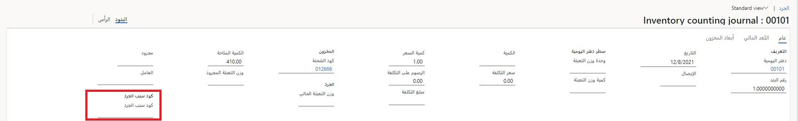

تتيح لك أكواد السبب تحليل نتائج عملية الجرد وأية اختلافات تحدث أثناء هذه العملية. يمكنك تحديد سبب إجراء الجرد، مثل البالتة المكسورة أو تعديل المخزون المستند إلى عينات المخزون.

قبل إعداد النظام، نوصي بتحديد استراتيجية للعمل مع أكواد السبب‬. على سبيل المثال، حاول الإجابة عن الأسئلة التالية أثناء تعريف استراتيجيتك:

- هل يجب أن تكون أكواد السبب إلزامية في المستودعات؟
- هل يجب أن تكون أكواد الأسباب إلزامية أو اختيارية في بعض الأصناف؟
- كم عدد أكواد الأسباب التي تحتاجها؟
- هل يتعين عليك التحديد المسبق لقائمة محدودة من أكواد الأسباب لإجراء التعديلات؟
- كيف يجب على مستخدمي الماسحات الشريطية استخدام أكواد الأسباب؟ هل يجب أن تكون أكواد الأسباب محددة مسبقاً أم إلزامية أم غير قابلة للتعديل؟
- هل يحتاج عمال المستودع إلى سلوك مختلف لكود السبب في الماسحات المتحركة؟ إذا كانت الإجابة نعم، يمكنك إنشاء المزيد من أصناف القائمة وتعيينها لأشخاص مختلفين.
- هل يجب أن تدفع أكواد الأسباب ترحيل حساب المقابل المالي؟

يمكنك إنشاء سياسات أكواد أسباب متعددة، ويمكن أن تحتوي كل سياسة أكواد سبب على سياسات أكواد سبب جرد. يمكن استخدام سياسات كود سبب الجرد على مستوى المستودع أو مستوى الصنف. 

يمكن لعمال المستودعات والتجزئة الذين يقومون بإجراء تعديلات على المخزون تحديد سبب التعديل أثناء عملهم. مع قائمة الأسباب المحتملة للتعديل (مسروقة أو منتهية الصلاحية أو تالفة)، يمكن ترحيل التسويات إلى حساب المقابل المناسب لكل سبب. يؤدي ذلك إلى ترحيل التعديلات تلقائياً كدفتر يومية جرد إلى الحساب الصحيح بمجرد تسجيله. 

لإعداد سياسات أكواد الأسباب، استخدم الإجراء التالي:

1. انتقل إلى **إدارة المخزون > إعداد > المخزون > نهج كود سبب الجرد**، وقم بإنشاء نهج جديد لكود السبب.
1. في الحقل **نوع كود سبب الجرد**، حدد إما **إلزامي** أو **اختياري** لتحديد ما إذا كان اختيار كود السبب يجب أن يكون اختيارياً أم إلزامياً في إحدى دفاتر يومية الجرد التالية:
    - الجرد الدوري (جهاز محمول)
    - الجرد الفوري (جهاز محمول)
    - جرد الحدود (جهاز محمول)
    - التعديل في (الجهاز المحمول)
    - تعديل خارج (جهاز محمول)
    - دفتر يومية الجرد (عميل غني)

يمكنك أيضاً إعداد أكواد الأسباب للمستودعات الفردية والمنتجات. يمكن لإعداد كود السبب للمنتجات تجاهل الإعداد للمستودعات.

## أكواد السبب إلزامية 

في حالة تعيين المعلمة **إلزامياً** في تكوين أكواد السبب للمستودعات أو الأصناف، لا يمكن إكمال دفتر يومية الجرد وإغلاقه حتى يتم توفير كود سبب.

لإعداد أكواد السبب للمستودعات، استخدم الإجراء التالي:

1. انتقل إلى **إدارة المخزون > إعداد > تصنيف المخزون > مستودعات**.
1. في علامة التبويب **إدارة المخزون والمستودعات**، ضمن الحقل **نهج كود سبب الجرد**، حدد أحد الخيارات التالية:
    - **فارغ**: تستخدم هذه المعلمة التي تم إعدادها للصنف لتحديد ما إذا كانت دفاتر يومية الجرد إلزامية بالنسبة للمنتج أم لا.
    - **إلزامي**: دائماً ما يكون كود السبب مطلوباً في دفاتر يومية الجرد للمستودع.
    - **اختياري**: لا يكون كود السبب مطلوباً في دفاتر يومية الجرد للمستودع.

لإعداد أكواد السبب للمنتجات، استخدم الإجراء التالي:

1. انتقل إلى **إدارة معلومات المنتج > المنتجات > المنتجات الصادرة**.
1. في علامة التبويب **المنتج**، اختر **نهج كود سبب الجرد**، ثم حدد أحد الخيارات التالية:
    - **فارغ**: تستخدم هذه المعلمة التي تم إعدادها للمستودع لتحديد ما إذا كانت دفاتر يومية الجرد إلزامية بالنسبة للمنتج أم لا.
    - **إلزامي**: دائماً ما يكون كود السبب مطلوباً في دفاتر يومية الجرد للمنتج. يتجاوز هذا الإعداد أي إعداد كود سبب على مستوي المستودع.
    - **اختياري**: لا يكون كود السبب مطلوباً في دفاتر يومية الجرد للمنتج. يتجاوز هذا الإعداد أي إعداد كود سبب على مستوي المستودع.

## استخدام أكواد السبب في دفاتر يومية الجرد 

في دفتر يومية الجرد، يمكنك إضافة أكواد سبب لجرد الأنواع التالية:

- الجرد الدوري‬
- الجرد الفوري
- جرد الحدود
- تسوية واردة
- تسوية صادرة

تتم إضافة أكواد السبب إلى بنود دفتر اليومية في دفاتر يومية الجرد من النوع **دفتر يومية الجرد**.

1. انتقل إلى **إدارة المخزون > إدخالات دفتر اليومية > جرد الأصناف > جرد**.
1. في تفاصيل البند الخاصة بدفتر يومية الجرد، في الحقل **كود سبب الجرد**، حدد أحد الخيارات. 

لعرض سجل الجرد كما تم تسجيله بواسطة أكواد السبب، انتقل إلى **إدارة المخزون > الاستفسارات والتقارير > سجل الجرد**، ثم في حقل **كود سبب الجرد**، اعرض سجل الجرد الذي تم تسجيله من خلال كود السبب.

## استخدم كود السبب لتعديل الكمية 

لإضافة كود السبب لتعديل الكمية، استخدم الإجراء التالي:

1. في الصفحة **المخزون الفعلي**، حدد **تسوية الكمية**. يمكنك فتح صفحة **المخزون الفعلي** بطرق متعددة. على سبيل المثال، حدد **إدارة المخزون > الاستعلامات والتقارير > المخزون الفعلي**.
1. حدد **تسوية الكمية**، ثم في الحقل **كود سبب الجرد**، حدد أحد أكواد السبب.

