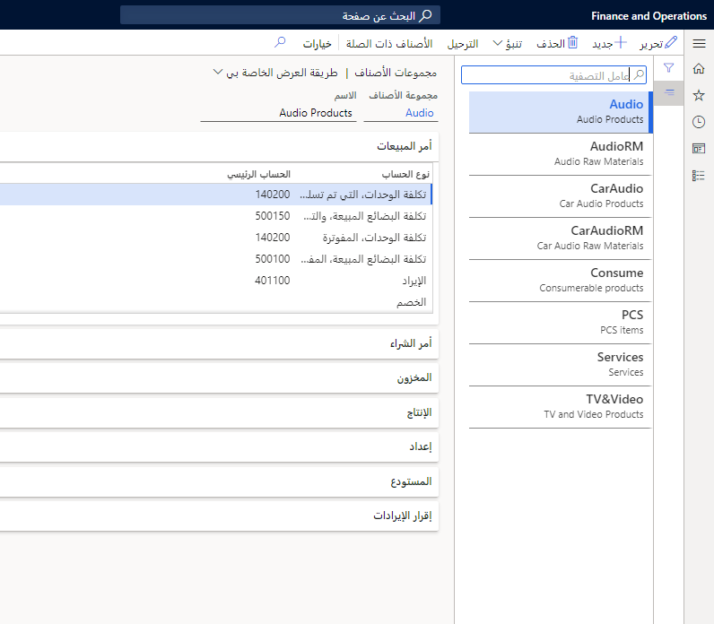
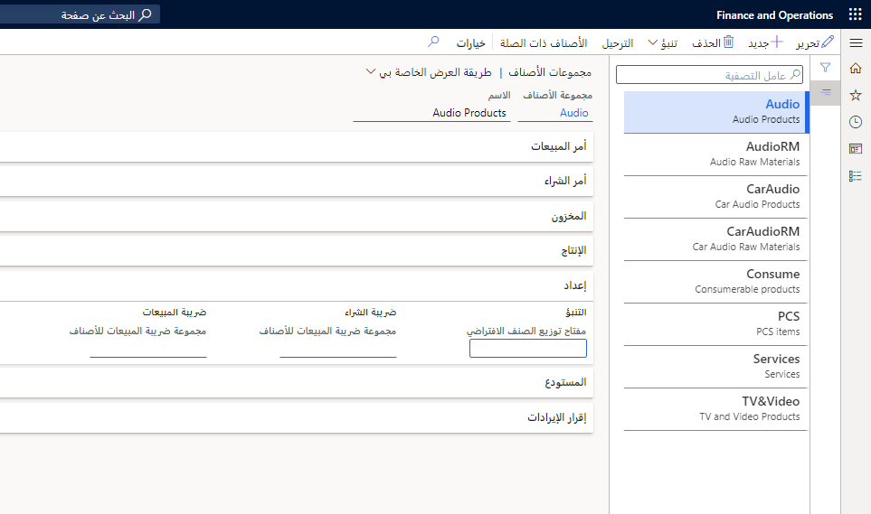

## مجموعات الأصناف ##

في كل كيان قانوني، يجب إعداد مجموعة أصناف واحدة على الأقل لأنها شرط أساسي سيتم استخدامه في معالجة المخزون.
تخدم مجموعات الأصناف ثلاثة أغراض رئيسية:

- تحديد مجموعات حسابات دفتر الأستاذ للإدخالات المحاسبية لمجموعة من المنتجات المصنفة في مجموعة الأصناف.
- استخدام مجموعات الأصناف للإبلاغ عن المعلومات المالية التفصيلية والاستعلامات.
- إنشاء تقارير أخرى مرتبطة بالمنتجات.

لإنشاء مجموعة أصناف، انتقل إلى **إدارة المخزون > إعداد > المخزون > مجموعات الأصناف**. حدد الحسابات من مخطط الحسابات التي ستستخدمها لأنواع الحسابات المختلفة في كل منطقة.
 

تعرض علامة التبويب السريعة **أمر المبيعات** الحسابات الرئيسية التي تم تكوينها لمجموعة الأصناف، بالإضافة إلى المحاسبة المرتبطة بمستند أمر المبيعات في دورة الإيراد.

بالنسبة للمنتجات التي تم تكوينها كمنتجات مخزّنة، يتم تسجيل حركة مخزون مع بند أمر المبيعات للكمية المطلوبة.

على سبيل المثال، عند تسليم منتج مخزّن لأمر مبيعات، يتم إنشاء إدخالات محاسبية في الحقلين **أمر، الحساب الرئيسي لإيصال التعبئة (إصدار)** و **المبيعات، الصفحة الرئيسية لإيصال التعبئة (استهلاك)**، إذا تم تحديد خانة الاختيار **ترحيل المخزون الفعلي** في الصفحة **مجموعات نماذج الأصناف** وخيار **ترحيل إيصال التعبئة في دفتر الأستاذ** ضمن **معلمات الحسابات المدينة**.

تعرض علامة التبويب السريعة **أمر الشراء** الحسابات الرئيسية التي تم تكوينها لمجموعة الأصناف، بالإضافة إلى المحاسبة المرتبطة بمستند أمر الشراء في دورة التدبير‬.

بالنسبة للمنتجات التي تم تكوينها كمنتجات مخزّنة، يتم إنشاء حركات المخزون مع بند أمر الشراء للكمية المطلوبة.

تعرض علامة التبويب السريعة **المخزون** الحسابات المستخدمة للترحيل المرتبط بالمخزون لمجموعة الأصناف.

على سبيل المثال، يستخدم النظام أنواع الحساب **المخزون، ربح سعر الاستلام الثابت** و **المخزون، خسائر سعر الاستلام الثابت** لترحيل ربح أو خسارة فرق سعر الاستلام الثابت للمنتجات التي تم تكوينها باستخدام نموذج مخزون سعر الاستلام الثابت في مجموعة نماذج المخزون. كما يستخدم "الاستلام والإصدار" لنشر الإيصالات وإصدار حركات المخزون للمنتج المخزّن.

تعرض علامة التبويب السريعة **الإنتاج** الحسابات المستخدمة للترحيل المرتبط بالتصنيع لمجموعة الأصناف.

تتيح علامة التبويب السريعة **إعداد** إمكانية إعداد مجموعات التنبؤ والضريبة الافتراضية. تحتوي علامة التبويب **التنبؤ** على **مفتاح تخصيص الصنف الافتراضي**. حدد مفتاح التخصيص المعرّف من قِبل المستخدم ليعمل كمفتاح قياسي مقترح عند إنشاء التنبؤات لمجموعة الأصناف. يتم إنشاء مفاتيح تخصيص الأصناف ضمن الإعداد **مفاتيح تخصيص الأصناف** في وحدة التخطيط الرئيسية.
 

تحتوي مجموعات **ضريبة الشراء** و **ضريبة المبيعات** على الحقل **مجموعة ضريبة مبيعات الصنف**. وهنا يتم تحديد مجموعة ضريبة مبيعات الصنف الافتراضية للأصناف الموجودة في مجموعات الأصناف المحددة.

## مجموعات نماذج الصنف 

تحتوي مجموعات نماذج الأصناف على إعدادات تحدد كيفية التحكم في الأصناف ومعالجتها عند استلام الأصناف وإصدارها. تحدد هذه الإعدادات أيضاً كيفية حساب استهلاك الصنف. تسهل هذه الميزة الصيانة نظراً لأنه يتم التحكم بشكل متكرر في العديد من الأصناف بنفس الاعداد.

يمكن إرفاق العديد من المنتجات بمجموعة نماذج الصنف. وبدلاً من توفير معلومات مفصلة لكل صنف، تقوم مجموعة نموذج صنف واحد بجمع كافة المعلومات. مما يربطه بالمنتجات المعنية، ويساعد على إجراء التحديث بشكل أسهل لأنه يمكنك عادةً إدارة العديد من الأصناف وفقاً لنفس الإعداد الذي يجب تحديثه في مكان واحد فقط. لذلك، يجب عليك إنشاء مجموعات نماذج الصنف فقط حسب الحاجة.

يتم استخدام مجموعات الأصناف لإدارة المخزون عن طريق تقسيم أصناف المخزون إلى مجموعات استناداً إلى خصائص الصنف. يمكنك تحديد أرقام الحسابات الرئيسية لحركات دفتر الأستاذ التلقائية التي يتم إنشاؤها لإيصالات استلام مجموعة الأصناف وإصدار حركات في المخزون. يمكنك أيضاً إعداد تنبؤات الطلب والتوريد لمجموعات الأصناف.

تُعد مجموعات نماذج الصنف جزءاً مهماً من تكوين منتج للمخزون وإدارة المخزون والحسابات. تحتوي مجموعات نماذج الأصناف على إعدادات تحدد كيفية التحكم في الأصناف ومعالجتها عند استلامها وإصدارها.

لإنشاء مجموعة نموذج أصناف، انتقل إلى **إدارة المخزون > إعداد > المخزون > مجموعات نماذج الأصناف**.
 
تحدد مجموعات نماذج الأصناف نهج المخزون التالية:

- ما إذا كان المنتج مخزناً أم غير مخزّن
- افتراض تدفق التكلفة وطريقة قياس التكلفة لتقييم مخزون المنتجات المخزنة
- إذا تم السماح بالمخزون السلبي الفعلي والمالي
- إذا كان يجب ترحيل حركات المخزون إلى دفتر الأستاذ العام
- سير العمل المستخدم عند إرسال الأصناف أو استلامها
- قواعد الحجز

يُعد إعداد مجموعة نموذج الصنف مهماً عند تحديد كيفية تكامل الصنف مع المناطق الأخرى الخاصة بإدارة سلسلة التوريد. لم تتم تغطية كافة الحقول في هذه الوحدة النمطية لأنها تنطبق على مناطق أخرى من النظام والتي سيتم تغطيتها في الوحدات النمطية الأخرى.

## ‏‫أسلوب حساب التكلفة‬ والتعرف على التكلفة

تحدد مجموعة حقل **أسلوب حساب التكلفة‬ والتعرف على التكلفة** ما إذا كان يتم تعقب المنتجات في المخزون أم لا.
 
وهي تحتوي على المعلمة **منتج مخزّن**. في حالة إلغاء تحديد خانة الاختيار **منتج مخزّن**، لا يتم الاحتفاظ بأية حركات مخزون للمنتج. لذلك، لا يمكن استخدام المنتج للإنتاج أو الميزات المتعلقة بالمخزون. يتضمن ذلك دفاتر يومية المخزون التي تعتمد على حركات‬ المخزون‬. 

يمكن استخدام المنتج غير المخزن في أوامر الشراء والمبيعات.
 

حدد خانة الاختيار **منتج مخزّن** للإشارة إلى أنه يجب معالجة المنتج في المخزون. تقوم المنتجات التي تتم معالجتها في المخزون بإنشاء حركات المخزون. يمكن تضمين هذه المنتجات في حسابات التكلفة. يمكن أيضاً صيانة الكميات الفعلية لهذه المنتجات. تتضمن المنتجات المخزنة الأصناف والخدمات. 

لا يمكن إضافة خدمة إلى المخزون. غير أن النظام يشترط إنشاء حركات مخزون أولية من أجل الخدمات التي تسهم في القيمة المخزونية للسلع الملموسة. على سبيل المثال، يجب إنشاء حركات مخزون أولية إذا تم استخدام خدمة في التعاقد من الباطن على خطوات الإنتاج.

فيما يلي الحركات التي يتم استخدامها للمنتجات المخزنة فقط:

- أوامر الإنتاج
- أوامر النقل‬
- دفاتر يومية المخزون
- أوامر إدخال مخزن العزل
- أوامر الجودة
- حظر المخزون
- التنبؤ بالمخزون

إذا تم إعداد مجموعة نماذج صنف لمنتج غير مخزن، فإن العديد من المعلمات تكون غير مرتبطة.
 
## تكامل دفتر الأستاذ

تحدد مجموعة حقل **تكامل دفتر الأستاذ** ما إذا كان سيتم ترحيل حركات المخزون إلى دفتر الأستاذ العام فعلياً أو مالياً، ومتى يجب ترحيلها. تكون الحقول في هذه المجموعة كما يلي:

- ترحيل المخزون الفعلي
- ترحيل المخزون المالي
- ترحيل إلى حساب الإيراد المؤجل عند تسليم المبيعات
- استحقاق الالتزام على إيصال استلام المنتجات

## ترحيل المخزون الفعلي 

توضح القائمة التالية التأثير الخاص بمعلمة **ترحيل المخزون الفعلي** عند تحديدها أو إلغاء تحديدها:

- في حالة تحديد هذا الحقل، يتم ترحيل الحركات الفعلية للمنتجات المخزنة في دفتر الأستاذ عند:
    - تسليم المبيعات، عند تحديد المعلمة **ترحيل إيصال التعبئة في دفتر الأستاذ** في الصفحة **معلمات الحسابات المدينة**.
    - استلام المنتج، عند تحديد المعلمة **ترحيل استلام المنتج في دفتر الأستاذ** في الصفحة **معلمات حسابات المدفوعات**.
    - الإبلاغ عن الإنتاج كمنتهٍ، عند تحديد **ترحيل التقرير كمنتهٍ في دفتر الأستاذ** في الصفحة **معلمات التحكم في الإنتاج**.
- إذا قمت بتحديد المعلمة **ترحيل المخزون الفعلي**، سيتم ترحيل قوائم التعبئة من عمليات الشراء أو المبيعات بالتكلفة في دفتر الأستاذ. وهذا يعني أن قيمة الأصناف المستلمة أو التي تم تسليمها أو العائمة فعلياً لا تنعكس فقط في المخزون، ولكن أيضاً في دفتر الأستاذ. عند تحديث فاتورة الشراء أو المبيعات نفسها، يتم عكس الحركات من تحديث إيصال التعبئة.
- إذا قمت بمسح معلمة **ترحيل المخزون الفعلي**، فلن يتم ترحيل الحركات الفعلية للمنتجات المخزنة في دفتر الأستاذ، بغض النظر عما إذا كان قد تم تحديد خيارات الإعداد **ترحيل إيصال التعبئة إلى دفتر الأستاذ**، و **ترحيل إيصال استلام المنتجات إلى دفتر الأستاذ**، و **ترحيل التقرير كمنتهٍ إلى دفتر الأستاذ**.

## ترحيل المخزون المالي 

توضح القائمة التالية التأثير الخاص بمعلمة **ترحيل المخزون المالي** عند تحديدها أو إلغاء تحديدها:

- في حالة تحديد هذا الحقل، يتم ترحيل القيمة المالية المحدثة للأصناف في دفتر الأستاذ في حالة:
    - تم تحديث أمر الشراء للفاتورة. تم ترحيل نفقات المنتج إلى حساب إيصال استلام المخزون.
    - تم تحديث أمر المبيعات للفاتورة. تم ترحيل تكلفة المنتج إلى إصدار المخزون وحسابات الاستهلاك.
- إذا قمت بإلغاء تحديد هذه المعلمة، سيتم ترحيل عمليات الشراء إلى نفقات شراء الصنف لحساب المصروفات عند مطابقة الشراء بفاتورة مورد.

ويمكن بعد ذلك تسوية قيمة المخزون التي تم ترحيلها بحسابات الحالة ذات الصلة في دفتر الأستاذ العام.
 
إذا تم إلغاء تحديد هذا الخيار، فإنه عند تحديث الفاتورة في أمر شراء، يتم ترحيل قيمة الأصناف إلى حساب استهلاك الصنف، وليس لحساب إيصال استلام المخزون. عند تحديث أمر مبيعات في الفاتورة، لا يتم إجراء الترحيل في حساب استهلاك الصنف أو حساب الإصدار. قم بإلغاء تحديد هذا الخيار لأصناف الخدمة إذا لم يكن من الضروري ترحيل استهلاك الصنف عند فوترة أوامر المبيعات. عند إلغاء تحديد هذا الخيار، لا تقوم بنود دفتر اليومية الخاصة بالأصناف بإنشاء عمليات ترحيل دفتر الأستاذ.

## ترحيل إلى حساب الإيراد المؤجل عند تسليم المبيعات 

حدد معلمة **ترحيل إلى حساب الإيرادات المؤجلة عند تسليم المبيعات** لترحيل الإيراد المتوقع عند تسليم المبيعات. ويستخدم هذا الأمر عادةً عندما تقوم إحدى الشركات بإقرار الإيرادات في وقت الشحن بدلاً من الفوترة للعميل. عند فوترة الأمر، يتم إعفاء الإدخالات المحاسبية للإيراد المؤجل.

حدد هذا الخيار لاستحقاق الإيراد المقدر للكمية التي تم تسليمها من تحديثات إيصال التعبئة. يتم تعويض الإيراد المستحق الذي يتم حسابه في تسليم المبيعات عند فوترة العميل للتسليم.

## استحقاق الالتزام على إيصال استلام المنتجات 

حدد المعلمة **‏‫استحقاق الالتزام على إيصال استلام المنتجات‬** لترحيل النفقات والمسؤوليات المتوقعة للشراء لتحديثات إيصال التعبئة إلى دفتر الأستاذ العام. عند مطابقة إيصال استلام المنتجات بفاتورة المورد، تكون الإدخالات المحاسبية لاستحقاق الالتزام معفية.

## تضمين القيمة الفعلية 

حدد الخيار **تضمين القيمة الفعلية** للإشارة إلى أنه يجب تضمين الحركات التي تم تحديثها فعلياً في حساب متوسط التكلفة. عند إغلاق المخزون، يمكن استخدام هذه المعلمة، اعتماداً على الطريقة المستخدمة لتقييم المخزون. تستخدم طرق تقييم المخزون التالية هذه المعلمة أثناء إغلاق المخزون:

- ‏‫الوارد أولاً يُصرف أولاً‬ (FIFO)
- الوارد أخيراً يُصرف أولاً
- تاريخ الوارد أخيراً يُصرف أولاً

لا تستخدم طرق تقييم المخزون التالية هذه المعلمة أثناء إغلاق المخزون: 

- المتوسط المرجح
- تاريخ المتوسط المرجح

## سعر إيصال ثابت 

حدد خيار **سعر الإيصال الثابت** لتسوية الإصدارات وإيصالات الاستلام لسعر الإيصال الثابت. سعر الإيصال الثابت هو مبدأ لتقييم المخزون حيث يقوم بتعيين سعر الإيصالات إلى التكلفة المخططة النشطة أو التكلفة الأساسية للمنتج. 

يتم تحديد سعر الإيصال الثابت في حقل **السعر** ضمن علامة التبويب **إدارة التكاليف** في الصفحة **تفاصيل المنتج الصادر**. 

عند تحديد هذا الخيار، يتم ترحيل عمليات الاستلام والإصدارات كالتالي: 

- بالنسبة لإيصالات الشراء، يتم الترحيل بالتكلفة الفعلية.
- بالنسبة لفواتير الشراء، يتم ترحيل فرق السعر بين التكلفة الفعلية وسعر الإيصال الثابت إلى دفتر الأستاذ العام كفرق.
- يتم ترحيل المبلغ إلى حساب الخسارة أو الأرباح لسعر الإيصال الثابت. 
- يتم تحديث المخزون على أساس سعر الإيصال الثابت.
- بالنسبة لإيصالات التعبئة وفواتير المبيعات الخاصة بأمر المبيعات، يتم إجراء عملية الترحيل في التكلفة المقدرة. 

عند قيامك بتشغيل إغلاق المخزون أو إعادة الحساب، في حالة تحديد خيار **سعر الإيصال الثابت**، يتم تسوية قيمة حركات الإصدار وفقاً للسعر المحدد في حقل **السعر**. في حالة مسح خيار **سعر الإيصال الثابت**، لا يتم تعديل قيمة حركات الإصدار وفقاً لهذا السعر. 

في حالة تغيير سعر الإيصال الثابت، وترغب في استخدام كافة حركات الإصدار الجديدة للتكلفة الجديدة، اتبع الخطوات التالية: 

1. تشغيل إغلاق المخزون.
1. قم بتعديل الرصيد للمخزون الفعلي بحيث يتوافق الرصيد مع التكلفة الجديدة.
1. تنشيط تكلفة مخططة جديدة.

## نموذج المخزون 

حدد نموذج المخزون المستخدم لإغلاق التعديلات وإجرائها على الصفحة **الإقفال والتسوية**.

