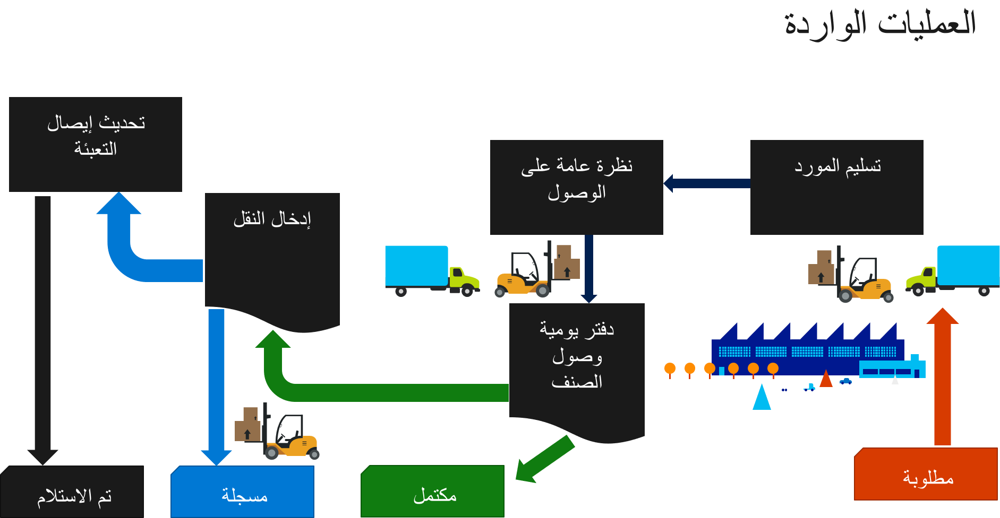
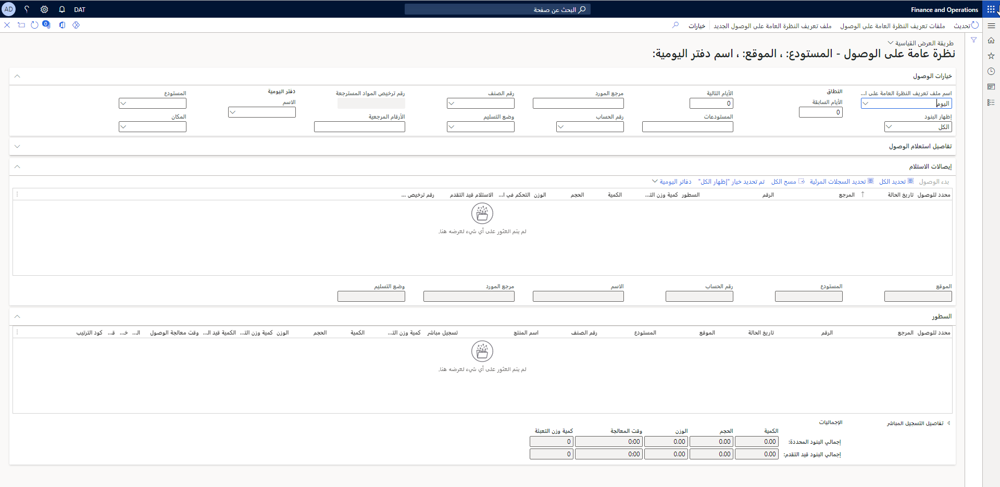
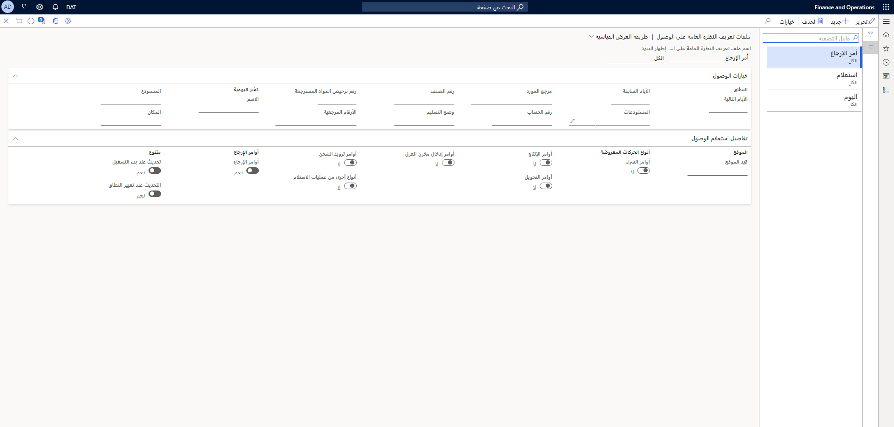

خذ بعين الاعتبار السيناريو التالي في معالجة الواردات.

يرغب موظف الاستلام في معرفة ما هو متوقع أن يتم استلامه في اليوم الحالي. في صفحة **نظرة عامة على الوصول**، يمكنه الحصول على نظرة عامة على المهام الحالية، وتقدير تقريبي للكميات والحجم والوزن وأنواع الأوامر المختلفة، وما إلى ذلك. 

وبعد ذلك، يصل التسليم إلى أحد الأرصفة الداخلية، ويستلم موظف الاستلام قائمة بالتسليم. في صفحة **نظرة عامة على الوصول**، يمكنه تنفيذ المهام التالية:

- تحديد أمر الاستلام المطابق وتسجيل الاستلام كما هو **قيد التقدم**. يتم إنشاء البنود المطلوبة للتسجيل تلقائياً، ويمكن مراقبة الاستلام، حتى إن لم يتم حتى الآن ترحيل الحركات على أنها **مسجلة**.
- الوصول إلى مرجع دفتر يومية الوصول المناسب (أي **دفتر يومية وصول الصنف** أو **دفتر يومية إدخال الإنتاج**)، وتحديد دفاتر اليومية الجاهزة لتحديث إيصال استلام المنتجات.

## نظرة عامة على الوصول 

توفر صفحة **نظرة عامة على الوصول** نظرة عامة على الأصناف المتوقع وصولها والتاريخ المتوقع وصولها فيه. كجزء من عملية الوصول، يمكن استخدام مجموعات متعددة من الإعدادات الشخصية.

لفتح صفحة **نظرة عامة على الوصول**، حدد **إدارة المخزون > الأوامر الواردة > نظرة عامة على الوصول**. في هذه الصفحة، يمكنك عرض قائمة بالأوامر المتوقع استلامها. يتم تقسيم النظرة العامة إلى رأس وسطور. 
 

ويتم تجميع معلومات الرأس حسب نوع الأمر وتاريخ الاستلام المتوقع ووجهة التسليم. عند تحديد سطر رأس للوصول، يتم تحديد كافة سطور التفاصيل المرتبطة بمرجع الإيصال للوصول في جزء تفاصيل السطر من الصفحة. عند ترحيل كافة سطور دفتر اليومية ذي الصلة، لا يتم عرض هذه المعلومات.

يمكن للمستخدمين تحديد إعداداتهم الشخصية في صفحة **ملفات تعريف النظرة العامة على الوصول**.
 

في هذا المثال، يريد كاتب الاستلام إعداد كمبيوتر جديد في موقع سيتم استخدامه لاستلام البضائع النهائية التي تأتي من الإنتاج في الموقع 1. في صفحة **ملفات تعريف النظرة العامة على الوصول**، تقوم بإنشاء إعداد جديد يسمي "إنتاج الموقع 1"، ويحدد الإعدادات التالية.

1.  في علامة التبويب السريعة **خيارات الوصول** الموجودة في مجموعة الحقول **النطاق**، أدخل معلومات حول الفترة الزمنية لليوم والمستودعات المطلوب تضمينها في النظرة العامة.
2.  في علامة التبويب السريعة **خيارات الوصول**، في مجموعة حقول **دفتر اليومية**، أدخل مستودع استلام وموقعاً واسم دفتر اليومية (وصول الصنف/إدخال الإنتاج).
3.  في علامة التبويب السريعة **تفاصيل استعلام الوصول**، في مجموعة حقول **الموقع**، في الحقل **قيد الموقع**، أدخل موقعاً لتحديد طريقة العرض في منطقة النظرة العامة.
4.  في علامة التبويب السريعة **تفاصيل استعلام الوصول**، في مجموعة حقول **أنواع الحركات المعروضة**، قم بتعيين خيار **أوامر الإنتاج** إلى **نعم**.
5.  في علامة التبويب السريعة **تفاصيل استعلام الوصول**، في المجموعة **متنوع**، قم بتعيين خيار **تحديث عند بدء التشغيل** إلى **نعم** إذا كان يجب تحديث طريقة العرض تلقائياً عند بدء التشغيل. 
6.  قم بتعيين الخيار **التحديث عند تغيير النطاق** إلى **نعم** إذا كان يجب تحديث طريقة العرض تلقائياً عند تغيير قيم النطاق.

بالنسبة لهذا المثال، فإن حقل **اسم ملف تعريف النظرة العامة على الوصول** الموجود ضمن علامة التبويب السريعة **خيارات الوصول** في صفحة **نظرة عامة على الوصول** يتم تعيينه إلى **إنتاج الموقع 1**.

لإنشاء دفاتر يومية وصول تلقائياً من صفحة **نظرة علامة على الوصول**، تحتاج إلى تحديد المعلومات المناسبة في مجموعة حقول **دفتر اليومية** ضمن علامة التبويب السريعة **خيارات الوصول**.

- يجب تحديد اسم دفتر يومية لإنشاء دفتر يومية.
- إذا قمت بتخصيص قيم في حقلي **المستودع** و **الموقع**، يتم تطبيق تلك القيم في سطور دفتر اليومية. أما إذا لم تقم بتحديد القيم، يستخدم النظام القيم من البُعد المحدد في حركات المخزون.

## الأصناف المستلمة من أمر استلام متوقع واحد 

في علامة التبويب السريعة **إيصالات الاستلام**، يحدد موظف الاستلام سطراً ثم يحدد **بدء الوصول**. 

يتم تحديد كافة السطور ذات الصلة الموجودة في النطاق المحدد، والتي تحتوي على كمية مطلوب تسجيلها تلقائياً. يتم إنشاء دفتر يومية وصول صنف يحتوي على تطابق بين أمر الاستلام المتوقع ودفتر اليومية. تتم تهيئة الكمية تلقائياً على كافة السطور التي تم إنشاؤها.

## الأصناف المستلمة من أكثر من أمر استلام متوقع واحد 

في علامة التبويب السريعة **إيصالات الاستلام**، يحدد موظف الاستلام عدد سطور ثم يحدد **بدء الوصول**. 

يتم إنشاء دفتر يومية وصول صنف يحتوي على تطابق بين جميع أوامر الاستلام المتوقعة ودفتر اليومية. يتم إنشاء كافة السطور في رأس دفتر يومية وصول صنف واحد، وتتم تهيئة الكمية تلقائياً.

## استلام أصناف من أمر استلام متوقع واحد أو أكثر 

للحصول على نظرة عامة على عمليات الاستلام المتوقعة في إحدى فترات التاريخ، يقوم موظف الاستلام بإدخال المعلومات التالية في الحقول الموجودة ضمن علامة التبويب **خيارات الوصول** على صفحة **نظرة عامة على الوصول**، ثم يحدد **تحديث** لتحديث طريقة العرض:

- **اسم ملف تعريف النظرة العامة على الوصول**: استعلام
- **إظهار البنود**: الكل
- **الأيام السابقة**: (فارغة)
- **الأيام التالية**: 0
- **المستودعات**: 11، و13

يمكن لموظف الاستلام عرض المعلومات التالية:

- نظرة عامة على مهام التسجيل المستحقة لجميع بنود الأمر التي تم إنشاء دفتر يومية وصول صنف لها، ولكن لم يتم ترحيله بعد. لعرض هذه المعلومات، يمكن تحديد **قيد التقدم** في حقل **إظهار البنود**.
- معلومات البند التفصيلية لأكثر من أمر واحد. ويمكن تحديد سطور الرأس المتعددة في النظرة العامة، ثم تحديد **تم تحديد خيار إظهار الكل** لعرض كافة معلومات تفاصيل البند المقابلة لكافة الأوامر المحددة.
- معلومات حول أمر شراء معين. لعرض المعلومات المرتبطة برقم مرجعي محدد في النظرة العامة، يمكن إدخال رقم العمل في حقل **رقم العميل** ورقم الأمر في حقل **الأرقام المرجعية**.
- كافة أوامر الاستلام ذات الصلة لتاريخ النظام وعدد لا نهائي من الأيام السابقة له، وإيصالات الاستلام إلى المستودعين 11 و13، بغض النظر عن الحالة.

## تحديث دفاتر اليومية 

لتسجيل واحد أو أكثر من بنود الأوامر التي من المقرر معالجتها، يمكن لموظف الاستلام تحديد البنود في شبكة النظرة العامة أو في شبكة البنود، ثم تحديد **دفاتر اليومية > إظهار عمليات الوصول من عمليات الاستلام**. يتم عرض رؤوس وصول الأصناف التي تطابق البنود. لتحديث إيصال منتج أمر الشراء للأصناف المسجلة، يمكن الوصول إلى رؤوس دفتر يومية وصول الصنف الجاهزة للتحديث. للوصول إلى رؤوس دفتر يومية وصول الصنف هذه، يتم تحديد **دفاتر اليومية > دفاتر اليومية الجاهزة لإيصال استلام المنتجات**. يتم عرض كافة سطور الرأس الجاهزة لتحديث إيصال استلام المنتجات في نطاق المستودع المحدد. (لا ترتبط سطور الرأس المعروضة بالفترة الزمنية لليوم.)

## بدء تسجيل وصول 

من خلال تحديد بنود متعددة في صفحة **نظرة عامة على الوصول**، يمكن لموظف الاستلام بدء وصول لأكثر من مرجع إيصال واحد. عند تحديد بند من النظرة العامة على إيصالات الاستلام، يتم تحديد تفاصيل البند المقابل. في حالة وجود كمية للتسجيل، يتوفر زر **بدء الوصول**. ويمكن استخدام أسلوبين لبدء تسجيل الوصول:

- لتصفية الصفحة بحيث تعرض السجلات التي تفي بالمعايير المحددة فقط، في الحقل **مرجع المورد**، امسح الرقم المرجعي من المورد، مثل الكود الشريطي لمذكرة التسليم.
- في جزء النظرة العامة أو جزء التفاصيل في صفحة **نظرة عامة على الوصول**، قم يدوياً بتحديد أو إلغاء تحديد السجلات لتسجيل الوصول يدوياً. وبعد ذلك، عند تحديد **بدء الوصول**، يتم إنشاء السجلات المحددة تلقائياً في دفتر يومية وصول الصنف. وتشتمل السجلات على معلومات البند، ويتم تعيين كافة معلومات الحقل الفريد.

## تحديث معلومات الوصول ومعالجة استلام المنتجات 

عند تسجيل جميع البضائع، يمكن لمدير المستودع أو مدير المشتريات تحديث الأصناف المستلمة بإيصال استلام المنتج لإضافة التكلفة الفعلية. لتحديث معلومات الوصول وترحيل إيصال استلام منتج، اتبع هذه الخطوات.

1.  حدد **إدارة المخزون > الأوامر الواردة > نظرة عامة على الوصول**.
2.  في الصفحة **نظرة عامة على الوصول**، حدد **دفاتر اليومية > دفاتر اليومية الجاهزة لإيصال استلام المنتجات** لعرض قائمة بدفاتر اليومية الجاهزة لتحديث استلام المنتج.
3.  حدد دفاتر اليومية التي يجب تحديثها، ثم حدد **الوظائف > إيصال استلام المنتجات**.
4.  في صفحة **الترحيل**، حدد رقم إيصال استلام المنتج، إذا لم يكن متاحاً بالفعل في دفتر اليومية، ثم حدد **موافق** لمعالجة إيصال استلام المنتجات.

يمكن لصفحة **نظرة عامة على الوصول** تقديم المساعدة إلى مدير المستودع وعمال المستودعات في تحقيق نظرة عامة على العمل المتوقع الذي يجب القيام به كجزء من معالجة الواردات. يمكن أيضاً استخدام الصفحة لبدء عملية وصول الصنف، للمساعدة في ضمان تتبع العناصر عند الإدخال الأول إلى المستودع.

