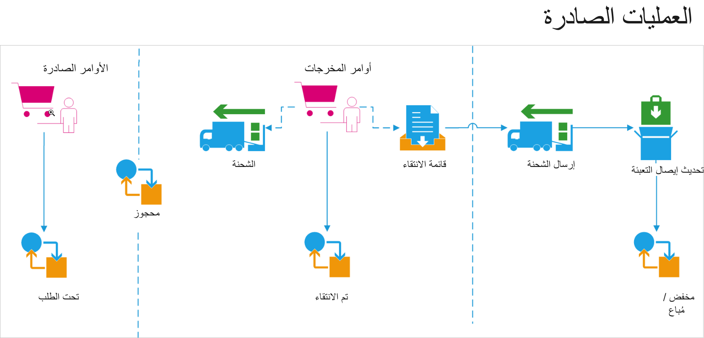
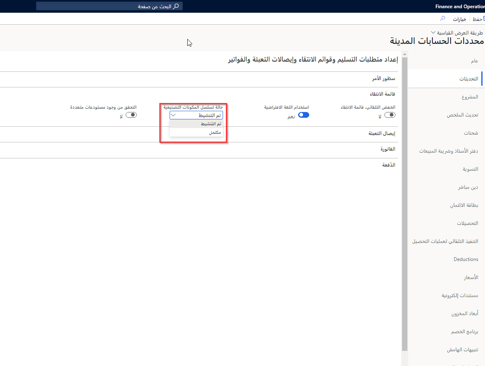
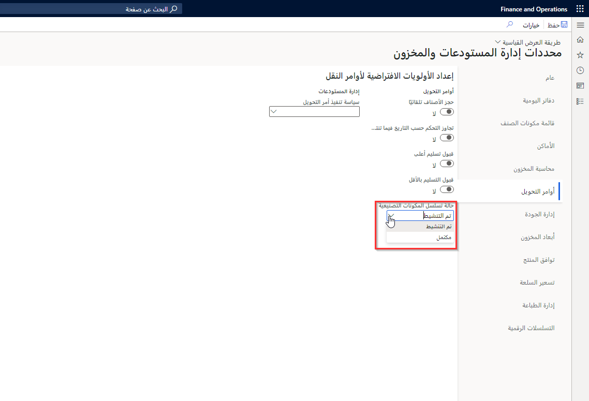
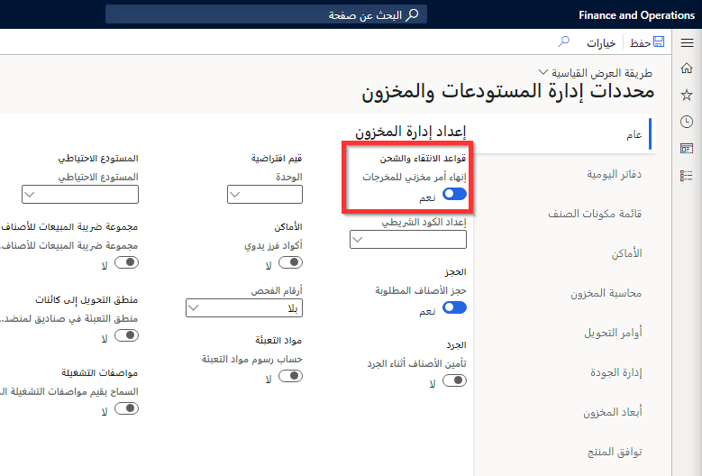
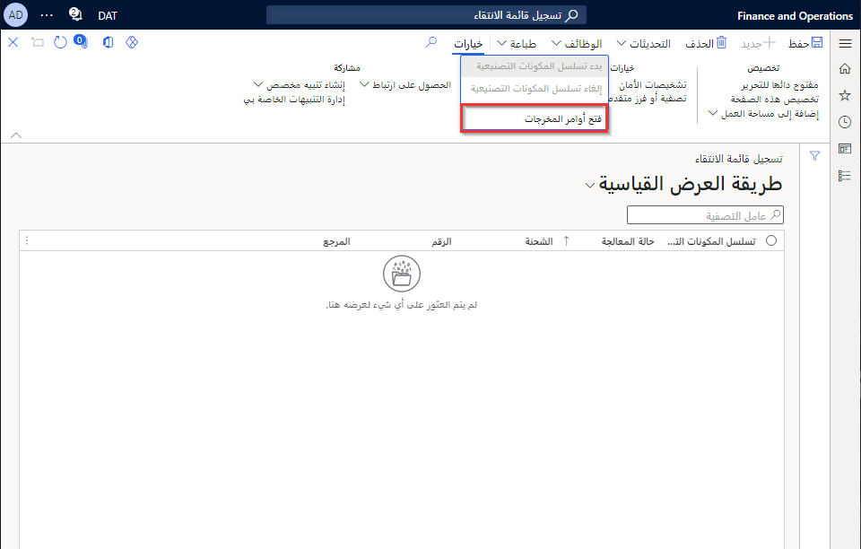
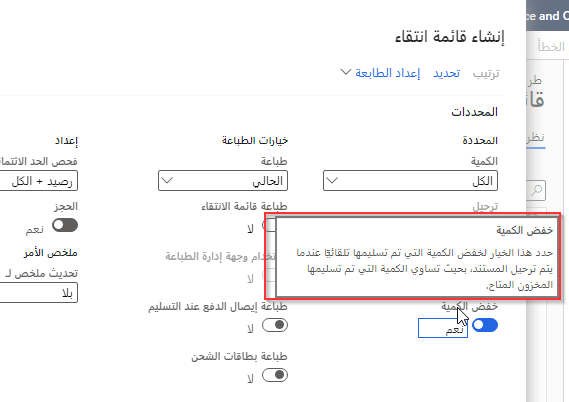
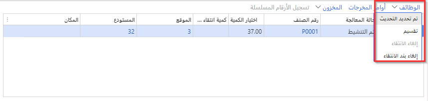
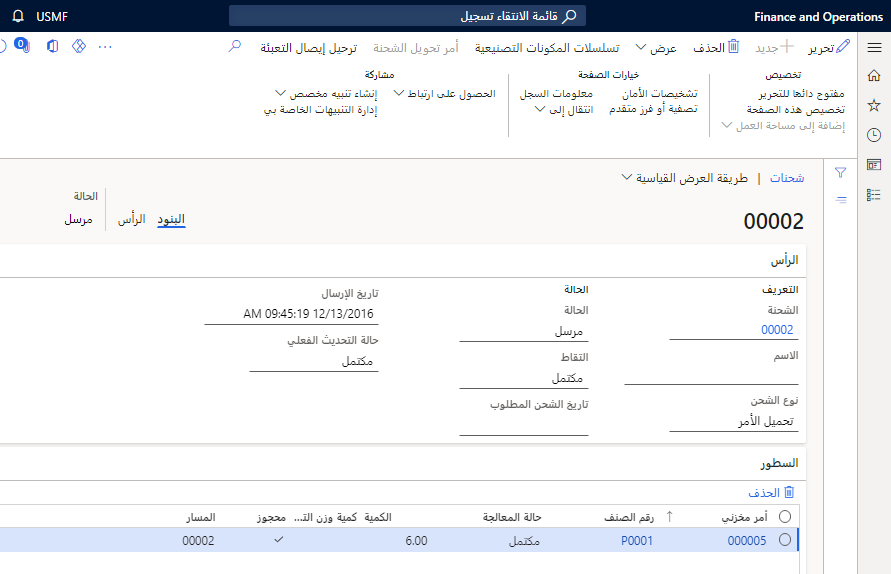

تُستخدم أوامر المخرجات لربط سطور أوامر المبيعات وسطور أوامر النقل بعمليات الانتقاء الصادرة التي تستخدم قوائم الانتقاء.

عند إنشاء قوائم الانتقاء من أوامر المبيعات أو أوامر النقل، يتم إنشاء أوامر المخرجات والشحنات تلقائياً. توجد علاقة واحد لواحد بين قائمة الانتقاء والشحنة. يمكن معالجة شحنة أمر النقل أو إيصال تعبئة أمر المبيعات من الشحنة.

يظهر الشكل التالي نظرة عامة حول العملية الخاصة بالأوامر الخارجية.
 

يمكنك إعداد قواعد صادرة لتحديد كيف ينبغي لـ Supply Chain Management معالجة العملية الصادرة. يمكنك استخدام هذه القواعد للتحكم في عملية الشحن والتحكم في المرحلة أثناء العملية التي يمكن إرسال الشحنة فيها. 

تحدد الإعدادات التالية كيفية معالجة العمليات الصادرة.

## حالة مسار الانتقاء لأوامر المبيعات والتحويل 

انتقل إلى **حساب المقبوضات > الإعداد > معلمات الحسابات المدينة**، ثم من علامة التبويب **التحديثات**، حدد قيمة في حقل **حالة مسار الانتقاء**. 

إذا تم تعيين حقل **حالة مسار الانتقاء** على **مكتمل**، يتم إجراء عملية الانتقاء تلقائياً كجزء من عملية إنشاء قوائم الانتقاء. إذا تم تعيين الحقل إلى **نشط**، فيجب تحديث بنود قائمة الانتقاء يدوياً.
 

يتم تطبيق نفس الإعداد على أوامر التحويل. انتقل إلى **إدارة المخزون > الإعداد > معلمات Warehouse Management والمخزون**، ثم في علامة التبويب **أوامر التحويل**، حدد قيمة في حقل **حالة مسار الانتقاء**.
 

 
## إنهاء أمر مخزني للمخرجات 

انتقل إلى **إدارة المخزون > إعداد > معلمات Warehouse Management والمخزون**، ثم في علامة التبويب **عام**، قم بتعيين خيار **إنهاء أمر مخزني للمخرجات** إلى **نعم**.
 

عندما يقوم عامل المستودع بتقليل كميات قائمة الانتقاء، ستتم إزالة كميات أمر المخزون المقابلة من الشحنة. 
 
عند تحديث قائمة الانتقاء في نقطة زمنية ما، يتم إرسال تقرير بالكميات المتبقية إلى الأمر في حالة تعيين خيار **إنهاء أمر مخزني للمخرجات** إلى **نعم**. 
 
في حالة تعيين خيار **إنهاء أمر مخزني للمخرجات** إلى **لا**، يتم الاحتفاظ بالكميات المتبقية ككمية أمر مخرجات مفتوحة ويجب إضافتها إلى قائمة انتقاء جديدة كجزء من وظيفة **أوامر المخرجات المفتوحة**.

## خفض الكمية 

المعلمة الثالثة التي يمكنك استخدامها كجزء من عملية إنشاء قوائم الانتقاء هي معلمة **تقليل الكمية**. يعمل إعداد هذه المعلمة مع إعداد **الحجز** الذي يشغل عملية الحجز كجزء من الإصدار إلى المستودع.
 

 
## مثال على عملية صادرة لأمر المبيعات 

في هذا المثال، يوجد أمر مبيعات لصنفين. أثناء إنشاء قائمة الانتقاء، حدد **معلمة تقليل الكمية**.
 
بالتالي، يمكنك تحرير بنود الانتقاء وإنشائها فقط للمخزون الفعلي المتاح. يجب الإبلاغ عن الانتقاء بواسطة عملية تسجيل لقوائم الانتقاء (حالة **مسار الانتقاء** = **منشَّطة**).

يتم حجز المخزون الذي لم يتم حجزه بالفعل أثناء إنشاء قائمة الانتقاء. ويمكن إزالة المخزون غير المتاح من أمر المبيعات أو إصداره إلى المستودع للمعالجة الصادرة لاحقاً، عندما يكون المخزون متاحاً للانتقاء.

وبمجرد انتقاء كافة بنود الانتقاء في صفحة **تسجيل قائمة الانتقاء**، يتم إكمال الشحنة المرتبطة. يمكن بعد ذلك تهيئة عملية إيصالات التعبئة لأمر المبيعات استناداً إلى المخزون الذي تم انتقاؤه.
 

