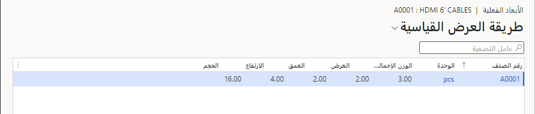

من المهم أن تفكر في الطريقة التي تريد أن يعمل بها مخزونك قبل إعداد أبعاد وأبعاد المخزون. يجب أن يكون نوع وعدد أبعاد المخزون التي يتم إنشائها انعكاساً واقعياً لكيفية تصنيف كل صنف من أصناف المخزون أو معالجته في شركتك.

يتم تقسيم أبعاد المخزون إلى الفئات التالية:

- **أبعاد المنتج** - تساعد في تحديد الخصائص الفعلية لأصناف المخزون. أبعاد المنتج المتاحة في Supply Chain Management هي: التكوين والحجم والنمط واللون.
- **أبعاد التخزين** - تتحكم في كيفية تخزين الأصناف وأخذها من المخزون. باستخدام أبعاد المخزون، يمكنك إدارة المخزون بمستوى تفصيلي. 
- **أبعاد التتبع**- توفر الأرقام التسلسلية والدُفعات للشركات القدرة على تتبع منتجاتها من خلال Supply Chain Management، وهو أمر ضروري لأغراض ضمان الجودة وعندما تتعامل مع ضمانات لمنتج.

## أبعاد التعبئة والتخزين
يمكن تعبئة المنتجات وتخزينها بطرق مختلفة. لذلك، تحتاج إلى إعداد أبعاد فعلية مختلفة لدعم عملياتك. تسمح لك ميزة **أبعاد منتج التعبئة** بإعداد أبعاد متعددة للمنتجات. 

أولاً، يجب تمكين **أبعاد منتج التعبئة** في مساحة العمل **إدارة الميزات**.

مع تمكين الميزة، تتوفر هذه الأبعاد:
- **التخزين** - تُستخدم أبعاد التخزين جنباً إلى جنب مع مقاييس حجم الموقع لتحديد عدد العناصر التي يمكن تخزينها في مواقع المستودعات المختلفة. هذا هو البعد الافتراضي المتاح دون تشغيل ميزة أبعاد منتج التغليف. عندما لا يتم تحديد التعبئة و/ أو التعبئة المتداخلة في منتج ما، سيتم إعداد أبعاد التخزين في **المنتجات الصادرة** > **إدارة المخزون** علامة التبويب > **الأبعاد المادية**.
- **التعبئة** - تُستخدم أبعاد التعبئة أثناء التعبئة بالحاويات وعملية التعبئة اليدوية لتحديد عدد العناصر المناسبة في أنواع الحاويات المختلفة.
- **التعبئة المتداخلة** - تُستخدم أبعاد التعبئة المتداخلة عندما تحتوي عملية التعبئة على مستويات متعددة.

لإعداد أبعاد **التعبئة** و **التعبئة المتداخلة** اتبع الخطوات التالية:

1.  انتقل إلى **المنتجات الصادرة** > **إدارة المخزون** علامة التبويب > **أبعاد المنتج المادي**.
2.  حدد النوع **البعد المادي**.
3.  أدخل أبعاد المنتج:
    - الوحدة المادية
    - الوزن
    - وزن الوحدة
    - العمق
    - الارتفاع
    - العرض
    - طول الوحدة
    - وحدة الحجم - سيتم حساب الحجم.

 

عندما تحاول وضع منتج في منطقة غير مناسبة، ستتلقى خطأً يفيد بأن المنتج لن يتناسب مع المنطقة بناءً على أبعادك.

## أبعاد المنتج الإصدار
الإصدار هو أحد أبعاد المنتج الذي يساعدك في الحفاظ على إصدارات متعددة من المنتج وتعقبها عبر سلسلة التوريد. يعمل تعقب الإصدار بطريقة مشابهة لأبعاد المنتج الأخرى (الحجم والنمط واللون والتكوين). بالتالي، يمكنك استخدامه لأغراض أخرى إلى جانب تعقب إصدارات المنتج.

يجب تشغيل بعد منتج الإصدار تحت **إدارة النظام > الإعداد > تكوين الترخيص > مفاتيح التكوين > التجارة > بُعد المنتج - الإصدار**.

 
عند تمكين **بُعد المنتج - الإصدار**، ستجده تحت **إدارة معلومات المنتج > الإعداد > مجموعات الأبعاد والمتغيرات > الإصدارات**.

