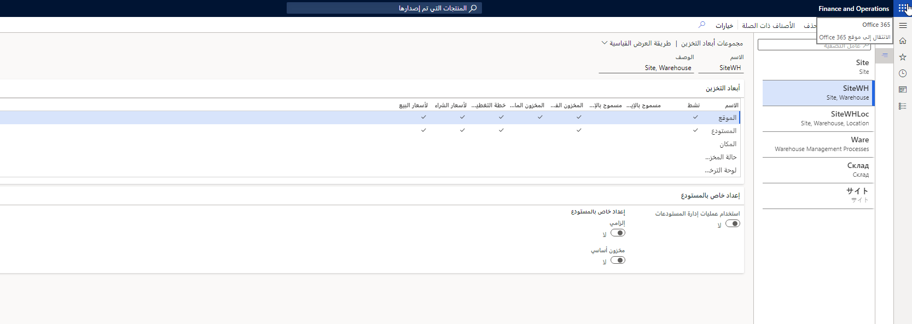

تمثل أبعاد مخزون التخزين الطرق المختلفة التي يتم من خلالها تخزين الأصناف واستردادها من المخزون. وهذه تسمح بإدارة المخزون على مستوى تفصيلي. يعتمد نوع التفاصيل التي تنطبق على إنشاء أبعاد التخزين على احتياجات الشركة وتوقعاتها. خذ بعين الاعتبار صلة كل بُعد، خاصة عندما يكون للأصناف احتياجات معالجة خاصة.

فيما يلي أبعاد التخزين المتوفرة في Supply Chain Management:

- الموقع
- المستودع
- الموقع
- حالة المخزون
- لوحة الترخيص

يجب تعيين مجموعة أبعاد تخزين لمنتج تم إصداره. تستخدم مجموعات أبعاد التخزين في تحديد كيفية تخزين المخزون في المستودع الخاص بك. تتضمن Supply Chain Management بعض أبعاد المخزون والخيارات التي ينبغي لك مراعاتها عند إنشاء مجموعات الأبعاد.  

**إدارة معلومات المنتج > الإعداد > مجموعات الأبعاد والمتغيرات > مجموعات أبعاد التخزين**

قد تتضمن بعض الأمثلة المتطلبات التالية:

- يجب المحافظة على منتجات الألبان باردة.
- ويجب أن يكون من السهل تعريف البضائع الصيدلية.
- يجب الاحتفاظ بالأيس كريم مجمداً.

### السيناريو 

لدى إحدى شركات الدراجات عدة منشآت لتخزين أجزاء الدراجات وتصنيعها. في كل منشأة، يتم تخزين مسننات من 10 سرعات في صندوق واحد، ويتم تخزين المسننات من 12 سرعة في صندوق آخر. ومع ذلك، نظرا لأن يتم تحديد أحجام إطار الدراجات بسهولة، فإنه لا يتم فصلها في المستودع. يتم تخزين إطارات الرئيسية والفرعية في نفس الحوامل. وترغب الشركة في ضمان الاحتفاظ بجرد دقيق للمخزون لكافة الأجزاء.

## إلزامي 

حدد شريط التمرير **إلزامي** في صفحة **مجموعات أبعاد التخزين** لجعل البُعد إلزامياً. يظهر البُعد الإلزامي على كافة دفاتر اليومية والحركات، ويجب عليك تحديد قيمة بُعد عند إنشاء إدخال. 

يتم تطبيق القواعد التالية: 

- تكون أبعاد المنتج إلزامية دائماً.
- عندما تكون وظيفة المواقع المتعددة نشطة، يكون بُعد تخزين الموقع إلزامياً.
- يعتبر تعيين بُعد تخزين المستودع كإلزامي أمراً اختيارياً.
- لا يمكنك تحديد أبعاد المخزون المتبقية كإلزامية.

## المخزون الأساسي 

لإعداد أبعاد المخزون كمخزون أساسي، في صفحة **مجموعات أبعاد التخزين**، حدد شريط التمرير **المخزون الأساسي**. (إذا كنت ترغب في أن يكون هو المخزون الثانوي، فلا تقم بتحريك شريط التمرير.)

سيظهر بُعد المخزون الأساسي تلقائياً في صفحتي **المتاح** و **الحجز**. ويؤثر ذلك على كيفية إعادة حجز الأصناف المطلوبة بناء على إيصالات الأصناف الفعلية. يتم تطبيق القواعد التالية:

- يجب تحديد البُعد عندما تقوم فعلياً بتحديث عمليات استلام الأصناف أو الإصدارات.
- عند تنشيط الحجز التلقائي، يتم حجز الأصناف وفقاً للبُعد المحدد، شريطة أن يتم تحديد البُعد أيضاً لحركة الصنف الفعلية. وهذا يعني أنه في حالة تحديد المستودع في بند أمر المبيعات، وتم تحديد المخزون الأساسي، يقوم الحجز التلقائي بحجز الأصناف في هذا المستودع فقط.
- ولا تتم إعادة حجز عمليات الحجز المطلوبة بناء على عملية الاستلام الفعلية. إذا تم حجز بند أمر مبيعات بالمستودع أ والموقع 1، وتم تعيين المستودع إلى المخزون الأساسي وتعيين الموقع إلى المخزون الثانوي، فلن يتم تلقائياً إعادة حجز بند أمر المبيعات إذا تغيّر المستودع عند تحديث عمليات الاستلام فعلياً. إذا تغير الموقع إلى 2، سيقوم بند الأمر تلقائياً بإعادة الحجز للموقع 2.

## السماح بالإيصال الفارغ والسماح بالإصدار الفارغ 

حدد خانتي الاختيار **مسموح بالإيصال الفارغ** أو **مسموح بالإصدار الفارغ** في صفحة **مجموعات أبعاد التخزين** لتطبيق النتائج التالية:

- **مسموح بالإيصال الفارغ** - في حالة عدم تحديد البعد كمخزون أساسي، فإن تحديد خانة الاختيار هذه يؤدي إلى ترك مواصفات البُعد عند تحديث عمليات الاستلام الفعلية. تعتبر هذه الوظيفة مفيدة، على سبيل المثال، عندما لا يتم تحديد رقم الشحنة/المسلسل عند الإدخال ولكن مع القيام بذلك للانتقاء والإخراج.
- **مسموح الإصدار الفارغ** - في حالة عدم تعليم البُعد كبعد منتج أو كمخزون أساسي، فإن تحديد هذا الحقل يؤدي إلى ترك مواصفات البُعد عند تحديث عمليات الإصدار الفعلية.

## المخزون الفعلي 

حدد خانة الاختيار **المخزون الفعلي** لتحديد إدخال البُعد في المخزون الفعلي عندما يقوم النظام بالتحقق مما إذا كان الصنف متوفراً في المخزون أم لا.

## المخزون المالي 

حدد خانة الاختيار **المخزون المالي** للإشارة إلى أن هذا البعد جزء من المخزون المالي. 

تكون المعلمة في مهمة إذا كنت لا تعمل بمخزون سالب مالياً مع التحديث المالي لإصدارات الأصناف، على سبيل المثال، تحديث الفاتورة في الوحدة النمطية للحسابات المدينة. يفحص النظام المخزون الفعلي المالي تبعاً لإصدارات الأصناف وفقاً لنفس المنطق الموضح في الموضوع المتعلق بالمخزون الفعلي.

تحدد **معلمة المخزون المالي** أيضاً كيفية حساب استهلاك الصنف عند تحديث الفاتورة وإقفال المخزون ومحاسبة التكاليف لقيمة التكلفة.

## خطة التغطية حسب البُعد 

حدد خانة الاختيار **خطة التغطية حسب البعد** في صفحة **مجموعات أبعاد التخزين** لإكمال خطة التغطية للصنف بشكل فردي، بدلاً من إكمالها كمجموعة.

## لسعر الشراء

عند تحديد خانة الاختيار **لسعر الشراء** في صفحة **مجموعات أبعاد التخزين**، يعتمد البحث عن أسعار الشراء على القواعد التالية:

- البحث عن السعر لكل صنف ولأبعاد المنتج وأبعاد التخزين
- البحث عن السعر لكل صنف ولأبعاد المنتج (أبعاد التخزين تكون فارغة)
- البحث عن السعر لكل صنف (كل من أبعاد المنتج وأبعاد التخزين تكون فارغة)

## لأسعار البيع

عند تحديد خانة الاختيار **لسعر البيع** في صفحة **مجموعات أبعاد التخزين**، يعتمد البحث عن أسعار البيع على القواعد التالية:

- البحث عن السعر لكل صنف ولأبعاد المنتج وأبعاد التخزين
- البحث عن السعر لكل صنف ولأبعاد المنتج (أبعاد التخزين تكون فارغة)
- البحث عن السعر لكل صنف (كل من أبعاد المنتج وأبعاد التخزين تكون فارغة)

