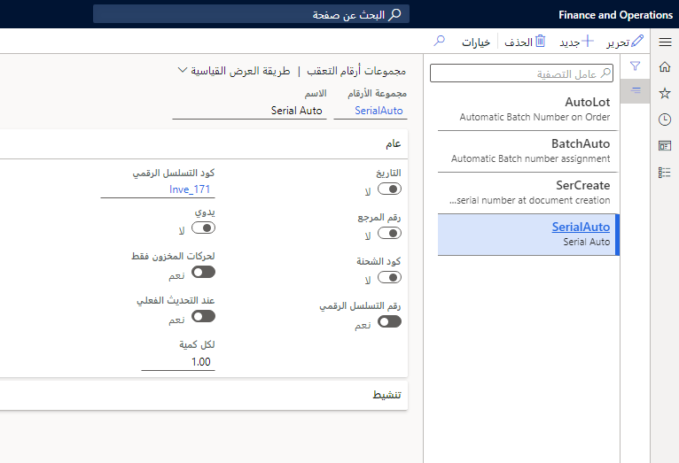

يتم تعيين أرقام الدُفعات إلى مجموعات من الأصناف المادية ويتم تعيين الأرقام التسلسلية إلى أصناف مادية فردية. بعد ذلك، يتم تحديد هذه الأرقام في حركة المخزون لتحديد المنتج الجاري استلامه أو تسليمه.

يمكن استخدام أرقام الدُفعات والأرقام التسلسلية معاً أو بشكل فردي.

### السيناريو 

تُستخدم عادةً أرقام الدُفعات والأرقام التسلسلية عندما تتعامل مع المواد الغذائية وأنواع أخرى من المنتجات التي يستهلكها الإنسان، مثل المستحضرات الدوائية. ويمكن استخدامها أيضاً بشكل متكرر عند التعامل مع مواد خطرة أو حساسة، مثل المواد الكيميائية أو الأصناف التي يجب تبريدها.

افترض أن لديك خزاناً كبيراً يُستخدم لإنتاج منتجات الألبان. يتم تنظيف الخزان وتفريغه قبل بدء كل أمر إنتاج. لقد قمت بإنتاج 10,000 غالون من المثلجات ثم قمت بتعبئة المثلجات في حاويات بسعة غالون واحد.

يمكنك استخدام رقم الدُفعة لتعريف دُفعة أو خزان المثلجات التي تم إنتاجها، ثم استخدام رقم تسلسلي لتعريف كل حاوية بسعة غالون واحد تم إنتاجها. ومن خلال القيام بذلك، يمكنك تتبع الحاوية الدقيقة وخزان المثلجات التي تم إنتاجها، حتى لو كانت الحاويات الفردية مقسّمة حول المستودع أو مشحونة إلى عملاء مختلفين.

## الأرقام التسلسلية 

يمكن تعيين الأرقام التسلسلية يدوياً أو تلقائياً إلى المنتجات على الإيصال. استخدم التوزيع اليدوي لأرقام الدُفعات والأرقام التسلسلية إذا أردت إعادة تتبع الأصناف حتى المورّد. 

على سبيل المثال، عندما تستلم الأصناف الكيميائية أو الطبية، تأكد من أنك تواصل استخدام أرقام الدُفعات والأرقام التسلسلية التي وفرها لك المورّد بحيث تتمكن من تتبع الأصناف المعيبة واسترجاعها عبر سلسلة التوريد.

يتطلب منك التوزيع اليدوي للأرقام التسلسلية إعداد مجموعة أبعاد المخزون ورقم تسلسلي للصنف المحدد في صفحة **الرقم التسلسلي**. يمكنك أيضاً إعداد الأرقام التسلسلية بشكل مسبق.

افتح صفحة **الأرقام التسلسلية** من **إدارة المخزون > الاستعلامات والتقارير > أبعاد التعقب > الأرقام التسلسلية**.
 

## تعيين الأرقام التسلسلية 

يمكنك تعيين رقم تسلسلي إلى منتج بطريقة يدوية عند تنفيذ المهام التالية:

- العمل على أحد المنتجات مباشرةً على بند أمر مبيعات أو أمر شراء
- تسجيل المنتجات في وقت وصول الصنف

يمكن كتابة أي رقم مباشرةً على البند في حقل **الرقم التسلسلي**. ومع ذلك، إذا أردت التحكم بشكل أفضل في الأرقام التسلسلية المستخدمة لكل صنف، فأنشئ أرقاماً تسلسلية لرقم منتج على صفحة **الأرقام التسلسلية**.

إذا تم تعيين الأرقام التسلسلية يدوياً إلى حركات الصنف، وإذا كان خيار **التحكم في الأرقام التسلسلية** محدداً لمجموعة أبعاد التعقب للصنف، فسيُضاف أي رقم تسلسلي تم تعيينه يدوياً إلى صفحة **الأرقام التسلسلية**.

يتم تعيين الرقم التسلسلي المحدد في حقل **الرقم التسلسلي** على بند أمر الشراء لجميع المنتجات على البند. إذا كان الخيار **التحكم في الأرقام التسلسلية** محدداً لمجموعة أبعاد الصنف، فيجب أن تكون الأرقام التسلسلية فريدة لكل صنف، ولا يمكنك تعيين رقم تسلسلي إلى بند الأمر إذا كانت الكمية أكبر من واحد.

عند إدخال الرقم التسلسلي، أدخل علامة الرقم (#) للإشارة إلى عدد الأرقام التي تريد ظهورها في الرقم التسلسلي. الحد الأدنى لعدد علامات الأرقام في رقم تسلسلي يساوي عدد الأرقام في كمية الصنف.

ينشئ دائماً الزر **إنشاء أرقام تسلسلية** أرقاماً تسلسلية فريدة. إذا أردت تعيين الأرقام التسلسلية نفسها لكميه أخرى، فاكتب الأرقام التسلسلية يدوياً في **الحركات/تسجيل الآن** واستخدم وظيفة التقسيم. بدلاً من ذلك، يمكنك استخدام مجموعة أرقام لإنشاء الأرقام التسلسلية بشكل تلقائي مع كمية ثابتة بدلاً من وحدة واحدة.

إذا تم تعيين الأرقام التسلسلية تلقائياً، فلن تتم إضافة الأرقام التسلسلية المُدخلة على بنود أمر الشراء أو الإنتاج إلى صفحة **الأرقام التسلسلية**.

## أرقام الدُفعات 

يجب إنشاء رقم الدُفعة قبل تعيينه إلى منتج. بعكس تعيين الرقم التسلسلي، لا يمكن إدخال رقم الدُفعة مباشرة في الحقل **رقم الدُفعة** على بند الأمر. يجب إنشاؤه على صفحة **رقم الدُفعة**، ثم تحديده من البند إما في أمر المبيعات أو في أمر الشراء.

لإنشاء أرقام الدُفعات أو عرضها، انتقل إلى **إدارة المخزون > الاستعلامات والتقارير > أبعاد التعقب > الدُفعات** لإنشاء أرقام تعقب لأرقام الدُفعات التي سيتم تعيينها إلى أحد المنتجات.
 

## مجموعات أرقام التعقب 

إذا أردت استخدام التوزيع التلقائي للأرقام التسلسلية أو أرقام الدُفعات، فانتقل إلى **إدارة المخزون > الإعداد > الأبعاد > مجموعات أرقام التعقب** لإنشاء أرقام التعقب للأرقام التسلسلية وأرقام الدُفعات التي سيتم تعيينها إلى أحد المنتجات.

لتوزيع الأرقام التسلسلية أو أرقام الدُفعات بشكل تلقائي، يمكنك إنشاء مجموعة أرقام وتعيينها إلى الصنف. يمكن تعيين الأرقام التسلسلية وأرقام الدُفعات إلى منتجات متعددة، بشكل تسلسلي من مجموعة الأرقام نفسها.
 

في مجموعة الحقول **عام**، حدد الوقت الذي يجب أن يتم فيه تعيين الرقم التلقائي وكيفية القيام بذلك مع أخذ الحقول التالية في الاعتبار:

- **يدوي** - حدد هذا الخيار لتعيين أرقام تسلسلية وأرقام دُفعات يدوية إلى المنتجات المقترنة بمجموعة الأرقام هذه.
- **لحركات المخزون فقط** - حدد هذا الخيار لتعيين الأرقام التي تم إنشاؤها إلى الحركة، بدلاً من تعيينها، على سبيل المثال، إلى بند أمر الشراء. يتم إنشاء الأرقام التسلسلية وأرقام الدُفعات ويتم تعيينها عند إنشاء أمر شراء. ولا يمكن عرض الأرقام من بند أمر الشراء. ومع ذلك، يتم إدراج حركة واحدة على صفحة **الحركات** مع رقم تسلسلي أو رقم دُفعة واحد.
- **عند التحديث الفعلي** - حدد هذا الخيار لتعيين الرقم الذي تم إنشاؤه عند إنشاء حركة منتج. ويعني هذا الأمر أن الأرقام التسلسلية وأرقام الدُفعات لا تنشأ حتى يتم ترحيل إيصال تعبئة وقائمة انتقاء. ولا يمكن عرض الأرقام التسلسلية على بند أمر الشراء. ومع ذلك، يتم إدراج حركة واحدة على صفحة **الحركات** مع رقم تسلسلي واحد.
- **لكل كمية** - حدد كمية المنتجات التي يجب تعيينها إلى الرقم الذي نشأ. لتعيين أرقام تسلسلية وأرقام دُفعات فريدة، اكتب **1** في الحقل **لكل كمية**. يجب تحديد شريط التمرير **لحركات المخزون فقط** لكي يكون هذا الحقل نشطاً.

على سبيل المثال، إذا تم تحديد شريط التمرير **لحركات المخزون فقط**، يتم تحديد 25 في الحقل **لكل كمية** ويتم إنشاء أمر شراء لستين منتجاً، ثم يتم إنشاء ثلاثة أرقام دُفعات أو أرقام تسلسلية عند إنشاء أمر الشراء. بعد ذلك، يتم تعيين رقم الدُفعة أو الرقم التسلسلي الأول إلى 25 منتجاً، ويتم تعيين رقم الدُفعة أو الرقم التسلسلي الثاني إلى 25 منتجاً آخر، ويتم تعيين الرقم التسلسلي الثالث إلى 10 منتجات.

إذا كان شريط تمرير **التحكم في الأرقام التسلسلية** محدداً على علامة التبويب السريعة **الأرقام التسلسلية** لأحد المنتجات، فستظهر رسالة خطأ إذا حاولت ترحيل إيصال التعبئة مع منتج، إذا تم تحديد **2**، على سبيل المثال، في الحقل **لكل كمية** لمجموعة **الرقم التسلسلي**. 

إذا لم تحدد أي واحد من هذه الحقول، فسيتم تعيين رقم دُفعة أو رقم تسلسلي واحد إلى بند أمر الشراء عند إنشاء أمر جديد وحفظه.

خذ في الاعتبار الحقول التالية لعمليات التنشيط التلقائية:

- **تنشيط الأمر** - حدد هذا الخيار لتمكين التوزيع التلقائي للأرقام في الوحدتين النمطيتين "الحسابات المدينة" و"المبيعات والتسويق". يؤدي ذلك أيضاً إلى إنشاء أرقام جديدة عند إرجاع المنتجات بواسطة الإشعارات الدائنة.
- **تنشيط الشراء** - حدد هذا الخيار لتمكين التوزيع التلقائي للأرقام في الوحدات النمطية "الحسابات الدائنة" و"التدبير والتوريد".
- **تنشيط المخزون** - حدد هذا الخيار لتمكين التوزيع التلقائي للأرقام في الوحدة النمطية "إدارة المخزون والمستودعات". على سبيل المثال، تكتشف خمسة منتجات في المستودع غير موجودة في المخزون. لإضافة منتجات إلى المخزون، أنشئ دفتر يومية الربح/الخسارة للمنتجات الخمسة. عند ترحيل دفتر يومية الربح/الخسارة، يتم توزيع الأرقام التسلسلية على المنتجات وفقاً لإعدادات مجموعة أرقام التعقب.
- **تنشيط الإنتاج** - حدد هذا الخيار لتمكين التعيين التلقائي للأرقام في الوحدة النمطية "التحكم بالإنتاج".
- **تنشيط كانبان** - حدد هذا الخيار لتمكين التعيين التلقائي للأرقام في وحدة التصنيع الخالي من الهدر.‬

الإعداد العادي هو تحديد جميع الحقول باستثناء **تنشيط الأمر** لأنك لا تريد تمكين تغيير الأرقام التسلسلية عند تنفيذ إجراء إرجاع.

يمكن تحديث الأرقام التسلسلية وأرقام الدُفعات إذا لزم الأمر. عند إدخال بُعد مخزون على حركة استلام، يمكنك تغيير القيمة باستخدام دفتر يومية **التحويل**. يتسبب تغيير أبعاد المخزون في حدوث حركة على المخزون المُتاح من بُعد إلى آخر.

