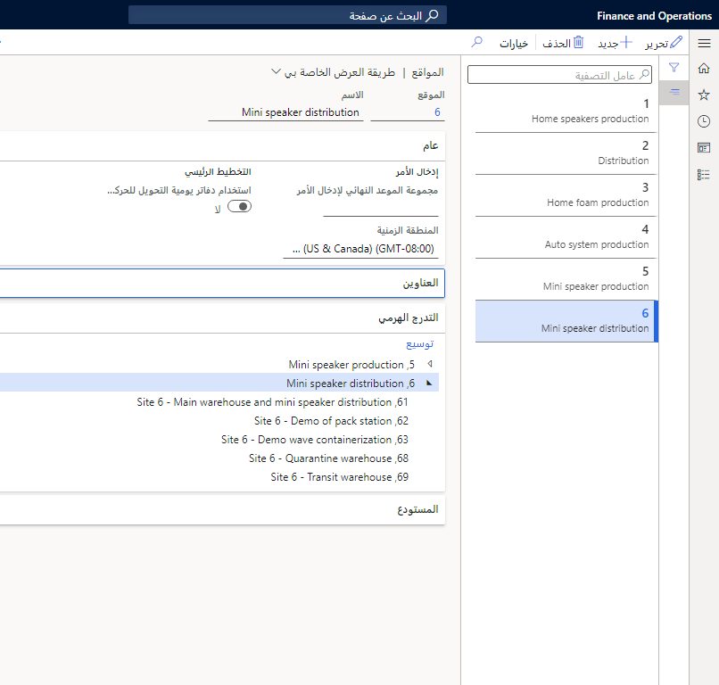

المواقع هي أبعاد تخزين المخزون ويمكن ربطها بإطار عمل الأبعاد المالية لتكامل دفتر الأستاذ العام. يجب إنشاء موقع واحد على الأقل لكل كيان قانوني في Supply Chain Management، ويجب أن تشير جميع الحركات إلى موقع. لا يمكن مشاركة موقع واحد بواسطة كيانات قانونية متعددة. يمكن للشركة إنشاء عمليات لوجستية في مواقع متعددة لأسباب عديدة.

على الرغم من أن المواقع هي الإعداد الوحيد المطلوب، إلا أننا نوصي بإعداد أبعاد المخزون الأخرى بناءً على متطلبات العمل. 

يوفر كل إعداد لأبعاد المخزون المادي مستوى آخر من التفاصيل لتخزين وإصدار المخزون في نظامك. يساعد هذا في توفير تقارير مفصلة بشكل أفضل وكميات متاحة تكون أكثر تحديداً للموقع الفعلي للعناصر.

قد تتضمن إعدادات أبعاد المخزون المادي هذه إنشاء مراكز توزيع تخدم أسواقاً جغرافية مختلفة أو إنشاء مرافق إنتاج في موقع ما بسبب انخفاض التكاليف العامة أو القرب من المواد الخام أو النقل المريح.

على سبيل المثال، يمكنك تكوين مواقع متعددة لتعكس نموذج عملك الفريد ودعم العمليات وعمليات سير مهام العمليات. تتضمن أمثلة بيئات العمل حيث يمكنك إنشاء مواقع متعددة ما يلي:

- موقع إنتاج واحد يستخدم مستودعاً واحداً
- موقع إنتاج واحد يستخدم مستودعات متعددة
- مواقع إنتاج متعددة تستخدم مركز توزيع مشتركاً
- مواقع إنتاج محلية متعددة تستخدم موقع إنتاج مشتركاً

لإنشاء موقع جديد، انتقل إلى **إدارة المخزون > الإعداد > تقسيم المخزون > المواقع**.
 

عند إنشاء موقع، يمكنك حذفه فقط إذا:

- لم تتم الإشارة إلى الموقع من المستودعات أو موارد الإنتاج أو البيانات الرئيسية الأخرى.
- كان لا يوجد مخزون متاح مفتوح مرتبط بالموقع.

إذا لم تتحقق أي من هذه الشروط، تعرض Supply Chain Management رسالة خطأ، ولا يمكنك حذف الموقع.
