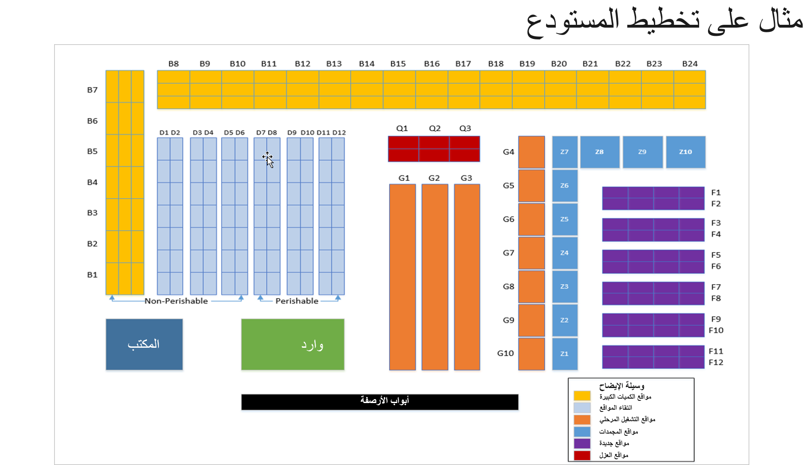

المستودع هو مكان يمكنه تخزين الأصناف. يجب وضع جميع الأصناف التي يحسبها النظام في المستودع. نظراً لإعداد العديد من المعلمات والسياسات لكل مستودع، يمكنك التحكم في عمليات المستودع والتمييز بينها من خلال تحديد عدة مستودعات.

عادة ما تكون المستودعات عبارة عن موقع جغرافي، أو أنها تؤدي وظيفة معينة، مثل مستودع قطع الغيار أو مستودع البضائع الجاهزة. عندما يكون لديك عدة مستودعات، يمكن تقسيم إجمالي المخزون الفعلي. يمكن إرفاق جميع حركات الصنف بمستودع يتبع بعد ذلك الحركات من خلال النظام.

عندما تشير إلى مستودع حركة ما، حدد الموقع حيث يمكنك وضع أو اختيار عنصر جغرافياً. ويعني هذا أنك تستخدم مستودعات منفصلة لمواقع جغرافية مميزة.

في بعض الحالات، يمكن أن يكون لديك مستودعات افتراضية. ويعني هذا أن المستودع قد لا يكون مبنى مادياً منفصلاً، ولكن قد يكون فصلاً منطقياً أو جزءاً من مبنى. يمكن استخدام هذه الاستراتيجية لتلبية متطلبات الأعمال المعقدة.

لإنشاء مستودع جديد، انتقل إلى **إدارة المخزون > الإعداد > تقسيم المخزون > المستودعات**.
 

لا ينبغي استخدام المستودع كبعد مخزون مالي. بدلاً من ذلك، يجب عليك إنشاء مواقع منفصلة.

## أنواع المستودعات 

عند إنشاء مستودع، حدد نوع المستودع على النحو التالي:

- **افتراضي** - مستودع رئيسي.
- **العزل** - إرفاق مستودعات من نوع العزل بالمستودعات العادية من النوع الافتراضي. عند شراء العناصر التي يتم التحكم فيها في وحدة العزل إلى مستودع، يتم وضعها تلقائياً في المستودع من نوع العزل المرفق بمستودع الاستلام. عند إنهاء العزل، يتم نقل الأصناف بعد ذلك إلى مستودع الإيصالات المحدد.
- **النقل** - يُستخدم لأوامر النقل ووظيفة التحكم في تاريخ التسليم. مستودعات النقل هي مستودعات وسيطة للنظام التقني بين مستودعات **من** و **إلى** أو المستودع وموقع التسليم مع وظيفة التحكم في تاريخ التسليم.

يمكن تنظيم المستودع في مواقع للاحتفاظ بالمواد المخزنة في مواقعها المناسبة. عادة في مستودع بسيط، يحتوي موقع المستودع على شكل ممر-كامل-رف-صندوق.

يوضح الشكل التالي عينة من تخطيط مستودع بقالة.
 

يمكنك تحديد أوقات النقل للمستودع المحدد عن طريق تحديد الزر **نقل**. تُستخدم أوقات النقل في حساب تاريخ التسليم عندما تستخدم عنصر التحكم في تاريخ التسليم مع أوامر النقل.

إذا لم تحدد مستودعاً للمنتج، يمكنك تحديد المستودع الذي سيتم بيع المنتجات منه أو شراؤها على رأس أمر الشراء والمبيعات وعلى البنود الفردية.

ينطبق المستودع المحدد في العنوان على جميع البنود، ما لم يتم تحديد خلاف ذلك بشكل فردي، إما على المنتج أو يدوياً في بند أمر.

## ممرات المخزون 

تم تقسيم المستودع إلى ممرات المخزون. تُستخدم ممرات المخزون لتجميع المواقع. يحتوي الممر على معرف الممر ورقم الممر، ويمكن أن يكونا متماثلين. معرف الممر، عادةً الجزء الأول من اسم الموقع، هو معرف أبجدي رقمي للممر. تساعد الرسائل في تحديد مستودع أو منطقة داخل المستودع.

رقم الممر هو تعريف رقمي صارم للممر في المستودع. يستخدم النظام رقم الممر عند إنشاء رموز الفرز. يمكنك تعيين معرفات فريدة لممر المخزون باستخدام حقلي **المستودع** و **الممر**.

بشكل افتراضي، يتم فرز ممرات المخزون بترتيب تصاعدي. ومن خلال تحديد حقل **تنازلي**، يمكنك عكس مسار الانتقاء للممر ذي الصلة. يغير هذا الترتيب من أعلى قيمة إلى أقل قيمة.

## الموقع 

يشير مصطلح الموقع إلى المكان الذي يتم فيه تخزين الأصناف وسحبها منه. الموقع هو المؤشر الأكثر تحديداً لمكان تخزين الأصناف في المستودع. بالنسبة لكل موقع، يمكن أيضاً تحديد المكان الذي يتم فيه إدراج الصنف. بشكل افتراضي، يكون هذا نفس الشيء. يتم عادةً إدراج الأصناف وسحبها من نفس الجانب من الموقع، ولكن ليس دائماً. 

على سبيل المثال، يتم إدخال الأصناف المخزنة في رفوف تخزين مباشرة من أحد الممرات ويتم سحبها من ممر آخر. يتم تحديد الإدخال الرئيسي باسم الموقع، والذي يتم تحديده عادةً من خلال إحداثياته: المستودع، والممر، والحامل، والرف، والصندوق. يمكن إدخال هذا الاسم أو المعرف يدوياً أو إنشاؤه من إحداثيات الموقع - على سبيل المثال، 1-2-3-4 للممر 1، الحامل 2، الرف 3، الحاوية 4 - في صفحة **مواقع المخزون**. 

يحتوي الموقع على الخصائص التالية:

- الحجم (الارتفاع والعرض والعمق وما إلى ذلك في وحدة التخزين)
- موضع المستودع والممر والحامل والرف والصندوق
- نوع الموقع (الموقع المجمع، أو موقع الانتقاء، أو رصيف وارد، أو رصيف صادر، أو موقع إدخال الإنتاج، أو موقع الفحص، أو سوبر ماركت كانبان)
- يمكن استخدام نص التحقق في الأنظمة عبر الإنترنت للتحقق من أن المشغل قد حدد الموقع الصحيح لصنف معين. يمكن إنشاء نص التحقق هذا يدوياً أو افتراضياً.

استخدام الموقع اختياري. إذا تم استخدام المواقع، فسيتم تخزين الأصناف في المواقع، ويمكن للنظام تحديد مسارات الانتقاء وعمليات العد وما إلى ذلك، بناءً على المواقع.

يتم عادةً إدراج الأصناف وسحبها من نفس الجانب من الموقع، ولكن ليس دائماً. علي سبيل المثال، يمكن تخزين الأصناف في نوع خاص من الحوامل، يعرف أيضاً باسم "حامل سير العمل". يشير هذا إلى المكان الذي يتم فيه إدراج الأصناف من ممر واحد وسحبها من ممر آخر.

جنباً إلى جنب مع المستودع، تحدد هذه الإحداثيات الأربعة بالضبط المكان الذي يجب أن يكون فيه الصنف، أو يكون، في المستودع: المستودع - الممر - الحامل - الرف - الصندوق.

فيما يلي أمثلة على أنواع المواقع:

- **الموقع المجمع** - المنطقة الموجودة في المستودع حيث يتم تخزين الأصناف المستلمة حتى يقوم عامل المستودع بنقل الأصناف إلى مواقع الانتقاء. تُستخدم المواقع المجمّعة لتجديد مواقع الانتقاء حيث يتم تقليل مخزونها ويتم استخدامها أيضاً في الانتقاء.
- **موقع الانتقاء** - حيث يتم تخزين الأصناف حتى يتم انتقاؤها للشحن. يتم الاحتفاظ بها هنا لضمان سهولة الوصول إليها من أجل الانتقاء. يتم استخدام موقع الانتقاء لانتقاء كميات صغيرة من صنف. يمكن أن يحتوي الصنف على موقع انتقاء واحد فقط في كل مستودع.
- **مساحة الوارد** - الموقع في المستودع حيث يتم استلام الأصناف وربما التحقق منها (هذا هو الوضع الافتراضي إذا لم يتم تحديده في مكان آخر).
- **مساحة الصادر** - الموقع في المستودع حيث يتم الشحن (هذا هو الإعداد الافتراضي إذا لم يتم تحديده في مكان آخر).
- **موقع إخراج الإنتاج** - الموقع الذي تصل إليه الأصناف الجاهزة من أرضية المتجر.
- **موق الفحص** - الموقع الذي تتم فيه عمليات الفحص.
- **سوبر ماركت كانبان** - الموقع الذي يتم فيه التحكم في المخزون ومعالجته لمنتجات العمل قيد التنفيذ (WIP) في بيئة تصنيع Lean.

## موضع الموقع 

يمكنك تصنيف موضع الموقع بطريقتين:

- **مناطق الإدخال** - مواقع في المستودع مخصصة لوضع الأصناف في المستودع عند الاستلام. يتم تجميع الأصناف بناءً على خصائص متشابهة أو ترتيب وضعها في مواقعها. يمكنك تحديد منطقة الإدخال لموقع في علامة التبويب **عام** في صفحة **مواقع المخزون**.
على سبيل المثال، ستكون الأصناف التي تتطلب تخزيناً بارداً في منطقة إدخال واحدة، في حين أن الأصناف التي يمكن تخزينها في منطقة تخزين المستودع العامة ستكون في منطقة أخرى.
- **مناطق الانتقاء** - يتم تعيينه في جميع أنحاء المستودع لتجميع الأصناف التي يجب انتقاؤها في وقت واحد أو بواسطة نفس الشخص. يمكنك تحديد منطقة الانتقاء لموقع في علامة التبويب **عام** في صفحة **مواقع المخزون**.
على سبيل المثال، ستكون الأصناف التي تتطلب رافعة شوكية للانتقاء والنقل في منطقة انتقاء واحدة، في حين أن الأصناف التي يمكن لعامل المستودع انتقاؤها بشكل فردي من مستوى الأرضية بشاحنة يدوية ستكون في منطقة أخرى.

شاهد هذا الفيديو لمعرفة كيفية إنشاء مواقع لمستودع:

 > [!VIDEO https://www.microsoft.com/videoplayer/embed/RE4aDAS]

## أصناف المستودع 

بعد إعداد المستودع بالممرات والمواقع ومناطق المتاجر، يمكنك تعيين المنتجات إلى المستودع. ويمكن تحديد عدة أصناف مستودع لكل منتج. وبشكل افتراضي، يقوم النظام بإنشاء صنف مستودع فارغ عند حفظ المنتج. لا يمكن تعديل أبعاد المنتج في صنف المستودع الفارغ هذا. ومع ذلك، يمكن تحديث الإعدادات الأخرى.

علامة التبويب **إدارة معلومات المنتج > المنتجات > المنتجات الصادرة >  إدارة المخزون**، مجموعة **المستودع**، **أصناف المستودع**.
 

بالنسبة لكل صنف مستودع تقوم بإنشائه، يمكنك أيضاً تحديد خيارات مختلفة لما يلي:

- **مجموعة الجرد** - تحديد تكرار الجرد الدوري.
- **موقع الاستلام الافتراضي** - تحديد الموقع الذي يتم استخدامه افتراضياً عند استلام الصنف.
- **موقع الإصدار الافتراضي** - تحديد الموقع الذي يتم استخدامه افتراضياً عند تسليم الصنف.
- **موقع الانتقاء** - تحديد الموقع الافتراضي الذي تم انتقاء الصنف منه.

تتوفر حقول **موقع الاستلام الافتراضي**، و **موقع الإصدار الافتراضي**، و **مواقع الانتقاء** فقط عندما تحتوي مجموعة أبعاد التخزين التي تم تعيينها للصنف على **بُعد موقع** تم تنشيطه. ولا تتوفر أيضاً هذه الحقول لصنف المستودع الفارغ الافتراضي الذي يتم إنشاؤه بواسطة النظام.

