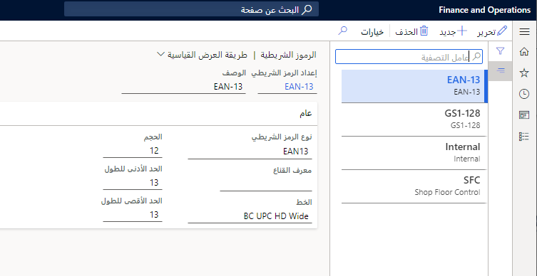

يمكن استخدام الرموز الشريطية لأسباب عديدة، مثل تحديد الأصناف أو المواقع. يمكنك إعداد الرموز الشريطية لمنتجاتك في **إدارة المؤسسة > الإعداد > الرموز الشريطية**. 
 

يمكن بعد ذلك طباعة الرموز الشريطية على مستندات مختلفة أو استخدامها لفحص المنتجات. قبل أن تتمكن من إعداد رموز شريطية معينة لمنتج ما، يجب عليك استخدام صفحة **إعداد الرموز الشريطية** لتحديد التنسيقات لرمز شريطي معين.

